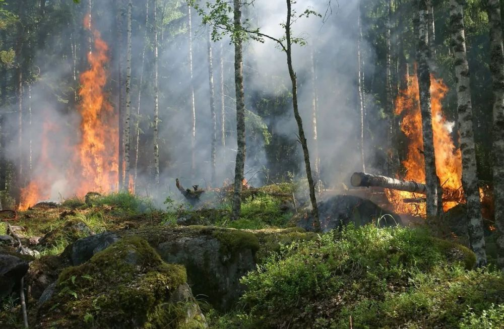
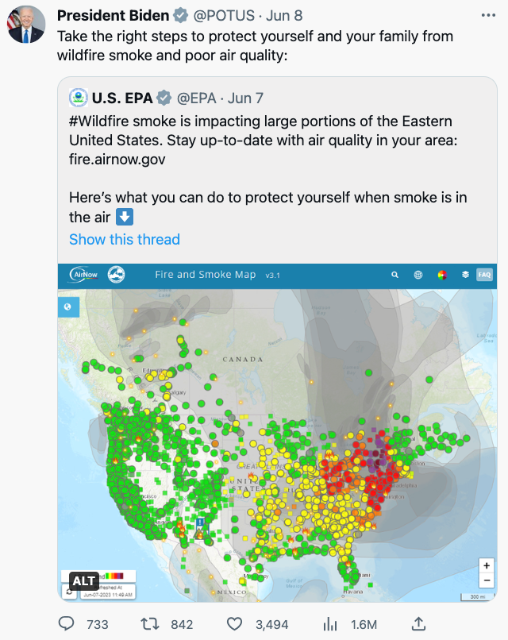
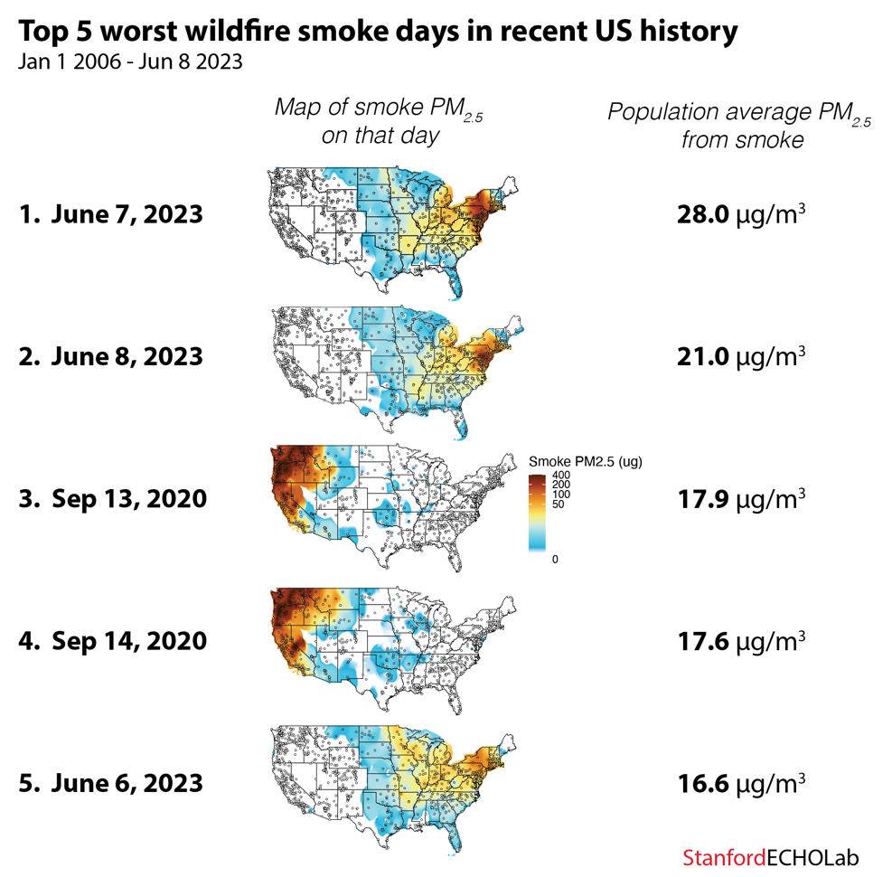
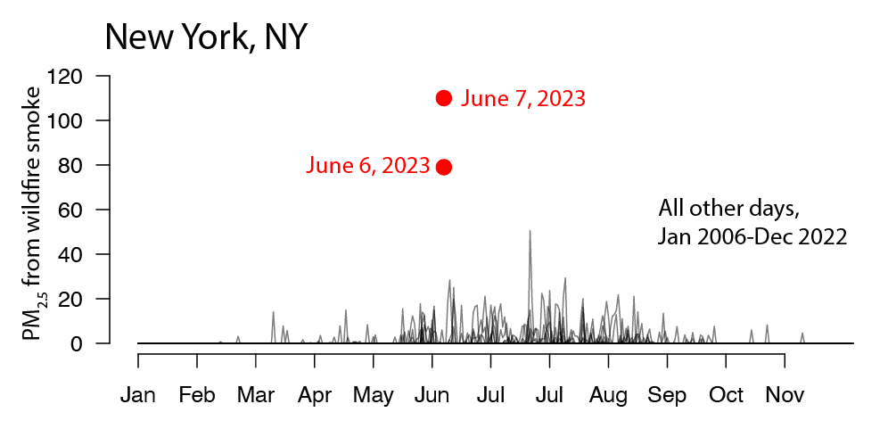
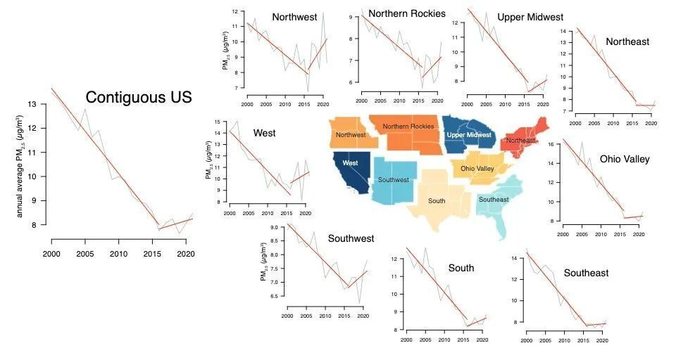

# 前所未有的加拿大山火还在燃烧，美国超5000万人饱受污染之苦

_图源：Pixabay_

**撰文｜邱明昊**

**责编｜冯灏**

**这次的山火污染有多严重？**

自2023年5月以来，超过2000起山火在加拿大全境蔓延，其严重程度史无前例。截止到7月5日，加拿大全国的过火面积已经超过800万公顷。即使才步入7月，2023年已经成为有历史数据的四十年来加拿大山火燃烧面积最高的一年（图1）。

_图1
2023年是有数据以来加拿大山火最严重的一年。数据来源：Canadian Interagency Forest Fire Centre[1]_

尽管这次山火的起因仍有待进一步的研究，气候变化在其中无疑起到了推波助澜的作用。今年加拿大的气温明显高于往年同期，部分地区5月温度较平均温度高出多达5摄氏度。极端的高温天气非常有利于野火的产生和扩散。科学家们预计，由于气候变暖和干旱条件的加剧，北美很多地区山火风险将在未来显著升高。

这次山火之所以特别引人关注还因为它所产生的严重空气污染。6月初在魁北克省发生的大规模山火，火点距离加拿大-
美国边境不远。风势将大量的烟尘颗粒物传输到了美国境内，特别是人口稠密的美国东北部地区。美国各大媒体纷纷在6月初对此进行了报道。美国总统拜登也在社交媒体上呼吁普通人做好防护（图2）。6月底，加拿大山火产生的烟尘则飘过大西洋，传到了欧洲等国。

_图2 美国总统拜登发布推特建议民众保护好自己。_

根据斯坦福大学研究团队的估算（笔者是该研究的参与者），2023年6月7日和8日两天是美国自2006年以来山火污染最严重的两天（图3）。在这两天中，有超过5000万美国人生活在严重的PM2.5污染条件下（24小时平均超过50微克/立方米）。与2020年西部地区的山火污染事件相比，尽管这次山火的污染物水平较低，但由于东海岸的人口密度较高，此次山火污染对美国的健康影响仍是历史上最严重的。

这也是美国东部地区首次经历如此严重程度的山火污染（图4）。在此之前，美国的山火污染多集中在美国西部。斯坦福大学2022年的研究显示，从2006年到2020年期间，美国西部地区极端山火污染天数显著增加，而美国东北地区受到的影响则相对较小[2]。然而，这次的事件告诉我们，美国的东部地区也可能会受到山火污染的显著影响。

_图3
美国山火污染最严重的5天中有3天都来自2023年6月的污染事件（数据记录从2006年开始）。数据来源：美国环境保护署、斯坦福大学研究团队。_

_图4
纽约山火PM2.5在2023年6月来到新高。数据来源：美国环境保护署、斯坦福大学研究团队。_

**山火污染日益成为决定美国空气质量的关键因素**

如果抛开山火产生的空气污染不谈，美国的空气质量其实一直在改善。从2000年有稳定的PM2.5监测数据以来，全美平均PM2.5浓度在20年间下降了50%。这一下降主要是由于能源系统的转型，特别是天然气对煤炭的替代（天然气对PM2.5的影响远小于煤炭），以及一系列针对人为污染源的空气质量改善政策。

然而从2015年开始，这一下降趋势不断放缓。在许多区域（特别是美国西部），PM2.5浓度不降反升。山火产生的PM2.5在其中起到了决定性的影响。

_图5
美国各个地区2000-2023年间PM2.5浓度，多数地区PM2.5下降的趋势在2015年前后开始放缓，山火产生的PM2.5在很大程度上逆转了过去20年美国空气质量改善的趋势。图源[3]_

根据斯坦福大学的研究，山火产生的PM2.5占到全部PM2.5的30%（在2010年前只有不到10%）。山火导致的PM2.5增加量相当于美国之前15年间（2000-2015年）PM2.5下降量的25%。在美国西部一些州，这个比例甚至达到了50%。也就是说，山火产生的PM2.5在很大程度上抵消了空气质量的改善趋势[3]。随着低碳转型的推进，化石燃料燃烧产生的PM2.5将持续减少。山火产生的PM2.5的重要性将愈发凸显。

**山火污染对人有什么影响？**

PM2.5污染严重影响人体健康。它会导致呼吸系统、心血管疾病和癌症风险的增加，死亡率上升。PM2.5还会影响人的心理健康和认知能力，造成学生考试成绩的下滑、工人劳动效率降低等等。然而之前的研究主要关注人为污染源产生的PM2.5，山火污染对于健康的影响依然是一个前沿的科学问题，存在许多不确定性。

**问题1: 山火产生的PM2.5比其他来源的PM2.5更有害吗？**

PM2.5是一种化学意义上的混合物，包括污染源直接排出的一次污染物（比如黑炭和沙尘）和许多在大气中二次化学反应产生的污染物。不同污染源产生的PM2.5组分各有不同：山火产生的颗粒物包括大量的有机物，与其他工业、交通等产生的颗粒物有显著不同。了解不同组分颗粒物的健康效应，能帮助我们更好地制定相应的政策法规和排放标准。

与其他污染源相比，山火产生的颗粒物对人体健康更有害吗？发表在Nature
Communication的一项研究利用加州山火时的独特风向和卫星数据发现，在1999-2012年间，等量的山火PM2.5对呼吸系统疾病产生的影响是其他PM2.5的2-10倍[4]。

**问题2: 山火发生时，待在室内就可以减少污染的影响吗？**

当山火发生时，媒体和政府通常建议民众减少外出、尽量留在室内。留在室内是否可以降低山火污染对我们每个人的影响呢？总的来说，待在室内对于减少山火污染的影响是有帮助的，但具体的程度并不确定。

研究人员通常使用室外与室内污染浓度之比（渗透比，infiltration
ratio）来衡量这种影响。这一比值越高（越接近1），则待在室内能提供的保护就越小。而这一比值越低（越接近0），则说明待在室内所能给人们提供的保护越大。

发表在Nature human
behaviour的一项研究发现，在加州山火期间，加州房屋的平均渗透比约为15%[5]。换句话说，空气污染每上升一个单位，室内污染上升0.15个单位。然而，15%只是一个平均值，研究人员发现在加州的样本中，不同住户的渗透比差异非常明显，范围从接近0%到高达60%不等。有些房屋隔绝污染的效果很好，而其他则不然。有趣的是，研究人员发现，渗透比与居民的收入、房屋质量、房屋年限等因素并没有强烈的相关性。他们推测，这种差异可能主要受到居民行为的影响，例如是否使用空气净化器、是否开窗等。

_图6
纽约山火期间室内与室外PM2.5浓度的对比。_

**应对山火风险，未来的空气质量政策应如何制定？**

近几十年来，各国对于空气污染的治理都积累了一定经验。我国的空气质量从2013年开始得到显著改善，全国平均PM2.5浓度在十年间下降了将近50%。美国在1970年通过的《清洁空气法案》则被誉为该国历史上最成功的环境法案之一。

然而，现有的空气质量政策很难适用于山火产生的污染。

美国的《清洁空气法案》根据空气质量，将不同的县分为“符合标准”和“不符合标准”两类，并强制要求不符合标准的地区采取措施改善空气质量。然而，山火产生的PM2.5污染则被视为“偶发事件”（exceptional
event），不纳入上述评估。这也就是说，一个山火污染严重的地区依然可以在空气质量上“达标”，而不需采取任何额外措施。这本是为了防止偶发的重污染事件对各地区造成过大的环保压力。然而，随着山火问题日趋严重，它是否仍可被认为是“偶发事件”，也受到越来越多的争议。

我们对山火污染目前也没有很好的治理方法。与工厂、机动车这些人为污染源不同，我们不可能给森林加装尾气净化器。应对山火风险最有效的政策，目前看来，应该是对森林进行更好的管理，比如在美国的政策讨论中最受关注的计划烧除（prescribed
burn）。

“计划烧除”即定期在可控制的范围内对森林进行燃烧。因为燃烧是在专业人员的指导下进行的，燃烧规模相对可控，产生的污染也相对低。这样通过频繁、低污染的计划烧除降低森林中的燃料量，可以避免形成规模巨大的森林大火。

据估算，美国加州未来每年需要对超过40万公顷的土地进行计划烧除和森林修剪。这是加州现有规模的20倍[6]。然而，计划烧除的大规模普及面临着许多政策上和经济上的阻碍。首先，计划烧除的申办手续非常繁琐，并且价格高昂，为达到40万公顷计划烧除的目标，加州政府每年需要花费20亿美元（相当于加州消防系统全年预算的50%）。其次，虽然美国的空气质量评价体系不考虑山火产生的污染，但计划烧除这一人为活动产生的污染却会被考虑在内。这进一步降低了地方政府进行计划烧除的意愿。除此之外，美国复杂的土地所有权制度也让在私人土地上进行计划烧除几乎不可能实现。

**山火、空气质量、碳中和**

我国有24%的土地面积被森林覆盖。森林防火一直受到高度重视。根据国家林业局颁布的《全国森林防火规划（2016-2025年）》，我国在“十二五”期间，年均发生森林火灾3992起，受害森林面积1.7万公顷。这些数字相比于“十一五”期间下降超过60%[7]。

尽管森林疆域辽阔，我国现阶段受山火影响的森林面积相对较小，“十二五”期间受害森林面积仅相当于森林总面积的0.005%。然而，我国森林防火在未来仍面临诸多考验。气候变化导致的全球变暖将导致极端山火的风险显著增加。Earth
System Science Data最近发表的一项研究发现，当全球升温超过3摄氏度时，十年一遇的极端山火强度将增加30%[8]。

山火产生的污染物在我国PM2.5浓度中的占比很难确定。目前仅有一项研究估算认为，非农业燃烧只占我国PM2.5的1-2%[9]。尽管如此，随着我国下一阶段空气质量政策的推动，人为源产生的PM2.5将进一步降低，山火这类“自然污染源”将愈发不能忽视。

除了导致空气污染外，山火排放的二氧化碳也会对全球气候产生重要的影响。在美国加州，2020年山火所产生的二氧化碳相当于2019年全部温室气体排放的30%[10]。尽管山火产生的二氧化碳与化石能源燃烧的排放不能被直接比较（植被会在山火后逐渐恢复并吸收二氧化碳），但是山火所产生的巨量二氧化碳排放依然不容忽视。

山火也会对各国应对气候变化、实现碳中和目标产生复杂的影响。增加森林覆盖率以提高碳汇是许多国家碳中和规划中的重要一步。例如，中国国家发改委就提出，“扩大林草面积，巩固提升碳汇能力”是我国达到碳达峰、碳中和的重要举措[11]。然而，森林面积的增加也意味着更高的山火风险，山火的肆虐也将进一步影响森林生态系统的固碳能力。未来，山火管控应该不再只是林业部门的问题，山火相关政策应该成为空气质量和气候变化政策的重要组成部分。

**参考资料：**

[1] Canadian Interagency Forest Fire Centre. https://ciffc.net/statistics

[2] Childs, Marissa L., Jessica Li, Jeffrey Wen, Sam Heft-Neal, Anne Driscoll,
Sherrie Wang, Carlos F. Gould, Minghao Qiu, Jennifer Burney, and Marshall
Burke. "Daily local-level estimates of ambient wildfire smoke PM2. 5 for the
contiguous US."Environmental Science & Technology56, no. 19 (2022):
13607-13621.

[3] Burke, Marshall, Marissa L. Childs, Brandon De la Cuesta, Minghao Qiu,
Jessica Li, Carlos F. Gould, Sam Heft-Neal, and Michael Wara.Wildfire
influence on recent us pollution trends. No. w30882. National Bureau of
Economic Research, 2023.

[4] Aguilera, Rosana, Thomas Corringham, Alexander Gershunov, and Tarik
Benmarhnia. "Wildfire smoke impacts respiratory health more than fine
particles from other sources: observational evidence from Southern
California."Nature communications12, no. 1 (2021): 1493.

[5] Burke, Marshall, Sam Heft-Neal, Jessica Li, Anne Driscoll, Patrick Baylis,
Matthieu Stigler, Joakim A. Weill et al. "Exposures and behavioural responses
to wildfire smoke."Nature human behaviour6, no. 10 (2022): 1351-1361.

[6]https://calmatters.org/environment/wildfires/2022/11/wildfire-prevention-
biomass-climate-forest/

[7]全国森林防火规划（2016-2025年）。

https://www.gov.cn/xinwen/2016-12/29/content_5154054.htm

[8]Quilcaille, Yann, Fulden Batibeniz, Andreia FS Ribeiro, Ryan S. Padrón, and
Sonia I. Seneviratne. "Fire weather index data under historical and shared
socioeconomic pathway projections in the 6th phase of the Coupled Model
Intercomparison Project from 1850 to 2100."Earth System Science Data15, no. 5
(2023): 2153-2177.

[9] McDuffie, Erin E., Randall V. Martin, Joseph V. Spadaro, Richard Burnett,
Steven J. Smith, Patrick O’Rourke, Melanie S. Hammer et al. "Source sector and
fuel contributions to ambient PM2. 5 and attributable mortality across
multiple spatial scales."Nature communications12, no. 1 (2021): 3594.

[10] Jerrett, Michael, Amir S. Jina, and Miriam E. Marlier. "Up in smoke:
California's greenhouse gas reductions could be wiped out by 2020
wildfires."Environmental Pollution310 (2022): 119888.

[11]国家发改委：提升林草碳汇潜力助力碳达峰碳中和目标实现。https://www.ndrc.gov.cn/xxgk/jd/jd/202111/t20211108_1303400.html

