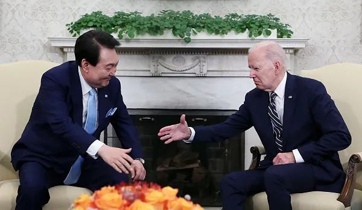

# 在另一战场，美国又拉上韩国

仅9个月之后，韩国又一次参与美国主导的网络战演习。

韩联社援引韩国国防部最新消息，韩军网络作战司令部于7月17日至28日参加远程举行的“网络旗帜”（Cyber Flag）多国联合网络攻防演习。

_5月9日，韩美国防网络政策工作组第8次会议。图源：韩联社_

自2011年起，美国网络司令部就开始主办上述演习，每年一次，旨在“增强同盟友的联合网战戒备态势”。除分享情报的“五眼联盟”成员（澳加新英美）外，韩国、新加坡也一同参加了今年的联演。而这也是继去年10月之后，韩国第二次参演。

长安街知事（Capitalnews）注意到，近年来，韩国在网络安全领域随美亦步亦趋，让“网络战争”的影子频繁在亚洲出现。

**“网络旗帜”扎进亚洲**

据报道，“网络旗帜”联演由战术层面的网络安全攻防演习和研讨会两部分组成，参演方将共享有关信息并模拟开展网络战。

2022年10月，韩国军队派出18人首次参加了一场为期5天的演习。事实上，韩国为加入美国的网络战联盟早已做好铺垫。

自2010年起，韩国便成立网络司令部，次年升格为国防部直属司令部。该部门主要负责执行技术情报侦察、心理战和网络防御任务，成立初期为450人，2014年增至1000人。

2022年4月，韩国国家情报院参与北约合作网络防御中心（CCDCOE）主办的全球最大规模国际网络攻防演习“锁盾”。

仅一个月后，这一韩国情报机构就宣布作为正式会员加入北约合作网络防御中心，成为首个加入该机构的亚洲国家。

韩国媒体宣称，此次牵手北约是韩国在网络空间领域软硬实力的体现，也是“韩国与北约关系持续深化拓展的映射”。

同样是在当年5月，美国总统拜登访问韩国期间与韩国总统尹锡悦商定，两国“就关键和新兴技术及网络安全深化和拓宽合作”。

据韩联社报道，在今年5月举行的韩美国防网络政策工作组会议上，韩方表明了每年参演的意向，美方先前答复“积极考虑”，后来予以批准。

另据《韩国先驱报》报道，韩军网络作战司令部在一份声明中表示，“我们的司令部将寻求通过与美方的交流以及人员和技术共享来加强联合网络安全能力。”

有分析指出，韩国和西方国家在网络空间领域的实兵化合作，意味着美国及其盟友在加紧从传统战场向新型作战领域拓展，美国联合盟友在保持战略武器和常规军力基础上，正不断提升非对称领域战备。

眼下，这面扎进亚洲的“网络旗帜”也在不断催生亚太地区甚至全球范围的“新冷战”氛围。

**拼命挤进“保护伞”**

然而颇具讽刺意味的是，就在韩方不断向美国靠拢时，最大的网络安全威胁其实就是美国。

今年4月，尹锡悦开启访美之行前夕，美国情报机构被曝监听韩国政府。一份被泄露的文件非常详细地描述了两名韩国高级国家安全官员之间的对话，内容涉及韩国国家安全委员会对美国要求提供弹药的担忧。

而韩国国家安保室竟回应称，韩方并未发现美方出于不良动机监听窃听韩方的迹象。

韩总统室更是表态，过去也有过类似事例，但并未动摇韩美关系。

在随后的访美过程中，尹锡悦不但没有对窃听事件表露不满，还与美国签署了拓展网络合作的《战略性网络安全合作框架》协议。

_4月26日，对美国进行国事访问的尹锡悦与拜登在白宫举行韩美首脑会谈。_

该协议显示，韩美合作将扩展至网络空间，双方将增进在信息共享等网络安全技术、政策、战略层面的合作，构建互信。

韩总统室随后表示，期待此举能成为构建类似于“核保护伞”的“网络保护伞”的象征性契机。

在“窃听风云”之下，韩国依旧选择“义无反顾”冲进所谓美国“保护伞”，可谓是将自欺欺人演绎到了极致。

6月23日，韩美联合应对网络安全问题的高级别协商机制正式成立，这也被看作是此前首脑会谈达成协议的后续行动。

据韩联社报道，对于韩美合作框架的跟进措施，韩方提出分享威胁情报、互相参加训练、开展人员交流等提议。美方则提出制定主要网络安全政策和相关标准、实施零条件信任政策等。

“今后网络作战司令部将不仅通过美国主导的‘网络旗帜’联演，还将通过韩美网络司令部之间的双边演训、网络专业人才及技术交流等，发展韩美网战协作机制。”针对今年的演习，韩国防部做出了上述表态。

自上任以来，尹锡悦政府一直致力于推动加强与美国及其盟友合作。然而，将国家网络安全寄托于一个经常在他国制造网络危机的角色身上，这样的“保护伞”能否称之为“安全”，只有韩国政府自己知道了。

（除标注外，图源视觉中国）

