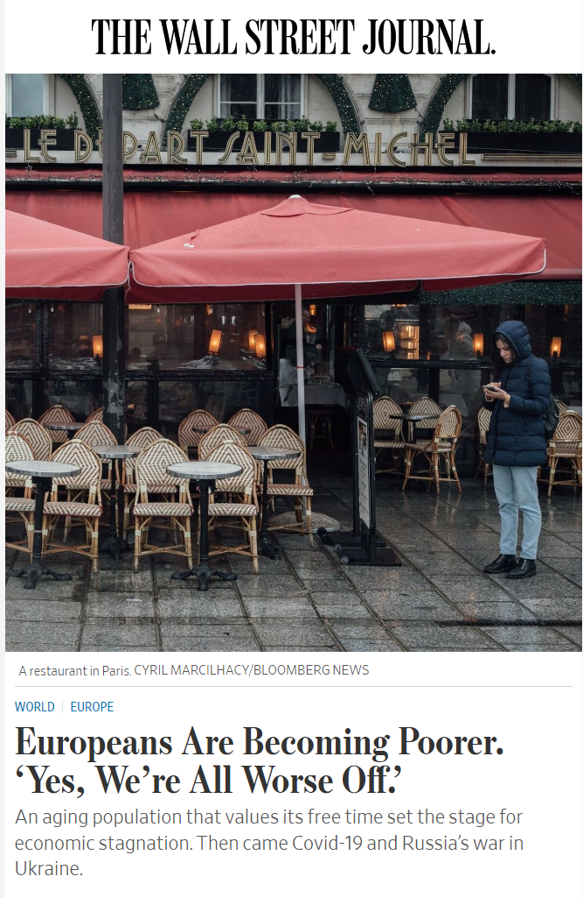
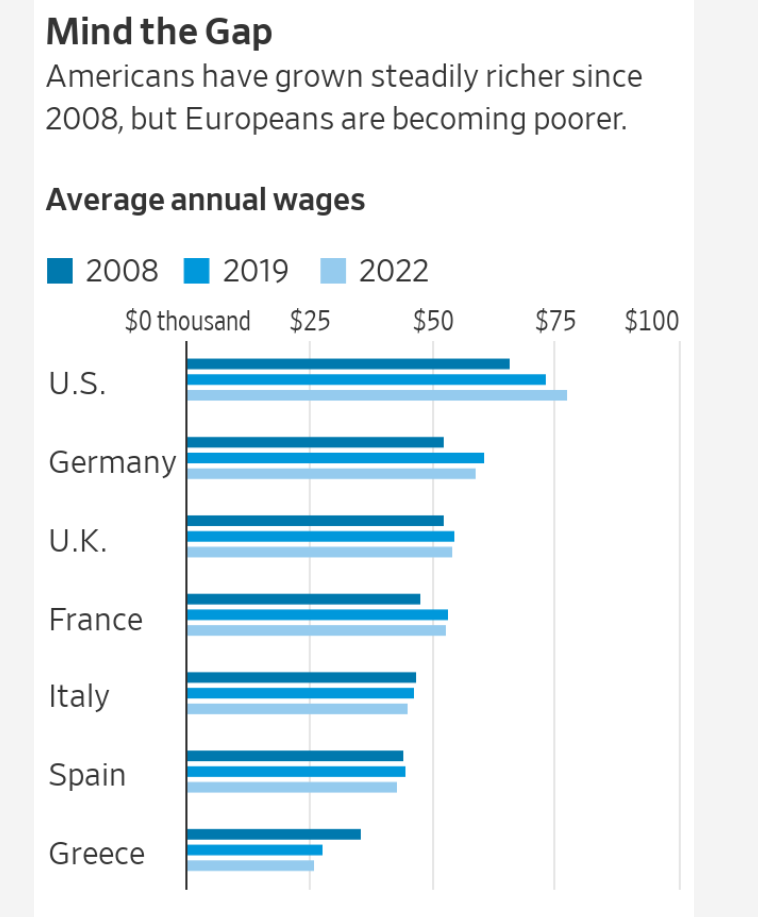
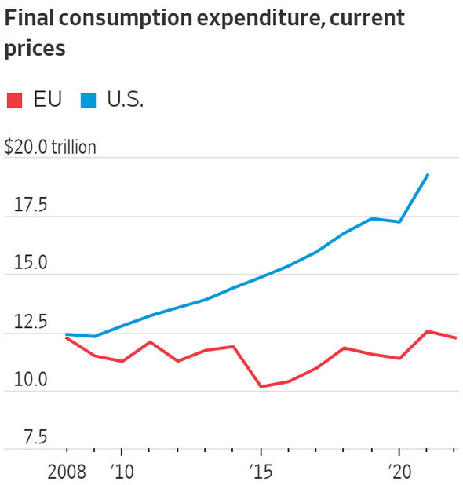
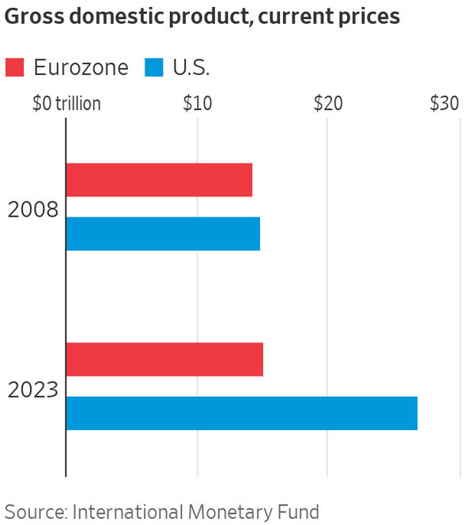

# 外媒：和美国比，欧洲人正变得越来越穷

文/观察者网 王世纯

近年来，新冠疫情、俄乌冲突等事件冲击欧洲经济。对此，《华尔街日报》7月18日的专题文章指出，欧洲人正面临着几十年来从未经历过的新的经济现实——他们变得越来越穷。

文章指出，近年来，欧洲人的工资收入和购买力日益下降，影响了生活水平。这导致长期以来欧洲人被外界羡慕的生活水平也日益下降——很多欧洲居民正在采购廉价食品，德国的人均肉食量也逐步下降。

对于欧洲经济困境的原因，文章称欧洲目前的困境是长期形成的。新冠疫情和俄乌冲突的连击冲击了欧洲经济，导致能源和食品价格飙升，加剧了几十年来一直在恶化的欧洲经济。随着人口老龄化，人们更喜欢自由时间和工作保障，而不是追求收入，这导致了多年来经济和生产率增长乏力。

随着欧洲经济步入困境，欧美工资差距拉大，欧洲与美国的生活水平和经济水平差距加大。当下，美国居民承受的通胀压力更小，同时居民的消费水平高于欧洲居民。文章援引相关组织的话称，如果目前的趋势继续下去，到2035年，美国和欧盟的人均经济产出之间的差距将与今天日本和厄瓜多尔之间的差距一样大。

_报道截图_

_欧美工资相较美国逐步下降，图片来源：《华尔街日报》_

随着消费支出的自由落体，欧洲在今年年初陷入衰退，加重了外界自本世纪初开始对欧洲的经济、政治和军事逐步衰落的观感。

法国人正在少吃鹅肝，少喝红酒。西班牙人对橄榄油非常吝啬。芬兰人被敦促在有风的日子里使用桑拿，因为有风能的时候能源价格不那么昂贵。在整个德国，肉类和牛奶的消费量已降至三十年来的最低水平，曾经蓬勃发展的有机食品市场也陷入了困境。意大利经济发展部长阿道夫·乌尔索于5月召开了一次危机会议，讨论意大利最受欢迎的主食——意大利面的价格，此前意大利面的价格涨幅超过了全国通胀率的两倍。

这种痛苦深深地影响到了中产阶级。最近的一个晚上，在欧洲最富裕的城市之一布鲁塞尔，教师和护士排队从卡车后车厢领取半价杂货。这家名为“欢乐时光市场”的摊贩从超市收集临期食品，并通过一款应用为其做广告。顾客可以在下午早些时候下单，晚上再收取打折食品。

正在分发一箱箱食品杂货的皮埃尔·范·赫德说：“有些顾客告诉我，因为你，我每周终于可以吃到两三次肉。”

33岁的护士卡里姆·布阿扎正在为他的妻子和两个孩子采购打折半价的肉和鱼，他抱怨说，通货膨胀意味着“你几乎需要做第二份工作来支付一切费用”。类似的APP在该地区如雨后春笋般涌现。2015年在丹麦成立的TooGoodToGo公司销售零售商和餐馆的剩菜，当下在欧洲拥有7600万注册用户，大约是2020年底的三倍。在德国，成立于2017年的创业公司Sirplus在其网上商店提供“富余”食品，包括过期产品。

高端食品杂货的消费大幅下降。2022年，德国人均肉类消费量为52公斤，比前一年减少了约8%，是1989年开始计算以来的最低水平。虽然这在一定程度上反映了社会对健康饮食和动物福利的担忧，但专家表示，近几个月来肉类价格上涨了30%，这一趋势也在加速。

持续放缓的经济也影响了欧洲的福利水平。

为维克·特里维迪（Vivek
Trivedi）是一名31岁的麻醉师，住在英格兰曼彻斯特，每周工作48小时，年收入约为5.1万英镑。他说，近一年来，英国的通货膨胀率一直在10%左右或更高，这正在吞噬他每个月的预算。特里维迪说，他在折扣店买杂货，外出就餐的花费也减少了。他说，最近几个月，一些同事完全关闭了暖气，担心他们负担不起能源大幅上涨的成本。

28岁的伦敦公共事务专家科恩说，她可以利用自己的美国护照跨越大西洋，做同样的工作，薪水可以翻四倍。科恩最近换了工作后加薪了10%，但涨幅完全被通货膨胀吞噬了。她说，朋友们正在冷冻卵子，因为他们短期内负担不起孩子，希望将来有足够的钱。“感觉就像是生活水平的永久冻结，”她说。

在过去，欧洲大陆强大的出口行业可能会出手相救。但近年来全球的经济放缓影响了欧洲出口。高企的能源成本和自上世纪70年代以来从未见过的猖獗的通货膨胀正在削弱制造商在国际市场上的价格优势，并破坏了欧洲大陆曾经和谐的劳资关系。随着全球贸易降温，欧洲对出口的严重依赖正在成为一个弱点——出口占欧元区GDP的比重约为50%，而美国为10%。

值得一提的是，《华尔街日报》还将欧洲出口放缓的原因归咎于所谓“中国经济复苏放缓”。

随着欧洲生活水平下降，欧洲与美国的经济水平和生活水平也开始拉大。对此，《华尔街日报》宣称，美国政府“时至今日还在补贴消费者，让消费者避免通胀和能源高企的冲击”。

组织总部位于巴黎，主要由富裕国家组成的“经济合作与发展组织”（OECD）的数据显示，自2019年底以来，经通胀调整后欧元区20国的私人消费下降了约1%。

经通货膨胀和购买力调整后，自2019年以来，德国的工资下降了约3%，意大利和西班牙下降了3.5%，希腊下降了6%。与此同时，OECD的数据显示，同期美国的实际工资增长了约6%。当下，欧盟目前约占全球消费支出的18%，而美国占28%。15年前，欧盟和美国各占该总量的四分之一左右。

_最终消费支出，红色为欧盟，蓝色为美国，图片来源：《华尔街日报》_

收入的下降导致了欧洲民众消费的疲软。从消费品巨头宝洁到奢侈品帝国路威酩轩（LVMH），疲弱的支出和糟糕的人口前景正在降低欧洲对这些企业的吸引力。这些企业在北美的销售额占比越来越大。联合利华的首席财务官格雷姆·皮特克利在4月份表示“美国消费者比欧洲消费者更有弹性”。

地中海岛屿马略卡岛商会旅游委员会主席弗朗特拉说，当地企业正在游说增加飞往美国的航班，以增加花钱更大方的美国游客数量。美国人平均每天在酒店上的花费约为260欧元，而欧洲人则不到180欧元。

弗朗特拉说：“由于我们正在应对的经济形势，今年我们看到欧洲人的消费行为发生了很大变化。”

由于欧洲各国政府需要增加国防开支，加上借贷成本不断上升，经济学家预计税收将增加，从而给消费者带来更大压力。与其他富裕国家相比，欧洲的税收已经很高了，相当于GDP的40-45%左右，而美国的这一比例为27%。美国工人将近四分之三的工资带回家，包括所得税和社会保障税，而法国和德国工人只保留了一半。

国际货币基金组织（IMF）的数据显示，以美元计算，欧元区经济过去15年的增长率约为6%，而美国的增长率为82%。总部位于布鲁塞尔的独立智库欧洲国际政治经济中心本月发布的一份报告显示，这使得欧盟国家的人均收入低于美国除爱达荷州和密西西比州以外的所有州。

_GDP变化，红色为欧盟，蓝色为美国，图片来源：《华尔街日报》_

报告说，如果目前的趋势继续下去，到2035年，美国和欧盟的人均经济产出之间的差距将与今天日本和厄瓜多尔之间的差距一样大。

本文系观察者网独家稿件，未经授权，不得转载。

