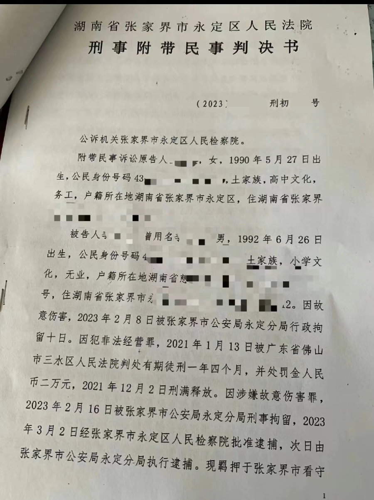
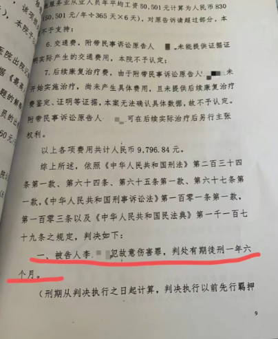
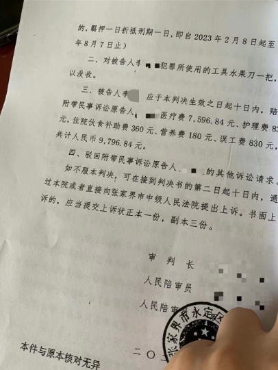
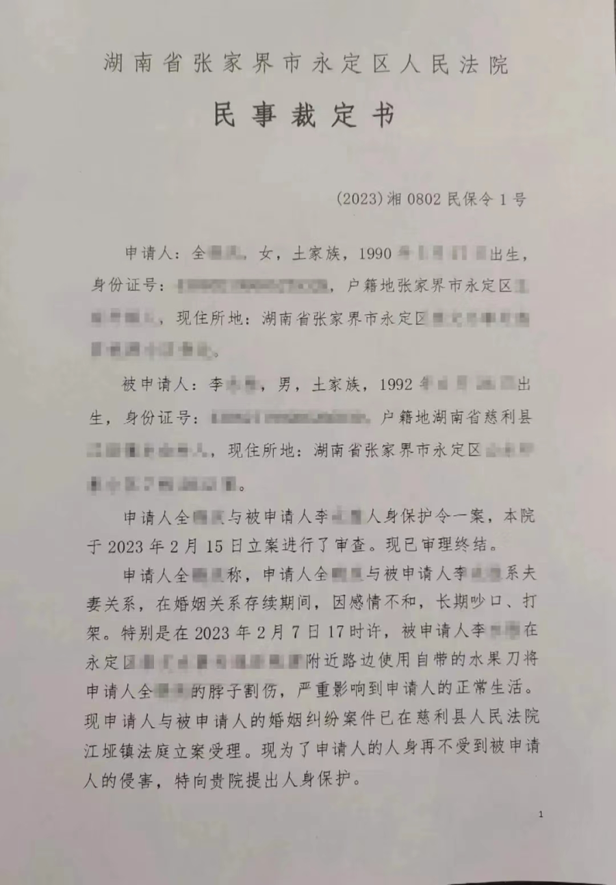
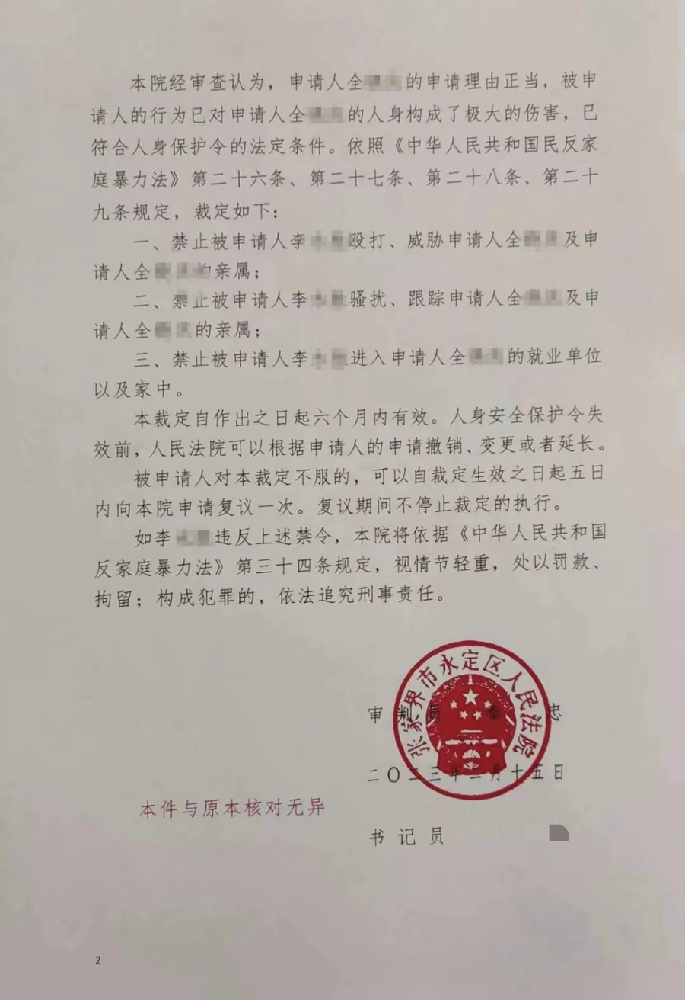
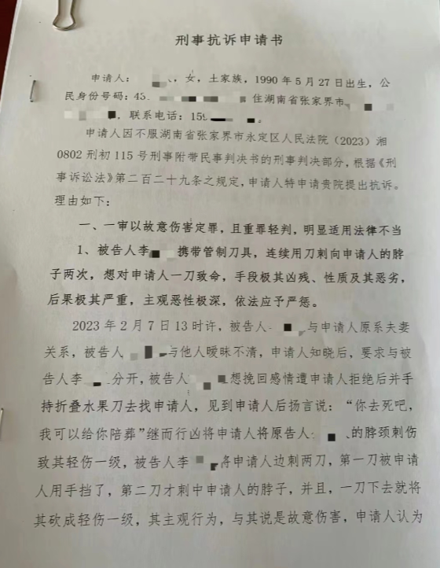

# 女子拒和好遭“割喉”，丈夫一审被判一年六个月，女子称打算放弃上诉

2023年2月，湖南张家界的全女士发视频称自己遭丈夫李某胜割喉，该事件引发了广泛关注。近日，正观新闻记者注意到，全女士在社交平台上公布了湖南省张家界市永定区人民法院一审刑事附带民事判决书。内容显示，被告人李某胜犯故意伤害罪，被判处有期徒刑一年六个月。全女士告诉正观新闻记者，自己打算放弃上诉。

_此前当事人在社交平台上晒出的伤情照片_

**法院发出人身安全保护令**

据永定公安微信公众号消息，2月7日17时46分，张家界市公安局永定分局接到一女子报警称，其女儿在某小区附近与女婿发生冲突导致女儿颈部受伤。接到报警后，永定公安分局立即出警赶赴现场处置，第一时间将伤者送往医院救治，伤者无生命危险，同时迅速组织警力全力开展调查取证和追逃抓捕工作。

经查，2023年2月7日17时许，嫌疑人李某某（男，30岁）与妻子全某某（女，32岁）因家庭纠纷引发冲突，使用水果刀致全某某颈部受伤，李某某拨打120后逃离现场。当日21时许，嫌疑人李某某向公安机关投案自首。

2月8日下午，李某某因故意伤害他人身体被依法行政拘留10日。经司法鉴定全某某为轻伤，李某某已被公安机关依法刑事拘留，案件正在进一步侦办中。警方将严格依法处置，坚决维护受害者合法权益。

2023年2月15日中午，在张家界市永定区妇联的联络下，受害人全女士向永定区人民法院申请采取人身安全保护令措施。2023年2月15日16时30分左右，张家界市永定区人民法院依法高效审查，为此发出2023年首份人身安全保护令。

**一审被判一年六个月**

从全女士在社交平台上发布的判决书内容上可见，被告人李某胜犯故意伤害罪，被判处有期徒刑一年六个月，被告人李某胜应赔偿原告人共计人民币9796.84元。全女士配文称这个结果让其很意外，对于不少网友提出的继续上诉的建议，全女士也表示，自己只有民事部分上诉权，对于刑事部分只能申请抗诉，并回复称“申了，希望不大”。

同时她还发布了一份刑事抗诉申请书，内容为对于湖南省张家界市永定区人民法院该案件一审刑事附带民事判决书的刑事判决部分，申请提出抗诉，理由之一是认为“一审以故意伤害定罪，且重罪轻判，明显法律适用不当”。

**7月18日下午，全女士回应正观新闻记者表示，自己打算放弃上诉。** 但对于是否已经进行过刑事抗诉申请以及结果如何等问题，其暂未回应。

正观新闻记者 古晨茜

统筹：石闯 李记波

编辑：王晨

