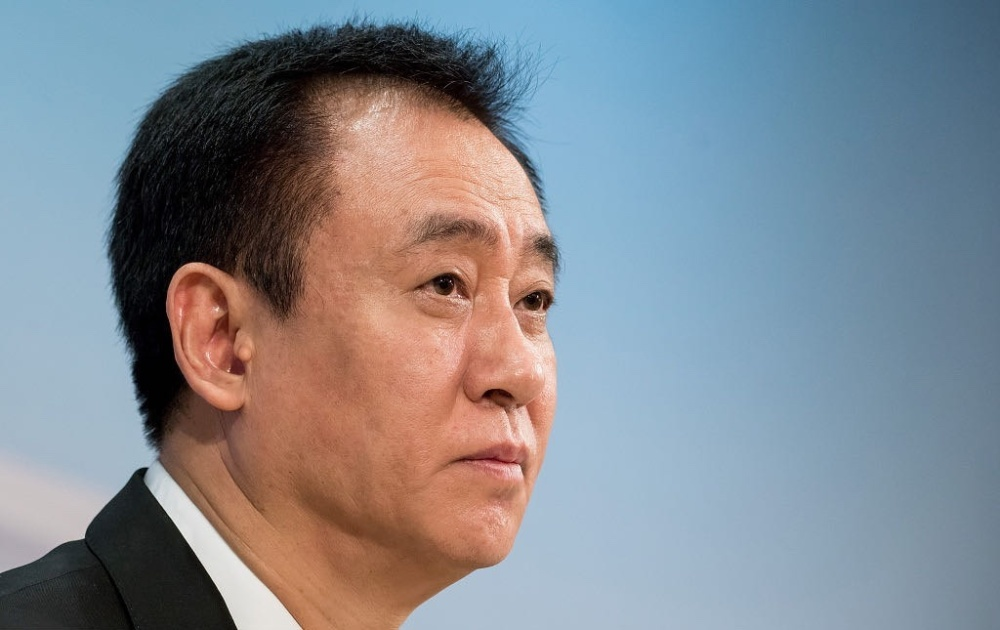

# 恒大自揭老底：日均亏11亿，11万员工人均月薪两千

_来源：视觉中国_

作者 | 陈弗也

编辑 | 肖 望

出品 | 棱镜·腾讯小满工作室

留给恒大的时间所剩无几。

在停牌一年多后，7月17日深夜，中国恒大（03333.HK）2021年、2022年业绩报告姗姗来迟。此时，距离其可能被港交所责令摘牌的最后期限仅剩两个多月。根据港交所相关规定，对于连续停牌18个月的上市公司，港交所可以责令其摘牌退市。

外界终于得以一窥这家陷入泥潭的房地产巨头的财务黑洞。业绩报告显示，恒大已经严重资不抵债。截至2022年底，恒大净资产为-6877亿元，集团总负债2.44万亿元。

恒大还披露，6天后的7月24日，将在香港高等法院、开曼群岛大法院、东加勒比最高法院举行聆讯会，就今年3月22日披露的境外债务重组方案进行投票。如未通过，恒大可能会被清盘。

据广州足球俱乐部官方微信，7月4日，许家印亮相主持召开恒大足球俱乐部管理会议，明确提出目标是今年保级、明年冲超。照片上的许家印看起来心情不错，两周后要披露资不抵债和巨额亏损似乎对其并无影响。

许家印和恒大，还能翻身吗？

_7月4日，许家印主持召开俱乐部管理会议。图源广州足球俱乐部官方微信_

**每天亏逾11亿，两年巨亏超8000亿**

2020年，海航曾经亏损640亿元，2021年，快手曾经亏损780亿元，亏损程度令市场震惊。但在恒大面前，这些都不值一提。

根据业绩报告，2021年、2022年，两年时间里，恒大巨亏8153亿元，相当于每天亏损超11亿元。毫无悬念摘得“亏损之王”的称号。

作者注意到，相较于今年3月份境外重组方案披露的财务状况，此次业绩报告显示的状况更为糟糕。

3月的境外债务重组方案显示，截至2021年底，中国恒大的总资产为16990亿元，负债总额18980亿元，净资产为-1990亿元；而此次发布的业绩报告则显示，截至2021年底，中国恒大的总资产为21070亿元，总负债为25801.5亿元，净资产为-6273亿元。

在3月22日的债务重组方案中，恒大曾经为投资者描述了一个愿景。未来三年，恒大的核心任务是“保交楼”，他们将努力保持“复工复产”，维持有序运营，预计需要额外2500亿-3000亿元人民币的融资。但眼下看，恒大的窟窿远不止此。

恒大在4月27日称，债务重组的进程在稳步推进。截至当时，债务重组方案获得了持有A组债务未偿还本金77%以上的债权人、持有C组债务未偿还本金30%以上的债权人、持有景程票据未偿还本金91%以上的债券和持有天基债务工具未尝本金64%以上的债权人的同意。

根据香港法律，重组方案需要得到持有75%债务的债权人同意，法院才会批准生效。只不过，当债权人看到新的业绩报告后，不知是否还会对重组有信心。

重组方案发布时，恒大曾称，如果恒大最终被清盘，境外的无担保债权人预估仅能回收约97.29亿元，回收率只在2.05%-9.34%之间。而根据最近的业绩报告，仅在2021年净资产就比重组方案中少了4283亿元，这些债权人的回收率可能会更低。

即便是这样两份难看的业绩报告，独立核数师仍表示，由于恒大的持续经营存在多项不确定因素、在对比数据时没有获得足够的审核凭证，他们无法对财务报表发表意见。

**11万恒大员工平均月薪仅2000元**

根据公开资料，恒大债务主要由明股实债、理财产品融资、商业承兑汇票、银行贷款、信托、境内信用债、担保、美元债等多个方面构成。
在此之前，通过债转股、展期、新债换旧债、拍卖资产、债务重组等方式，恒大解决了一些债务问题。

在过去两年间，也不断传出许家印个人出售豪宅、艺术品、私人飞机、游艇等个人资产的新闻。但这些相较于恒大的债务只是杯水车薪。

深陷债务危机后，降薪、裁员也成为恒大员工逃不过的宿命。

业绩报告显示，截至2021年6月底，恒大共有163119名员工，付出的薪酬达到142.2亿元，人均薪酬为87053元。到了2022年6月底，恒大共有112430名员工，与上一年同期减少了50689人，付出的薪酬也仅28.7亿元，人均薪酬仅25527元，一年间平均月薪从7254元降至2127元。

据多家媒体报道，从2021年下半年开始，恒大多地城市公司给员工停工留职，只发最低工资。

2021年也正是恒大的转折之年，被做空、被停贷、销售陷入停滞均发生在这一时期。但危机的种子早在一年前埋下。

2020年3月，恒大宣布实施“高增长、控规模、降负债”战略。第二年6月末，恒大宣布有息负债约5700亿元，较2020年最高时的8700亿元相比大幅度压降。

核数师在业绩报告中指出，在降负债的过程中，恒大的压力越来越大，并在2021年5月底开始被投资机构做空，引起了市场恐慌，大量金融机构开始停贷、断贷。两个月后，恒大的现金流正式断裂，再过两个月，恒大的销售陷入了停滞，直到2022年4月，销售才逐步恢复。

今年初，一位恒大中层向作者回忆起那段时间。他介绍，在此之前，中国恒大在港股的交易，一天的交易额三四亿港币，但被做空后，一天的交易量达到了二三十亿，“当时许老板想去‘救市’，但多少钱砸进去，都止不住。”

在资金链断裂的同时，恒大的理财产品、商业承兑汇票开始爆雷。大量投资者到恒大深圳总部要求兑付，有恒大承兑汇票投资者表示，打三折也无人接盘。

**亏损主要因资产价值缩水**

销售回款是房地产公司最为重要的现金流。从2021年9月到2022年4月，恒大的销售陷入了停滞状态。

业绩报告显示，2021年上半年，恒大的合约销售金额为3567.9亿元，合约销售面积为4301.4万平方米，累计销售回款为3211.9亿元。而2022年上半年，这三个数字则仅为122.6亿元、119.3万平方米和181.3亿元。

即便恢复销售，购房者的预期也已发生转变，恒大的期房更是令人避之不及。

综合业绩报告可知，恒大的亏损大部分来自于资产价值缩水、土地被回收等非经营性亏损，而这些亏损又主要发生在2021年的下半年。

以2021年为例，当年恒大经营性亏损为1137.5亿元，非经营亏损则高达5851.6亿元，其中，存货减值高达3736.8亿元，由土地被回收、联合投资等造成的亏损也高达1298.3亿元。

而在2021年上半年，恒大尚未暴雷之前，他们的待售物业及在建物业的减值仅29.9亿元，也很少有被收回的土地。

面对如今高达近7000亿元的负资产局面，恒大或只能寄希望于房地产市场的回暖，令存货资产的估值得以提升。

补发业绩报告、推进债务重组，这都被视为中国恒大努力自救避免被摘牌的举措。在此前，已有江西房企新力控股因停牌超18个月被港交所摘牌。

在最后的两个月中，一切充满了未知数。

