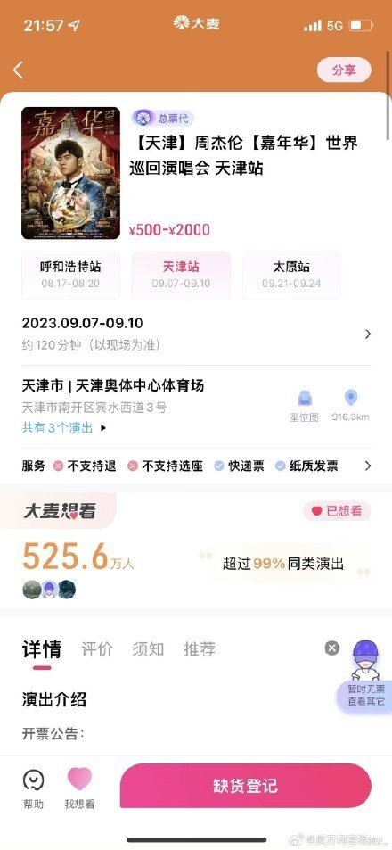
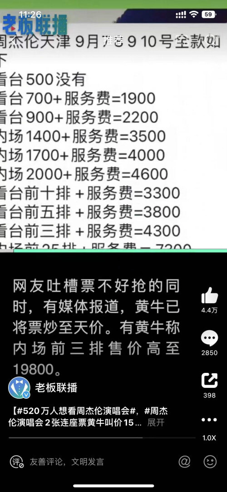
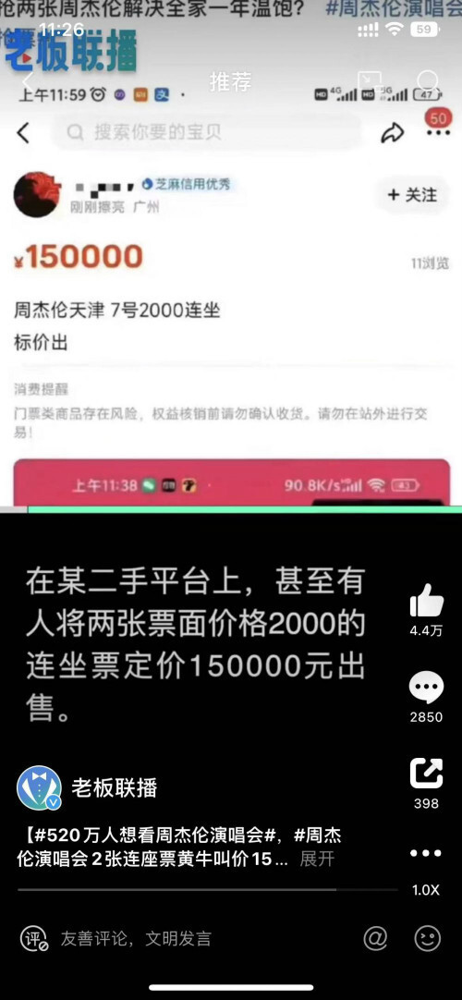
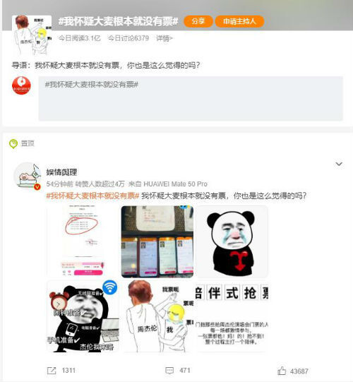

# 520万人想看周杰伦演唱会：有连座票叫价15万2张，网友怀疑大麦没票

中国经济周刊—经济网讯 7月18日，周杰伦演唱会天津站开票。据大麦平台显示，本场天津演唱会大麦单平台放票近13万张，共分四轮开票。超520万人标记“想看”。

经实际抢票发现，四轮开票都在30秒内售罄。网友吐槽票不好抢的同时，黄牛已将票炒至天价。有黄牛称内场前三排售价高至19800元。在某二手平台上，甚至有人将两张票面价格2000元的连座票定价150000元出售。

19日，网友热议周杰伦演唱会门票相关情况。有网友称：“票都在咸鱼吗”“抢周杰伦演唱会门票，整个抢票过程主打一个陪伴”。

也有不少网友留言表示：“我怀疑大麦根本就没有票”，话题#我怀疑大麦根本就没有票#也登上了社交媒体热搜，截至发稿，该话题浏览量已达3.1亿。在该话题下，有网友称：“倒计时20秒就页面崩溃，再进去就啥也没有了”“今天号召十几个朋友一起抢，根本抢不到”“演唱会都实名入场吧，求求了”“建议12306接手大麦”“在大麦就没抢到过五月天周杰伦薛之谦等的票”。

值得关注的是，这并非网友首次质疑演唱会票务APP、吐槽黄牛。前段时间五月天演唱会期间，网友甚至喊出“宁愿鸟巢门口站，也不能让黄牛赚”的口号。对于此类乱想，人民日报评论中也指出，抢票难，热门项目出现几百万人同时抢票的“盛况”；黄牛多，扰乱正常买票、观演行为。一些主办方在“回血”“挣快钱”的心态下，排队“官宣”、扎堆开票，有的项目提前半年以上、没有筹备好就急着开票，甚至直接把优质座位预留给黄牛售卖，凡此种种，给观众添堵，也给市场添乱。

新华社发文称，今年以来，演出市场迅速回暖，再度激起了歌迷、影迷、戏剧迷们久违的热情。然而，官方购票平台“一票难求”“黄牛”加价倒票“大行其道”又让众多观众“心灰意冷”。混乱的购票秩序、远高定价的“黄牛票”，严重困扰观众体验，扰乱市场秩序。业内人士指出，因为二级票务平台没有票源，只是充当了中介的角色，实际上为“黄牛”倒票提供平台。二级票务平台无法辨别门票真伪，也无法规范市场票价，暴露出服务与监管的短板。

新媒体编辑：崔晓萌

一审：崔晓萌 二审：何颖曦 三审：周琦

