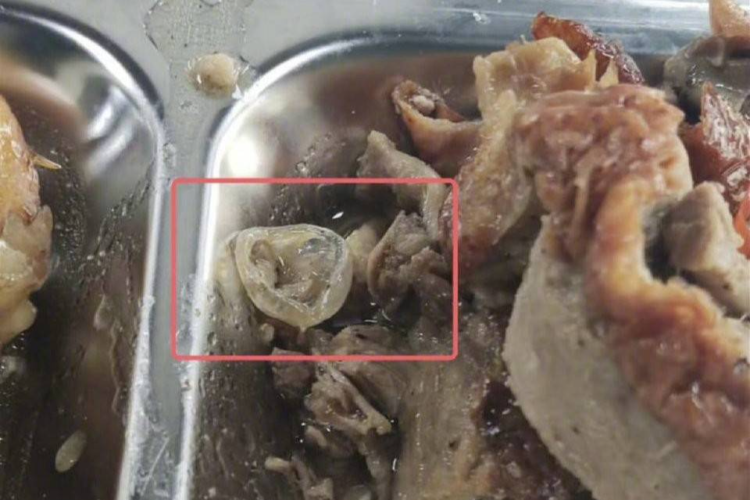

# “高度可能”是鸭眼球膜，这个结论为什么更加可信

7月19日，广州市增城区市场监督管理局公布华世科教食堂饭菜异物检测情况，经广州市食品检测所、广州市质量监督检测研究院综合形态学检测、核酸检测、蛋白质检测和红外检测等方法，认为“送检样品排除橡胶制品和一次性手套可能，高度可能为鸭眼球巩膜结构”。

检测结果是什么就说什么，这场鸭眼球膜疑云的通报，呈现出有别于此前“指鼠为鸭”事件的情况，相当比例网友对通报结果表示认可。当然，仍然有跟帖有所疑问，这也很正常，有先入为主的因素，也有接受度的问题。有专业的检测结果在，完全可以进一步公开检测过程视频资料，进一步解答疑问。

毕竟， **公共释疑从来都不是一锤子买卖，与网友互动就应当有来有往，知无不言。**

正如不少网友甚至专家在检测结果出来前所言，争议物品因为缺乏必要参照物，再加上不同的拍摄角度，很难对物品大小有准确认知，需要权威检测。

有人注意到官方通报的措辞，最终也是“高度可能”，而没有斩钉截铁，事实上即便是再专业的DNA检测，也往往是给出概率比例。这次检测，不仅“对送检样品进行核酸检测，检出鸭源性成分；对送检样品进行蛋白质检测，检出蛋白质成分，说明样品是动物的有机质构成”，而且邀请专家到第三方检测机构实验室，共同进行了形态学检验，“现场解剖煮熟鸭头眼球结构，取其外壁的巩膜与送检样品吸水复原后，形态对比高度相似，两者直径均为1.5厘米左右，并且外形、颜色、结构和触摸质地都非常相似”。

**从内到外的几项检测支撑“排除橡胶制品和一次性手套可能，高度可能为鸭眼球巩膜结构”的结论，应当说是比较严谨专业的做法和表述。**

不仅如此，涉事样品送检前还“经公安部门封存”，从程序上保证了送检样品不被污染。如果说还有需要完善的通报细节，则是对警方封存时间的披露，避免外界对涉事物品还有“被掉包”的疑问。

而在这场看似乌龙的事件中，涉事学校最开始的处置，选择第一时间寻求专业鉴定当然是对的，“成立专门的小组进行内部调查，包括追踪原材料供应链、排查可能的操作失误和检查食堂流程”也是应该的，但与之同步的其他处理并非没有可商榷的空间。此前，媒体获取的一份校方回复函显示：在检测正在进行中时，全体厨房员工“已问责并进行扣钱处罚”，涉事厨师“予以开除处理”。尽管校方也初步认定是鸭子眼球膜……

既然已送检，既然结果还未出，对涉事机构、人员的处罚是不是也该等一等？哪怕是现场封闭、人员停职接受检查也好。没有检测结果做依据，很难不让人对涉事学校处罚食堂、厨师的动机也有所疑问——这究竟是因事而罚，还是因舆情而灭火自保？
**舆情处置可以应急，但绝不能急到慌不择路** ，这同样谈不上公正客观，更不够科学严谨。

复盘这么一场在很多人看来“又会爆”的食品卫生个案处理流程，从目前情况看，
**及时的调查介入，专业权威的检测，是什么就说什么的通报，以及尽可能详尽的内容，对于公共疑虑的化解非常重要。**
监管部门不偏不倚，检测机构拿证据说话，其权威性、公信力依然值得呵护。

同样，舆论并非无法被说服，只要证据扎实、检测严谨、通报及时详尽不拖沓。一些失控个案之所以令当事方事与愿违，高概率是因为调查的模糊遮掩、通报的语焉不详以及回应公众疑问的不力。短时间内就有多起同类个案呈现出截然不同的走向，值得各方深思。

