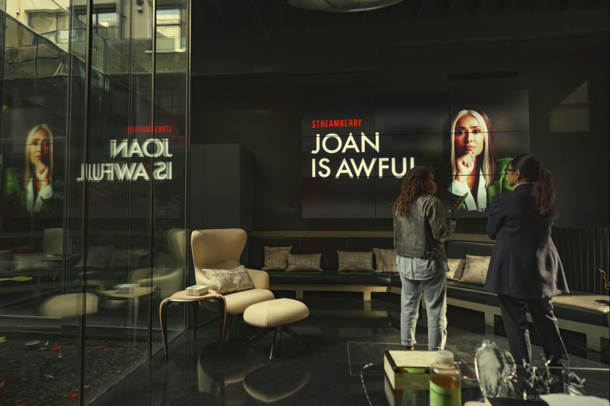
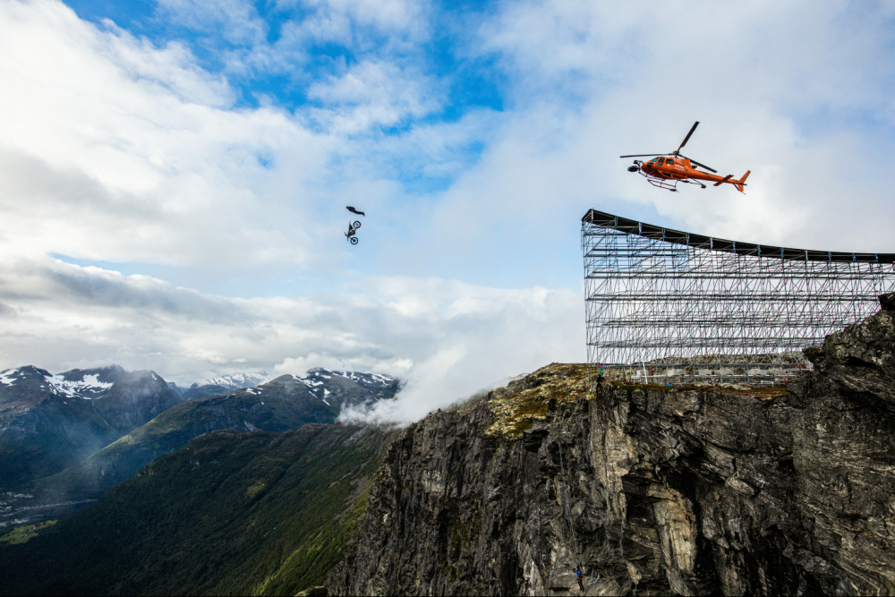
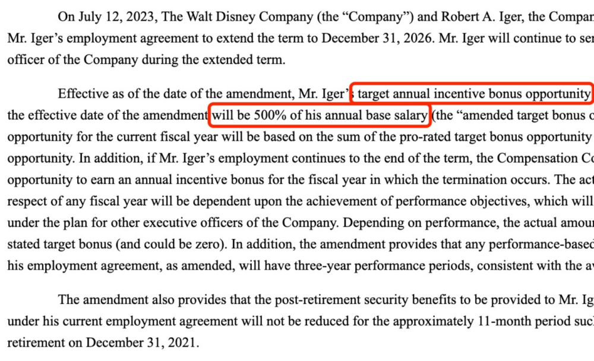

# 《碟中谍8》明年看不到了？好莱坞迎来最大罢工潮，都是AI惹的祸

腾讯新闻《潜望》特约作者 刘承 编辑 杨布丁

首映式还没办，明星们不见了。

7月13日，大导演克里斯托弗·诺兰新片《奥本海默》的伦敦首映式上，就出现了这样奇特的一幕。“钢铁侠”小罗伯特·唐尼、马特·达蒙等一众明星盛装走完红毯后，集体转身离场，只留下导演诺兰独自和观众打招呼。

当天大洋彼岸的午夜，美国演员工会及广播电视艺人联合工会（SAG-
AFTRA）宣布启动1980年以来首次大罢工，工会16万名表演者立刻停止所有影视拍摄和宣传工作。

今年5月，因劳资双方谈判破裂，有上万名成员的美国编剧工会（WGA）宣布罢工，很多尚未完成剧本创作的作品当即停摆。

如今十几万演员也加入罢工阵营，两大工会63年来首次联合罢工，直接波及到已进入拍摄的作品，包括《碟中谍8》、《死侍3》、《毒液3》、《怪奇物语》等大项目。如果罢工不能尽快结束，未来一两年内计划问世的好莱坞电影、美剧的进度将受到全面冲击，预计损失可能超过40亿美元。

在好莱坞，工会是保护普通员工利益的重要力量。正是有工会方在收益分配条款上据理力争，龙套演员和幕后工作者才能从当红美剧、票房大片的成功中持续分得收益。但在今年这场席卷整个好莱坞的罢工行动中，除了往届谈判常会出现的收益分配、待遇保障问题外，人工智能（AI）成为新的争议焦点。

眼看流媒体增长放缓、票房大片折戟，好莱坞高管们将希望寄托在突飞猛进的AI技术上，希望让AI参与到影视创作中，挽救摇摇欲坠的商业模式。

然而编剧、演员担心，如果同意AI参与剧本创作、让渡肖像权给AI加工，长期来看创作者会被逐步被取代，受益的只有资本方。用演员工会代表的话说，“我们都面临着被机器取代的危险。”

**AI入侵好莱坞**

好莱坞这场大罢工已经酝酿了好几个月。

今年5月，美国编剧工会（WGA）和代表资本方利益的电影电视制片人联盟（AMPTP）三年协议到期。在此之前，双方就新一轮的三年协议拉开了谈判。

和往年一样，劳资双方的矛盾核心围绕薪资分配展开。编剧工会声称，在行业向流媒体转变的过程中，编剧的薪资不断降低，导致很多从业者不得不在极短的时间内以最低薪资完成超量工作。

到6月30日，演员与制片方的的协议也到期（后被临时延期到7月12日）。代表美国16万演员、舞者、特技演员、配音演员的SAG-
AFTRA与制片人联盟也开启了谈判。

AI成为了劳资双方谈判的一大矛盾点。编剧工会提出，要对AI参与项目进行监督、AI生成的内容不得作为原始素材、工会成员的剧本不得被拿来用于训练AI。诉求被制片人联盟拒绝。

演员战线的谈判也不乐观。制片人联盟一方提出了一项提议，片方可对影视剧中的群演进行扫描并支付当日酬劳，而扫描获得的素材可被片方另作他用。演员工会担心，片方会在没有支付酬劳或获得批准的情况下用演员的肖像结合AI生成表演，或者对表演进行数字化修改。

这种担忧并非没有根据。

今年播出的《黑镜》第六季第一集极有预见性地描绘了这样一幕：一位好莱坞女明星将本人肖像权授权给片方，结果被“一键换脸”出现在AI创作的屎尿屁场景里，按合同她还不能寻求赔偿。获得过奥斯卡提名的萨尔玛·海耶克（Salma
Hayek）在剧中以本人形象出演。

_（《黑镜》第六季第一集，剧照）_

在更极端地畅想下，平台甚至希望发展成观众想看哪个明星主演某类题材，AI就能创作出来。《复仇者联盟3、4》导演乔·罗素就认为，不出两年时间，AI生成的电影长片就能发展到以假乱真的地步。

这样一来，编剧、演员们的生存空间可想而知——只需要给片方打一次工，后者就能用AI自行写剧本、自行生成表演。

因此好莱坞普遍表示出谨慎态度。诺兰在《奥本海默》映后采访中提出，AI应该是作为一种工具，但现在企业将AI视为一种逃避行为责任的手段。

在成员们高票支持下，编剧工会、演员工会先后在5月1日和7月13日宣布罢工。澳大利亚、加拿大、英国、意大利等地编剧工会纷纷声援美国同行，澳大利亚、英国的编剧工会告知成员，不得接手因美国编剧罢工而停摆的现有项目。

_（演员、编剧们联合罢工，来自美国西部编剧工会官方推特）_

上一次好莱坞编剧罢工还是15年前。在2007年至2008年初，美国编剧工会发起了长达100天的罢工，《越狱》、《迷失》、《绝望主妇》等当时爆红的美剧被迫停更、缩减集数，共有80多部美剧被迫暂停拍摄，造成了20多亿美元的经济损失。

这一次编剧、演员联手罢工，波及面只会更广。智库米尔肯研究院（Milken
Institute）研究认为，这次罢工可能造成至少40亿美元的损失，因为不仅是美国本土的影视制作会停摆，还会影响到大量在英国、澳大利亚、新西兰等英语国家拍摄的影视项目，比如亚马逊天价制作的《指环王》在英国拍摄，就不得不在编剧缺席的情况下拍完了第二季。

只有极少数剧本已完成、以非美国演员为主的项目可以幸免，如HBO的新台柱《龙之家族》第二季。

**当漫威电影宇宙都接连扑街**

好莱坞急着拿AI做文章，背后原因是整个影视行业的商业模式面临挑战。

一路爆发式增长的好莱坞各大流媒体，去年纷纷迎来拐点。先是Netflix，在2022年一季度首次出现订阅用户倒退，十几年来的增长神话被打破，美股传媒板块集体下跌。

紧接着Disney+在2022年四季度出现了问世以来首次订阅用户倒退，少了240万付费会员，今年一季度又少了400万付费会员。去年第四财季，迪士尼的流媒体业务亏损近15亿美元。

“订阅”这一商业模式，前几年备受资本市场认可。2021年最火的时候，Netflix股价超过700美元，迪士尼股价超过200美元。相比波动极大的院线票房，“按月付费、可看海量内容”的订阅制流媒体（SVOD）看上去旱涝保收，用户和片方皆大欢喜。

但随着海外通胀持续上涨，流媒体订阅费很快成为大众最先砍掉的非必需开支之一。

为了确保收入，Netflix、Disney+、Hulu、Peacock、Max（原HBO
Max）、Paramount+等流媒体纷纷上调了月费。其中Netflix、Disney+、HBO
Max为留住部分用户，抛弃了纯粹的SVOD模式，推出了月费更低但需要看广告的会员等级。

Netflix还开始严厉打击账户共享，要求同一账户名下的设备每31天至少需要登录一次该账户所属的Wi-
Fi。其他地址的用户要想共用该账户，需要每月额外付7.99美元。

与此同时，线下的院线大片表现也不理想。

华纳兄弟最近两年推出的《闪电侠》、《雷霆沙赞2》、《黑亚当》等多部院线电影票房不及预期。其中今年暑期上映的《闪电侠》制作成本超过2亿美元、宣发成本1.5亿美元的，但最终全球票房不到2.7亿美元，预计最终亏损超过2亿美元，将成为华纳史上亏损最多的作品之一。

派拉蒙最近热映的《碟中谍7》，上映第一周全球票房2.35亿美元，但由于疫情导致延期，影片成本高达2.9亿美元，回本任务艰巨。今年派拉蒙的《变形金刚6》和

环球影业的《速度与激情10》票房都比前作有所倒退。

_（《碟中谍7》中AI成为重要故事元素，剧照）_

迪士尼旗下卢卡斯影业的《夺宝奇兵5》，上映半个月来全球票房3亿美元，其制作成本据报道高达2.95亿美元（另有报道称高达3.29亿美元）；另一厂牌皮克斯的《疯狂元素城》全球票房3亿美元出头，而成本预计有2亿美元。两部电影大概率都无法回本。

几年前还是金字招牌的漫威电影宇宙最近几年也接连扑街，《永恒族》、《雷神4》、《黑豹2》、《蚁人3》 都不及预期，只有《银河护卫队3》保住了口碑。

为了大力发展流媒体，迪士尼旗下的漫威、皮克斯、卢卡斯影业等工作室纷纷推出剧集。重掌迪士尼的罗伯特·艾格前不久表态，认为漫威推出剧集削弱了观众对电影的关注度。

去年表现上佳的主题乐园今年也有所降温。有第三方统计发现，奥兰多的迪士尼世界今年6月平均排队时间只有33分钟，是2022年1月以来的新低。奥兰多环球影城今年平均排队时间相比去年也出现了下滑，意味着到访游客减少了。

各大媒体集团从去年开始就陆续提出要削减开支。其中迪士尼今年计划减少55亿美元的开支，并开启了又一轮大裁员。在大幅削减10亿美元的内容开支的基础上，去年华纳兄弟探索（Warner
Bros. Discovery）全年共亏损74.2亿美元，今年一季度又继续亏损超过10亿美元。

在这样的环境下，AI对好莱坞资本方的诱惑力可想而知。

只要有电有网，AI就能依靠现有的影视素材“创造”不限量的内容，生产效率提升的同时开支大幅降低，远比用真人划算。只要观众能接受，亏损自然迎刃而解。

**高管吃肉、基层喝汤**

但在编剧、演员工会一方看来，好莱坞各大媒体集团亏损的原因并不是人工太贵，而是收益分配出了问题。

首当其冲的是，好莱坞高管们的薪酬太高。

《洛杉矶时报》统计了好莱坞各大集团高管过去五年的片酬发现，华纳探索掌门人大卫·扎斯拉夫（David
Zaslav）五年入账近5亿美元。Netflix首席执行官里德·黑斯廷斯（Reed Hastings）、迪士尼CEO罗伯特·艾格（Robert
Iger）分别入账近3亿美元和近2亿美元。

而按照编剧工会主张的薪资方案，未来三年11500名编剧获得年均整体薪资4.29亿美元，相当于人均每年约3.7万美元。

这并非漫天要价。2022年美国居民税前人均年收入约4.1万美元。然而制片人联盟方面给编剧工会的报价一年只有8600万美元，人均0.75万美元。

2020年美国编剧工会调查显示，当年因为新冠疫情带来的工作中断，好莱坞有80%的幕后工作人员年收入还不到5万美元，甚至有三分之一的收入不到3万美元，平均每月不到2500美元。

但高管们并不认同。罗伯特·艾格近日公开表示，演员和编剧们的期望太高不切实际，“整个行业还没完全复苏，现在组织罢工是在最糟的时候添乱”。

这番表态丝毫没有妨碍艾格给自己争取加薪。

就在7月12日，艾格的CEO合同延长两年到2026年底。迪士尼提交给美国证监会的文件显示，在去年定下的100万美元年薪以及每年价值2500万美元的股票和期权基础上，艾格每年奖金从原定100万美元提升至每年最多500万美元。

_（艾格每年奖金最多可达年薪的5倍，图为迪士尼提交给美国证监会的文件）_

事实上，过去几年好莱坞媒体高管们力推的流媒体业务，很大程度上造成了双方收入的不平等。

传统的“剧集上电视、电影进影院”的播出模式下，除了金字塔尖的大牌明星和编剧有权力要求先拿片酬（Upfront），好莱坞普通从业者主要是靠与工作时间挂钩的最低薪资，能否获得理想的后续分成要看作品的收益，这一点又取决于票房和收视率。

但在流媒体时代，大量电影、剧集绕过影院、电视直接上线，如何算清这些项目的收益成了难题。

对于普通从业者来说，后续分成（Residues）是收入中极为重要的一部分。一位十几年前客串过《生活大爆炸》的龙套演员最近就在网上分享：他在剧中某一集只有一句台词，但直到近年仍然会不时因为这部剧的重播、影像制品销售而获得收入。

更不用说那些大牌明星。《老友记》已经完结近二十年，主演们每年仍能分得2000万美元。但以Netflix为代表的流媒体崛起后，很多项目会给出较高的一次性酬劳，但不再提供后续分红。

不仅如此，流媒体时代，影视项目推进节奏加快，同时剧集长度普遍缩短，这意味着编剧、演员们的工作节奏更快，但可计算薪资的工作时间反而变少了。

针对流媒体收益不透明、工作计划减少等现状，编剧工会给出了非常详细的薪资诉求：未来三年按一定百分点提高全体编剧的最低薪资和后续分红；重写剧本需要付费，避免后续无节制修改；针对流媒体项目明确编剧底薪，并要求流媒体公开收视评价标准，部分高预算流媒体项目要结合海外用户订阅数来计算二次分红等等。

演员工会同样提出了提高最低薪资、提高流媒体后续分红和改善工作环境等要求。演员工会声称，由于流媒体的影响，演员们已经无法依赖后续分红，同时由于流媒体剧集变短演员的工作时间也在变少。

如果劳资双方不能在9月之前谈妥，好莱坞各大媒体集团的内容存货都将所剩无几，明年开始，电影院、流媒体将面临无片可放、无剧可播的局面。

在今年5月编剧宣布罢工后， 制片人联盟发表声明称，很遗憾工会选择了一条会导致无数编剧陷入财务困境的道路。

在演员们罢工前，有报道称资方已决定鱼死网破，打算到10月底之前都不会和编剧工会谈判，预计到时候编剧们会因为没有收入而被迫接受资方的条件。

“好莱坞教父”巴里·迪勒（Barry Diller）最近出面，规劝好莱坞媒体高管和大牌明星们减薪25%，从而缩减和行业普通从业者之间的收入差距。

他警告，“如果不能尽快解决，可能会给整个行业带来灾难性的后果。”

