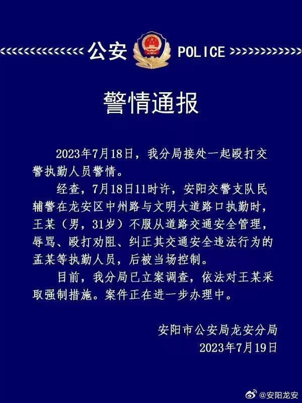

# 一男子不服从道路交通安全管理殴打交警执勤人员，河南安阳公安通报

来源：安阳龙安

警情通报

2023年7月18日，我分局接处一起殴打交警执勤人员警情。

经查，7月18日11时许，安阳交警支队民辅警在龙安区中州路与文明大道路口执勤时，王某(男，31岁)
不服从道路交通安全管理辱骂、殴打劝阻、纠正其交通安全违法行为的孟某等执勤人员，后被当场控制。

目前，我分局已立案调查，依法对王某采取强制措施。案件正在进一步办理中。

安阳市公安局龙安分局

2023年7月19日

