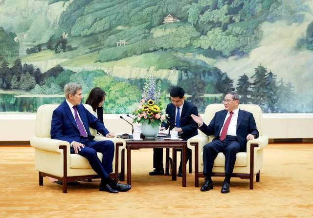

# 中美间的这项重要合作“回暖”了？

7月18日上午，国务院总理李强在人民大会堂会见美国总统气候问题特使克里。李强指出，当前全球应对气候变化任务艰巨，需要包括中美在内的各国加强协调、凝聚共识、抓紧行动，最大程度形成应对气变的合力。

同一天，中共中央政治局委员、中央外办主任王毅也会见了克里。

克里此次为期三天的北京之行，是他作为美国总统气候问题特使的第三次访华。同时，他也是继美国国务卿布林肯和财政部长耶伦之后，最近一个月时间里第三位访华的美国高官。

7月17日上午，克里与中国气候变化事务特使解振华举行了长达4个小时的会谈。当天下午的例行记者会上，中国外交部发言人毛宁表示，中方将落实两国元首巴厘岛会晤的精神，同美方就气候变化相关议题深入交换意见，携手应对挑战，增进当代和子孙后代的福祉。

在北京大学国际关系学院教授、美国研究中心主任王勇看来，就气候变化本身而言，中美在一年之后重启气候变化对话，也将给全球气候变化行动和计划注入更多信心和希望。

_7月18日上午，国务院总理李强在北京人民大会堂会见美国总统气候问题特使克里。图/新华_

**少有的合作亮点**

访华前夕，克里在接受媒体采访时表示，美中双方需要“真诚的合作”。他还指出，中国和美国是世界上最大的两个经济体，双方负有寻求共识的特殊责任。

今年5月，克里曾谈到他重点关注的三个问题，削减甲烷排放，限制煤炭使用和可再生能源转型，以及中美在森林破坏问题上的合作。

绿色创新发展研究院董事莫争春对《中国新闻周刊》表示，甲烷排放和燃煤发电会是此次中美气候问题会谈上的两个重点。他还表示，虽然目前中美双方信任度不够，很难有特别大的突破出现，但从历史角度来说，见面总比不见好，会谈总比不谈好。过去中美在气候合作上的重大突破，常常是在分歧之中达成的。

对于此访，克里办公室近日曾表示，会就应对气候危机同中方进行接触，并就推动《联合国气候变化框架公约》第二十八次缔约方大会（COP28）等议题交换意见。

COP28计划于11月底至12月上旬在阿联酋迪拜举行。大会将对各国在实现《巴黎协定》目标方面取得的进展进行首次盘点，并根据《巴黎协定》目标制定行动计划。

美国乔治城大学科学、技术和国际事务项目主任乔安娜·刘易斯认为，如果美国和中国无法在COP28会议召开之前讨论关键问题，那么将会给会议达成成果带去挑战。

克里访华之前，外交部发言人汪文斌表示，中美就各层级对话与交往保持着沟通。气候变化是全球性挑战，需要各国合力应对。中美曾在气候变化领域开展过良好合作，共同推动《巴黎协定》达成生效。“我们希望美方同中方相向而行，为中美气候合作创造有利条件和氛围。”汪文斌称。

近些年中美关系进入低谷状态以来，气候变化合作一度是两国少有的合作亮点。但去年8月时任美国众议院议长佩洛西窜访中国台湾地区，中国对美采取8项反制措施，其中就包括暂停与美国在气候问题上的对话和合作机制。此后，中美这两个全球最大经济体已经有将近一年没有正式讨论气候问题。

也正是因此，本次克里与解振华的会谈受到多方关注。王勇对《中国新闻周刊》表示，这次长时间的会谈说明，中美在气候问题上有很多探讨空间。

**面临不确定性**

根据世界气象组织（WMO）的初步数据，全球刚刚经历了有记录以来最热的一周。今年6月，全球平均海面温度达到新高，南极海冰面积则创历史新低。陆地和海洋破纪录的气温可能对生态系统和环境造成毁灭性影响。

中美两国作为全球最大的两个温室气体排放国，共同应对气候变化挑战已成为国际责任所在。事实上，中美两国多年前便开展了气候合作。

早在2008年，美国政府就开始高度重视中国在气候变化问题上的作用，中美双方在环境和能源领域达成合作，签署了《中美能源环境十年合作框架》。次年，克里和奥巴马等美国政要密集访华，就哥本哈根气候变化会议进行协调，促成了《加强气候变化、能源和环境合作的谅解备忘录》，并建立了中美清洁能源联合研究中心。

奥巴马任期内，将应对气候变化视为其主要政治议程之一，中美气候合作成为两国合作的亮点。2014年11月，奥巴马来华出席亚太经合组织（APEC）领导人非正式会议期间，中美双方共同发表了《中美气候变化联合声明》。

2015年和2016年，中美两国元首又两度发表气候变化联合声明。得益于两国的合作，《巴黎协定》最终落地和生效。《巴黎协定》的长期目标是将全球平均气温较前工业化时期上升幅度控制在2摄氏度以内，并努力将温度上升幅度限制在1.5摄氏度以内。

但特朗普就任美国总统后，宣布美国退出《巴黎协定》，使美国成为反对抗击气候变化全球努力的三个国家之一，动摇了中美、欧美等重要双边气候合作机制的基础。

当时中国外交部回应称，《巴黎协定》凝聚了国际社会应对气候变化的最广泛的共识，各方应共同珍惜和维护这一来之不易的成果。未来，中国将继续做好应对气候变化各项工作，积极参与气候变化多边进程，坚定不移维护全球气候治理进程。

2020年9月的第七十五届联合国大会一般性辩论上，中国承诺将提高国家自主贡献力度，采取更加有力的政策和措施，二氧化碳排放力争于2030年前达到峰值，并努力争取2060年前实现碳中和。在2021年的全国两会上，碳达峰、碳中和还首次写入了《政府工作报告》。

拜登政府上台后，通过颁发行政令“将应对气候危机置于美国外交政策和国家安全的核心”。与此同时，拜登在其就任总统的第一天就签署17项行政命令，其中包括重新加入《巴黎协定》。2021年11月，中美两国还发表《中美关于在21世纪20年代强化气候行动的格拉斯哥联合宣言》。

王勇认为，虽然拜登多次表示希望与中国在气候变化领域展开合作，但由于美国分裂的政治体制，联邦政府与地方政府分权，一些地区并未能够达到减排要求，兑现应对气候变化承诺。此外，很多分析也指出，由于美国两党内部的分歧，中美气候合作充满不确定性。与此同时，2022年通过的《美国竞争法案》也在能源等领域加大对华打压和竞争的力度。

清华大学战略与安全研究中心助理研究员董汀也表示，2021年4月签署的《中美应对气候危机联合声明》，明确双方在未来十年采取应对气候变化行动的重点领域，不仅包括高排放领域的脱碳与新能源的使用，还涵盖了农业、建筑、交通、非二氧化碳温室气体减排、国际航空及海运减排等排放高速增长的重点领域。但是拜登任内将气候危机应对安全化的做法给上述领域的合作造成很大障碍。此外，受当前美国国会对华强硬态度的影响，特别是针对中国科技“不安全”的论调，各种对华投资、贸易和科研的审查趋紧且规则模糊，导致具体的合作项目很难有实质性进展。克里临行前出席的众议院听证会，更表明共和党对其与中国气候问题合作的政治干预仍在加剧。共和党在中期选举前推出的路线图已经表明，他们应对气候变化的方法基本与拜登政府背道而驰。如今2024大选已经日益迫近，美国政府气候变化政策，将存在较大变数。

**气候合作成“突破口”？**

近期，中美高层互动频繁。先于克里来中国访问的耶伦称，“世界足够大，足以让我们两国繁荣发展”，布林肯则强调了美国和中国建立更好的沟通渠道的重要性。

耶伦在访华期间也谈到了气候问题。在参加一个气候融资问题圆桌讨论会议时，她表示：“气候变化位列全球挑战之首，而美国和中国必须共同努力来应对这项存在性威胁。”

乔安娜·刘易斯认为，从布林肯对中国的访问开始，拜登政府过去几周的重点就是重建美中双边关系。她指出，尽管美中政治和经济关系紧张，但两国仍应在应对气候变化方面进行合作，并引领全球的合作。

在政治、安全、外交等一系列沉重的议题中，气候最有可能成为中美双边合作的“突破口”。现年79岁的克里和74岁的解振华相识超过20年。2021年，解振华与克里在上海会面时曾表示，他们都认为行动重于空谈。克里也曾称解振华是一名全球气候变化议题方面的“领导人物”和“有能力的推动者”。得益于两人的共同努力，中美在气候议题上曾实现多个重大突破。

在王勇看来，克里访华是中美恢复气候合作的一个新的开始。乔安娜·刘易斯也有同样的看法，“这一切的发生”本身就非常重要，即使只是同意继续会面。她认为，这类官方会谈的重启，对私营机构以及非政府组织和研究人员之间的交流也将起到促进作用。

发于2023.7.24总第1101期《中国新闻周刊》杂志

杂志标题：克里访华：中美气候合作“回暖”？

记者：郑立颖

