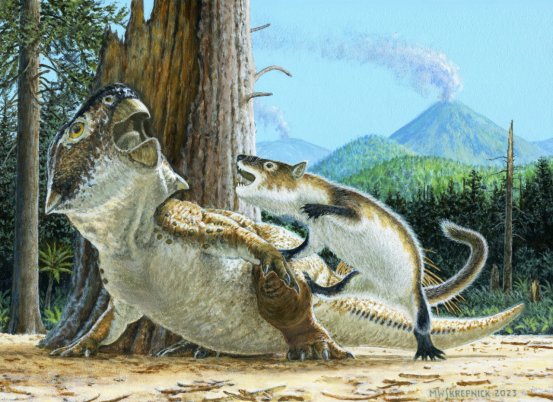
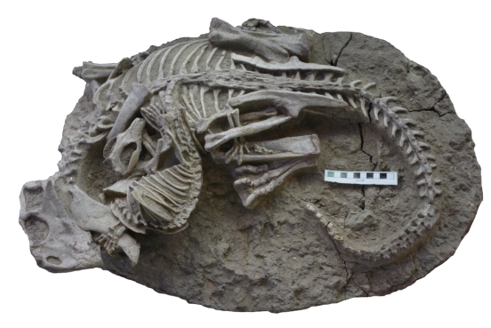
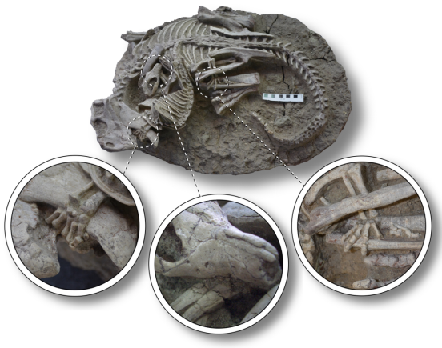

# 人类首次发现！白垩纪恐龙“霸主地位”受到挑战

【环球时报-环球网报道 记者
樊巍】在约1.25亿年前，一只生活在如今中国辽宁地区的一种类似于獾的肉食性哺乳动物，在尝试捕食一只体型远大于自己的鹦鹉嘴龙时突遇火山喷发，喷薄而出的火山泥石流瞬间将两只正在缠斗的远古野兽掩埋。后世的科学家们根据它们遗留的化石还原了这场殊死搏斗的惊险场面。这块宝贵的化石也被认为是人类迄今为止发现的哺乳动物捕食恐龙的最早证据。中加两国学者围绕这块化石所取得的相关研究成果于北京时间7月18日晚发布于国际知名学术杂志《自然》的子期刊《科学报告》。论文作者18日晚在接受《环球时报》记者采访时表示，相关发现意义重大，完全颠覆了人类以往对于白垩纪恐龙世界的认知。

_艺术复原图：1.25亿年前，强壮爬兽捕食鹦鹉嘴龙。Michael Skrepnick 图_

这块现在被收藏在山东省威海紫光实验学校博物馆的罕见化石被认为再次挑战了白垩纪恐龙的“霸主地位”，在此之前学界的普遍观点认为，在白垩纪期间恐龙是地球的主宰，几乎不可能受到同时代哺乳动物的威胁。

“当时这只鹦鹉嘴龙处于俯卧的状态，而这只哺乳爬兽的身体向右盘绕并俯坐在猎物的背侧、抓扒着鹦鹉嘴龙的下巴并撕咬着鹦鹉嘴龙的一些肋骨，与此同时，爬兽的小腿被鹦鹉嘴龙的后腿夹着。两只远古野兽在争斗过程中间纠缠在了一起。而此时火山爆发喷薄而出的热火山灰和火山碎屑一下子就将两只野兽埋住了。”论文作者之一，加拿大自然博物馆古生物学者吴肖春博士向《环球时报》记者介绍称，化石中两个动物死亡时都是亚成体。其中，化石中的鹦鹉嘴龙体长119.6厘米，大小与一只大型犬相当。这种植食性恐龙也是目前已知的最早的有角恐龙之一，生活在大约在1.25亿至1.05亿年前的白垩纪早期。而捕食它的哺乳动物是一种类似于獾的动物，学界称其为强壮爬兽，体长约为46.7厘米。虽然按照恐龙的标准强壮爬兽并不大，这只鹦鹉嘴龙的体型甚至比它大将近三倍，但它仍是白垩纪最大的哺乳动物之一。

在此之前，古生物学家已经知道强壮爬兽会食用包括鹦鹉嘴龙在内的恐龙，因为此前发现的一块爬兽标本显示，其胃中发现了鹦鹉嘴龙幼年个体的骨骼残留。但当时学界并不能确定这只爬兽究竟是捕食了这只恐龙，还是仅仅是食腐行为。该论文作者之一，加拿大自然博物馆马隆博士介绍称，爬兽和鹦鹉嘴龙同时生活在一起并不新鲜，但从科学角度而言，惊奇的是这块化石所揭示的捕食行为。

据《环球时报》记者了解，中加两国学者经过对这块化石的仔细观察认定，爬兽是在捕食鹦鹉嘴龙而不是在啃食一具鹦鹉嘴龙尸体，因为恐龙骨架上没有留下被啃食的任何牙印。“如果鹦鹉嘴龙在爬兽遇到它之前就已经死了，那么这两只动物不太可能变得如化石中呈现的那样纠缠一起。爬兽位于鹦鹉嘴龙背方的位置也表明它是攻击者。”马隆称。

_显示缠绕在一起的鹦鹉嘴龙
(恐龙) 和 爬兽(哺乳动物)两具骨架。 比例尺等于10厘米。(图片来源: 韩刚)_

在现今世界中，小型动物攻击体型较大的猎物司空见惯。吴肖春表示，众所周知，一些孤独的狼獾会猎杀较大的动物，包括驯鹿和家养的羊等。而在非洲大草原上，野狗、豺狼和鬣狗会攻击仍然活着大型猎物，很多情况下，倒下的猎物经常处于休克状态。马隆则一步表示，这也可能就是这块化石中所展现的情况，爬兽实际上在鹦鹉嘴龙还活着的时候就想吃了它
，不过，它们都葬身于即时的火山喷发及随后的火山泥石流中。

“此次发现的特殊意义就在于证明了作为哺乳动物的爬兽确实能捕食恐龙，也证明了爬兽和鹦鹉嘴龙在白垩纪整个生态链中的特殊作用。”吴肖春进一步介绍称，这块化石是于2012年在被喻为“中国的恐龙庞贝城”的辽宁省朝阳市北票市上园镇小北沟村陆家屯被发现，该地区保存有许多个体完整的恐龙、小型哺乳动物、蜥蜴和两栖动物化石，这些动物无差别地被一次或多次火山突然喷发及随后的大量火山泥石流掩埋。当地发现的动物化石属种中有百分之九十以上的化石都是鹦鹉嘴龙，所以在整个生物链中，鹦鹉嘴龙是被捕食的主要对象，提供了大量的食物，是生物链中的重要一环。

在论文中，由中加两国学者组成的研究小组还推测，在辽宁陆家屯源于火山喷发的沉积层中可能会继续产生物种之间相互争斗的新标本、新证据。吴肖春也认为，也不排除未来可能会发现白垩纪哺乳动物捕食肉食性恐龙的证据。

