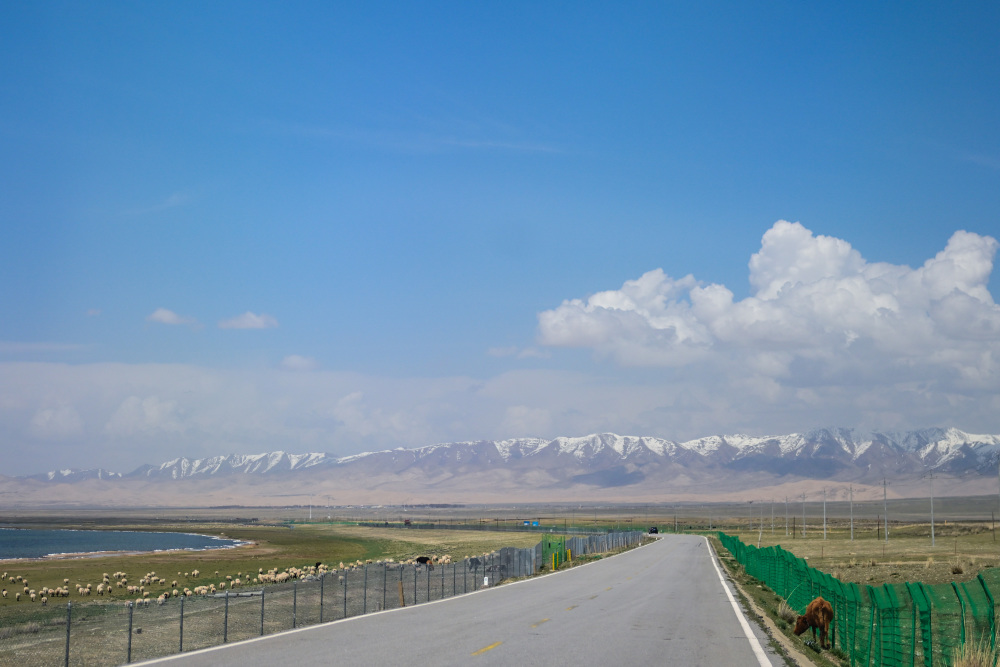

# 修建围栏是“赶游客入景点”还是另有缘由？三问青海湖“围栏挡景”

新华社北京7月19日电 7月19日,《新华每日电讯》发表题为《三问青海湖“围栏挡景”》的报道。

“自驾一千多公里，结果整个青海湖就只能在远处看看”“过去跑马圈地，现在围景收钱”“青海湖全被围栏围起来，被戏称铁丝网湖”……近期，国内旅游热门目的地青海湖因环湖的铁丝网围栏引起舆论关注，不少游客质疑青海湖为收费而把景色“关起来”、“严禁欣赏祖国大好河山”。

青海湖为何修建围栏？修建围栏是“赶游客入收费景点”还是有其他目的、历史原因？围栏后游客如何近距离观赏湖景？青海湖景区如何提升旅游品质？围绕社会关注焦点，新华每日电讯记者近日实地探访青海湖，走访游客、当地群众、管理部门、业内专家等，了解争议的来龙去脉，探求解决之道。

**青海湖缘何设围栏？**

【主要成因有两个：一是湖岸围栏主要是草场区界；二是部分围栏用于保护生态】

暑期旅游高峰来临，在青海湖景区，来自江苏省的游客周先生向记者吐槽：“本想走到湖边玩一玩，结果到处都有围栏，不得不买票进景区。围栏给人的感觉就是把游客赶入收费景点。”

青海湖缘何设围栏？本报记者近日实地探访发现，围栏由来已久，主要成因有两个：

一是湖岸围栏主要是草场区界。记者驱车绕行青海湖一周，发现湖岸草场为牧民牧场，围栏内有牧民零散放养的牲畜。沿岸牧民也向记者证实，围栏的作用是防止牲畜乱走和车辆碾压破坏草场。“过去围栏比较简单，现在是质量更好的镀锌钢丝网。”

_5月16日,青海湖环湖东路附近的一处围栏。新华每日电讯记者张龙摄_

青海省农业农村厅相关人员也表示，草原围栏由来已久，目的是控制家畜牧食活动、调节牧草供求平衡，是促进退化草原植被恢复和固定草原使用权的有效措施。青海自20世纪80年代开始，从内蒙古等地引进镀锌钢丝网围栏进行试验示范，并在全省牧区推广应用。不仅青海湖，记者驱车行驶在青海主要牧区，草场均设有大大小小的围栏，用以区分不同归属的牧场。

二是部分围栏用于保护生态。相关部门向记者表示，除牧场围栏外，一些重要湖岸线的围栏是为了保护青海湖生态而设。“青海湖是国家级自然保护区，生态系统敏感脆弱，生物多样性丰富独特，根据《中华人民共和国自然保护区条例》，自然保护区核心区、缓冲区不能开展旅游经营活动。”青海省生态环境规划和环保技术中心生态环境研究所所长邓黎说，青海湖是维系青藏高原生态安全的重要水体，是控制西部荒漠化向东蔓延的天然屏障，设置围栏等措施可以减少或严控人为活动对生态保护重点区域的不利影响。

青海湖景区是普氏原羚的栖息地，舆论同样担忧围栏影响其活动。针对质疑，青海湖景区保护利用管理局相关负责人表示，2000年之前，网围栏对普氏原羚自然活动和种群间基因交流有一定影响。2000年之后，青海通过采取设置饮水点、人工补饲、开辟安全通道和牧民腾出草场扩大普氏原羚栖息地等方式，保护普氏原羚栖息地。从20世纪80年代末到现在，普氏原羚在青海湖地区的数量，已经从不足300余只增加到目前的3480只。

青海省委党校（行政学院）经济学部教授马桂芳表示，青海湖不是单一的旅游目的地，还承担着生态保护等多重职能。在环境保护和旅游开发之间，必须坚持保护优先，在此基础上丰富生态旅游业态，细化旅游服务，提升旅游体验。

**游客如何亲近青海湖？**

【治理私设“景点”乱象造成亲水景点短期有效供给不足；年初已经在自然保护区的非核心区增设了12个疏散观景点，但因为建设周期问题，尚未完全建成】

既然青海湖的围栏并非今时今日所建，为何在今年引发游客大量“吐槽”？

记者走访调研了解到，当地针对保护优先的定位，在管理上持续发力，但在疏导上有待提升。

青海湖过去虽然有围栏，但部分环湖牧民打开自家围栏设置“旅游通道”和“小景点”，并通过收费让游客亲水、骑马拍照，让大量游客有了亲近青海湖的通道。但类似私设“景点”数量“膨胀”，一方面经常产生冲突纠纷，另一方面严重破坏草场，影响生态环境。

对此，青海省于2022年对私设“景点”乱象开展专项整治。记者日前在青海湖沿岸的海南藏族自治州共和县、海北藏族自治州刚察县和海晏县走访看到，昔日热闹的私设“景点”已被取缔，牧民自家草场围栏的铁门入口处也没有揽客现象。

然而，一系列严格管理虽然堵住了漏洞，但疏导不足却影响了游客旅游体验。

记者实地走访发现，青海省关闭“小景点”后，沿线可亲水景点有效供给不足，与旅游旺季游客数量激增形成突出矛盾。据青海省交通控股集团有限公司提供的数据，截至7月12日，青海湖景区今年累计接待游客111.76万人次，较2019年同期增长46％，客流呈持续增长态势。大量游客吐槽，景区拥挤，收费较高。

针对这一突出矛盾，青海省年初已经在自然保护区的非核心区增设了12个疏散观景点，但因为建设周期问题，尚未完全建成。记者实地探访发现，位于刚察县的圣泉湾体验区已于近日开放，吸引了不少游客，游客可以在此处近距离接触青海湖水，观赏青海湖裸鲤。除此之外，部分疏散观景点还在建设中。

网上有不少游客质疑青海湖环湖道路不允许停靠拍照，同样是为把游客赶至收费景点。对此，沿岸的海南州相关部门回应表示，青海湖旅游专线目前仅有双向两车道，旅游旺季车流量大，过去游客随意在公路边停车驻留，不仅造成道路拥堵，还常引发交通事故。因此地方从严管理，禁止随意停靠，同时在路边开设了停车港湾，方便游客短时停泊。

**如何提升旅游品质？**

【相关负责人表示，将坦诚面对舆论质疑，针对游客关心的问题，从硬软件方面全方位提升青海湖旅游品质】

记者实地走访发现，青海湖湖岸线漫长，尽管已在加盖厕所，仍有游客反映厕所数量不够。此外，青海湖沿线除二郎剑景区停车场外，现有停车场数量在旺季难以满足自驾游客需求，硬件提升急需进一步加强。

青海省文化和旅游厅相关负责人表示，将坦诚面对舆论质疑，针对游客关心的问题，从硬软件方面全方位提升青海湖旅游品质。

据悉，针对社会普遍关注的景区道路、停车场、厕所等配套问题，青海省目前完成了15.4公里景区及滨湖道路改建提升，以及4处停车场改造、5处停车场新建，新增标准停车位4020个。同时完成9座标准式厕所改造、新增16座移动式旅游厕所、储备4座应急移动式旅游厕所。

同时，为提升游客体验，青海湖沿岸的海北州和海南州集中开展旅游市场规范整治工作，对私设“景点”、欺宰客、索拿卡要、天价餐、天价房、不合理低价游等违法经营行为和市场乱象进行查处。截至目前，海北州、县两级文化市场执法部门已处理旅游投诉27起，办结率100％。

青海大学财经学院副教授陈金林建议，青海方面应以此次社会关注和质疑为契机，围绕国际生态旅游目的地青海湖示范区建设，重点在生态保护、基础设施、公共服务、旅游体验方面下功夫，规划设计适合青海湖特色的旅游产品。同时，创新景区旅游业态，鼓励群众参与创建全域旅游新方式，进一步帮助当地牧民共享旅游发展红利。

