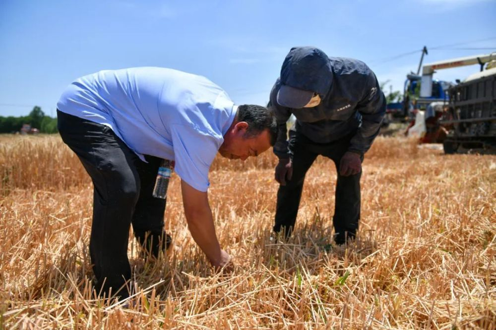
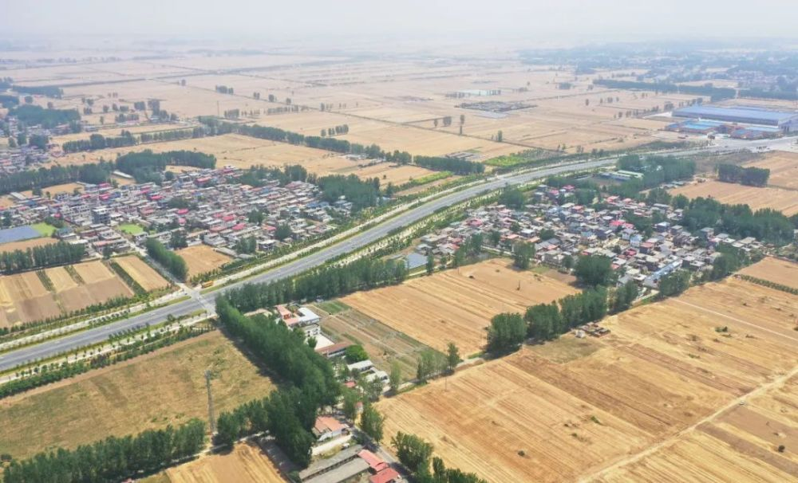

# 农业农村部负责人：坚决防止借解决农户承包地细碎化之机搞打乱重分

农民是土地的主人，开展解决承包地细碎化试点，应由农民说了算，让农民自主讨论决定搞不搞、怎么搞、如何经营耕种等重大问题。

近日，农业农村部印发《关于稳妥开展解决承包地细碎化试点工作的指导意见》（农政改发〔2023〕3号）（以下简称《指导意见》）。
**《指导意见》出台的背景是什么？对解决农村承包地细碎化试点工作有哪些要求？如何维护好广大农户的土地承包权益？** 记者就此采访了农业农村部负责人。

**Q**

**问：** 此次出台《指导意见》的考虑主要是什么？

答：近年来，随着农业机械化水平提高，在一些地方特别是平原地区，细碎的承包地越来越不便于农户等耕种经营。当前，解决承包地细碎化已经具备切实可行性，
**一是农民有期盼，** 据国家统计局社情民意调查中心电话调查，有76.2%的农户愿意把自家分散的小块承包地集中成一块耕种。 **二是党中央有部署，**
2013年以来，多个中央一号文件提出鼓励农民在自愿前提下采取多种方式解决承包地细碎化问题。2023年中央一号文件明确提出“总结地方‘小田并大田’等经验，探索在农民自愿前提下，结合农田建设、土地整治逐步解决细碎化问题”。
**三是工作有支撑，**
通过农村承包地确权登记颁证工作，利用现代测绘技术，明晰了承包地块的空间位置、面积，为地块连片归并后追溯权属信息提供了支撑。高标准农田建设、全域土地综合整治等项目，为归并田块、集中连片耕种提供了项目资金保障和工程支持。
**四是实践有基础，**
各地积极顺应农民需求和现代农业发展需要，结合土地整治、高标准农田建设等，形成了各具特色的实践路径。为落实中央要求、顺应农民意愿，农业农村部认真总结各地经验，研究制定了《指导意见》，主要目的是更好保障和实现农户承包经营权益，促进土地资源优化配置，提高耕地利用效率。

同时， **为防止个别地方简单推动土地集中规模经营、违背农民意愿搞强迫流转，损害农民利益，**
《指导意见》明确，开展解决承包地细碎化必须坚守“坚持农村土地农民集体所有，坚持农户家庭承包经营基础性地位，坚持最严格耕地保护制度”工作底线，提出保持土地承包关系稳定、合理分配收益、规范土地流转行为等政策要求和科学选定试点范围、因地制宜探索路径、规范履行工作程序等工作要求，为做好解决承包地细碎化工作、进一步保障农民合法权益上了一道“保险”。

**Q**

**问：** 近年来各地为破解承包地细碎化难题，开展了一些探索，《指导意见》吸收了地方探索的哪些经验？为什么要提倡“承包权不动、经营权连片”的路径？

答：“先试点探路、再总结推广”，是农村改革取得成功的重要经验，解决承包地细碎化也遵循了这一有效路径。近年来，各地为解决承包地细碎化，开展了积极探索，例如，江苏盐城通过“小田变大田”在保障农户承包权益的前提下，有效满足了不同经营主体的种地需求；安徽蒙城通过“互换并地”实现了“一户一块田”；湖北沙洋采取“按户连片耕种”的方式，有效解决了自耕农户分散经营不便的问题。这些做法，总结起来可以分为两种路径：
**一是承包权不动、经营权连片，** 即各户承包地承包权不动，通过流转经营权实现集中连片。 **二是土地承包权互换、承包地连片，**
即通过互换承包权的方式实现承包地集中连片耕种。

从各地实践看，解决承包地细碎化以“承包权不动、经营权连片”的路径为主，且具有多方面的优势。 **一是风险小，**
保持农户承包权不动，最大限度稳定了农村土地承包关系，给农户吃下“定心丸”，不易引发风险。 **二是易操作，**
农户与农户之间、农户与村集体经济组织或新型农业经营主体之间只需签订土地经营权流转合同，程序简单，流程清晰，操作难度较小。 **三是成本低，**
如保持承包权不动、仅将经营权集中连片，可以最大限度利用承包地确权登记颁证成果，有效节省重新测绘、换证、登记等费用，降低工作成本。这一路径很好地把握了政策界限，同时兼顾了可操作性和改造成本，既契合了党中央关于保持土地承包关系稳定并长久不变的政策要求，也丰富了承包地“三权”分置的有效实现形式，还适应了广大农户“稳定承包地财产权和集中连片耕种”的双重需求，可在有条件的地方稳步推广。

**Q**

**问：** 在开展解决承包地细碎化试点中，如何切实维护好农民的权益？

答：农民是土地的主人，开展解决承包地细碎化试点，应由农民说了算，让农民自主讨论决定搞不搞、怎么搞、如何经营耕种等重大问题。对此，《指导意见》既明确了原则性要求，也规定了具体程序。
**一是尊重农民意愿。**
各地组织开展解决承包地细碎化试点，必须坚持农民主体地位，把选择权交给农民，充分调动农民群众积极性、主动性，多“示范引导”，少“整齐划一”，坚决不搞“强行推动”，不得损害农民权益。
**二是不能打乱重分。**
要落实好中央关于保持土地承包关系稳定并长久不变的政策要求，坚决防止借解决农户承包地细碎化之机搞打乱重分，这是我们土地承包政策的底线，不能触碰。
**三是规范工作程序。**
拟开展试点的村组，应当依法经本集体经济组织成员的村民会议三分之二以上成员或者三分之二以上村民代表同意，方可组织开展试点。凡是涉及承包农户的事项，均要做到政策解读到户、征询意愿到户、信息核实到户、签字确认到户，保证程序合规、农户认可。

**Q**

**问：** 各地情况千差万别，如何选择开展解决承包地细碎化试点地区和实施方式？

答：《指导意见》明确，解决承包地细碎化试点由各省（区、市）农业农村部门组织开展。各地要结合实际，因地制宜推进，不能搞“一刀切”“齐步走”。要综合考虑地形地貌、灌溉条件、作物品种、劳动力转移情况等因素，优先在群众意愿高、基层组织强、承包地确权登记颁证工作扎实的平原、浅丘地区开展试点，也就是要在“适宜干、愿意干、能干好”的地方开展试点，不能定指标、下任务。

同时，根据基层探索的经验，《指导意见》提出分类实施路径： **一是对于多数农户仍直接耕种承包地的，**
可以探索将农户承包地经营权集中，实现按户连片经营，解决耕种不便等问题。 **二是对于多数农村劳动力已经转移到二三产业的，**
在集中连片的基础上，可以探索设置自耕农户按户连片经营的自种区和新型农业经营主体集中连片经营的租种区等方式，满足不同主体解决承包地细碎化的多元需求。

**Q**

**问：** 在试点工作中，要如何规范组织实施？

答：解决承包地细碎化，涉及农户众多，利益关系复杂，必须审慎稳妥推进、做到“有方案、有程序、有档案”，把保障农民权益的工作做扎实。在组织实施过程中，
**一要结合村组实际制定试点方案，** 明确目标任务、实施路径、进度安排和保障措施等。
**二要做好调查摸底、宣传动员、拟定方案、民主议决、组织实施、总结验收等工作，** 确保试点任务规范有序完成。 **三要加强档案管理，**
工作中形成的实施方案、地块示意图、农户签字确认记录、流转合同等资料应严格归档管理，为保障农户权益提供支撑。

**Q**

**问：** 解决承包地细碎化过程中，如果已经打破田埂界限，请问有什么措施能确保农户可以找回自己的承包地？

答：在解决承包地细碎化工作中，确实有部分农户存在顾虑，担心田埂打破后，找不回自己的承包地。对此，基层试点中已经探索了一些经验，承包地确权登记颁证也提供了有效支撑。党的十八大以来，我们贯彻落实中央部署，在全国组织开展了农村承包地确权登记颁证工作，通过现代测绘技术，已经明确了农户承包地块的空间位置、四至范围、面积等信息，强化了对土地承包经营权的物权保护，也为开展解决承包地细碎化试点提供信息技术支撑。

开展解决承包地细碎化试点，要充分利用农村承包地确权登记颁证成果，要确保在打破田垄界限、土地集中连片后，能依据确权数据回溯承包地块原来的空间位置、四至范围和面积。如有农户想找回自己的承包地，或者承包地被征收，能据此保障农户土地承包权益不受损。如果这些基础工作做得不扎实，就不能盲目开展试点。

**Q**

**问：** 通过打破田埂、平整地块会新增一些可耕种面积，由此产生的新增收益怎么分配？

答：通过解决细碎化，小地块之间的田埂、垄沟等得到整平，沟壑、水渠和小路得到复垦，实现了农地可耕种面积的增多和收益增长。据各地试点，平整后的土地可耕种面积一般可增加3%-5%。对于这部分新增的面积和收益，农村集体经济组织要在充分尊重农民意愿前提下，依法依规通过民主协商决定，要坚决杜绝少数人私相授受，损害农民权益。

**Q**

**问：** 在解决承包地细碎化试点中，各级农业农村部门和农村集体经济组织应当分别发挥什么作用？

答：解决承包地细碎化是一项系统性工程，需要政府、村集体、农户和承包地经营者等多元主体协同推动。各级农业农村部门要做好工作指导、宣传培训、试点组织、政策支持和风险防范等工作。《指导意见》明确，省级农业农村部门可根据实际情况，将符合条件的试点地区纳入土地整治、高标准农田建设等项目支持范围。

农村集体经济组织是农村集体土地所有权的行使主体，在协调承包农户整合地块、整理土地方面具有天然的组织优势。在推进解决承包地细碎化过程中，要充分发挥农村集体经济组织的统筹协调功能，做好试点组织实施，科学合理分配收益，化解矛盾纠纷，防范经营风险，切实维护好农户土地承包权益。

**作者：农民日报·中国农网记者**

来源：农民日报

图片：新华社

监制：高雅 编辑：李忆宁

