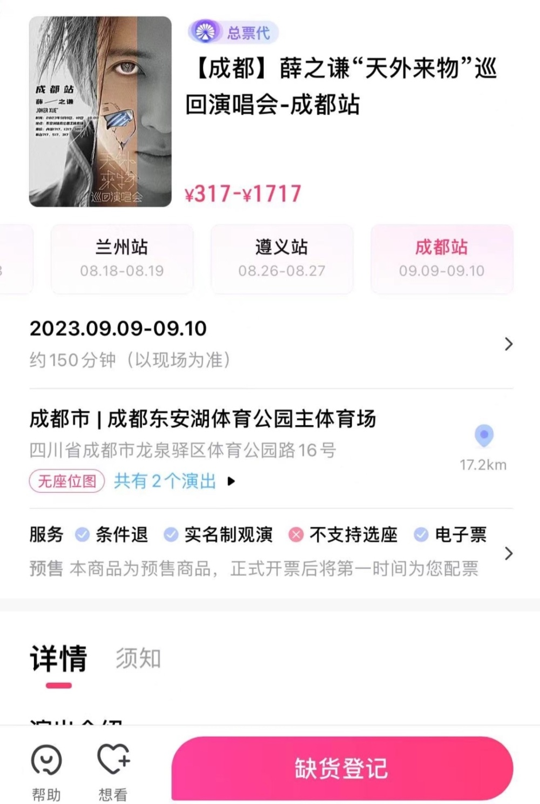

# 周杰伦天津演唱会不实名，2张连座票有黄牛喊出10万元天价

7月18日，周杰伦嘉年华巡回演唱会天津站开票。据大麦网显示，演唱会门票共有4轮抢票机会，放票近13万张，超520万人标记“想看”。

据报道，周杰伦演唱会四轮开票，都在30秒内售罄。

由于周杰伦的这场演唱会并没有强制实名制抢票，所以在抢票结束后，在某二手平台上，有很多关于这场演唱会的高价门票出售。

两张购买价格2000元的连座演唱会门票，甚至被“黄牛”喊到了六位数的高价。

喊价五位数的门票更是多到数不过来。

据悉，7月18日多位明星的演唱会开票，如张学友、周杰伦、薛之谦都在同日开票。大麦网薛之谦成都演唱会门票在18日下午17时17分开抢，结果开票后不到40秒全被抢光。

疫情结束后，演出市场迅速反弹，今年明星扎堆开演唱会，很多明星为了满足粉丝的需求，更是增加了表演场次，但演唱会门票依旧是一票难求的情况。

对于抢不到门票，网友表示：“看开了，主打一个陪伴式抢票”“500多万人想看的演唱会，实名不实名抢票都很难吧”“抢不到也不买黄牛票”。

编辑 苏静

