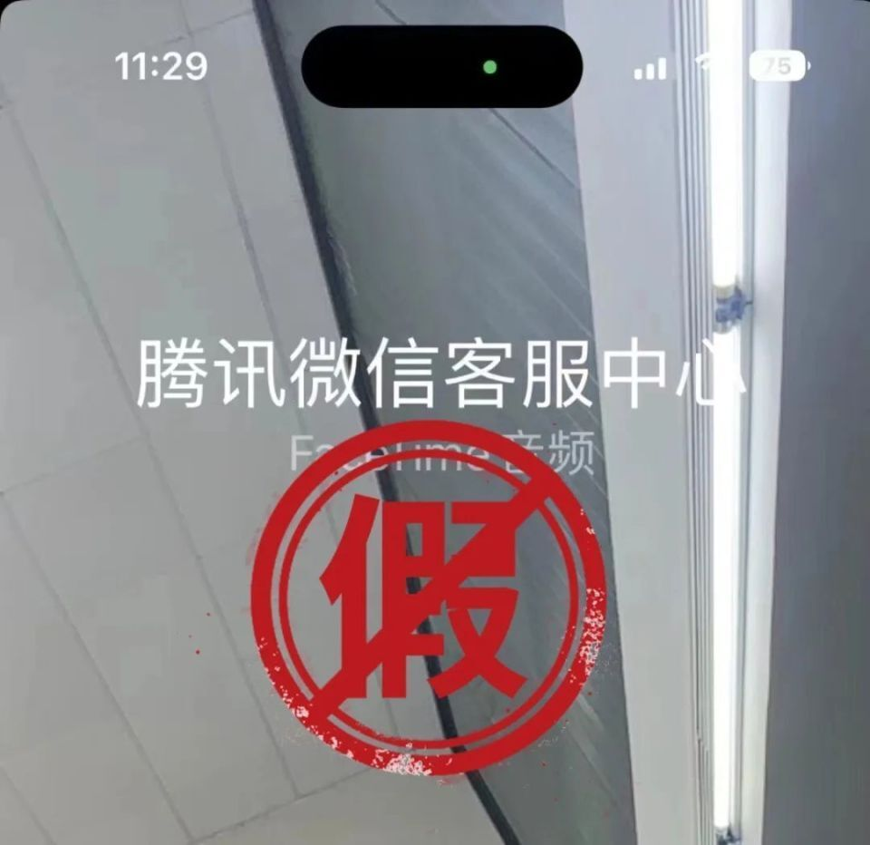
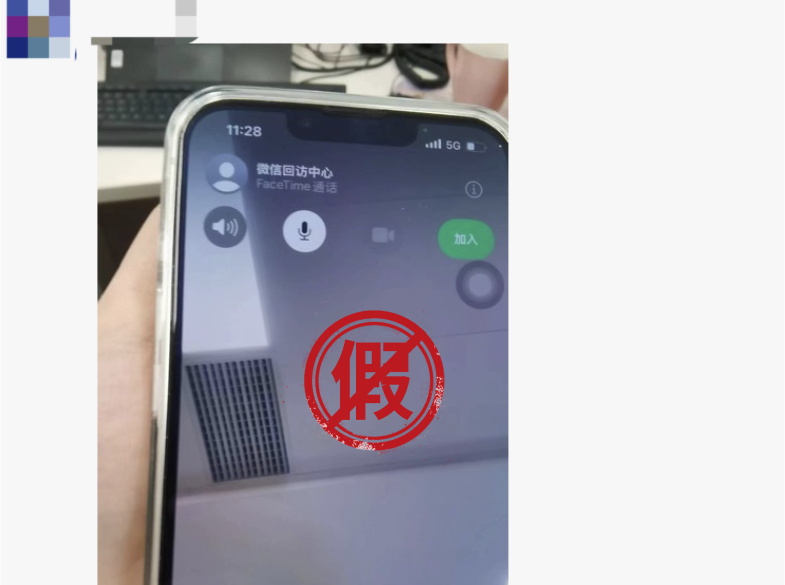
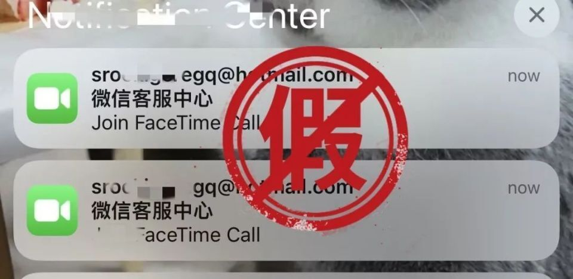
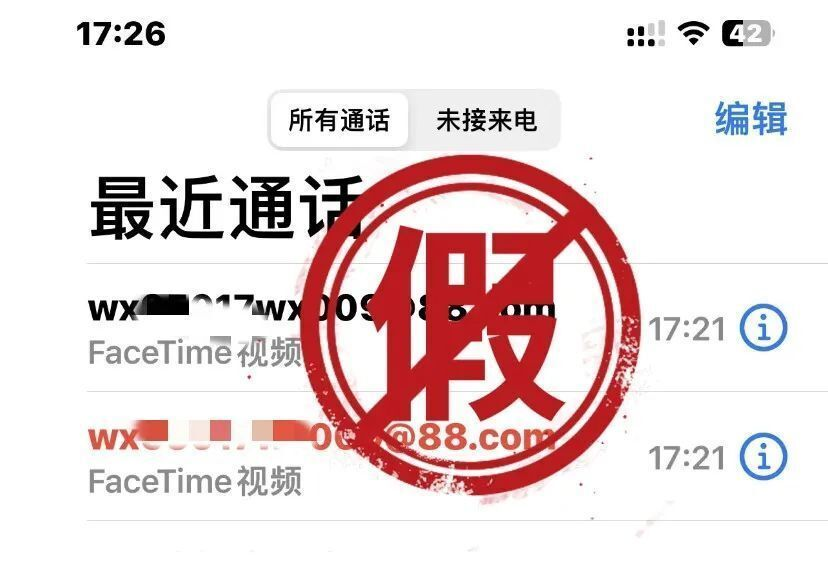
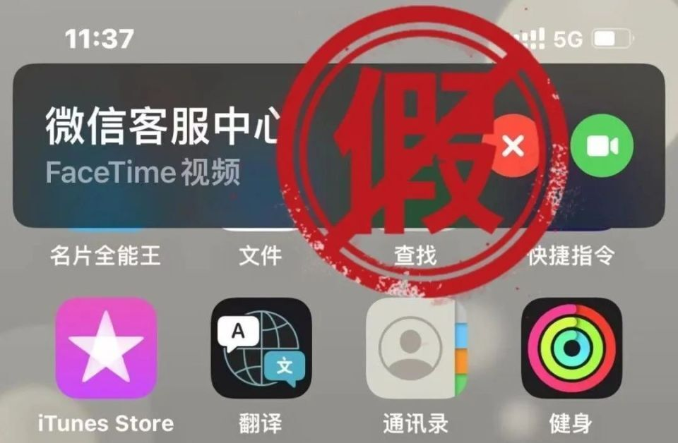
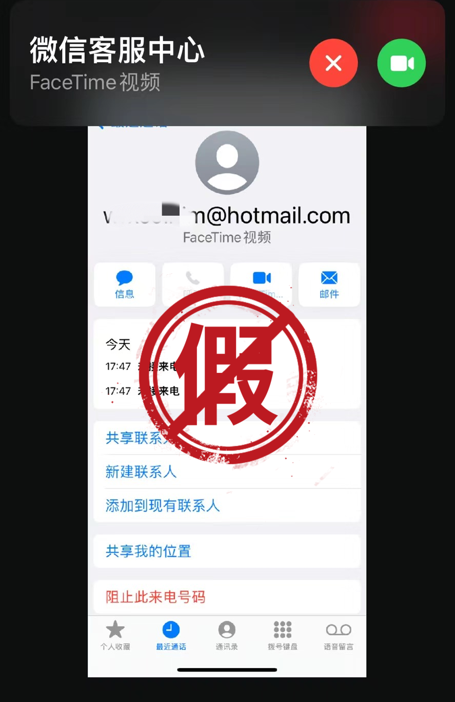
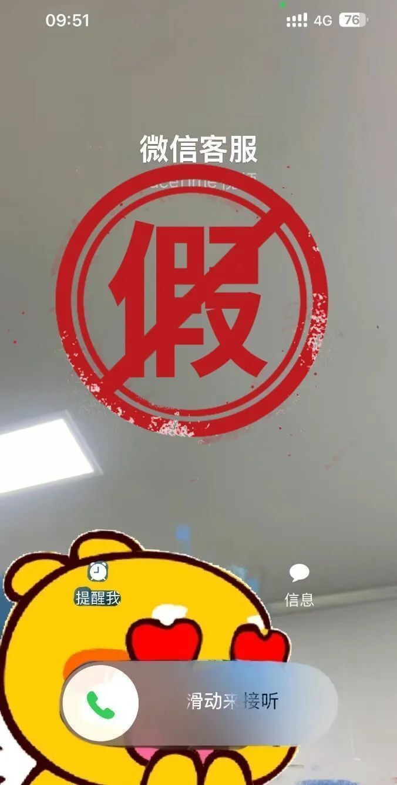
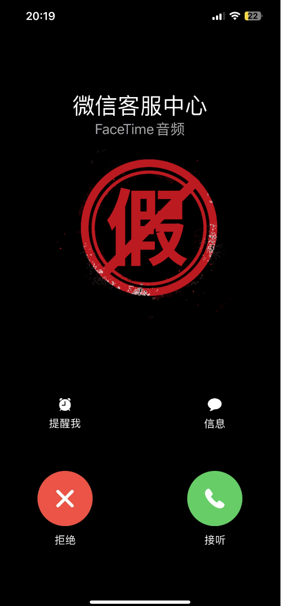
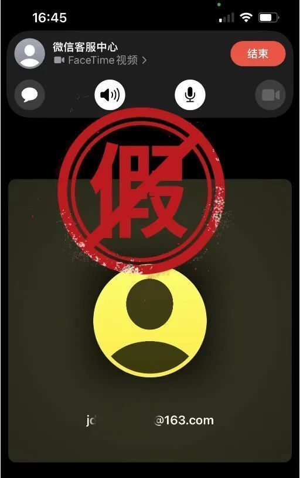

# 微信发布声明：以FaceTime方式联系用户系仿冒，不要接听

腾讯科技讯
7月19日消息，今日，微信安全中心发布关于通过FaceTime仿冒微信官方进行欺诈的安全提醒，称近期接到用户反馈，有骗子假称自己是“微信客服中心”“微信回访中心”“微信支付中心”等官方客服，使用「FaceTime」功能，向iOS系统用户发起视频通话。

微信团队在此声明，微信团队不会以FaceTime方式联系用户，但凡用这种方式就是仿冒，不要接听。请广大用户警惕陌生FaceTime来电，避免受骗。

_（以上图片均来源于网络）_

以上案例均为仿冒微信官方，请大家不要轻易相信，谨防陷入欺诈骗局。如对方要求添加私人社交账号或至各类视频会议软件进行共享视频等协助操作，一定要果断拒绝。如对方要求操作转账或者进行借贷，统统不要理会。

