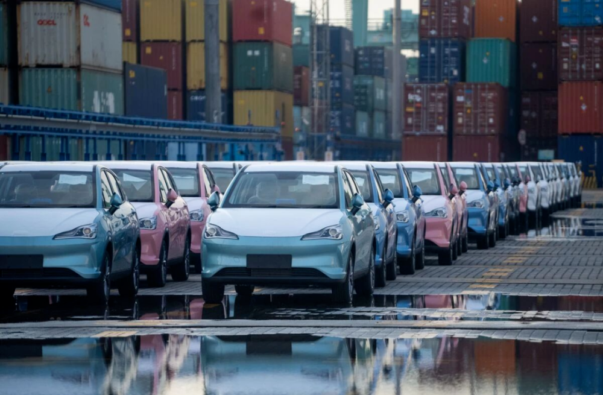
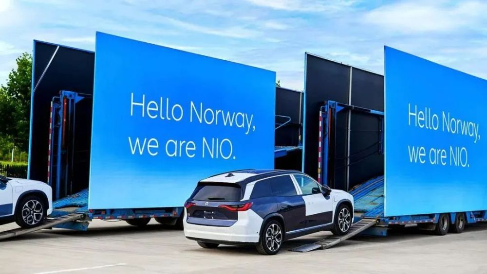
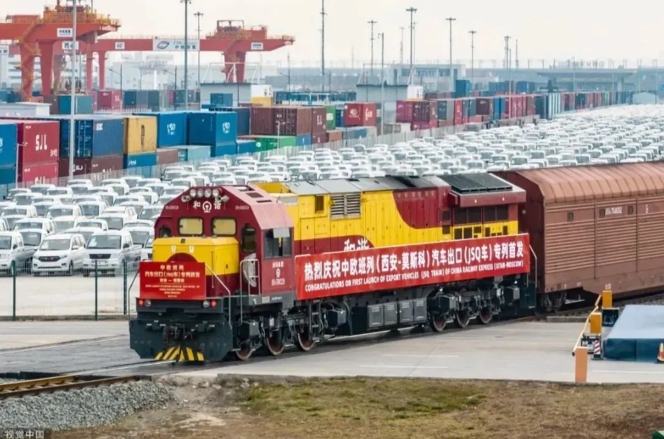
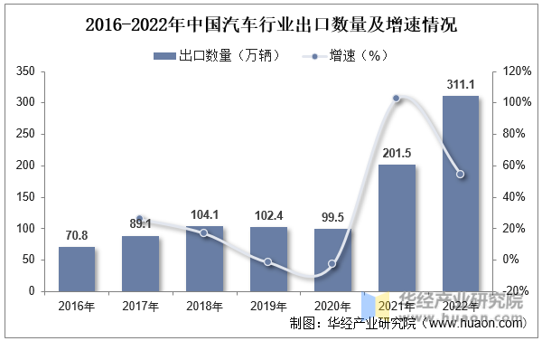
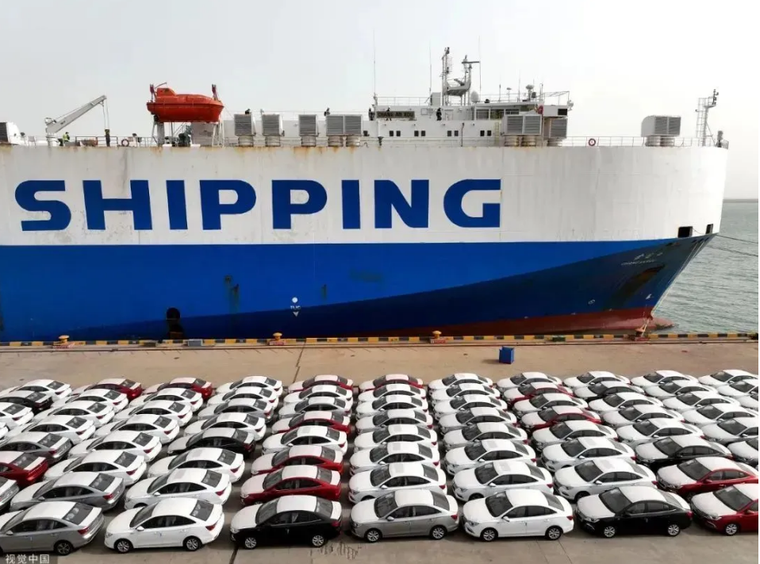

# 新能源汽车出海，遭遇了卡脖子

**作者 | 南风窗记者 谭伊妮**

中国汽车正逐渐征服全世界人的芳心。

“近几年，在泰国街头上穿梭的，来自中国的汽车品牌，尤其是新能源汽车品牌，真的是肉眼可见地变多了。”已在曼谷定居5年的阿玲，对盐财经记者如此感慨道。

_泰国街头的比亚迪e6/图源：比亚迪_

身处哈萨克斯坦共和国的周力，也有同样的感受。

他告诉盐财经记者，在哈萨克斯坦共和国开中国品牌汽车的人很多，就连他自己也在今年5月来中国购置了一辆，并以此为灵感，开始做起了帮哈萨克斯坦共和国的人代购中国汽车的生意。

以上还仅仅是中国汽车出口到海外的两个小小的缩影。

除了中亚和东南亚，中国汽车实际上更多地被出口到了欧洲和北美洲等经济更为发达的地区。

在这些区域人民的追捧下，中国汽车出口量屡创新高，继去年超越德国，跃居世界第二之后，又在今年一季度取代日本，摘下“全球第一汽车出口大国”的桂冠。

_2021年7月，蔚来首批用于用户交付的智能电动旗舰
SUV ES8量产车，在上海外高桥港口正式发运挪威市场/图源：蔚来_

根据中国汽车工业协会统计分析，继2021年全年出口超200万辆、2022年全年出口超300万辆之后，今年上半年中国汽车出口214万辆、同比增长75.7%。

形势一片大好的同时，中国汽车出海也面临着诸多挑战。

比如，自有运力不足。

根据华经产业研究院数据，截至2022年底，在全球从事海运的700多艘专业汽车船（又称“滚装船”）中，日本、挪威和韩国等三国累计占有近70%的市场份额，而我国占比不足3%。

庞大的汽车出口量与稀少的自有运力形成鲜明对比，由此引发人们对运输“卡脖子”的担忧。而这一担忧，是否有必要呢？

01

订单暴增但一舱难求

要想理解担忧是如何产生的，得先理解汽车船在新能源汽车出海运输渠道中的重要性。

通常，汽车出口分为陆运和海运，前者包括公路汽车、中欧班列等方式，适用于出口到与中国在同一片大陆的其他国家，但运力覆盖范围有限；而后者包括集装箱运输和汽车船运输，运力覆盖范围更广，是我国汽车出口的主要渠道。

_2023年1月16日，西安国际港站，满载261辆陕西制造汽车的X8256次中欧班列汽车出口专列发车驶向俄罗斯首都莫斯科/图源：视觉中国_

根据克拉克森历年数据统计，中国汽车海运出口占比相对较为稳定，约占中国汽车出口总量的80%左右。

其中，汽车船，是专门用于运输汽车的小众船舶，可以让汽车直接开上船舱，无需像集装箱货轮一样需要人工打包汽车固定到箱子里，然后吊进船舱。

因此，更方便快捷、性价比更高的汽车船运输，成为车企出海首选的运输方式。

唐山英坤供应链管理有限公司的运营中心总监张少骞表示：“一般能选汽车船，我们会尽量选择汽车船运输，价格不仅相对更便宜，对汽车的保护性也更好。”

他指出，以南美洲为例，从中国运输一台车过去，用集装箱货轮运输单程最便宜大概需要1700美元，而用汽车船运输单程则只需要1300美元左右。

但同时，张少骞也告诉盐财经记者，以目前的行情，他们很难订到汽车船的舱位。

一方面，是因为全球汽车船市场近几年新增船只少，反而有旧船相继淘汰，整体运力相当有限。

另一方面，则是因为近几年我国汽车出口量爆发式增长，对汽车船的运输需求也随之提升，整体市场供不应求。

_2016-2022年中国汽车行业出口数量及增速情况/资料来源：中汽协，华经产业研究院整理_

确实，中国汽车出口突然火起来是这两年的事情。

与2020年相比，去年我国汽车的出口量翻了超3倍。但与之相匹配的运力并未跟上，甚至隐隐在疫情的影响下有停滞的迹象。

这也是造成如今汽车船市场一舱难求、运费飞涨最主要的原因。

“全球汽车运输船的船队运力规模在过去10年间几乎没有增长。”克拉克森研究（上海）总经理幸月表示。

克拉克森的数据统计，汽车运输船市场自2017年以来船队增速几乎为零甚至降为负数，直到2021年增速由负转正，同比增长1.2%，2022年微增0.4%，但目前仅有410万车位，仍不能满足市场需求。

不仅如此，由于过去很长一段时间里我国汽车出口处于低迷状态，我国与之对应的汽车船产业发展也较为落后，目前大部分运力都掌握在日韩、欧美等国家手中。

“汽车船运输本身就是伴随不同国家自身的汽车工业发展而建立的，过去50年中国从来不是汽车出口大国，在这种背景下，你无法要求中国‘突然’有一支完备的汽车船运输船队。”资深汽车船从业者马哥对盐财经表示。

_2023年4月12日，江苏连云港，一艘远洋滚装轮在连云港港装载出口汽车/图源：视觉中国_

话虽如此，但也正因为这样，我国汽车出口的运输命脉也掌握在他人手中，可能会面临一些势弱的时候，比如其他国家为了自家车在海外市场的竞争，拒载或者只给很少的舱位到中国车企。

对于这一说法，山东正隆国际物流总经理张瑞浩表示，确实存在部分事实。

“比如某些国家的汽车船舱位，会优先装载本国的汽车，然后如果有少量空位会分给我们这些货代，这个数量大概在300到600车位之间。”

02

此卡脖子非彼卡脖子

值得指出的是，汽车出海所谓被“卡脖子”，与我国此前由于高精尖技术领域被“卡脖子”，有着本质区别。

汽车船，属于运输环节。

虽然目前该环节被他人掌控，但上游核心的整车产品和造船技术我国都不缺，因此，船和船队可以自己建设，只是时间的问题。而高精尖技术被卡脖子，却很难在短时间内攻克。

那么，我国新能源汽车的出口，到底算不算遭遇卡脖子了？

从曾在外资汽车船企工作过的马哥对盐财经的讲述里，我们不难发现，实际情况远比想象更加复杂。

据马哥的观察，我国汽车出口量从前年的200多万，再到去年的突破300万，其中都离不开日韩、欧美等运输船队的助力。

_截至2023年2月，全球汽车船头部公司排名情况/图源：华经产业研究院_

因为在当下市场，我国车企并没有其他选择，“毕竟过去2年，中国整车依靠滚装运输出口的运力中的95%，是由外资船东提供的，中国汽车出口能从80万（增加）到300万，这其中至少一半多是日韩、欧美等滚装船队提供的运力”。

既然汽车船整体的运力并未增长太多，那么中国汽车出口占据的那些舱位从何而来？

马哥解释道：“这些运力并非新增，而是通过减少日系车、韩系车客户的份额而‘挤’出来的。所以毫不夸张地说，中国这一波整车出口高潮是建立在日韩滚装船东减少本国舱位的基础上的。”

当然，日韩、欧美等船队也不是牺牲自家车系客户、大公无私的“慈善家”。

驱使日韩、欧美等船队把更多舱位分配给中国汽车品牌的最大动力，还是经济利益。

_比亚迪ATTO
3新车开卖前夜，吸引了众多消费者彻夜排队订车，掀起“抢购潮”/图源：Blink-Drive_

汽车船运输是随着汽车工业发展而建立的，属于一荣俱荣、一损俱损的关系，尽管是其他国家的船队，也要赚钱吃饭。

本国车系出口量少了，也就意味着船队的舱位空置率变高，但出海一趟的成本不会因此降低，船队所能赚取的利润也会相应变少。

在马哥看来，汽车船市场是一个相当脆弱、经不起折腾的行业，因为全球汽车运输需求大体上还是遵循经济发展客观规律的逻辑。

同时，国与国之间的税收政策突变，比如贸易保护主义抬头，单一汽车制造商的生产链全球布局的不确定性，都会对整车远洋运输需求产生巨大的影响。

这些影响对于每一个汽车船的船东，都是生死攸关的。毕竟，船队和车企签订长期合同基本都是一年、三年甚至更久，变数很大。

因此，汽车船船队选择客户，是一次赌博。

他们需要考虑这个车企的产品能否在海外市场站稳脚跟，毕竟一个新品牌的崛起是一定与另一个旧品牌的消失同时发生的；以及该车企是不是愿意与滚装船东建立一个长期的战略关系，共同去抵抗这个行业的波峰和波谷。

马哥补充道：“假如你今天拒绝了这个客户，后续他们订单很多，而船队此前选择的客户订单变少了，就会面临自身利益受损的风险。”

马哥也坦承，由于不可避免受到本国长期合作的汽车品牌的发运需求压力，外资汽车船船队也会在特定月份更多地支持一下本国车企，但这种属于个例。大多数情况，都还是按照长期合同来履约。

把更多舱位给中国汽车品牌客户是利益驱动，同理，船队优先转载本国汽车品牌，除了贸易保护主义因素外，也有经济利益的考量。

张少骞表示，不只是货代，像他们这种做二手车的海外贸易商，也会面临一舱难求的问题。

这主要是因为货代、贸易商的汽车运输订单数量偏小，大多数在几十台甚至几百台，于船队而言，只是有舱位时可以顺路捎上的边角料，毕竟蚊子再小都有肉。

“像一次出手就有几百上千的车企或主机厂，订舱位比我们会更容易。”张少骞说，以连云港的汽车船港口为例，这个港口几乎被奇瑞包了，每隔三五天就有800台左右的车过来，然后运到世界各地。

_2022年整车出口量前10位企业（单位：万辆）/数据来源：中汽协，招商银行研究院_

如此看来，舱位难订与否，关键还是在于订单的大小。

当客户的订单量较大时，其议价权也会比小批量的客户相对更大，毕竟船队也很难把到手的肥肉拱手让人。

03

运输，只是出海的一道小小难关

在我国汽车出口卡脖子的担忧之外，市面上还出现了不少“国车国运”的声音。

对此，全国乘用车市场信息联席会秘书长崔东树认为，目前我国汽车出海运力不足的问题，是整个市场爆发过快，有些环节跟不上发展的问题，并不是我国航运能力能否提升的问题。

“如果一味追求国车国运这些所谓的自主发展，必然会带来巨大的浪费和前期判断的困难，没有太大的必要。国际贸易本来就是国际合作的一个事情，而不是说自己把所有事儿都做了。”

马哥也认为这种声音有过度渲染的嫌疑。

他表示，相比能源运输，汽车船运输只用于运输汽车这种单一消费品，没必要上升到“国车国运”的层面。

但在我国汽车出口“大爆发”的背景下，我国的汽车运输行业确实也迎来了前所未有的机遇。

比如，随着日本汽车工业崛起的同时，日本汽车船行业也迎来巨大的发展机遇，商船三井、日本邮船、川崎汽船就从零起步发展成为垄断汽车船运力近一半的庞然大物。

在不过分强调“国车国运”的情况下，黄冈职业技术学院客座教授、汽车分析师张翔觉得鼓励我国船企发展汽车船运输，或者想其他办法缓解汽车运输的难题，也是一件好事。

比如，国内车企纷纷下场造船。

去年1月，上汽集团就下单了两艘远洋滚装船。

比亚迪紧随其后，它被爆出了计划斥资50亿元，订造6—8艘7700车位双燃料汽车运输船的消息。

_2023年1月14日，800台BYD
ATTO 3在上海港列阵集结，准备起航发往泰国/图源：比亚迪_

在张翔看来，车企下单造船无可厚非，在本身订单量很大的情况下，有利于掌握运输环节的成本，也能保障自身汽车出海的供应链正常运行。

但值得注意的是，汽车船一般建造周期在18个月左右，从下单到交付，船只投入使用至少还得等到2024甚至2025年，在此之前，我国车企依旧需要与国际船运公司协作，或者另想他法。

不过，在张少骞看来，远水解不了近渴，我们也不必过于忧虑。

因为需求和市场存在的情况下，办法总比困难多。

“比如以前集装箱就不能运新能源汽车，因为新能源汽车带电池，属于危险品，但现在发展出电池检测报告、化学危险品等证书，有这些东西，新能源汽车就能上集装箱运输了，再比如此前中欧班列对新能源政策和铁运有限制，现在也放开了。”张少骞表示。

除了拓展我国整体出海运力外，马哥指出，汽车船码头拥堵造成的运力浪费问题也值得注意。

以澳大利亚为例，马哥介绍，自2022年12月份以来，澳大利亚农业部加强了对进口整车的生物检测，如果车身被发现存有“种子”，则被要求在卸货港进行清洁处理。

这种清除工作是为了防止“种子飞溅”，所以不是用水洗等方式，而是抬起一辆一辆车，使用带有粘性物质的木棒进行清除作业，耗时较长。

当前，船只在澳大利亚东南部港口的等泊时间为1—3周不等。据测算，仅因为种子原因，澳大利亚港口拥堵所造成的滚装运力损失已经占到全球滚装运力的3%。运营澳大利亚航线的滚装船公司的损失，或高达数千万美金。

归根结底，运送车辆仅仅是新能源汽车出海的一个环节。尽管眼前有一定的困难，但有许多解决办法，比起焦虑于不足的运力，中国新能源汽车如何在海外增强自身品牌力，适应当地人民的用车需求。站稳脚跟，才是最核心的问题。

（应采访者要求，文中阿玲、周力、马哥均为化名）

编辑 | 江江

新媒体编辑 | 煎尼

排版 | 八斤

