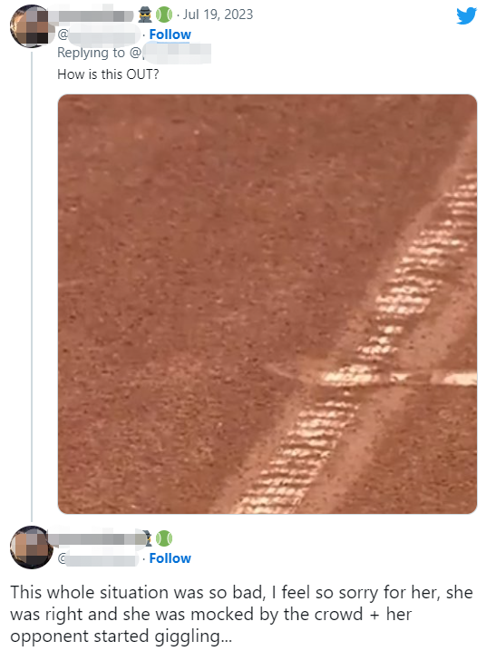
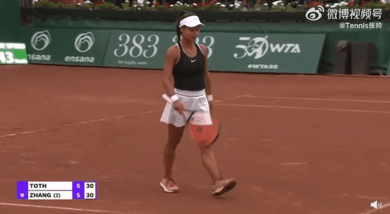
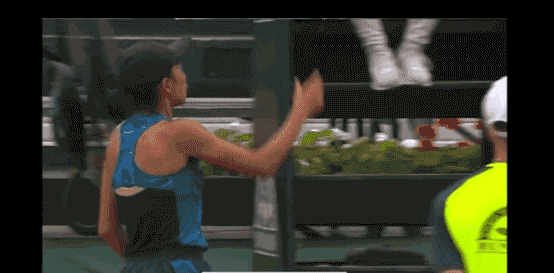
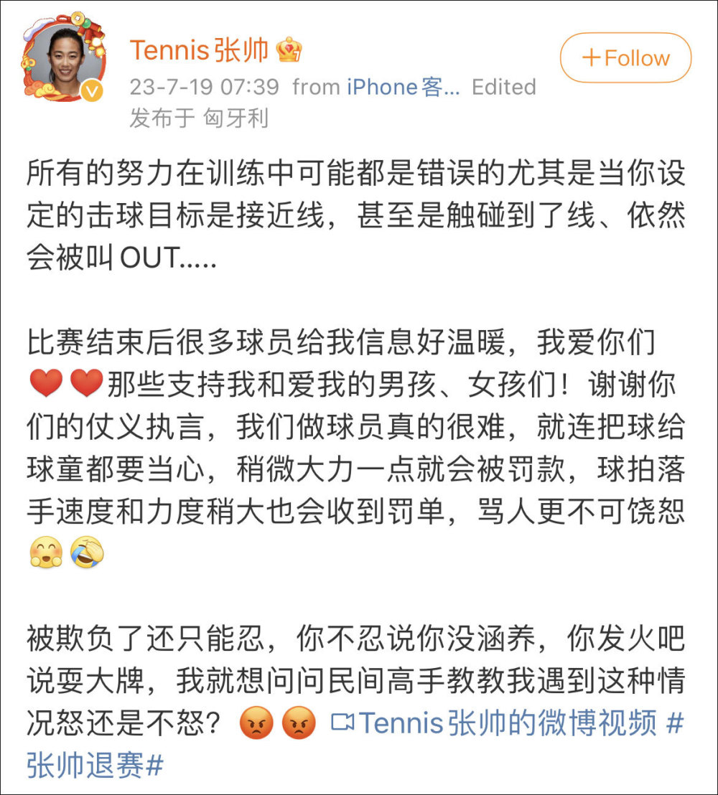
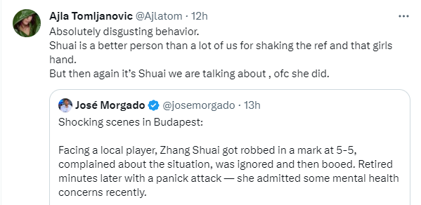
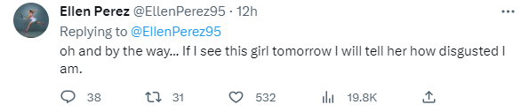
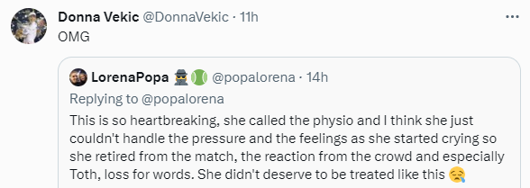
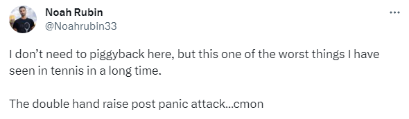
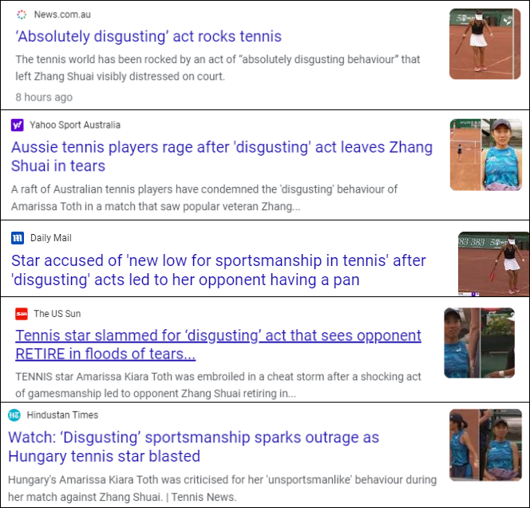
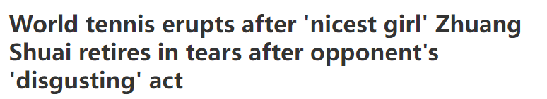

# 网球运动员张帅因不公判罚含泪退赛，网坛球星谴责裁判和匈牙利选手

【文/观察者网 严珊珊】判罚不公、匈牙利对手挑衅、匈牙利观众喝倒彩……这次，曾顶着压力、忍受着部分观众的恶意嘘声拿下WTA巡回赛级女单冠军的中国金花不忍了。

北京时间7月19日，WTA250布达佩斯站首轮，张帅在首盘5-6落后时决定退赛，其对手、匈牙利本土外卡选手托特（Amarissa Kiara
Tóth）的行为惹怒了整个世界网坛。

赛后，众多网坛球星发声谴责托特没有体育精神的行为，并力挺张帅，对明显不公的判罚表达不满。英美澳等国家媒体纷纷在标题中用“恶心”形容托特擦掉争议球球印等举动。

张帅19日发文回应称：“被欺负了还只能忍，你不忍说你没涵养，你发火吧说耍大牌，我就想问问民间高手教教我遇到这种情况怒还是不怒？”

这场红土公开赛是34岁的张帅在温网之后的首战。她在前不久结束的温网女双中取得了四强的好成绩，在单打上经历了低估的张帅，此次以二号种子身份出战WTA250布达佩斯站。

本场比赛，世界单打排名第45位的张帅（双打最高排名为第二，目前28）对战20岁匈牙利选手托特（世界排名548）。第一盘中，双方在前8局各自完成了两次破发，打成平局，比赛进行到第11局，张帅在关键发球局遭遇争议判罚。

视频显示，张帅的压线球被裁判喊了“出界”，这一争议判罚立马引起张帅抗议。

在张帅抗议的过程中，场边一名匈牙利观众竟大喊“超时”，本土选手托特听到后大笑。尽管张帅上前据理力争，却没有改变判罚。

《纽约邮报》称，球“清晰地”碰到了线，这是裁判“明显判罚失误”，对张帅的心态造成了影响。

张帅随后努力调整心情，继续比赛，而场边观众还对她发出嘘声。

之后，更令人不解的一幕发生。

在争议分结束、双方又各取得一分后，托特径直走向此前争议分的球印，不顾张帅在对面大叫“等一下等一下，把球印留着”的提醒，面露微笑、带着挑衅意味、一脚踩平了球印。

张帅立即向主裁投诉“如果真出界了她为什么擦球印”，托特竟大声怼道“因为你在制造麻烦”。

与主裁争论未果后，受到影响的张帅丢掉了这一局，首盘5-6落后。

因为种种不公，张帅被气到在场边哭泣，经历了一番挣扎后决定退赛，她礼貌地与裁判和对手握手，结果更恶心的一幕来了：托特握过张帅的手后，立马振臂高呼，庆祝自己作为非种子选手取得职业生涯首场WTA正赛胜利，现场还响起掌声。

张帅也没忍，直接向干扰自己本场比赛的观众表达了不满。

19日，张帅本人在微博、Instagram上发文称：“所有的努力在训练中可能都是错误的，尤其是当你设定的击球目标是接近线，甚至是触碰到了线、依然会被叫OUT……比赛结束后很多球员给我信息好温暖，我爱你们。那些支持我和爱我的男孩、女孩们！谢谢你们的仗义执言，我们做球员真的很难……被欺负了还只能忍，你不忍说你没涵养，你发火吧说耍大牌，我就想问问民间高手教教我遇到这种情况怒还是不怒？”

与此同时，众多网坛球星发声力挺张帅，他们对明显不公的判罚以及托特没有体育精神的行为感到愤怒，并且对张帅的球品表示认可。

_“绝对恶心的行为，”澳大利亚女子网球选手艾拉·汤姆贾诺维奇在推特发文称，“张帅还与裁判和那个女孩握了手，她比我们很多人都好。”_

退役前多次获得大满贯女双、混双冠军的澳大利亚女子网球名将雷内·斯塔布斯忍不住发声：“那个裁判需要尽快找个别的工作！她也应该为此受到严厉的惩罚。”

_双打世界排名第九的澳大利亚女选手艾伦·佩雷斯直指托特已经失去了同行的尊重：“我真的被这个女孩的行为的不尊重程度震惊了……如果我明天见到这个女孩，我会告诉她，这有多恶心。”_

佩雷斯接受澳大利亚媒体采访时还称，这个判罚太糟糕了，张帅的处理方式是每个球员的处理方式，“球显然在界内，在如此紧张的时刻，你不可能不为此据理力争，结果观众对她大喊大叫……我甚至无法想象张帅在那一刻的感受，很难直接看出来，因为张帅是最好的女孩。”

_澳大利亚选手加夫里洛娃表示，自己非常愤怒，看不起这个叫托特的女孩，并为张帅感到难过。_

_双打世界第22名的克罗地亚女子网球运动员多娜·维基奇也转发了张帅被气哭的一幕，表达对其遭遇的震惊。_

_比利时网球女子选手萨林·博纳旺蒂尔谴责托特欢呼的样子“可耻”，喊话张帅希望她快点好起来。_

_美国网球男子选手诺阿·鲁宾直言，这是他在网球界见过的“最糟糕的事情之一”。_

_外媒纷纷在标题中用“恶心”形容托特擦掉争议球球印等举动。_

_澳大利亚第九网络频道旗下体育网站wwos直接发文《在对手的‘恶心’行为后，‘最好的女孩’张帅含泪退赛，世界网坛爆发了》。澳大利亚第七新闻网和英国《每日邮报》称，托特的表现被球迷成为“体育精神的新低点”。_

19日，体育评论员陈君乐发文指出：查球印规则是，主裁看过球印以后作出的决定就是最终决定，所以那个球印就算留着，也不能起到任何追溯作用，擦球印时已经是两分过后，
**因此这个行为本身并不违规，但这世上多的是不违规却足以恶心人的事情**
。我猜张帅是想等换边过去以后可以亲眼看一下，因为规则规定球员不能擅自走到对面球场查看球印，否则会被警告。

除了被同行谴责，托特的举动也遭到球迷广泛批评。

_“得引进鹰眼或者电子裁判，这些红土比赛不能再造假了。”_

_“我很确定这个痕迹表明球落在界内。”_

_“托特应该被禁赛。”_

_“这名球员会因为没有体育精神的举动被罚款吗？WTA规则手册怎么说的？”_

_“托特还举双手庆祝胜利，刷新下限，连续两次。”_

**本文系观察者网独家稿件，未经授权，不得转载。**

