# 美国华人妈妈，正在批量制造谷爱凌

文/凯斯

编辑/花木蓝

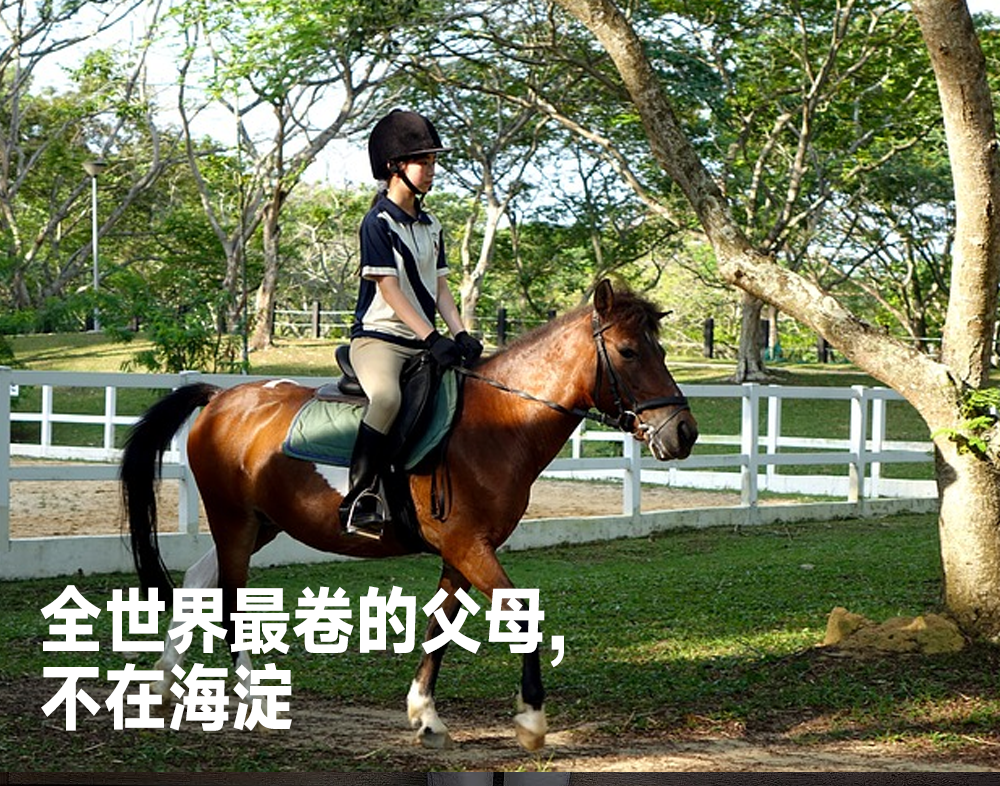

众所周知，中国的家长在教育子女这方面，向来突出一个“往死里卷”。这其中，又以北京海淀为最，被称为“卷王之王”。

就像网上之前流行的段子，问，孩子5岁，英语词汇量只有3000，是不是不太够？

答曰：在美国肯定是够了，在海淀肯定是不够。

培养孩子，就是海淀家长们共同的信仰。

在海淀，不抓孩子学习，出门跟别人都找不到共同语言。

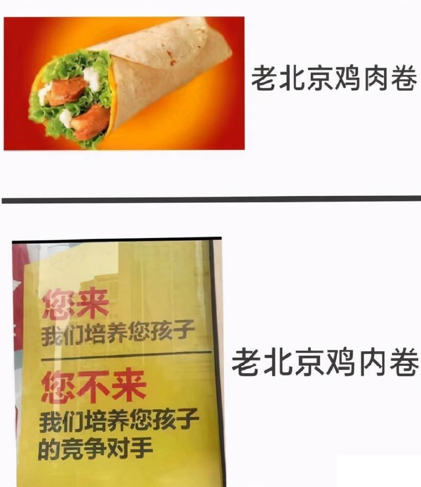

**殊不知，这一代在美国的华人家长，早就卷出了国门，从北京海淀，一路卷到了旧金山湾区。**

震惊了美国人的虎妈“蔡美儿”，就是8岁时搬家到了湾区；我们熟知的“青蛙公主”谷爱凌，也是湾区成长出的青年才俊典型。

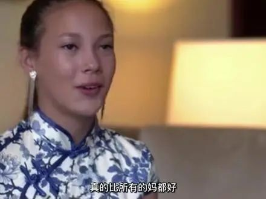

_谷爱凌在访谈中盛赞自己的妈妈_

湾区的华人宝宝打出生就开始卷，而这，也间接改变了该地区的产业结构。

**来到现在湾区位于硅谷附近的南德安扎大道，你会感到自己仿佛置身于北京的海淀黄庄。**

在这条大街上，你能看到几乎所有品类的补习班：

刚开没多久的学而思硅谷分校，这两年深受老美追捧的“俄罗斯式数学教育机构”，专做K12培训的洞察教育（Insight
Education），教钢琴和古筝的艺术中心......

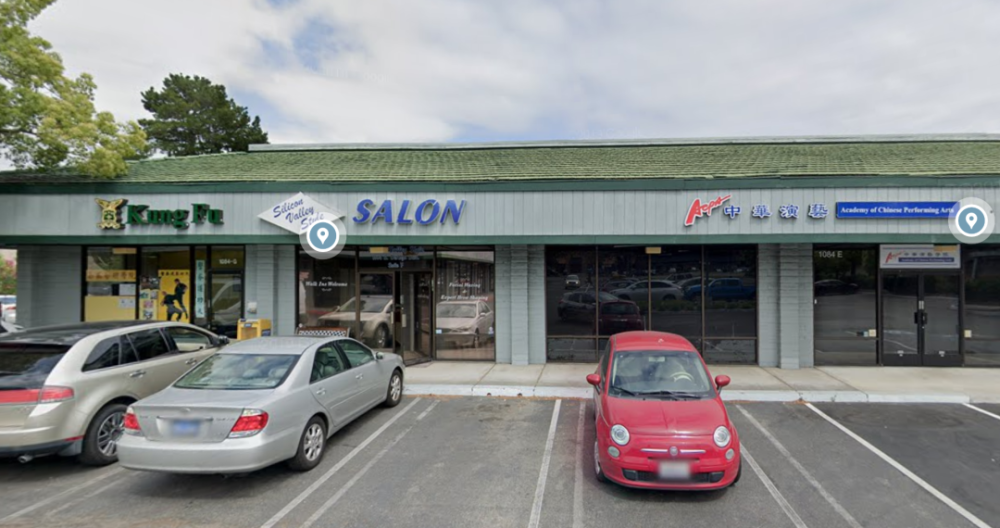

跨过大洋，仍旧鸡娃

加州家长们鸡娃的方式，和国内家长并无二致：主打一个提前规划。

譬如说，当自家孩子的年龄还是负数时，他的父母就开始在旧金山湾区，给他申请最好的幼儿园了。

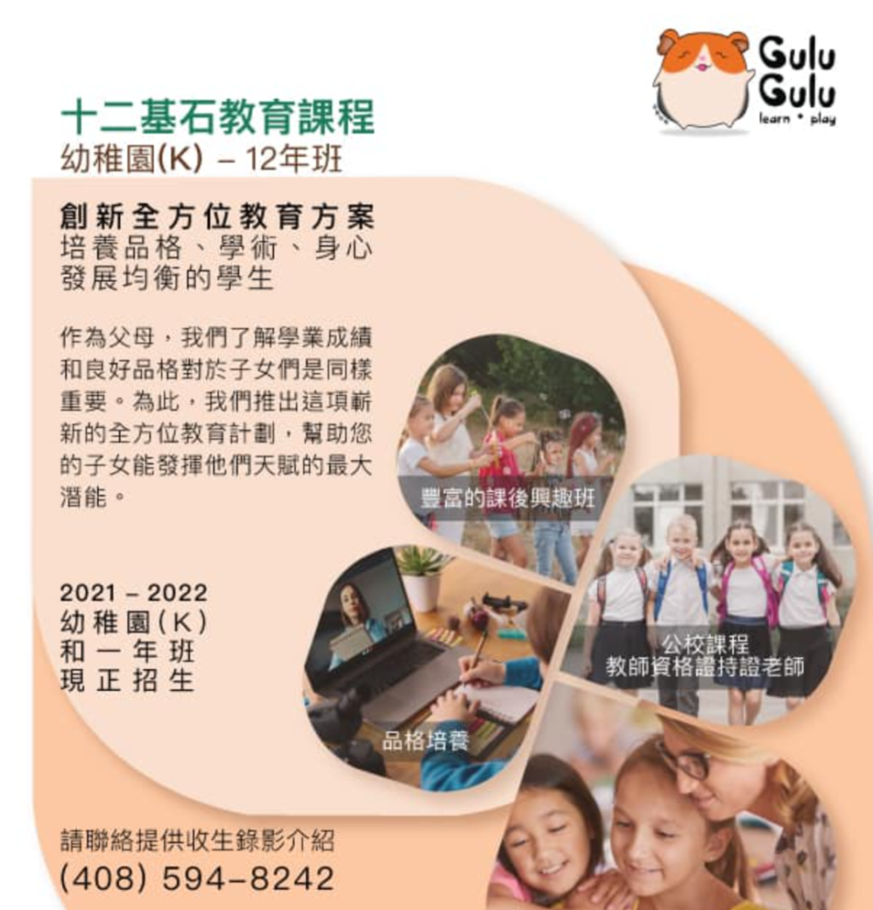

小孩降生还不到24个月，就被他踌躇满志的父母拉去上补习班。

所以，如果你问一个湾区华人小孩，他的生活是怎样的，那他多半会告诉你：

“周一学STEM，周二练钢琴，周三.......”

湾区许多培训学校的牌匾直接就写着中文，还在外面用中文写“今年又有xx个孩子，获得了数学竞赛的一等奖”，精准击中主流客户的心。

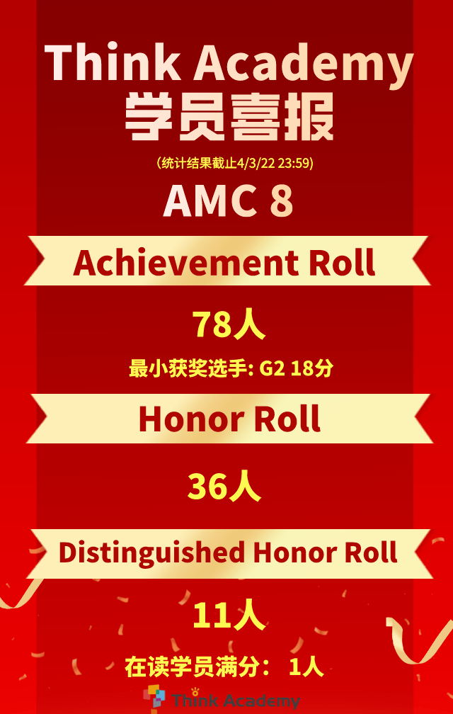

而在一位移民妈妈所晒出的养娃账单里，我们发现，其中有超过四分之三的开销，都被拿来上课后辅导班了。

毕竟，就算在美国，孩子上补习班的目的，也基本都是为了能在比赛中拿奖，能在申请学校时拿出一份写满了荣耀的个人简历。

然而，当这些“亮瞎人眼”的学生简历，被送到名牌大学的招生处后，却并没有收获心动的offer。

比如，有华人家长说，朋友的女儿上的是顶级私高，成绩特别拔尖，画技出类拔萃，在哈佛的物理实验室实过习，在欧洲游过学，还有很强力的推荐信.......

但就是这样一个履历极其优秀的女孩，却根本就申不上最顶尖的学校。

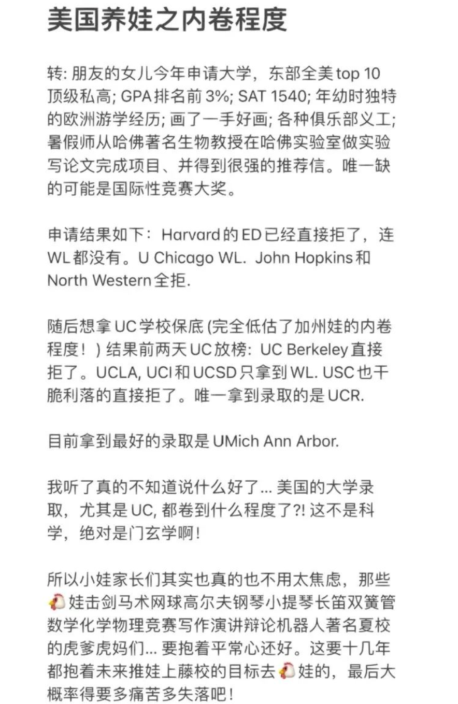

问题，究竟出在哪呢？

风向变了

**答案可能恰恰是因为现在的亚裔小孩，太优秀了。**

比如说，洛厄尔高中是旧金山湾区亚裔最多的高中之一，同时也是最好的高中之一。

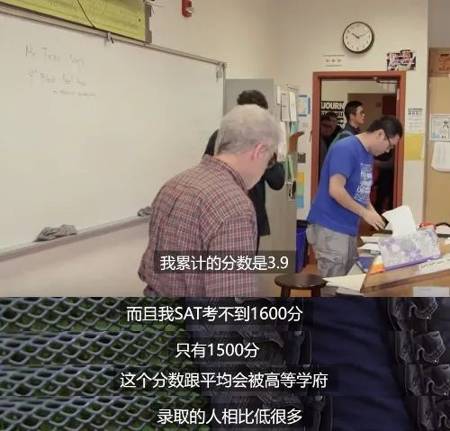

在这所学校，几乎每一个学生的简历拿出来，都能羡煞北美的鸡娃爸妈。

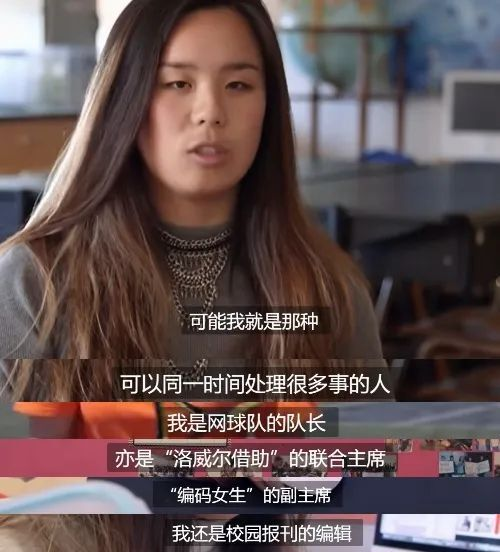

但美国顶尖藤校，却对洛厄尔这样的“北美衡水”越来越不感兴趣，因为在招生办看来：

“亚裔孩子都很棒，但棒得千篇一律。”

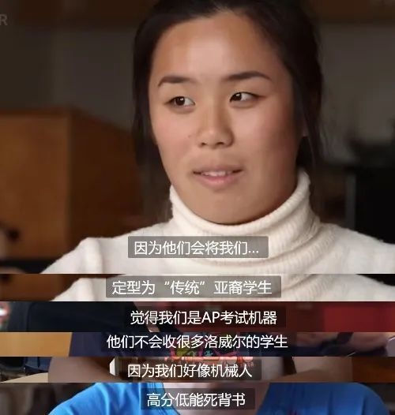

作为私立的办学机构，美国的大学最看重的，是一个学生能给它们带来什么，是优秀的人脉资源？还是不可取代的经历？

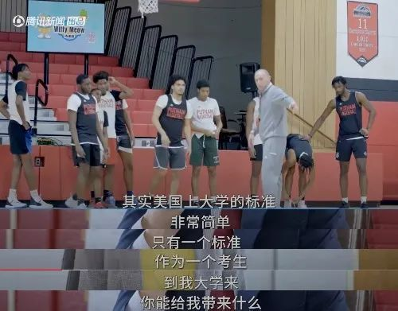

换句话说，在美国想要申好学校，你不仅要优秀，还要“优秀得有特点”。

就比如，在芝加哥大学的官网上，你能找到去年6个优秀新生在上大学前的人生履历。

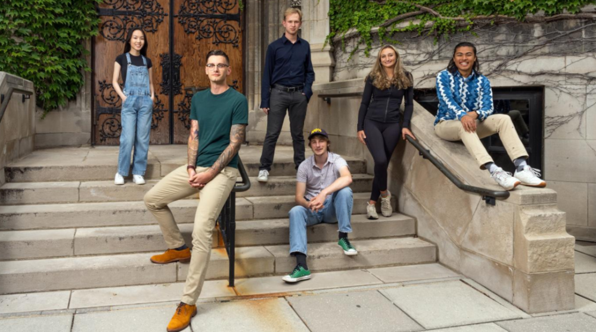

而要用一句话来概括这些履历，那便是“各有狠活儿”。

比如有个叫里斯·贝克的女孩，来自美国堪萨斯州，原本是一名撑杆跳好手，却在2019年确诊霍奇金淋巴瘤。在经历了50多次的化疗后，里斯战胜了病魔，自学了法语，并最终获得了芝加哥大学的垂青。

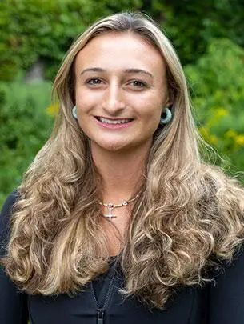

_里斯·贝克_

而其他那几个优秀新生，有的从小就喜欢修汽车，上大学前俨然已是一名成功的汽车销售；

有的就喜欢当记者，高二就给《纽约时报》写特稿；

还有的，从小就是户外探险达人，一直热衷于环保事业......

当然，在许多人看来，上述的这些招生要求，不可避免地让升学沦为了一个“谁的人生故事好，谁就更有优势”的比赛，本质还是在否定亚裔群体的勤恳和努力。

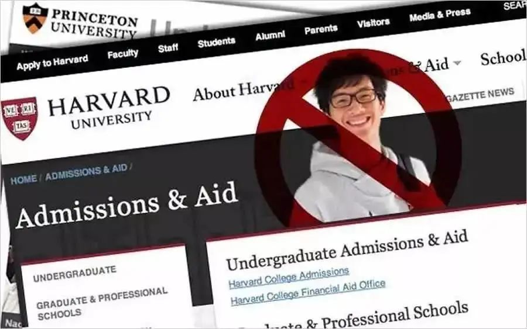

但华人的适应力，向来强得吓人。

在得知名校的招生倾向已然改变后，湾区的鸡娃爸妈，便立刻跟紧形势，改变了自己培养子女的方式。

而湾区鸡娃，也跟着进入了“2.0”时代。

湾区鸡娃进入“2.0”时代

既然常春藤大学的招生办喜欢听故事，那么湾区的华人家长就花钱给自己的娃，“砸”出一个好故事。

这里面最离谱的，据说是家长在硅谷直接成立VC，投资自家孩子“创立”的公司，之后找专门的团队做包装，结合时下流行的WEB3和数字加密货币，将孩子打造成一个少年科创新锐，以此来敲开名校的大门。

当然，孩子能不能受得了先放一边，这种“鸡”法的花销实在过大，并不是所有旧金山中产家庭都能玩得转。

于是，很多华人家长便退而求其次：

先给孩子报范围尽可能广的辅导班，然后再选一项孩子最擅长的专项突破。

像在这两年，很多湾区鸡娃就都走上了“体育特长”这个赛道。

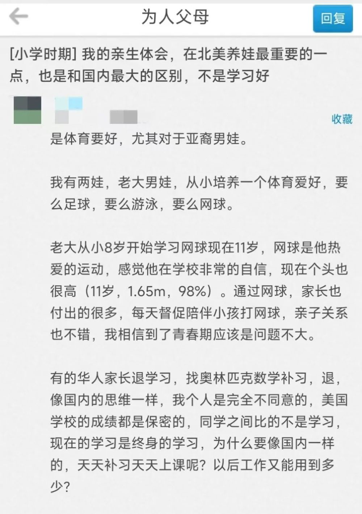

因为在美国，体育好的孩子在升学时极度吃香。

同样的成绩申哈佛大学，普通学生的录取率仅为16%，而体育生的录取率却能高达83%。并且大部分的体育生都有奖学金可拿，平均一年1.8万美金。

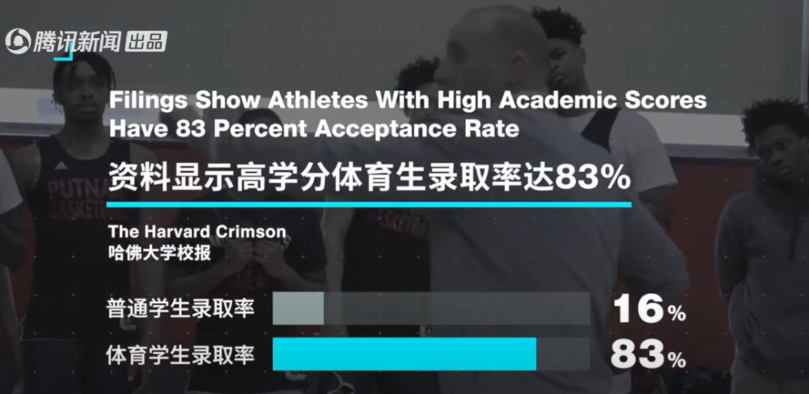

_图片来源：腾讯新闻_

并且，体育这条路它真的管用，"It works"。谷爱凌就是明证。

去年北京冬奥会后，当其他人都在感叹谷爱凌的人生履历时，湾区的家长则在琢磨：如何让我家孩子成为下一个谷爱凌？

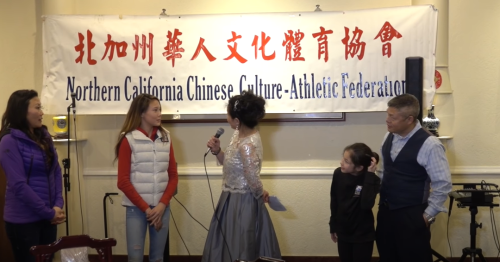

_2018北加州华人冬季体育运动会开幕晚宴上的谷爱凌_

于是，某机构去年在湾区开了专门针对孩子的滑雪培训班，1000美元一小时，刚推出就被家长们抢走了所有名额。

而更小的华人宝宝，则有体操课和“核心肌肉训练课”在等着他们。

难怪有家长感叹，说在国内，父母见面之后聊的是“你家孩子背了多少单词，会背多少古诗”，而到了北美，聊天则变成了“你家孩子学什么体育项目，在哪个场地”。

与此同时，湾区的家长们也发现，在重视体育的同时，文化课也是一点也不能放轻松。

因为在当下，鸡娃早已不是华人家长的专利。

比如，在美国的印度裔家庭也都是卷娃的好手。

_吉坦贾莉·拉奥（Gitanjali
Rao），印度裔，15岁登上时代杂志封面_

在暑假期间，很多印度裔家庭都会组织所谓的study date学习班，几家凑在一起集中学习到深夜。

而当华人家长还在纠结自家孩子的英语词汇量有没有上3000，印度那边的小孩则在这些年间，狂拿了27个全美“拼字比赛”的冠军：

像“psammophile（在沙质土壤中茁壮成长的有机体）”这样的冷僻词汇，大部分老美这辈子都没听过，14岁的印度男孩却能在瞬间拼出，实在是卷得吓人。

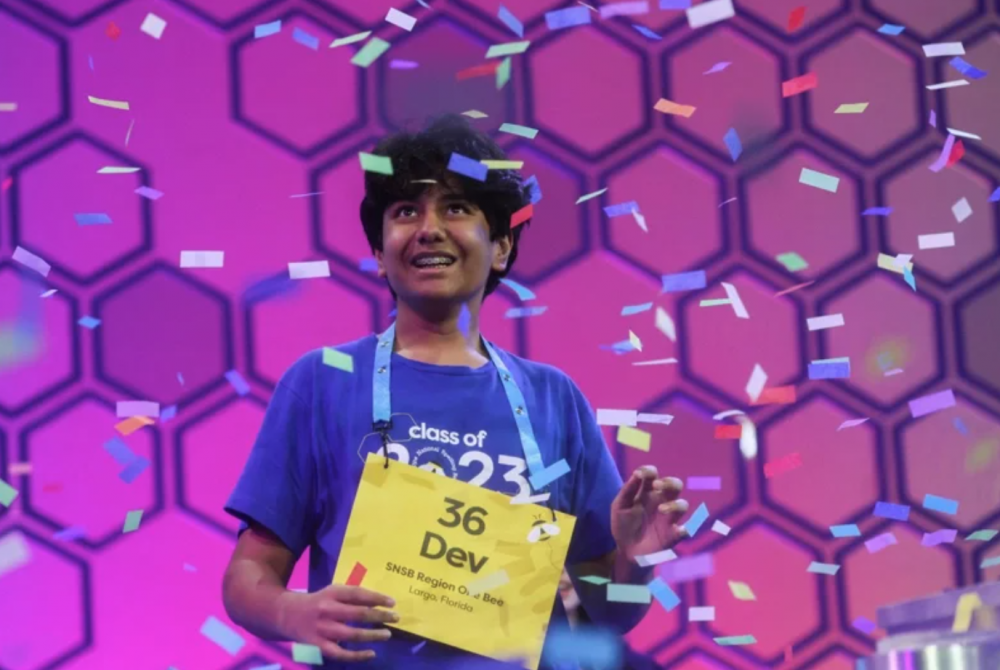

_这个拼字大佬名叫Dev
Shah_

与此同时，有华人家长在网上说，身边的墨西哥家长，都在逼着自家还没上学的孩子学第二门外语。

而在刻板印象里从不在乎学业的非裔美国人群体，如今也开始“习惯于”因为成绩问题，而对自己的孩子发火。

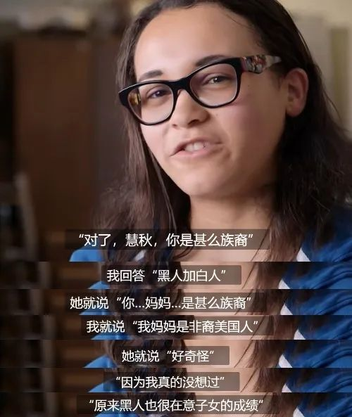

于是乎，湾区的父母们意识到，纯粹在家长群里“抄作业”的鸡娃时代已经过去，要想“爬藤成功”，他们就必须要“完全地动员起来”，激发出自家孩子真正的特质。

所以湾区鸡娃这项活动，不仅卷孩子，同样也卷孩子的爸妈。

越卷越深

**对于现在湾区的父母而言，养娃就好像打仗一样，拼的不只是爸爸的财力，还有妈妈的情报力。**

作为家庭的“指挥官”，一个妈妈需要尽可能多地搜集信息：

不但要知道各大湾区私校的招生要求，还要了解这些私校的教育理念，和自己的教育模式是否匹配。

如果孩子不上私校，转去公立，那么湾区的家长就会发现，即便到了美国，他们也绕不开学区房，绕不开这一笔巨大的开销。

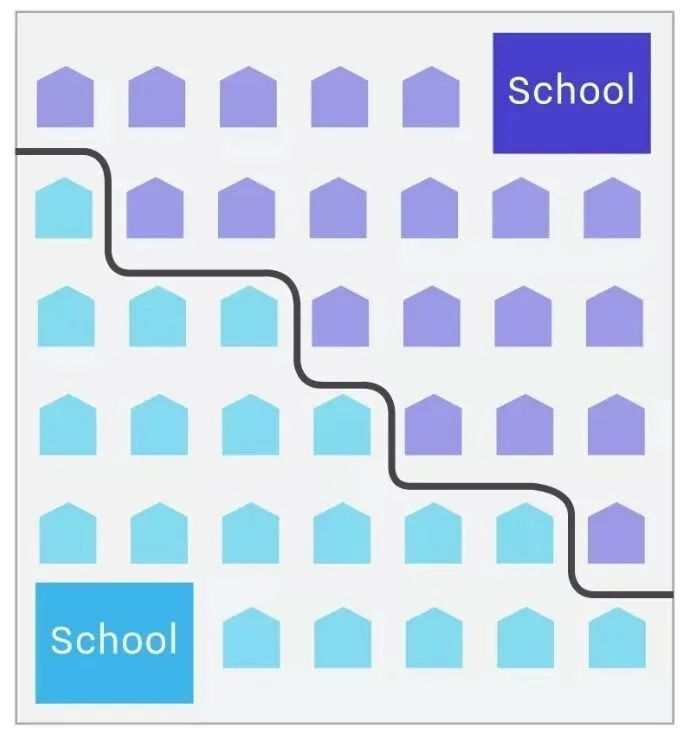

而养娃，不仅是一场消耗战，也是一场持久战。

当湾区的孩子们开始刷培训班，他们的家长便需要时刻陪同，有父母陪着孩子练小提琴，结果自己学通了乐理；还有的家长本身就琴棋书画样样精通，所以在面对育娃时便能做到游刃有余。

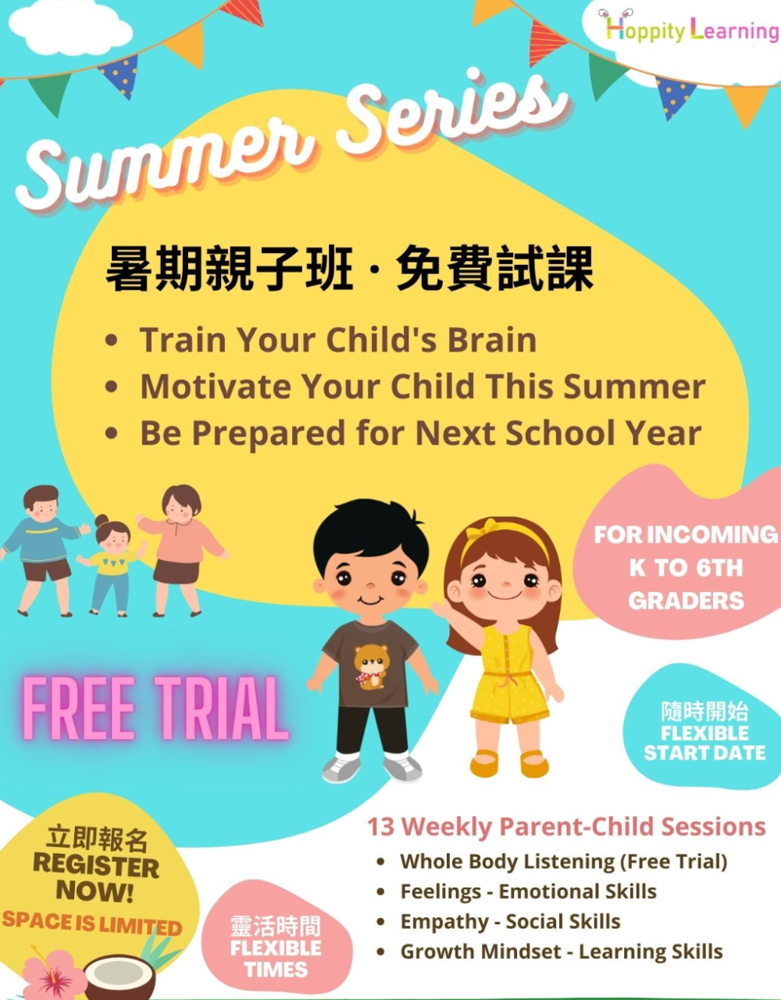

甚至在爬藤成功后，鸡娃爸妈的战斗，都还没有结束。

微博博主@一杨ish
就曾发过一个湾区家长群的截图，在图片里，你能看到这些华人家长在互相庆贺，而庆贺的内容，则是他们早已在美国工作的儿女，今年谁又加薪了，谁又升职了。

_“牛蛙”，是父母一辈子的骄傲_

前些日子网上也传出来一个瓜，说湾区有两个华人家庭，就因为争论“谁家的孩子进的大学好”，而从争吵升级成了斗殴，最后致使三人重伤。

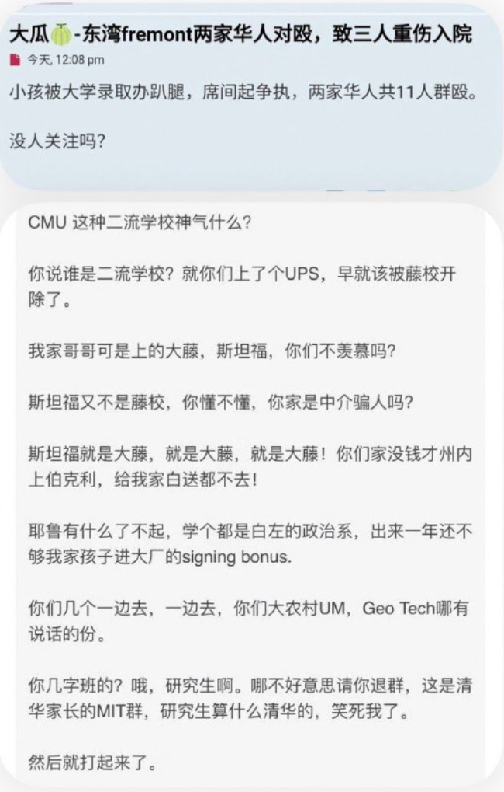

一开始只是卷自己的孩子，最终不可避免地把自己也卷了进去。

在踏上了异国的土地后，华人家长们才真切的意识到：

**曾经他们所听到的“欧美快乐教育”，只不过是一套被夸大的片面说词，唯有越来越激烈的竞争，才是升学这个游戏的真正本质。**

在国外，在国内，都一样。

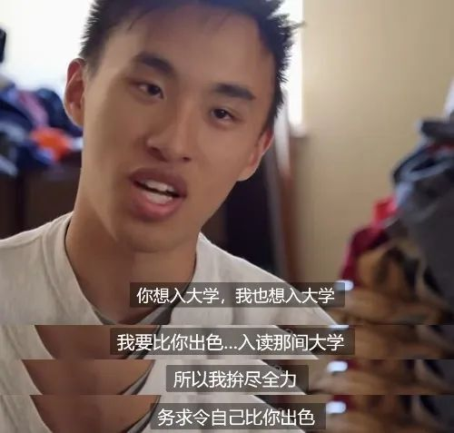

参考资料：

1.《你好未来人类：美国篇》

2.《再加把劲！》（Try Harder）

