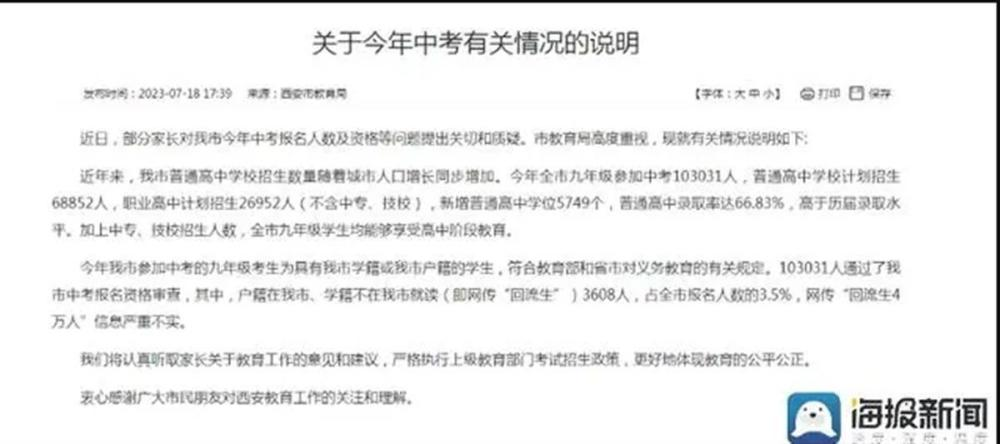

# 西安澄清“4万回流生参加中考” 媒体：家长反对的是变相“高考移民”

极目新闻评论员 吴双建

有传言称，2023年西安中考10万考生中，有大量回流生，数量1万至4万人。传言中，一些家庭凭借人才政策落户西安，但工作生活均不在西安，其孩子凭借政策“回流”至西安参加中考，其目的则直指三年后的高考。不少西安家长认为，这挤占了生活、工作、学习均在本地家庭本该享有的教育资源。7月18日傍晚，西安市教育局回应称，参加2023年中考的回流生为3608名，只占全市报名人数的3.5%。（据7月18日海报新闻）

查询数据得知，2023年西安市参加中考报名人数为10.3万人，如果真有4万回流生，那占的比例就相当吓人了，从另一个角度也说明“4万回流生”的数据不科学。当地教育部门及时公布回流生人数，回应舆论关切，应该点赞。

一般而言，中考的录取学生人数是一个综合权衡的结果，根据教育资源会有一个相对固定的比例，回流生会不会加剧中考的竞争，要看回流生的学习成绩。不过，就占比3.5%的人数而言，产生全局性影响的可能性并不大。但家长有意见的地方关键不在这里，而是高考。

_当地回应_

翻阅众多有意见家长的留言，大家在反对钻漏洞的“回流生”。漏洞在哪里呢？这些回流生参加西安中考并不是目的，而是为了取得高考的学籍，家长担心他们会挤占了西安的高考录取名额。

据海报新闻报道，凡是想要在陕西参加高考的学生，需要在陕西学籍满3年，父母或法定监护人在陕西落户满3年，在陕缴纳职工养老保险3年。因为有这个门槛存在，一般家庭很难达到。但因为当地为了吸引人才，只要身份证和本科毕业证原件即可办理落户，这样孩子就有了在当地参加中考的资格，之后就能顺理成章参加高考。

如果说，这些落户的人才在西安就业和生活，他们的孩子参加中考乃至高考，家长们也没有什么意见。问题就在于，一些机构宣称陕西的高考录取率高，高考压力比邻省小，就导致背后有灰色的产业链存在。他们从家长落户到孩子学习以及如何参加中考、高考，都有完整的配套收费服务。

换言之，通过这种灰色手段落户西安的家庭，就是空挂户，工作不在当地，孩子学习也不在当地，但可以参加西安的中考、高考。如此这般，西安的学生家长能不有意见吗？

而且，现在这些机构大肆宣传并从中牟利，虽然今年只有3608名回流生，那么明年会有多少，后年呢？家长就是怕人数继续膨胀下去。不得不说，家长的这些担心不是没有道理。说穿了，家长们反对的是这种变相的“高考移民”，认为有违教育公平。

此前，西安为了吸引人才，简化大学生落户，就受到了舆论赞赏。大学生都来落户就业、创业，可提升城市的竞争力和发展水平，水涨船高，每个人都可以从中受益。现在，城市的人口增量之所以受到大家关注，就是因为人口决定着一座城市的发展前景和预期。

如今出现的矛盾也表明，户籍改革是牵一发而动全身的工程。对当地来说，如何出台措施，堵上背后的灰色产业链，就显得尤为迫切。这一点，值得当地综合权衡得失利弊，打断这个灰色产业链。

（来源：极目新闻）

