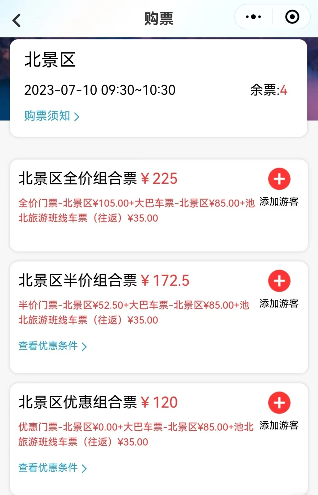
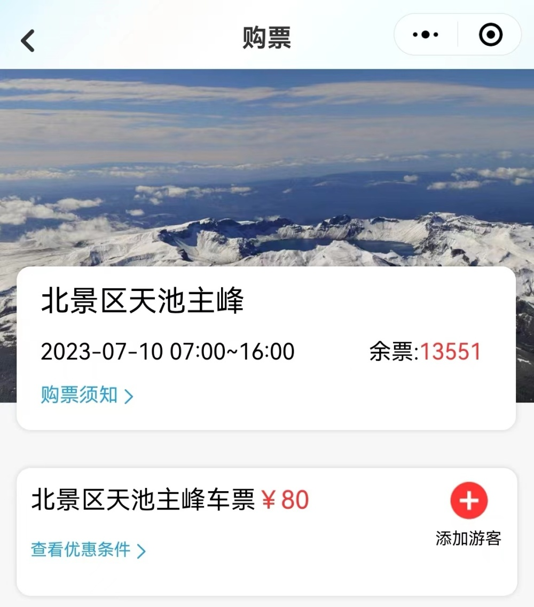

# 进门需再走三公里，景区摆渡车票价数十元，专家：需转变盈利思路

【 **民生调查局** 】

编者按：

这里是民生调查局，见人所未见，调查民生之变。关注你想关注的、你没关注的，调查你想看的、未看到的。

中新网7月19日电 (中新财经
彭婧如)“长白山以前自驾还能直接买门票，现在必须门票车票一起买，去天池主峰还要再花80元车票钱。”“月牙泉鸣沙山景区开始搞事情，正门隔很远把路封了，让游客去景区东门停车场，到了之后发现要额外买景区摆渡车票。”“30分钟车程收费300元，牛背山应该改名‘牛贵山’。”

如今，国内不少景区将游客集散中心与大门拉开一定距离，要进入景区乘坐摆渡车几乎成为必选项，这种情况引发了不少游客的吐槽。

**游客被迫“自愿”乘车**

刚游览完甘肃、青海路线的贾小姐对中新财经表示，沿线景区游客集散中心到检票口的距离几乎没有一处少于三公里。“有些景区甚至需要乘车半小时或者更久，这种情况下不坐摆渡车是不可能的。”

_资料图，游客在甘肃省敦煌市鸣沙山月牙泉景区游览。张晓亮
摄_

“从游客中心到检票口大概三公里路程，我们自己倒是可以步行，但是带上家里的老人、小孩，摆渡车几乎成为必选项。”一名从安徽来到北京慕田峪长城的游客对中新财经如是表示。

针对近期网络上关于四川牛背山、吉林长白山、甘肃鸣沙山月牙泉等景区交通的争议，中新财经分别致电核实。牛背山景区的工作人员表示，游客接待中心到检票口大概15公里，只能乘坐景区车辆上山，外地车辆不会被放行。至于为什么设置这么远的距离，工作人员对中新财经表示，可能是出于营收方面的考虑。

长白山北景区的客服人员表示，景区不能自驾进入，必须购买门票和车票的组合票，游客需在集散中心统一乘车上山，车程约50分钟。由于天池主峰路段大巴车上不去，需要换乘越野车，所以这段路程的车票需单独收费。

_吉林长白山北景区的组合票。 截图自“长白山”微信公众号_

_吉林长白山北景区天池主峰车票价格。
截图自“长白山”微信公众号_

鸣沙山月牙泉景区则回复称，景区东门停车场到距离景点有4.2公里，确实需要乘坐观光车。目前中门和东门都是正常开放，只是会根据客流量进行分流。另据“鸣沙山月牙泉”微信公众号消息，景区近期已发布公告调整东门观光车票价，自7月14日起，往返车票由20元/人次降至5元/人次。

**景区：是为方便游客**

对于景区设置摆渡车的合理性，实际上存在不同的观点和考量。慕田峪长城的官方客服对中新财经表示，景区在交通规划方面针对日场票和夜场票进行区分。如果是夜场票，游客可以开车到景区里面，4或5停车场距离缆车也很近；如果是白天的票，距离检票口就有一定距离。

“游客可以根据自身需求决定是否购买摆渡车票，景区与北京旅游集散中心也有合作，包含摆渡车票的旅游专线可直达缆车附近，也是为了方便游客。”上述客服称。

_资料图，北京市怀柔区慕田峪长城景区内的游客们。
中新社记者 贾天勇 摄_

有人认同慕田峪长城景区的说法，认为游客中心和景区大门的拉开一定距离是为方便景区附近交通管理，保障行人安全。有些景区还存在危险路况，乘坐景区专职司机驾驶的车辆会更加安全，也能保护景区生态环境。也有人认为，景区改移大门位置不是为给游客提供舒适便捷的服务，而是为了“宰客”而载客，出发点就跑偏了。

北京联合大学旅游学院教授李柏文对中新财经表示，关键在于游客中心到核心景区的距离应控制在合理范围内，如果故意拉得太长，相当于景区方故意增加游客的交通成本，制造盈利点。

“将日场和夜场分开处理，从景区客流管理的角度有一定好处，但也应注意提供多种交通方式保障消费者的选择权。”李柏文说。

**专家：景区需转变盈利思路**

针对景区管理和游客交通成本的矛盾，李柏文表示，放开交通，转变利益回报点，增加景区内部的消费点，问题才会得到解决。

“现在，景区更多是把门票、摆渡车等当成盈利点。但实际上，景区可以尝试提供低价或免费公共交通，同时侧重景区内部的二次消费，通过其他消费点弥补这部分成本。”李柏文分析称，一味抬高门票、交通的价格容易造成客流量下降，景区业态以及盈利点整体萎缩反而会得不偿失。

今年3月，文旅部资源开发司会同全国旅游标准化技术委员会就国家标准《旅游景区质量等级的划分与评定》(修订稿)公开征求意见。

根据修订说明，此次修订突出“3个引导”：引导景区树立正确的发展观与资源观，采取科学的资源开发方式，调整和优化供给结构和供给重点；引导景区正视功能性质变化，进一步强化景区的公益属性和社会职能；引导景区关注市场需求，重视现代服务观与产品观，追求供需适配、品质提升、消费升级和高质量发展。

目前，已有景区开始尝试摒弃观光车收费的做法。据“乌兰发布”微信公众号消息，青海茶卡盐湖景区根据广大游客诉求和解决景区存在的堵点问题，决定从2022年7月12日起，一律取消茶卡游客集散中心旅游环保观光车30元乘车费用，最大限度让利于广大游客。

你会选择乘坐景区摆渡车吗？(完)

