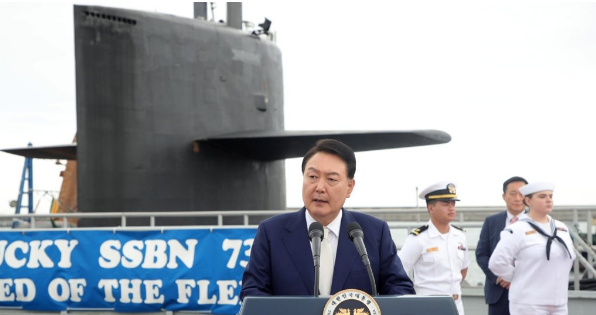
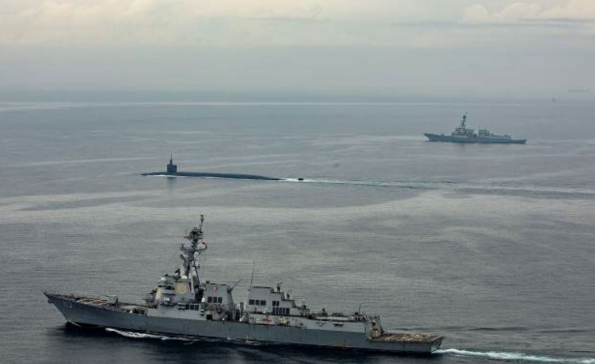

# 韩媒：尹锡悦登上美国战略核潜艇，成外国领导人中第一位

【环球网报道 记者
索炎琦】据韩联社、《朝鲜日报》19日报道，美国战略核潜艇时隔42年首次到访韩国之际，韩国总统尹锡悦于次日（19日）在釜山港海军基地登上该核潜艇并发表讲话。对此，韩媒表示，这是向朝鲜发出强烈警告。

报道介绍，停靠釜山港的这艘核潜艇为美国“俄亥俄”级战略核潜艇“肯塔基”号。据韩联社此前报道，美国白宫国安会印太事务协调员坎贝尔18日在韩透露，美国战略核潜艇正停靠在釜山港。

_7月19日，釜山港海军基地，尹锡悦在美国“肯塔基”号战略核潜艇旁发表讲话。图源：韩联社报道配图_

对于尹锡悦登上该核潜艇的举动，《朝鲜日报》援引韩总统府相关人士的话称，“这不仅是韩国总统首次登上美国弹道导弹核潜艇，也是除美国总统以外的第一位（登上美国战略核潜艇的）外国领导人。”报道还称，尹锡悦登上“肯塔基”号战略核潜艇在美国的盟友中是“史无前例的”，也是对朝鲜发出的强烈警告信号。

_7月18日，美国“肯塔基”号战略核潜艇进入釜山港海军基地。图源：韩联社报道配图_

值得注意的是，韩联社提到，就在上述美国核潜艇18日抵达韩国数小时后，朝鲜于19日凌晨向朝鲜半岛东部海域发射2枚短程弹道导弹。报道认为，这是朝方对美国战略核潜艇前一天停靠韩国釜山港实施的“针对性”示威。

