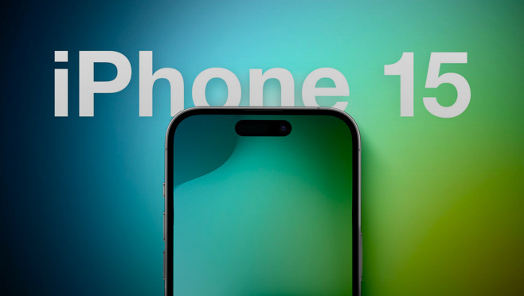
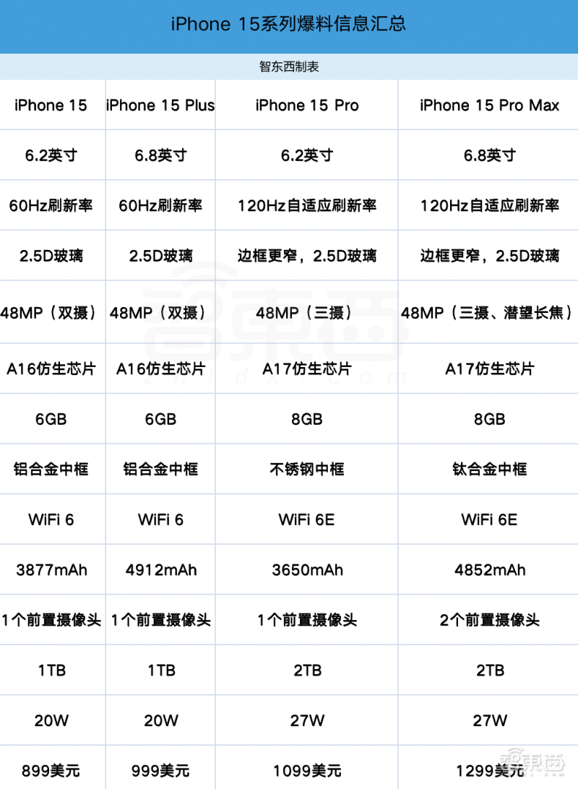
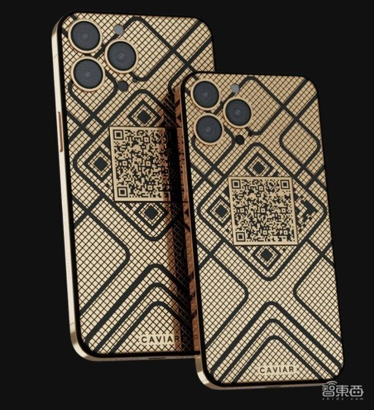
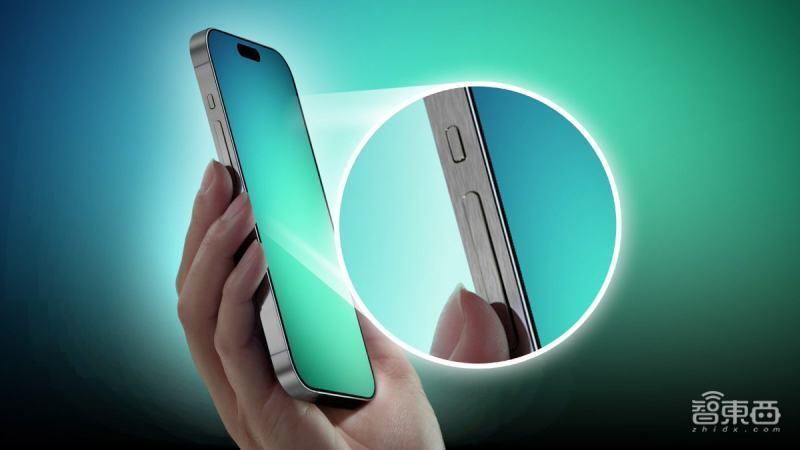
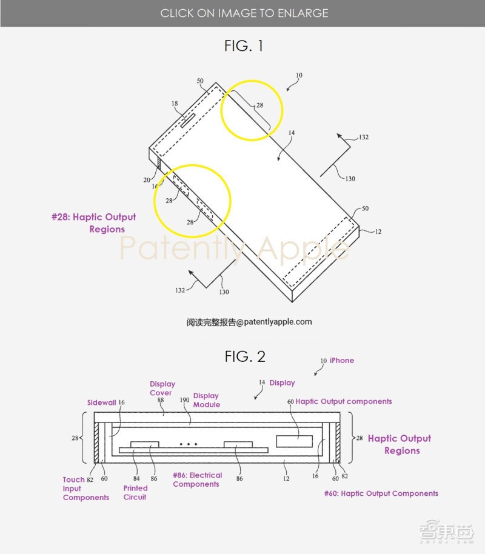
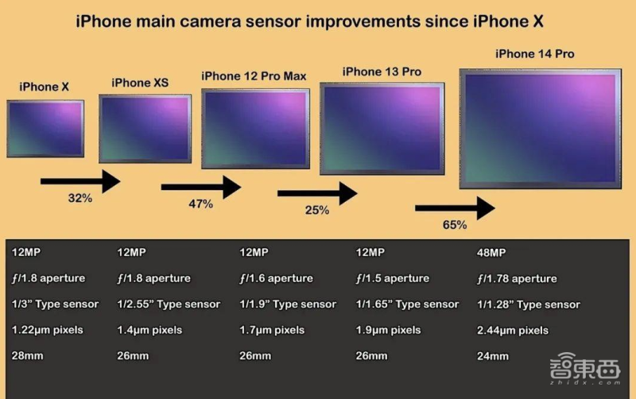
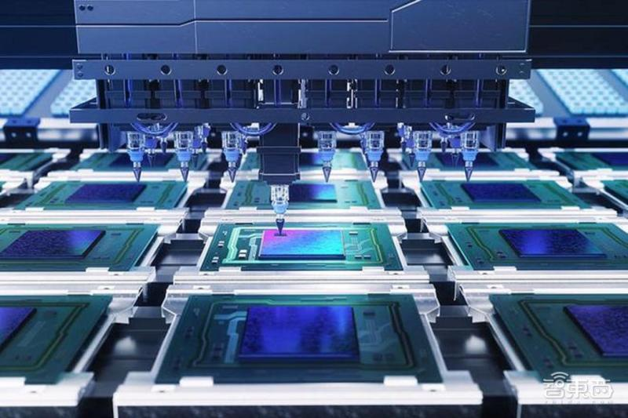
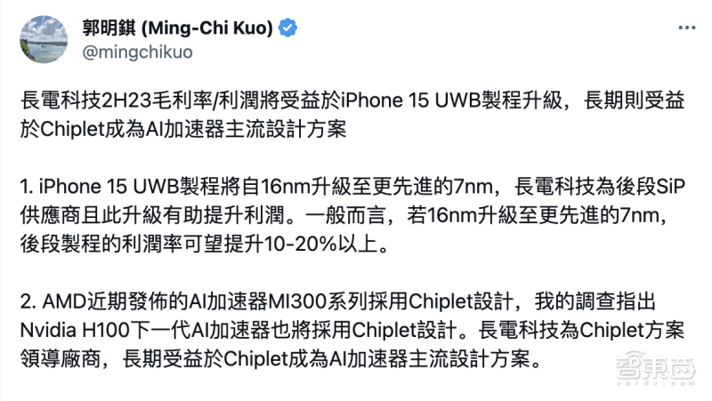
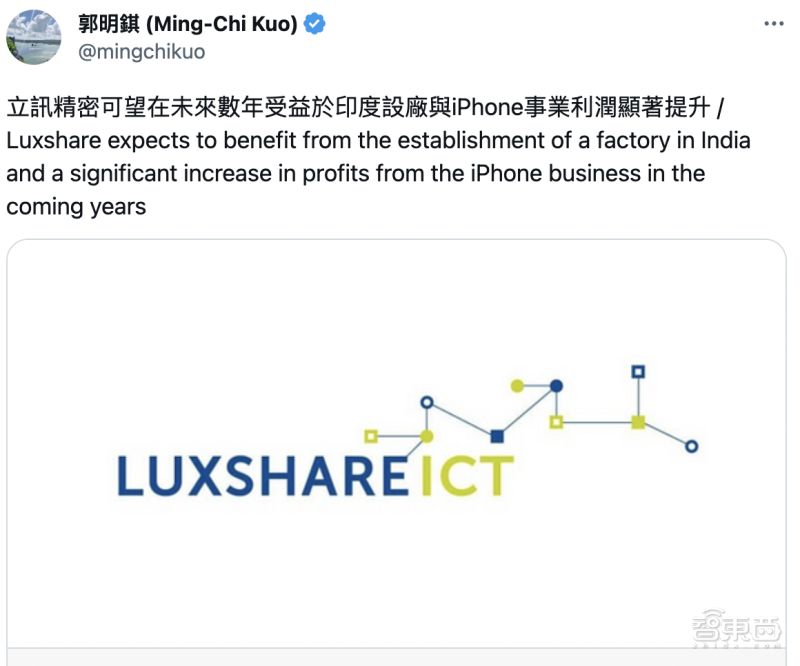
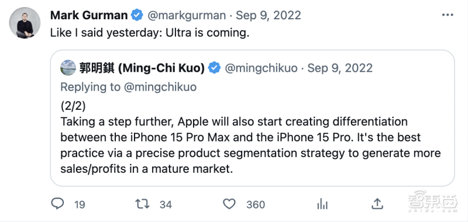

# 今年的iPhone 15，约吗？

**作者 | 周炎**

**编辑 | 云鹏**

连续八个季度的疲软，让全球智能手机产业亟需一剂振奋剂。

不久后就要面世的iPhone 15被寄予厚望。

就在前几天，某证券公司的一则消息称iPhone
15系列将涨价近1500元；今日，来自彭博社的消息又传出iPhone将接入苹果秘密研发的聊天机器人AppleGPT，引起了人们对iPhone
15的更多遐想，苹果能将手机和大模型结合玩出什么花？不过，据说今年iPhone 15很有可能推迟到第四季度才发布，大家可能要再多等一段时间。

回顾过去几个月，关于iPhone
15的猜测已经有很多，包括续航增加15%、首次用上6倍潜望式长焦镜头、搭载苹果史上最强A17芯片等，都一次次让“果粉们”激动起来，一些新功能与安卓机的对比也让产业人感到非常有趣。

通过对iPhone 15系列爆料信息进行全面归纳总结，智东西发现，iPhone
15系列将在外观设计、影像能力、屏幕显示、电池容量、接口类别、储存规格、通信技术、芯片、产品命名、备货数量、价格、供应商、代工商等13大方面发生改变：

**1、使用Apple Watch Ultra的“钛合金”材料，固态按键设计可能被毙**

**2、潜望式镜头变焦能力提升2倍，前置拍照首次改为“双摄”**

**3、屏幕峰值亮度可达2500nit，首次采用28nm OLED驱动芯片**

**4、电池容量接近5000mAh，功耗降低35%、续航延长15%**

**5、11年的Lightning接口更替为USB-C，支持第三方配件快充**

**6、全系标配256GB储存空间，2TB超大储存暴打安卓**

**7、升级UWB规格构建Vision Pro生态，或放弃实体SIM卡，普及eSIM**

**8、用上台积电3nm工艺的A17芯片，无缘自研5G基带，停止开发Wi-Fi芯片**

**9、提前备货量近亿台，iPhone 15系列却被爆或推迟至四季度上市**

**10、供应商洗牌，瑞声科技惨遭“砍单”，京东方无缘屏幕供应**

**11、塔塔生产首批iPhone，立讯首次拿下三款iPhone机型订单**

**12、最高端机型“Ultra”将至？分析师：至少要等到2024年**

**13、每台贵约1500元，2TB版本或超2万元人民币**

而随着各种消息的汇聚联接，一张关于iPhone 15系列的猜测版参数表也浮出水面。

 _▲iPhone 15系列爆料信息汇总图，智东西制图_

**本文福利：**
新兴市场空间广阔，智能机逐渐取代功能机。非洲、南亚、东南亚、中东和拉美等新兴市场人口基数超过40亿，部分国家经济发展水平较低，手机行业发展相对滞后，人均手机保有量较小，市场空间较大。随着新兴市场的不断发展，智能手机占比将不断提高，存在较大的结构性改善需求。推荐精品报告
**《手机业务稳定增长，新业务打开成长空间》** ，可在公众号聊天栏回复关键词【 **智东西381** 】获取。

一、使用Apple Watch Ultra的“钛合金”材料，固态按键设计可能被毙

去年11月，爆料者LeakApplePro放出iPhone 15 Ultra的外观渲染图，再次验证iPhone 15系列可能要使用钛金属材质。

与此前苹果使用的不锈钢、铝合金等材质相比，钛合金更加结实、耐刮以及轻便。但价格也更为昂贵。目前市场钛合金每克价格在400-1000元人民币区间，只有俄罗斯奢侈品牌Caviar推出过定制版钛合金iPhone，是当时正常版本价格的5-6倍。

_▲俄罗斯奢侈品牌Caviar推出的iPhone 13 Pro Max_

目前苹果已经使用钛合金生产Apple Watch Ultra，在Apple Watch
Ultra的宣传片中，苹果提到了“先锋工艺”，看来是通过手表已经为iPhone“试水”。

_▲使用钛合金生产的Apple Watch Ultra_

有爆料称，苹果还会将iPhone 15背部设计成弧形边框取代现有的直边设计，这也就意味着iPhone 15将回归此前圆润的机身。

据推特账号@ShrimpApplePro称，iPhone 15的背部边框类似与苹果14英寸和16英寸MacBook
Pro机型外壳的底部边缘，更贴切一些，应该更像是iPhone 5C的背面。

虽然钛金属和弧形边框都属于苹果在外观上的调整，但其产生的差异化优势是具有技术壁垒的。
**目前安卓厂商还没有钛金属方面的技术积累，供应链也没有成熟和低廉的解决方案，同时苹果凭借着对供应链高度的掌握力，安卓厂商又很难企及。可以预见的是，iPhone
15系列中对钛金属的运用，有可能会带动钛金属加工产业产业链的发展。**

除了钛合金材质，苹果iPhone 15系列此前还被爆出采用固态触控按键设计，其可能会在机身左右两侧的内部设置额外的Taptic
Engines，来提供实体按键的手感。

 _▲爆料中iPhone 15的固态触控按键设计渲染图_

不过这个爆料后来被分析师郭明錤否定了，由于iPhone 15 Pro机型在量产前无法克服技术问题，iPhone 15 Pro和iPhone 15 Pro
Max取消了市场高度关注的固态按键设计，改回了原本的实体按键设计。

不过，这也并不意味苹果完全取消了采用不同设计方案按键的计划，Patently Apple官网显示，苹果在今年6月公布了一项固态按钮触觉输出的专利。

 _▲苹果获得的新专利信息，来源：Patently Apple_

在专利中苹果称，非机械按钮可能由固态半导体材质制成，还可能使用包括电容式触摸传感器（touch
sensors）在内的各种触摸传感器，因此无需按动按钮部件即可操作。

**该专利还提供了另一个重点，即增加毫米波天线阵列（millimeter wave antenna arrays）、卫星导航系统（satellite
navigation system）、超宽带收发器电路（ultra-wideband transceiver circuitry）。**

有产业知情人士称，固态按键应该只是不在iPhone 15系列中使用，延后使用的可能行还是很大。

二、潜望式镜头变焦能力提升2倍，前置拍照首次改为“双摄”

除了外观，今年iPhone 15系列一个比较重磅的改变就是终于使用上了潜望式镜头。

今年以来，华为、vivo、OPPO、荣耀、小米等多家手机厂商在产品中使用了潜望式长焦镜头。事实上，长焦镜头在手机中的应用可以追溯到2019年，后来
**潜望式长焦镜头开始成为安卓旗舰机的标配。**

**过去几年，长焦镜头的“素质”以及变焦倍数也成为鉴定一款手机是否是真旗舰的隐性指标。**

从郭明錤的预测来看，iPhone 15 Pro
Max也将配备潜望式长焦镜头，该镜头可以提供5到6倍的光学变焦能力，对比此前只能提供3倍光学变焦能力的iPhone 14 Pro
Max来说，变焦能力提升了近2倍。

然而这种潜望式长焦镜头会改变目前iPhone手机镜头系统的布局。 **据爆料者Unknownz12透露，在iPhone 15 Pro
Max上，苹果计划将超广角镜头移动到模块的角落位置，而长焦镜头放在闪光灯和激光雷达之间的位置，这样做的目的是为苹果提供更多的内部空间来安装潜望式变焦镜头。**

_▲爆料中iPhone 15 Pro Max手机镜头设计渲染图_

从描述来看，作为第4颗镜头出现的潜望式长焦镜头无疑会打破目前形成的三摄传统，同时苹果背部镜头也难逃“大改”的命运。

**今年OPPO推出的OPPO Reno10 Pro+使用了大药丸形状的三摄像机模组，最下面使用了潜望式长焦镜头。而小米13
Ultra后置摄像头模组采用了圆形设计，包含四个摄像头和两个闪光灯，潜望式镜头被OPPPO放在了机身摄像头模组的右下角的位置。**
可以看到，长焦镜头对手机厂商堆叠排布手机内部元器件提出了较高的要求，苹果将会交出怎样的答卷？

尽管目前来看，潜望式长焦在安卓手机的热度渐退出，但苹果iPhone 15系列首次搭载这颗潜望式镜头将会有望领导手机摄像头行业的风向。

除了潜望式长焦镜头，海通国际分析师Jeff Pu还称， **iPhone
15系列会通过三层堆栈式的方式来提高传感器的进光量。这种传感器和索尼之前发布的Xperia 1V的Exmor
T双层影像传感器类似，后者实现了光学二极管与像素晶体管分层设置，这样可以使得饱和信号（FWC）提升至原来的两倍，从而实现更大的动态范围。**
另一方面，与同为1微米的传统背照式传感器相比，由于像素晶体管拥有了更大的空间，因此可以增加放大晶体管的尺寸，从而改善弱光下噪点表现。

_▲苹果历代图像传感器情况，来源：LeakerApple_

爆料达人@Majin Bu还称iPhone 15 Pro Max会采用2枚前置摄像头。据悉，这是iPhone首次采用前后置双摄组合。 **在这之前，vivo
X9、vivo X9
Plus、荣耀Magic等都曾使用过前置双摄，当时荣耀为了避免多个零件放在正面影响美观，所以用了特殊的喷漆技术，将红外摄像头隐藏起来。**

目前尚未得知苹果具体的解法，有业内人士分析称，屏下Face ID技术或许是一种解法，在这种方案下，灵动岛的宽度不会增加，Face
ID模组可以做到屏幕下方不影响显示。

今年5月，苹果公布了一项关于屏下ID的技术专利，从专利图片来看，屏幕下方可以嵌入各种传感器，其中包括Touch传感器、用于测量三维非接触手势的传感器、压力传感器、用于检测位置、方向和运动的传感器。

从专利图中可以看到，灵动岛的位置可以改变，通过使用一系列微小透明窗口，有选择地激活和停止不同的像素，这样的窗口的尺寸和位置可以在屏幕周围移动。

三、屏幕峰值亮度可达2500nit，首次采用28nm OLED驱动芯片

据韩国媒体The Elec报道，iPhone
15系列的OLED屏幕都将使用最新的M12材料，采用该材质的屏幕手动峰值亮度超过1000尼特，全局峰值亮度达到1500尼特。两个Pro
版本的屏幕亮度还将进一步提升达到2500nit，画面层次感越强，整体表现力越好。

此外，苹果还对iPhone 15标准版的屏幕进行了“阉割”，iPhone 15和iPhone 15 Plus将不会配备LPTO。
**这也就意味着它将继续缺乏ProMotion支持及像Pro版那样常亮选项。**
而Promotion功能对于消费者来说具有重大的意义，它不仅可以提升手机的续航能力，还可以解决处理器渲染画面和屏幕即时显示的问题。

在屏幕显示上，苹果还面临一个棘手的问题，那就是iPhone游戏时自动降低亮度且掉帧严重。 **苹果为iPhone
15系列还加持了更加先进的OLED驱动芯片，这块芯片使用了28nm的制程工艺，将带来芯片算力的提升，从而大幅提升屏幕的刷新率、触控反应、亮度调节的智能和灵敏度，以便进一步降低屏幕显示带来的功耗，从而更进一步提升手机的续航表现。**

_▲iPhone 15系列将使用台积电28nm制程工艺的OLED驱动芯片_

四、电池容量接近5000mAh，功耗降低35%、续航延长15%

从目前爆料的信息来看，iPhone 15系列在电池容量将有望大幅提高，其中iPhone 15的电池容量为3877mAh，iPhone 15
Plus电池容量为4912mAh，iPhone 15 Pro的电池容量为3650mAh、而iPhone 15 Pro
Max的电池容量达到了4852mAh，相较于iPhone 14系列，这一代产品电池增加了400-600mAh。

**虽然与目前的动辄5000-6000mAh的安卓机相比，iPhone
15系列的电池容量可能并不显眼，但是新机使用了基于台积电3nm制程工艺打造的A17芯片，可以降低35%的功耗。** iPhone
15可延长续航15%，iPhone 15 Pro和Plus能够延长12%，iPhone 15 Pro Max可以延长11%。此前还有报告称，iPhone
15系列电池寿命也会延长15%。

五、11年的Lightning接口更替为USB-C，支持第三方配件快充

2021年，欧盟委员会关于“统一消费电子产品的充电口为USB-C”的议案或批。两年后，iPhone 15系列或成为首批由Lighting接口转为USB-
C接口的手机。

将时间倒回2012年，苹果发布全新Ligjhting Dock接口的iPhone
5。对于当时而言，Lighting算是比较先进的设计，一方面它实现了不分反正面盲插，增加了方便性，另一方面，相较于Lighting接口的体积得到了极大的缩减。

**但是在11年后的今天，Lighting接口一直停留在USB
2.0的传输速度，理论传输速度也只有60MB/S，而且Ligjhting接口的充电速率也比USB-C接口要慢得多。**

今年3月，有媒体爆料称，与安卓阵营的USB接口不同，iPhone 15的USB-C端口将完全依赖与MFi认证。使用苹果认证电缆和普通电缆，iPhone
15的数据传输速度和充电速度将会有较大的不同。

**然而这种情况很快就发生了反转，从外媒laptopmag的调查结果来看，如果苹果通过MFI加密，刻意限制iPhone
15快充速度的话，可能会被欧盟视为违法行为。** 另一位熟悉国内MFi供应商的博主@老七也透露：iPhone 15不会对USB-C进行限制。

_▲国内MFi供应商的博主@老七微博信息_

去年，郭明錤爆料称，iPhone 15和iPhone 15 Plus的USB传输速度会达到USB
2.0（480Mbps），这与此前的Lighting接口的传输速度基本一致。而iPhone 15 Pro和iPhone 15 Pro
Max的速度将达到USB 3.2（20Gbps）或者雷电3（40Gbps），而这个速度是USB 3.0快8倍。

据9toMac爆料称，iPhone 15 Pro、iPhone 15 Pro Max中的USB-
C接口将支持雷电3协议。据悉，雷电3拥有速度快、支持双向传输等优势。苹果还为这两款机型开发了新功能，使得手机在进行4K录制时，画面可以同步到外接显示器上。

**USB-C接口会是苹果对充电问题的终极解决方案吗？答案是未必，无线充电技术或许是未来的趋势之一。**

3年前，苹果在iPhone
12系列带来了Magsafe磁吸充电，通过为无限充电加入磁铁，改变iPhone系产品的新无线充电方式，成为手机充电的备选。在那之后，苹果还生产了许多MagSafe的衍生品，最新的苹果专利还显示，苹果正在研发一项可以显著控制MagSafe温度的技术。

但问题在于，这些还是没有实现接触充电装置本身就可以远程为手机充电。去年，小米和摩托罗拉官宣了一项隔空充电技术，通过充电桩向手机发射毫米波，手机再通过微型信标天线接收，从而实现隔空充电。目前这项技术已经雏形，接下来要进一步提升充电效率，减小充电桩的体积。
**但未来苹果具体要什么方式，还尚无定论，但安卓阵营已经为苹果树立了标杆。**

六、全系标配256GB储存空间，2TB超大储存暴打安卓

说完了充电，接下来讲一下iPhone
15系列的内存问题。目前iPhone手机的内存规格有128GB、256GB，128GB对于一些只安装日常所需APP的用户足够，但是对于一些喜欢拍摄的用户，这个内存就显然不够了，
**每隔一段就被苹果提醒“手机内存不足”，靠不断删除内容来扩容也十分麻烦。**

从爆料信息来看， **此次iPhone 15全系不再提供128GB的选项，而改为最低256GB的版本。**

不过也有分析称，苹果一直以来在手机储存容量都保持着相对保守的态度，此前iPhone一直沿用64GB的存储版本，直至近期才升级至128GB，因此，苹果不会直接开放到256GB起步，而是会将现有的256GB，促使消费者去选购更贵的版本。

就在安卓厂商将1TB版本作为产品重要卖点时，有爆料称， **今年iPhone
15系列将会增加2TB版本，以应对ProRes视频的极高储存占用。2TB是一个什么概念呢？也就意味着可以存储2万首歌曲或400部电影，这将引领手机存储到达一个新的高度。**

七、升级UWB规格构建Vision Pro生态，或放弃实体SIM卡，普及eSIM

在苹果推出Vision Pro后，郭明錤又爆出一大猛料：为了完善Vision Pro的生态，加强头显与其他苹果硬件产品的整合能力，
**苹果计划升级iPhone 15中UWB的规格，将生产制程由16nm升级到7nm。**

_▲郭明錤关于iPhone 15系列将UWB规格升级至7nm的推文_

苹果的Vision Pro生态为什么要精进UWB？UWB全称为“Ultra Wide
Band”，即“超带宽”，其使用的带宽在500MHz以上。同时，由于UWB的脉冲时间很短，可以在短时间发送大量数据，同时功率还不会太高。可见UWB是Vision
Pro生态推进的关键一环。

在过去的几年里，小米“一指连”技术将UWB推向业内关注的焦点，三星发布了支持UWB的智能追踪器，去年，华为旗下海思招聘启示中明确提到UWB的字眼。今年3月，三星宣布推出UWB芯片。随着苹果对iPhone
15中UWB规格的的升级， **UWB技术将再次成为“风口”。**

另一件与iPhone 15通信相关的爆料称，苹果iPhone 15系列eSIM将扩大登陆的国家和地区，部分国家的iPhone
15系列将不具备实体SIM卡槽，只能通过eSIM蜂窝连接。

去年iPhone 14系列全面取消美国市场的实体SIM卡槽，今年包括英国、德国在内大部分欧洲国家也将仅销售使用eSIM的iPhone 15系列。
**遗憾的是，国内用户或许将无缘这一新功能。**

八、用上台积电3nm工艺的A17芯片，无缘自研5G基带，停止开发Wi-Fi芯片

近些年来，安卓旗舰芯片在性能提升的同时，也接连在功耗方面“翻车”。随着功耗的增加，手机的热量也不断升高。

在持续高性能的压榨下，手机会主动降低芯片超大核的频率。而当温度依然升高时，接下来就会限制大核心的发挥。也就是说，当用户使用上更加先进工艺的旗舰芯片时，本应该体验到续航上的提升，但是实际使用上，续航的提升的效果不大。

在这个基础上，一款芯片的好坏更需要看芯片的能效比，也就是手机性能和功耗的比值。从爆料的信息来看，iPhone
15系列中即将采用的A17芯片更是用上了台积电最新的3nm工艺，比较而言，台积电以外的两家厂商高通和联发科都还停留在4nm。

虽然从4nm到3nm，性能预计只有10%-15%的提升，但功耗预计将下降35%。不过标准版仍然只配备了A16芯片。

就在上月,有媒体披露，A17芯片将存在两个版本，早期版本的A17仿生芯片将采用台积电的N3B制程工艺，但苹果计划在明年的某一时间点，将A17转向N3E工艺。
**据悉，N3E工艺是N3B工艺的简化版，相较于后者拥有更少的EUV层和更低的晶体管密度，但因为技术相对简单，因此良率较高，这也是苹果降低成本的一种方式。**

 _▲A17芯片将存在N3B工艺和N3E工艺两个版本_

去年10月，海通国际分析师Jeff Pu透露，iPhone 15将继续使用高通的基带芯片-骁龙X70。这也就意味着iPhone 15将无缘自研5G基带芯片。

今年1月，郭明錤称，苹果已经暂停其正在开发的Wi-Fi芯片工作，接下来苹果供应商博通将为其提供Wi-Fi芯片，iPhone 15将升级到Wi-Fi 6E。

从郭明錤的分析来看， **一方面，苹果将绝大部分IC设计资源用于开发处理器，开发资源不足影响了Wi-Fi芯片的进程，另一方面，未来2-3年里，Wi-
Fi芯片将迎来重要的Wi-Fi 6E向WiFi 7的升级，在行业标准显著改变的时刻，使用自家Wi-Fi芯片意味着更高的风险。**

目前来看，高通和联发科的旗舰芯片目前已经开始正式支持Wi-Fi 7，小米13更是已经支持WiFi 7，相比之下，使用Wi-Fi 6E的iPhone
15显然已经在通信方面落后了。

九、提前备货量近亿台，iPhone 15系列却被爆或推迟至四季度上市

就在上月，苹果正式下达iPhone 15的备货指令，同时将在7月份开启第一波备货潮。据台湾《经济日报》的报道，苹果iPhone
15系列模型机已经提供给供应链厂商，苹果初期备货将维持去年高位水准，起步8500万台，直逼9000万台。

不过，目前分析师们对iPhone 15系列的市场行情态度不一，此前巴克莱分析师称，iPhone 15系列有望迎来超级周期，年内出货量将达到8900万台。

美银全球研究公司分析师莫汉从消息源得到的爆料：iPhone 15系列推出时间可能延后好几个礼拜，可能延到今年第4季。基于iPhone
15系列的可能上市时间点，他预估，本季iPhone销量为4800万台。

十、供应商洗牌，瑞声科技惨遭“砍单”，京东方无缘屏幕供应

**iPhone 15系列在接口类别、通信技术、屏幕显示、续航等方面的更新也给果链企业带来较大影响。**

从郭明錤的分析来看，苹果目前看好iPhone 15系列改为USB-C接口后20W USB-C充电器强劲换机需求，故将20223年第二季度和第三季度20W
USB-C充电器的出货量预估显著调升约120%，并设定20W USB-C充电器在今年第四季度的出货量将达到7000万。

20W USB-
C充电器的组装供应商为领益智造与Flextronics。虽然后者的出货比重略高于前者，但因后者的营收约是前者的5–7倍，故从对营收的贡献程度而言，领益智造为20W
USB-C充电器强劲换机需求的主要赢家。

而长电科技则是受益于UWB芯片，上文提到，iPhone
15的UWB芯片将从16nm升级至7nm，那么后段制程的利润率有望提升10-20%，作为SiP封装供应商的长电科技，将从获得更大的利润。

 _▲郭明錤对长电科技分析的推文_

**比起“狂赚”的领益制造和长电科技，瑞声科技则是遭遇了“砍单”，**
这位昔日的“果链一哥”市值也遭遇了大幅跳水，暴跌90%，谁能想到5年前，这位国内代工巨头巅峰时期市值一度超过立讯精密和歌尔股份。

**而在这场果链供应的争夺战中，京东方更像是坐了一次过山车。** 今年1月，郭明錤爆料，京东方已经击败三星，取得今年下半年新款iPhone
15和iPhone 15 Plus的大部分屏幕订单，同时，若生产顺利，京东方将斩获iPhone 15与iPhone 15
Plus，成为苹果今年最大的屏幕供应商，供应比例更是达70%。

这件事足以让国内果链企业为之振奋，若真能实现，将成为中国制造的里程碑性质的事件。但就在两个月后，韩媒The Elec报道，京东方在生产iPhone
15系列首批OLED屏幕时出现漏光问题，将难以参与6月左右进行的iPhone 15系列首批OLED面板的大规模生产。

十一、塔塔生产首批iPhone，立讯首次拿下三款iPhone机型订单

TrendForce的一份报告显示，为了使制造业务多样化，苹果公司选择了塔塔集团在印度生产iPhone15和iPhone15
Plus。近期，塔塔收购了纬创在印度班加罗尔的iPhone组装工厂，也就意味着塔塔集团现已在印度拥有iPhone生产线。

同时， **这也标志着继富士康、和硕和立讯精密之后，塔塔集团成为苹果在印度的第四家iPhone组装商。除了塔塔集团加入首批iPhone
15系列的生产，此次iPhone 15系列的代工商份额还有较大的变动。** 富士康仍将拥有iPhone 15、iPhone 15 Pro和iPhone 15
Pro Max组装订单的70%，而iPhone 15 Plus订单将占60%。立讯精密将获得25%的iPhone 15和iPhone 15 Pro
Max订单，和硕将获得35%的iPhone 15 Plus订单和30%的iPhone 15 Pro订单。这也是立讯精密首次拿下三款iPhone机型订单。

 _▲郭明錤称立讯精密将受益于其在印度设厂以及苹果代工_

十二 、最高端机型“Ultra”将至？分析师：至少要等到2024年

去年9月，彭博社记者马克·古尔曼用“Ultra is coming”来暗示iPhone系列增加新成员。此后，多方爆料称iPhone
15将用Ultra机型取代Pro Max。 

_▲马克·古尔曼转发郭明錤推文称“Ultra is coming”_

从iPhone的命名史来看，起初苹果每两年对产品进行一次数字迭代，iPhone 5s就是那时命名规则下的产物。

2014年，手机厂商进入大屏时代，苹果顺势推出大屏新型号iPhone 6 Plus，同时后面的Plus版本也会比标准版增加额外的功能。
2015年，苹果发布iPhone 6s、iPhone 6S Plus，iPhone的总销量达到了历史巅峰的2.312亿台，销售额更是达到了1550亿美元。

2016年的iPhone 7、2017年的iPhone 8，苹果没有加上“S”的后缀，销售额也开始持续下滑。2018年，iPhone
X系列中捡回了代表微更新的“S“后缀，发布了iPhone XS和iPhone XS Max，这一年苹果的销售逆势反弹，达到了1662亿美元。

到了2019年，苹果发布iPhone 11、iPhone 11 Pro、iPhone 11 Pro Max，这也奠定了如今iPhone命名的基础。

马克·古尔曼在今年2月的报道中透露，苹果可能会在明年将Ultra作为一个高端、高价位机型发布。在尝到正确产品定位”甜头“的苹果正不断拉大不同版本之间的配置和特性差距。

十三、每台贵约1500元，2TB版本或超2万元人民币

最后，说到大家关心的价格问题， **据悉，iPhone 15系列将比iPhone
14系列更贵，涨幅最有可能在100-200美元左右（折合人民币约716-1432元），而顶配iPhone 15 Pro
Max的2TB版预计成为史上最贵iPhone，价格或超过2万元人民币。**

有业内人士分析称，iPhone持续涨价的原因有多方面，其中最主要的是供应链的紧张和成本的上升。由于全球疫情的影响，iPhone的部件供应商面临着生产延迟和运输困难的问题，导致了供不应求的局面。同时，iPhone的部件成本也在不断上涨，例如存储芯片、显示屏和电池等。这些因素都迫使苹果公司提高了iPhone的售价，以保证其利润水平。分析师还预测，iPhone的涨价趋势还将持续一段时间，直到供应链恢复正常和成本稳定为止。

结语：iPhone 15系列重磅升级，入局新领域或助推供应链发展

搭载地表最强芯片A17，使用索尼近一英寸大底传感器、配备三星M12材料打造的OLED屏幕，这些都可以看出iPhone 15系列的升级力度。

从目前的爆料信息来看，iPhone 15系列还将迎来多个“首次”，无论是首次搭载潜望式长焦镜头，还是首次将Lightning接口更替为USB-
C接口，抑或是首次采用28nm OLED驱动芯片，都有可能带来相关领域产能和工艺的提升，进而使同类设计供应链成本的下降。

