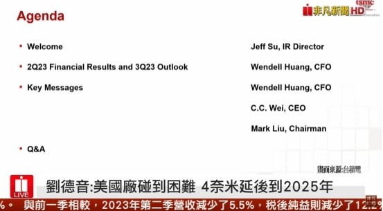

# 台积电：正按计划扩充南京28nm产能，美国厂遭遇困难延后

7月20日下午，观察者网在台积电二季度业绩说明会上了解到，台积电董事长刘德音透露，台积电美国厂遭遇困难，4nm制程已经延后到2025年量产，原计划是2024年量产。

与此同时，刘德音还表示，台积电正按计划在南京扩充28nm制程产能。他同时透露，台积电日本厂22/28nm进展顺利，将在2024年底量产。

 _台积电业绩说明会截图_

当前，全球半导体下行周期正持续影响台积电业绩。

财报显示，2023年二季度，台积电销售额4808亿元新台币（约合人民币1111亿元），同比下滑10.0%，环比下滑5.5%；净利润1818亿元新台币，同比下降23.3%，环比下降12.2%；毛利率54.1％，预估53.3％。

昨天（7月19日）光刻机巨头ASML披露的业绩显示，今年二季度出货到岛内的光刻系统，占全部出货量的比重环比下滑15个百分点。

市场调研机构TrendForce集邦咨询发布的数据显示，受终端需求持续疲弱以及淡季效应加乘影响，今年一季度全球前十大晶圆代工业者营收季度跌幅达18.6%，约273亿美元。

其中，台积电（TSMC）一季度营收167.4亿美元，环比减少16.2%，由于笔电、智能手机等主流应用需求疲弱，7/6nm及5/4nm产能利用率明显下跌，营收分别环比减少逾20%及17%。

不过，一季度台积电仍以60.1%的份额位居晶圆代工市场第一，第二名三星的份额只有台积电五分之一。

在此次业绩会上，台积电透露，2nm制程有望2025年实现量产，客户对2nm芯片的高性能计算和智能手机应用非常感兴趣。

然而，观察者网注意到，尽管台积电3nm制程已量产半年多，但在最新的二季报中并未体现收入，也未有客户下单消息。期内，台积电5nm晶圆出货量占晶圆总营收的30%，7nm及以上先进技术占53%。

竞争对手三星更是领先台积电量产3nm，但至今也未公布大客户下单信息。

 _台积电财报截图_

近期，韩国投资银行Hi Investment &
Securities曾发布报告称，目前台积电3nm处理器的良率为55%，而三星的已经达到了60%，超出台积电5个百分点。

有意思的是，7月19日，在被问及AMD是否可能会转单三星时，正在台湾岛内访问的AMD总裁苏姿丰反问岛内记者：“你相信韩国媒体吗？”

她表示，台积电是AMD的重要伙伴，以最新的MI300系列人工智能芯片为例，AMD是因为有台积电这么强的伙伴才能推出，该公司未来一定会继续仰赖台积电。

在此次业绩会上，台积电CEO魏哲家表示，该公司目前无法完全满足客户对人工智能的需求。

同样在7月20日，台积电（中国）有限公司总经理罗镇球在南京举办的2023世界半导体大会上表示，尽管行业存在短期波动，但半导体前景非常正面且值得期待，全球半导体市场仍呈现强劲成长，技术创新将会是推动半导体产业大幅成长的引擎。

他表示，台积电预计2030年全球半导体产值将趋于1万亿美元，其中会有40%为高算力产品贡献、30%为手机等移动计算组成、15%为电动车、10%为IoT，“这也是台积电在半导体工艺发展上的投入分配”。

根据此次业绩会上透露的信息，台积电预计2023年资本支出将为320亿至360亿美元区间低端，该公司资本密集度未来几年将下降。台积电表示，2023年的资本支出中，先进制程技术将占总额的70%至80%，成熟特殊技术占10%至20%，剩余部分分配给高级封装、测试以及其他项目。（编辑/吕栋）

