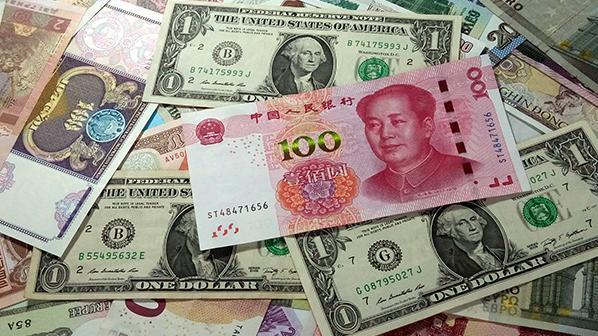

# 央行、外汇局出手！动用这一政策工具，离岸人民币一度拉升近500点

金融管理部门出手调节跨境融资宏观审慎调节参数，人民币对美元汇率在在岸和离岸市场双双应声大幅走高。

7月20日开盘前，中国人民银行和国家外汇管理局发布公告称，为进一步完善全口径跨境融资宏观审慎管理，继续增加企业和金融机构跨境资金来源，引导其优化资产负债结构，中国人民银行、国家外汇局决定将企业和金融机构的跨境融资宏观审慎调节参数从1.25上调至1.5，于2023年7月20日实施。

调节跨境融资宏观审慎调节参数，被视为可用于稳定汇率的政策工具之一。

上述政策发布后，人民币对美元汇率应声大幅走高。

其中，人民币对美元即期汇率7月20日开盘大幅走高，盘中升破7.18关口，较前一交易日7.2197的收盘价升值超过400点；更多反映国际投资者预期的离岸人民币对美元汇率在消息出炉后直线拉升，升幅一度接近500点，盘中逼近7.18关口。

央行上一次动用这一工具是在去年10月25日，当时人民币对美元即期汇率跌破7.30关口，两部门将企业和金融机构的跨境融资宏观审慎调节参数从1上调至1.25。

面对本轮人民币汇率贬值，金融管理部门表现“淡定”，在调节跨境融资宏观审慎调节参数前，一直未使用外汇政策工具。

央行副行长刘国强7月14日在国新办举行的2023年上半年金融统计数据新闻发布会上表示，近年来，在应对多轮外部冲击的过程中，人民银行积累了丰富的应对经验，也具有充足的政策工具储备。既不会没有定力，也不会太佛系。

他表示：“我们有信心、有条件、有能力应对各种冲击，维护外汇市场平稳运行。至于说具体的政策工具怎么样，我们会根据情况的需要合理使用，政策工具就是拿来用的，需要就用，不需要就不用，需要用哪一种就用哪一种，这要相机抉择。”

全口径跨境融资宏观审慎管理政策是为便利境内企业借用境外资金，降低实体经济融资成本而制定的一项融资便利化政策。企业可根据自身净资产情况借用境外资金，外币资金也可以兑换为人民币使用。根据相关政策规定，跨境融资风险加权余额上限=资本或净资产*跨境融资杠杆率*宏观审慎调节参数。上调企业和金融机构的跨境融资宏观审慎调节参数，可以提升企业和金融机构跨境融资风险加权余额上限，鼓励市场主体跨境融资。提高企业和金融机构的跨境融资宏观审慎调节参数在便利境内机构跨境融资的同时，也有助于境外资金流入，增加境内美元流动性，稳定市场预期，保持人民币汇率在合理均衡水平上的基本稳定。

