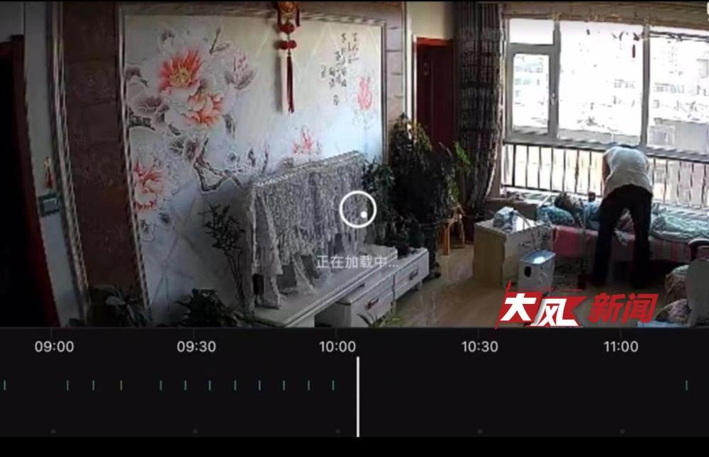
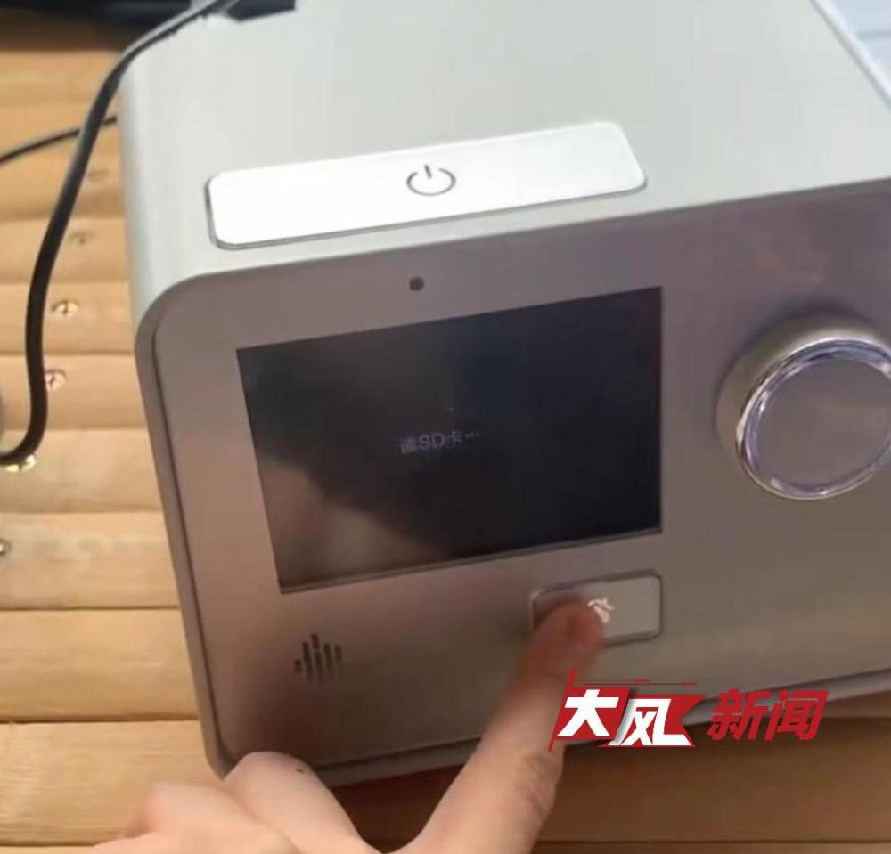

# 家中断电呼吸机无法用致病人去世，家属：曾向电力部门申请临电无果

家中突然断电，病人呼吸机等无法运作。家属向国家电网申请临时电源后，始终未得到回应，后病人因呼吸衰竭去世。家属侯女士认为，自己母亲的去世，国家电网应担责。对此，当地电力部门认为其未报备，且未提及发电机需求，索赔建议走司法程序。

**家属讲述：家中突然停电，3次通过物业联系国家电网，后申请紧急用电但迟迟无果**

侯女士是甘肃山丹人，她的母亲陈女士于2020年前后确诊为“运动神经元病”，属于渐冻症的一种。2022年9月开始，长期居家治疗，离不开呼吸机、制氧机、血氧仪、吸痰器等医疗设备。

_7月9日上午断电前，侯女士的父亲正在家照顾妻子陈女士_

今年7月9日上午10时04分，侯女士的父亲在家照顾妻子陈女士时，家中突然停电，“没有任何通知，我爸赶紧接上了备用电。”由于医疗设施的耗电量大，备用电源仅能维持20分钟至40分钟左右，“当时呼吸机还因为突然的停电导致故障，机器始终显示‘读SD卡’。”她的父亲于上午10时14分尝试拨打物业电话，但直到上午10时16分才拨通了电话。电话中，物业表示他们没有收到停电通知，联系国家电网后，对方称正在排查。

_呼吸机因为突然停电导致故障_

上午10时22分，侯女士的父亲再次联系物业，直到10时24分拨通了对方电话。物业称，他们从国家电网了解到，停电原因是某小区施工不小心挖断了电缆，供电恢复时间不确定。侯女士说，她父亲向物业反馈了其母亲的特殊用电需求，对方再次联系国家电网，“国家电网给了个电话，让申请临时供电。但我们上午10时27分联系后，对方表示尽快申请，之后便始终无人回应。”

**拨打急救：备用电源所剩无几，家属拨打120急救，救护车赶到现场10分钟，病人去世**

“供电所距离我们家只有1.5公里，如果及时处理，5至10分钟左右估计就可以送到临时电源。”侯女士说，上午10时33分，她母亲医疗设备的备用电所剩无几，她的父亲等不到临时电源，便拨打了“120急救电话”。上午10时50分左右，急救车抵达，由于他们家住在6楼，电梯因停电无法使用，因此也耽误了时间。上午10时55分，急救人员到场，急救没几分钟，便宣布她母亲死亡，“医生说，瞳孔已经散了，尝试抢救后看了看心电图，说人已经没了。”
上午11时18分，小区恢复了供电。

根据《死亡证明》显示，陈女士，死亡时间为“2023年7月9日11时1分”，死亡原因“呼吸衰竭”。

关于临时电源迟迟未到，侯女士说，此前曾发生过停电的情况，但联系国家电网，申请临时用电后，工作人员一直在和他们沟通“送临时电源”的问题，“这次国家电网始终都没有回复。”

**调解录音：电网工作人员希望死者家属说明索赔依据，曾称“我们没有这个义务，但人命关天的事，我们想办法调发电机去”**

侯女士说，7月17日，他们与国家电网、挖断电缆的施工队等单位进行了会面，信访部门也参与了调解。

根据调解录音显示，侯女士认为国家电网未提前告知，突然停电造成其母亲去世，要求对方赔偿。国家电网工作人员要求先分清楚双方的责任，然后让侯女士提出诉求，并表明其索赔的依据。

录音8分4秒，国家电网工作人员说，“你要赔偿如果符合国家标准，我们该支持都支持。”侯女士回复，“第一就是要给个说法，第二就是道歉，第三就是赔偿。我还没有专门请律师计算赔偿的费用，但一定要赔偿。”

8分49秒，侯女士说，7月9日上午10时停电后，她拨打电话申请临时用电，接电话的工作人员表示，需要向领导申请，申请后会回复，但直至她的家人去世，也没有回复。国家电网工作人员回复称，这属于不可抗力因素导致。

10分7秒，国家电网工作人员表示，7月9日上午10时，某小区有施工队在挖供暖管道时，挖断了电缆，该电缆属于小区自有资产……

17分11秒，一名国家电网工作人员说，当时没有找到故障点，因此无法确定维修时间，并询问了能坚持多久，实在坚持不住了想办法调一个发电机过去，“我当时也请示领到了……”“我们没有这个义务，但是你家的人命关天的事情，我们想办法调个发电机过去……我当时还提醒他，家里有这个情况，就存在不可抗力或者外力等因素……”

后续，双方还围绕“没能及时送临时电源”“突然停电致呼吸机SD卡损坏”等问题进行了沟通，但没能达成统一意见。

**要求担责：家属称小区曾多次停电，未提前通知、施工挖断电缆，申请紧急用电始终无回应，“国家电网应担全责”**

7月18日下午，华商报大风新闻记者联系到侯女士。她说，他们小区于今年上半年，已停电至少5次，遭遇停电后，他们曾将家中特殊用电需求向物业等反映过，前几次的停电时间往往不会超过40分钟，因此没有出过问题。

既然停电后已发现呼吸机无法正常运行，为什么不第一时间联系医院，而是要求国家电网提供临时电源？侯女士说，他们当地医院没有呼吸机，此前他们在当地医院住院，是使用自己家的呼吸机治疗的。另外，突然停电只是导致呼吸机SD卡无法正常读取，只要有临时电源，他们取出SD卡，呼吸机就可以正常运行。

为什么认为国家电网应承担全责？侯女士说，事发后，他们联系了国家电网，对方承诺会向领导申请临时电源，然后进行回复，但结果是没有回复；另外，她认为国家电网没有提前通知停电，停电次数、时间也超过了国家的要求，“我认为国家电网应担全责。”

根据侯女士及其家属提供的聊天记录显示，4月21日晚8时许，她的父亲曾在业主群询问，“啥时来电呀，家里病人用呼吸机。”

另外，侯女士还称，小区物业负责人周某为此事写的《证明》显示，2023年7月9日10时到11时停电中未接到电力部门通知……停电后第一时间联系电力部门，对方表示不知道停电，检明原因后回复。第二次于10时20分，对方称系某小区施工中损坏电缆造成停电，恢复供电时间不确定。第三次通话10时25分，说明有人使用呼吸机需用电，对方提供了某电话号码，让联系公司，申请发电机临时供电，后至11时18分恢复供电。

**国家电网回应：“我们可以协助提供发电机，但不是强制性的要求”，病人家属未报备，致电时也没有提及需要临时电源，若索赔建议走司法程序**

7月19日，华商报大风新闻记者联系到山丹县某供电所。工作人员说，这件事山丹县信访部门已介入，单位领导也在处理当中，“具体情况我们也不是很清楚。”侯女士家所在小区属于转供小区，其家属既没有给物业报备此事，也没有给他们报备此事。

华商报大风新闻记者询问，侯女士称曾通过物业3次联系电力部门，后还致电电力部门申请临时电源，并出具了通话记录。对此，工作人员说，侯女士家属在给他们致电时，没有提及需要使用临时电源的情况。

关于调配临时电源问题。工作人员说，在突发临时停电后，如果用户有特殊用电需求，他们可以提供发电机（临时电源），这是协助用户解决用电需求，并非强制性的要求，“主要是侯女士及其家属既没有给物业报备，也没有给我们单位报备。打电话时也仅询问了来电时间，没有提需要发电机的事。”

关于侯女士的索赔，工作人员表示，政府信访部门在协调处理，但他们希望侯女士走司法程序处理此事。

**律师说法：若供电企业在突发停电后及时抢修，已尽到了供电义务，不构成侵权；若施工企业有违法操作等过错情形，与病人的死亡有间接因果关系，病人家属可要求其赔偿**

北京德恒（西咸新区）律师事务所合伙人李耀华律师说，我国《民法典》规定了供电企业中断供电的通知义务以及抢修义务，供电人因供电设施计划检修、临时检修、依法限电或者用电人违法用电等原因，需要中断供电时，应当按照国家有关规定事先通知用电人；未事先通知用电人中断供电，造成用电人损失的，应当承担赔偿责任；因自然灾害等原因断电，供电人应当按照国家有关规定及时抢修；未及时抢修，造成用电人损失的，应当承担赔偿责任。供电企业通知义务的前提是其已知晓未来可能停电，对临时施工挖断线缆、天气原因等导致的突发停电，供电企业只能在突发停电后告知用户，并及时抢修。

本次事件中，如果供电企业在突发停电后及时抢修，已尽到了供电义务，病人因呼吸机无法使用死亡与供电企业遭到的突发停电等没有直接的因果关系，不构成侵权。当然，如查明施工企业有违法操作等过错情形，与病人的死亡有间接因果关系，病人家属可要求其赔偿。

**华商报大风新闻记者 佘晖 编辑 董琳**

