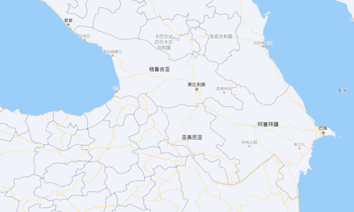

# 明明是亚洲国家，为啥它们不参加杭州亚运会？浙江当地媒体释疑

潮新闻客户端 记者 伊志刚

“有6个亚洲国家宣布不参加杭州亚运会。”——这些天，在网上经常可以看到这样耸人听闻的说法。实际上，完全是对亚洲地理和体育知识的一知半解。

让我们先来厘清一个概念，亚运会是亚洲大家庭四年一度的体育盛会，但亚运会的参与者并不是指地理概念上的亚洲国家，而首先得是亚洲奥林匹克理事会（亚奥理事会）的成员。

那么有哪些亚洲国家不属于亚奥理事会成员？为什么它们不是？本文为大家释疑。

亚奥理事会是亚运会的组织机构，也是代表亚洲与国际奥委会联系的全权代表。到目前为止，亚奥理事会旗下一共有45个成员，分属东亚区、南亚区、东南亚区、中亚区和西亚区，即亚洲42国加上中国的3个地区（中国台北、中国香港、中国澳门）。亚洲有6个国家，至今不是亚奥理事会成员，所以不参加亚运会。

这6个国家分别是：土耳其、以色列、亚美尼亚、阿塞拜疆、格鲁吉亚以及塞浦路斯。从地理版图上讲，它们算亚洲，但不属于五大区块，从历史文化及经济等各种原因综合看，它们多数都更自我认同是欧洲国家。通俗地说，它们不归属于亚洲体坛。非但不参加亚运会，连亚洲单项体育组织的所有赛事都一概不加入。

_外高加索三国_

先说亚美尼亚、阿塞拜疆、格鲁吉亚。自然地理把乌拉尔山、乌拉尔河与大高加索山作为亚欧大陆的分界线。高加索山以南为亚，以北归欧。从地理上讲，这外高加索三国，领土绝大部分地处亚洲，但它们从来不认为自己是亚洲国家。

1991年前苏联解体后，这三个加盟共和国即宣布独立。从独立那天起就以欧洲国家自居，从政治到经济全盘加入欧洲体系，体育当然也不例外。1992年和1994年，三国相继加入欧足联。尽管在全球足球水平最高的欧洲经常被虐得头破血流，鲜有出头之日，但这哥仨“宁为牛后，不做鸡头”，坚决放弃舒适区，不愿混迹竞争力弱得多的亚洲足球圈，也算是有些风骨。

外高加索三国的体育其实颇有特点，既擅长举摔柔等竞技格斗类项目，又在智力类项目中人才辈出。前国际象棋世界棋王卡斯帕罗夫就是阿塞拜疆人。阿塞拜疆还在体操和艺术体操领域延续了苏联时代的光荣传承，国际大赛屡有惊艳演出。格鲁吉亚则盛产大力士，世界大力士锦标赛总能看到格鲁吉亚壮汉的身影。东京奥运会男子109公斤以上级的金牌，就是被格鲁吉亚人塔拉哈泽以统治级表现掠走。对了，前AC米兰巨星卡拉泽在退役后从政当上了格鲁吉亚副总理，而亚美尼亚的现役球星姆希塔良，熟知五大联赛的球迷都知道，曾经在多家顶级俱乐部效力，很多人通过他，才了解亚美尼亚，算得上是一张国家名片。

_伊斯坦布尔_

再来看土耳其。号称横跨亚欧大陆，实际只有3%的国土位于欧洲的巴尔干半岛，其他包括首都安卡拉在内的97%疆土都位于小亚细亚半岛。然而土耳其的历史主要发生在欧洲，这3%在欧洲的土地之上伫立着曾经是欧洲最大的城市君士坦丁堡（现伊斯坦布尔），承载着土耳其人对奥斯曼帝国骄傲的记忆。土耳其是个不折不扣身在亚洲心系欧洲的国家，但从1987年申请加入欧盟，到今天仍未跨入欧盟成员行列。

塞浦路斯是个人口120万的小国，面积不到一万平方公里，跟淳安、临安、建德这三个杭州面积最大的区县加起来差不多大。从地理位置上看，它靠近地中海东岸的小亚细亚地区，也算亚洲国家，但同样坚决不承认“地理出身论”。与土耳其不一样，塞浦路斯早在20年前就加入了欧盟区，去年人均GDP达到2.6万欧元，早已进入发达国家行列。因为国土面积太小，所以只有公路没铁路，但是多海滩，欧洲人把这里当做度假的天堂。

上述5个国家的共同点是，骨子里就认定自己的血统在欧洲，可能只有以色列，内心不排斥自己是亚洲国家。以色列从1948年建国以来，曾经积极参加过5届亚运会。但从1974年德黑兰亚运会之后，因为众所周知的原因，以色列被孤立，继而缺席了此后的所有亚洲体育赛事。以色列足球并不算太弱，但大家可能不知道，从1978年到1990年的四届世界杯，以色列队一直处在漂泊模式，分别以东亚外卡队、欧洲队、大洋洲队的不同身份参加预选赛，长期“临时户口”，相当悲催。直到现在，它依然被排除在亚洲体育赛事体系之外。

如果了解这6个国家的基本概况，所谓“宣布不参加杭州亚运会”的说法就不攻自破了。6个国家有5个从来没参加过亚洲比赛，也没资格参加，何来宣布一说，这不是对着砚台梳头——没影儿的事吗？

_澳大利亚参加女篮亚洲杯_

至于此前传闻的澳大利亚和新西兰拒绝亚运会之说，实际情况是，杭州亚运会原定2022年9月开，两国受邀参加部分项目，但因赛期与另一大赛事英联邦运动会冲突——在英国伯明翰进行的2022英联邦运动会定在8月。作为最重要的英联邦成员之一，澳新两国不可能在短期内参加两项重大赛事。所以它们去年就推掉了亚运会。

有人纳闷为什么不在亚洲的国家会被亚奥理事会邀请参加亚运会，地处亚洲的国家又不在亚洲体育大家庭之列。实际上，国际体育的版图早就不被地理概念所局限了。去年的卡塔尔世界杯，东道主却参与了欧洲区预选赛，不计分，让葡萄牙、塞尔维亚等强队一路陪练。再早的美洲杯足球赛，日本队和卡塔尔队也分别受邀原汁原味的南美足球派对。

澳大利亚与新西兰在三大球领域早就加入了亚洲阵营。这一系列操作的背后，也许各有原因，但也并非难以理解。体育作为社会生活中的重要一部分，又是全球的共同语言，在吸引关注度、促进国家交流与合作、拉动地区经济等方面有时候会产生奇效。所以，打破地域限制和思维定式，并不是什么大不了的事。

然而，体育又无法做到完全脱离政治，各种历史矛盾与纠葛贯穿着奥运会和亚运会的发展进程，从这个意义上讲，不管传闻中的谁参加或缺席杭州亚运会，都不足为奇，都将只是体育历史的一部分。

“转载请注明出处”

