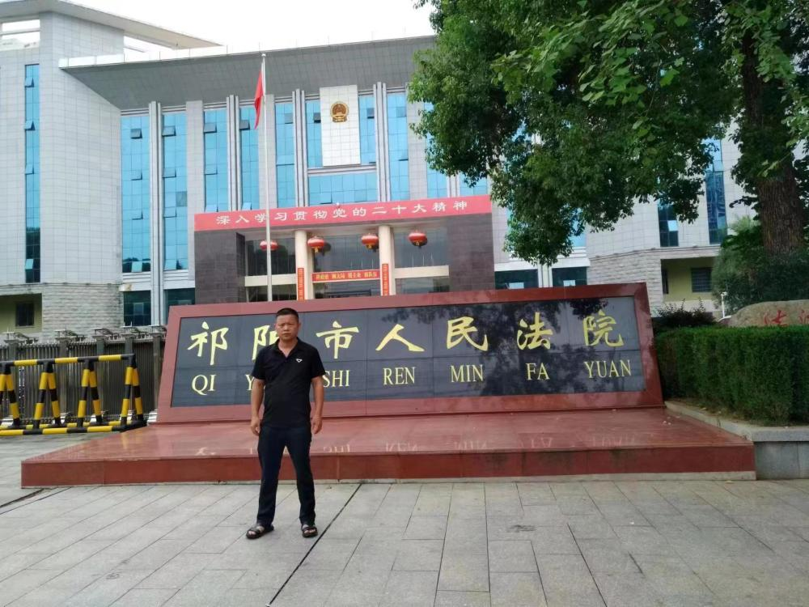
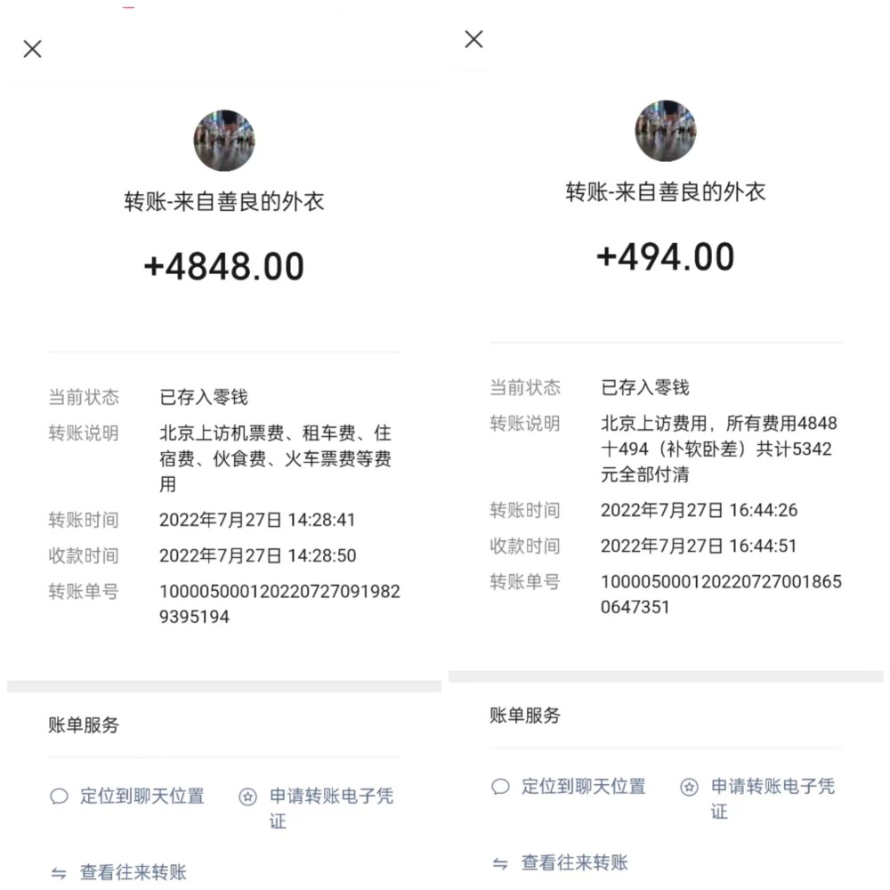
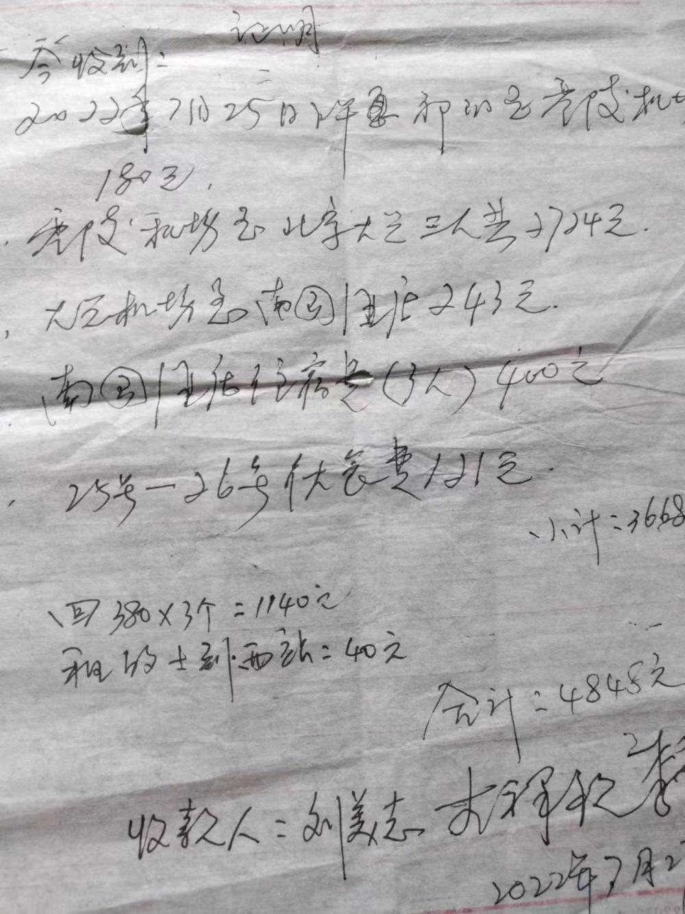
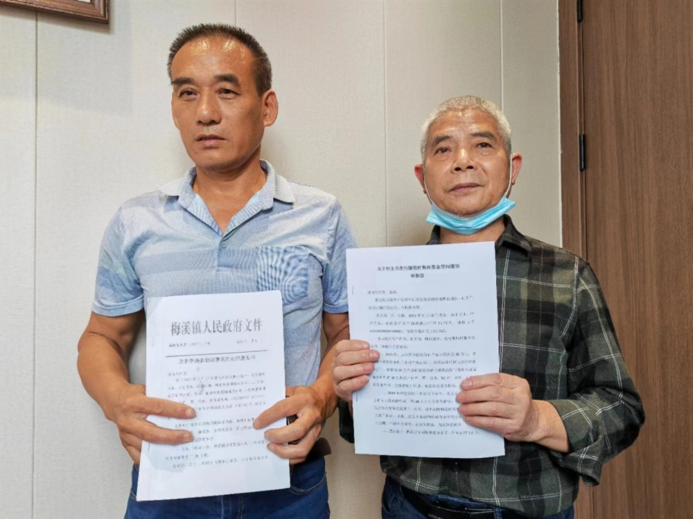
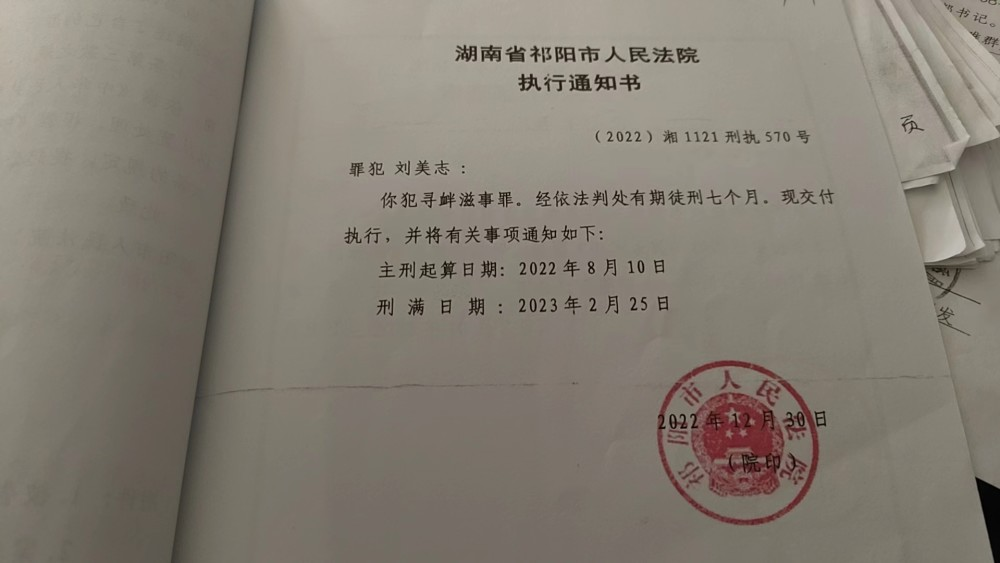

# 村民上访被劝返时收了镇干部五千多元车旅费被判寻衅滋事，出狱后申诉

湖南永州祁阳市农民刘美志上访被劝返时收取镇干部五千多元路费，被判寻衅滋事罪，判处有期徒刑七个月。

出狱后，刘美志于7月18日向祁阳市法院递交申诉材料，申请再审。

 _刘美志在祁阳市法院申诉。本文图片均
受访者 供图_

判决书显示，刘美志和村民多次反映本村村干部违纪违规，纪检机关查实该村干部存在部分问题并予以党内警告处分，刘美志等人因对该处理结果不满而进京上访。

小学文化的刘美志在一审判决后没有上诉。2023年7月18日，他向祁阳市法院递交了申诉材料。

**收取镇干部转账的车旅费，返回后直接被送公安局**

刘美志案的判决书仅3页，由独任审判员适用简易程序进行审理。祁阳市法院审理查明，被告人刘美志等人多次反映祁阳市梅溪镇大伍村党支部书记李占刚违纪违法问题，2020年12月30日梅溪镇政府对李占刚问题作出答复，刘美志等人对答复不服。2020年12月31日，祁阳市纪委对李占刚给予党内警告处分。2022年7月24日，村民李长庆、李长祝等人商量到北京上访。

刘美志介绍，他生于1977年，曾在北京打过工，李长庆、李长祝分别83岁和70岁，所以此次他就和两位老人一起去上访。

法院查明，7月24日，三人商议次日从祁阳坐车到零陵机场，乘坐飞机到北京。2022年7月26日，三人来到国家信访局信访，后又到中纪委反映问题，因中纪委已下班未果。当晚，祁阳市梅溪镇政府工作人员邓振华、付建设来到北京对刘美志三人进行劝返。

“劝返过程中，被告人刘美志向邓振华、付建设索要其三人往返路费和开支，否则待在北京信访不回去。邓振华被迫答应刘美志的要求，用手机微信向刘美志转账5342元，刘美志收款后便与邓振华等人返回祁阳。”判决书写道。

 _刘美志收到的镇政府工作人转账 。_

刘美志对澎湃新闻记者称，他当时没有威胁，也没有强行索要财物，“是镇政府人的纠缠要求我们不要再去中纪委，要跟他们回去，我们提出，一要处理好村支书的事，二要报销三人往返车旅费。他们打电话请示后，答应了，路费是他们主动给的。中间没有争吵，没有吼闹，更没有威胁。”

三人就此次上访花费写了个明细“证明”。“邓振华说不能写‘证明’，要写‘今领到’，后他拿笔添上‘今领到’三个大字。”李长祝说。

7月20日，澎湃新闻采访了梅溪镇政府工作人员邓振华，对于刘美志是如何强行索要财物一事，他回应称，“他要我们报销来回车费才肯回来。”

澎湃新闻从刘美志手机看到，转账一共分两笔，一笔是2022年7月27日14点28分转的4848元，转账说明为：“北京上访机票费、租车费、住宿费、伙食费、火车票费等费用”；另一笔是随后的16点44分转的，转账说明为：“北京上访费用，所有费用4848+494（补软卧差）共计5342元全部付清。”

 _村民出具的上访费用“证明”。_

随后，邓振华、付建设与刘美志等三人一起赶往火车站，搭上了回去的列车。

7月28日回到衡阳后，三人没有回家，被一辆车送到了祁阳市公安局。李长祝称，警察查询了他们的手机、拿走了举报材料，直到29日下午才允许他和李长庆回家，而45岁的刘美志被拘留了。刘美志称，从北京回来后，他就一直没出来，直到今年2月25日他刑满释放。

_大伍村村民李名扬和李长祝仍在继续信访。_

祁阳市法院判决书显示，2022年7月29日，祁阳市公安局对刘美志行政拘留十五日。2022年8月10日，刘美志被祁阳市公安局刑事拘留。祁阳市检察院8月24日批捕了刘美志，随后对其提起公诉。

公诉机关认为，刘美志采取威胁手段，强行索要他人财物，情节严重，应当以寻衅滋事罪追究其刑事责任，刘美志有坦白情节，可以从轻处罚，其自愿认罪认罚，可以依法从宽处理，建议判处其有期徒刑七个月。2022年10月21日，祁阳市法院认定公诉机关指控成立，判如所请。

**当事人被判刑后未上诉，出狱后提出申诉**

一审判决后，刘美志没有上诉。他只有小学文化，上有两个老人，下有两个孩子，较小的孩子还在读小学。“这一耽误就是大半年，我要赶紧去赚钱养家。”刘美志说。出狱后，他就赶紧去广东制衣厂打工。

国家信访局12303信访投诉受理查询服务热线给刘美志手机发来的信息显示，2022年7月26日，国家信访局将其信访事项登记转交。查询链接内容显示，经过国家、省市县多级转交，2022年7月28日，祁阳市梅溪镇政府开始办理刘美志的举报，9月26日该镇办理完毕，并上传了《关于刘美志事项的处理意见书》的内容。该内容显示，梅溪镇针对大伍村村支书李占刚贪污受贿、打击报复举报人等问题进行了调查，查证刘美志反映的部分问题属实。

梅溪镇上传的一份2021年1月4日镇纪委《关于给予李占刚党内警告处分的决定》文件显示，“李占刚身为村党支部书记，将应直接发放给困难群众的临时救助分配给他人，在村里产业建设、基础设施和公益设施建设时占用基本农田，其行为违反了党的工作纪律和法律法规。”镇纪委给予李占刚党内警告处分。

2023年6月16日，大伍村村支书李占刚接受澎湃新闻采访称，他当村干部二十多年，任村支书15年，村子里有十多个人对他不满，一直在上访。

刘美志说，2022年9月26日，他在看守所签收了梅溪镇政府工作人员送来的“信访事项公文送达回证”。镇政府在国家信访办上传的答复和处理内容，和此前答复过他们的并无二致，他们正是对此不满才进京上访的。

刘美志被判刑后，仍有村民继续信访。2023年7月18日，刘美志和李长祝向祁阳市法院递交了申诉材料。

**要求报销上访车旅费能否构成“强拿硬要”？**

湖南省刑法学研究会原副会长贺小电分析，寻衅滋事罪是在1997年修订刑法时因流氓罪是“口袋罪”而拆分出来的。最高人民法院院长张军2016年主编的《刑法（分则）及配套规定新释新解》（下称《新释新解》）中指出，“其动机是通过寻衅滋事活动，追求精神刺激，填补精神上的空虚”。主观上，刘美志是上访反映村支书问题，并不具有这样的动机。客观上，根据《信访工作条例》第36条，刘美志等人不应进京向国家信访局反映本村村支书的问题，其应该向衡阳市纪委请求复核。但其越级信访，并不会产生违法犯罪后果。事实上，国家信访局出于对人民负责的态度还接待了他们。

澎湃新闻注意到，刘美志被定寻衅滋事的理由是“采取威胁手段，强行索要他人财物”。

_从上访户到罪犯，刘美志的刑事执行通知书。_

贺小电认为，在劝返过程中，镇政府工作人员按刘美志等人要求支付5342元路费，如果是双方自愿协商一致的结果，不属于寻衅滋事罪“强拿硬要”的情形。

“何谓‘强拿硬要’，目前法律和司法解释并没有明确规定，属于法官自由裁量的范畴，但对此的理解应当从常情常理以及刑法基本原则和精神出发。”贺小电认为，构成“强拿硬要”至少要符合五个条件：一、强拿硬要者因为力量、地位等原因处于强势地位，可以迫使被索要者就范。“本案中刘美志显然不具有这种强势地位，而镇政府工作人员邓振华、付建设代表的镇政府，也不可能受两三个村民‘威胁’。”

二、强拿硬要者要采取流氓式的惹是生非、借小生大的手段。《新释新解》明确指出，此罪中的强拿硬要，“是指以蛮不讲理的流氓手段，强行索要市场、商店的商品以及他人的财物”。“刘美志等人只提出支付实际开支的要求，他并没有多要开支以外的钱。”

三、从受害人角度，其受到“强拿硬要”的情形，要达到常人看来的“因恐惧等无法反抗、不敢反抗、不能反抗”的程度。显然本案中两名镇政府工作人员没有达到这种程度。

四、从反抗的后果来看，寻衅滋事行为中，如果被害人反抗，可能会随之发生更大的危害社会后果的行为。而在本案中，邓、付如果不愿给上访路费，其结果仅仅是刘美志等人向国家有关机关继续反映情况，而不会造成任何危害社会的后果。

五、寻衅滋事行为指向的对象是不特定的第三人，要求对社会秩序造成破坏。一般针对的是不特定的多人，其行为带有随意性。而本案中，刘美志的信访行为，并不属于《信访工作条例》第26条规定的关于“在信访接待场所滞留、滋事，或者将生活不能自理的人弃留在信访接待场所”“煽动、串联、胁迫、以财物诱使、幕后操纵他人信访，或者以信访为名借机敛财”等扰乱公共秩序的行为。邓振华、付建设所在的镇政府机关没有因为刘美志的行为造成工作秩序严重破坏、无法办公等。

湖南纲维律师事务所律师贺律川也认为，当事人上访受到劝阻后要求支付往返费用，便将其列入寻衅滋事罪，违反了刑法谦抑性原则。

