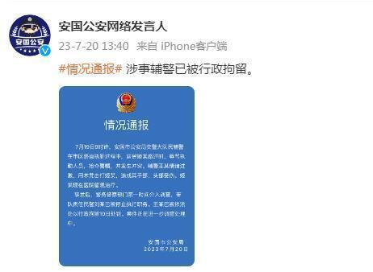

# 河北一交警持木凳砸老人背部 警方通报：辅警被行拘，民警被停止职务

来源：安国公安网络发言人

情况通报

7月19日9时许，安国市公安局交警大队民辅警在市区路面执勤过程中，居民姬某路过时，辱骂执勤人员，抢夺警帽，并发生冲突。辅警王某情绪过激，用木凳击打姬某，造成其手部、头部受伤。姬某现在医院留观治疗。

事发后，警务督察部门第一时间介入调查，带队责任民警刘某已被停止执行职务。王某已被依法处以行政拘留10日处罚。案件正在进一步调查处理中。

安国市公安局

2023年7月20日

