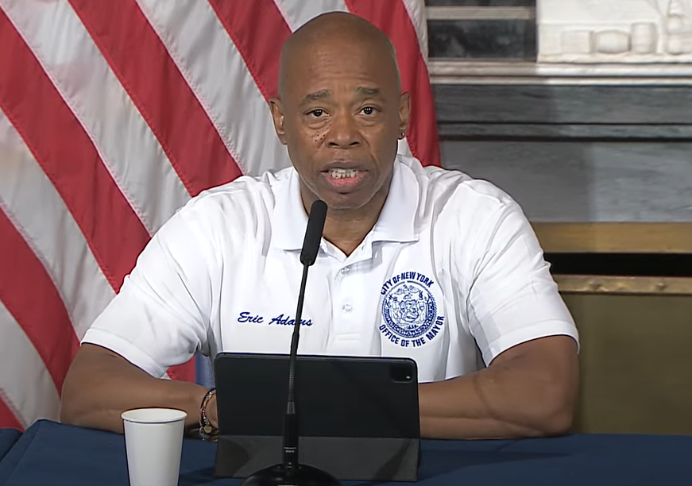
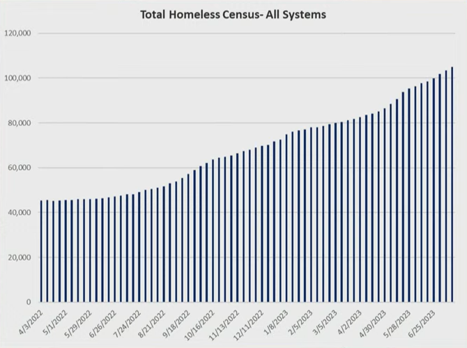
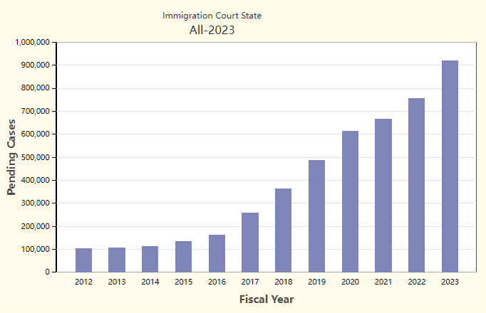

# 纽约将向难民发传单：别来了，去美国其他城市

【文/观察者网 李泽西】

据路透社报道，当地时间7月19日，美国纽约市长、民主党人艾瑞克·亚当斯（Eric
Adams）召开新闻发布会，表示“我们已经容不下更多难民了”，透露了纽约市将开始采取的新应对措施，包括在美墨边境发传单宣传“无地可容”，恳求难民不要来纽约。

 _亚当斯19日新闻发布会视频截图_

根据纽约市数据，纽约市已有约9万名难民，其中54800人被政府安置在无家可归者收容所，占收容所超过一半的人口，剩余3万多名难民要么是自行安排了住所，要么实际上是露宿街头。

_纽约市无家可归者收容所总安置人数（图源：纽约市政府）_

亚当斯讲述了难民在美国的血泪故事，表示“再这么下去，这些难民的美国梦将变为美国噩梦”。他还表示，纽约市每天仍有约400名难民涌入，“已经容不下更多难民了”。

_纽约市安置的难民人数（图源：纽约市政府）_

根据纽约市19日发布的新政策，所有收容所内的成年难民都需要在60天内自行找到新的住所，如果找不到新的住所，需在60天结束后重新申请入住收容所的资格，而非“一直待下去”。

此外，纽约市还将在美墨边境地区组织发放传单。传单用西班牙语和英语双语表示，纽约市无法保证为所有前来的难民提供安置服务，而纽约市的房价与物价也很贵，希望难民考虑暂居其他城市。

 _英语版传单（图源：纽约市政府）_

虽然纽约市位处美国东北，距离美墨边境约3000公里，但是因难民在等待庇护申请审理期间自发迁移，加上美墨边境州故意往外输送难民，导致大量难民出现在纽约。亚当斯也指责了这些州的相关做法。

2022年4月1日，拜登宣布将在2022年5月23日终止前总统特朗普在2020年3月开始实施的“第42条”疫情防控政策中的移民款项，这条要求美国政府立刻遣返在边境发现的大部分可能携带病毒的移民。该政策被美国左翼和人权组织批评为与疫情防控实际上无关，只是给“仇视移民”找了个冠冕堂皇的借口。不过，共和党人士不这么认为，他们担心撤销相关政策将加剧已经十分严峻的移民问题，多州随即宣布向支持民主党的地区输送移民。虽然拜登当时没有终止“第42条”，但是边境州输送移民的计划仍然继续进行。

实际上，更令亚当斯不满的，是同为民主党人拜登所领导的美国政府。在新闻发布会上，亚当斯感谢纽约州政府的帮助与支持，但是责怪联邦政府处理难民问题的举措不当，并认为联邦政府也没有提供足够的支持，还呼吁联邦政府宣布边境处于“紧急状态”。他表示，当前局势“不可持续”，“纽约正在独自承担国家的问题”。

根据雪城大学的事务记录访问信息中心（TRAC）数据，截至今年6月，美国约有92万难民在等待移民法院裁决，决定将相关人员驱逐出境还是允许暂留。目前，案件平均审理等待时长超过4年，不过纽约州审理时长约3年。

_美国共有92万难民在等待移民法院裁决（图源：雪城大学TRAC）_

他立场的转变也引来了共和党人士的嘲讽，尤其是因为呼吁宣布边境处于“紧急状态”、指责联邦政府不作为、抱怨自己所处的地区一直在“独自承担国家的问题”等都是共和党人士的一贯立场。

亚当斯2021年当选之初表示将欢迎移民，称纽约“永远欢迎”新来的人，并将纽约形容为“移民之城”，但是在2022年间，随着难民人数增加，这一立场出现了显著的反转。2022年10月，亚当斯因非法移民问题宣布“紧急状态”，自己也开始往纽约州其他地区输送非法移民。2023年1月，他表示“纽约不能容纳更多（移民）了”，“我们做不到。”他当时透露，为了给涌入纽约的非法移民提供服务，该市公共开支增加了多达20亿美元，大大高于此前的估计。

前总统特朗普在众议院的坚定盟友、司法委员会和委员会主席吉姆·乔丹（Jim
Jordan）在当时就曾嘲讽亚当斯的立场转变，指出亚当斯在当选市长前的2021年1月曾呼吁停止修筑美媒边境墙，但到了2023年1月却称纽约已无力安置新的非法移民。

 _乔丹推特截图_

民主党人士对此事基本保持低调。不过，亚当斯在7月19日的新闻发布会上称，他采取的新立场得到了纽约市和纽约州议员代表的广泛支持。这些议员大多为民主党人士。

总部位于纽约市的“法律援助协会”和“无家可归者联盟”当日发布联合声明，谴责纽约市要求难民“60天内自行找到新的住所”的新政策，认为这有违纽约保护无家可归者的法律义务，应拓展收容所规模，并且提供补助金帮助难民找到新的住所，表示正在研究政策细则，考虑下一步采取什么样的举措。不过，他们同意亚当斯关于“联邦政府应该提供资金等方面支持”的说法。

亚当斯表示，如果危机持续，纽约将考虑“一切选择”。

**本文系观察者网独家稿件，未经授权，不得转载。**

