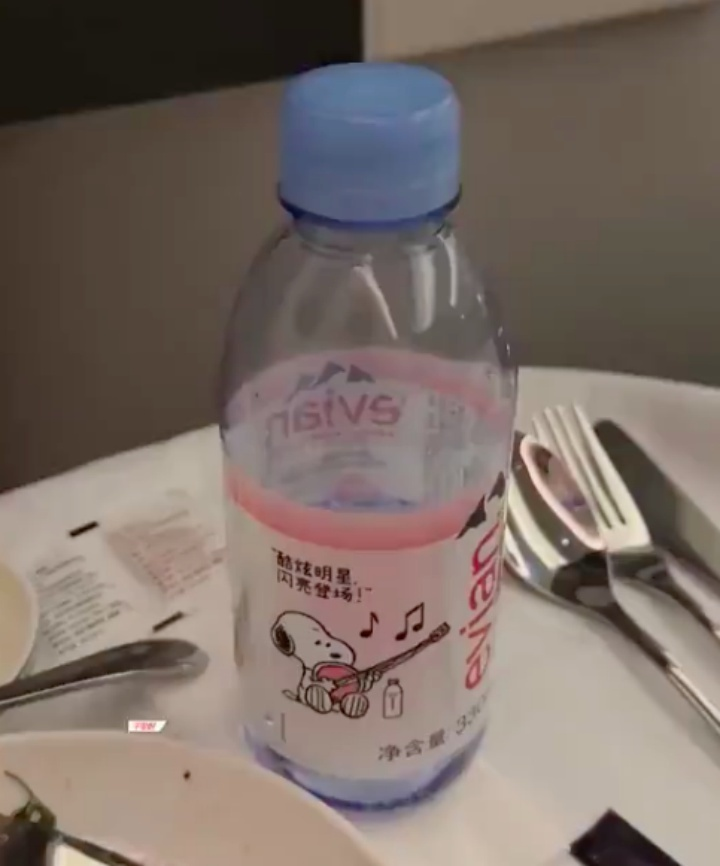
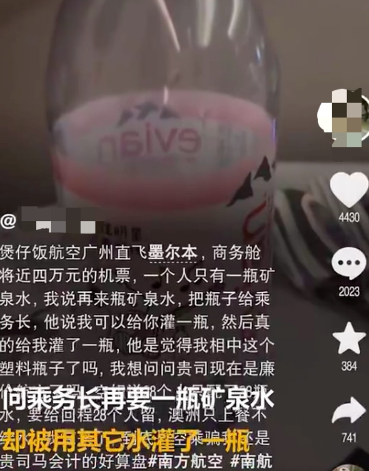
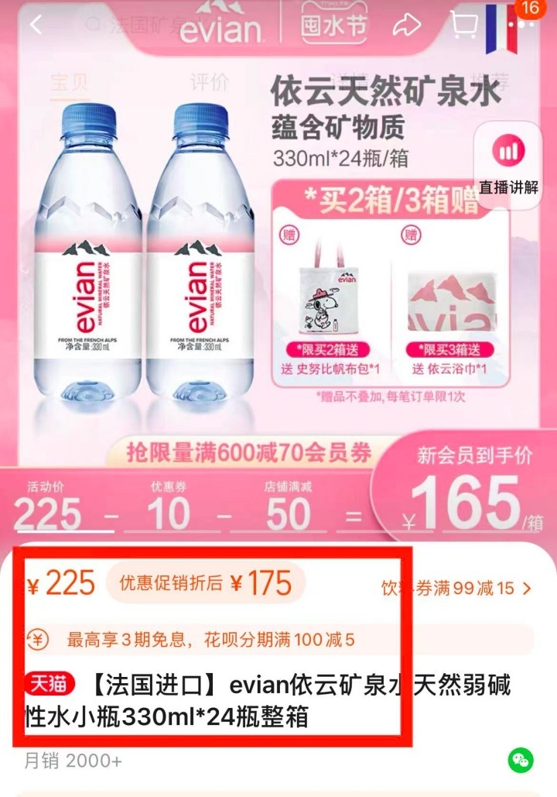

# 网友称机票近4万元只有1瓶依云矿泉水，南方航空：以机上的安排为准

据九派新闻视频援引“搜狐千里眼”报道，7月18日，有网友发视频称买的南方航空广州直飞墨尔本的商务舱，机票价格将近4万元，一个人却只有一瓶矿泉水，问乘务长再要一瓶矿泉水却被用其它水灌了一瓶。

当事网友在社交平台上表示，“乘务长真的拿这个瓶子给我灌了别的水，你是觉得我是相中这个塑料瓶子了吗？我想问问现在是变廉价航空了吗？空姐解释称28个人只配了28瓶水，要给回程28个人留，澳洲只上餐不给水。”

20日，南方航空公司客服称，具体餐食数量以机上安排为准，没有具体的规定，如有额外需求可告诉工作人员，若对机上服务有意见，可提供机票信息帮忙登记反馈。

对此，有网友表示能够理解航空公司，“视频里是依云水，可以理解，其他的水有就行。”

也有网友认为，4万块钱的机票都花了，只给商务舱一人一瓶依云，也太小气了。

另据依云在某购物平台的旗舰店显示，330毫升的依云矿泉水，售价是225元一箱，为24瓶，优惠价是175元，算下来一瓶大约7.3元。

**【来源：综合九派新闻视频、搜狐千里眼、购物平台】**

