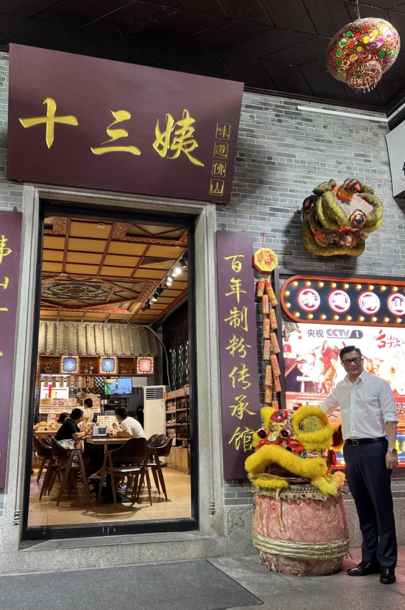

# 邓炳强游佛山飞鸿街品尝无影脚盲公丸，称当地旅游配套有特色

【环球网报道】据香港点新闻报道，香港特区政府保安局局长邓炳强19日率团展开一连两天的粤港澳大湾区访问行程，到访肇庆、佛山及中山。邓炳强19日晚在社交媒体上发文表示，当天来到第二站佛山，晚上完成公务后和团队去有名的飞鸿街，见到十三姨小食店，尝到获奖无数的无影脚盲公丸，之后在附近公园坐下聊第二天工作行程。

_邓炳强等人到访飞鸿街 图自邓炳强脸书_

邓炳强称，好久没来佛山，飞鸿街晚上好热闹，好想带家人来逛逛，这里的旅游配套发展得相当好，很有特色，“大家有兴趣不妨到此一游”。

_邓炳强等人游佛山飞鸿街，品尝无影脚盲公丸 图自邓炳强脸书_

_邓炳强到十三姨小食店品尝美食 图自邓炳强脸书_

香港星岛网报道称，邓炳强19日早乘高铁前往肇庆，先拜访当地公安局、应急局及消防救援队，双方详细讨论打击罪案及应急救援合作方案。

