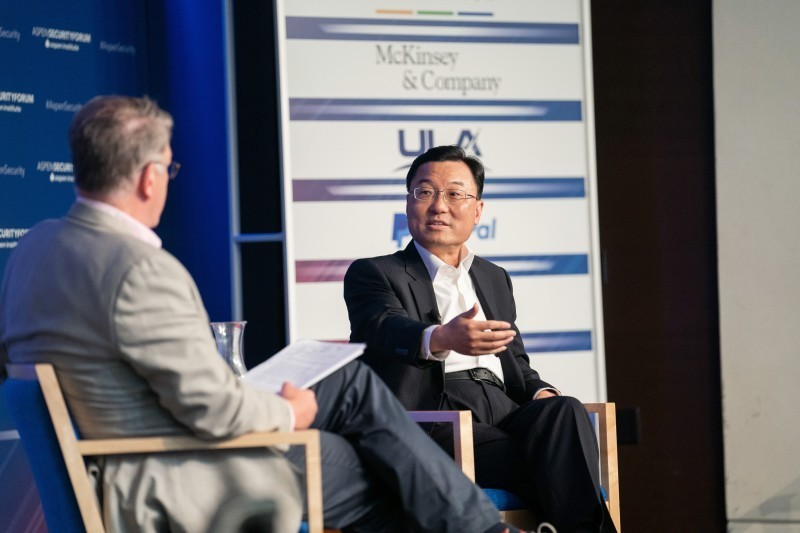

# 驻美大使谢锋：希望美方与中方相向而行，缩短负面清单，拉长正面清单

据中国驻美国大使馆网站消息，7月19日，中国驻美国大使谢锋应邀出席阿斯彭安全论坛，与旗语新闻社创始编辑克莱门斯举行专场炉边谈话。期间，谢大使重点就中美关系、中国发展意图、台湾问题、美对华科技打压等深入阐述中方政策立场。

关于中美关系，谢锋表示，当前中美关系面临严重困难和严峻挑战。近期，美国内围绕对华政策进行了一些反思，中美开展了一系列高层交往，进行了坦诚、深入、建设性沟通，特别是双方同意落实两国元首巴厘岛会晤共识，这为两国关系止跌企稳提供了契机，但基础仍然脆弱，前路依然坎坷。契机来之不易，值得珍惜更需要巩固。习近平主席提出的相互尊重、和平共处、合作共赢三原则，是新时期中美正确相处的治本之道。希望美方与中方相向而行，争取中美关系稳下来、好起来。一是缩短负面清单，用行动排除障碍、管控分歧，按照中美三个联合公报的原则妥善处理台湾等重要敏感问题，停止制裁中国实体和个人，防止“黑天鹅”“灰犀牛”事件对中美关系造成新的干扰和冲击。美方应以行动落实拜登总统不寻求改变中国体制、不支持“台独”、无意同中国脱钩、无意阻挠中国经济发展等表态。二是拉长正面清单，用诚意加强对话、拓展合作，从一点一滴做起，为中美关系发展增添正能量。包括增加客运航班，调整赴华旅行提醒，续签《中美科技合作协定》，恢复“相互教育和文化交流法”项下国会议员和助手访华项目，举办中美旅游高层对话会，在入境、签证等方面为对方国家学生、学者、游客、企业家等各界人士互访提供便利。中美曾建立100多对各类对话交流机制，但自2018年起被美方冻结，两国人民等待的时间太久了。如果全部恢复有困难，先重启50对呢？30对呢？三是要把支持中美关系的人找出来、请出来，大家一起发声出力，推动中美关系逐步回归正轨。

谢锋说，所谓“政治正确”弥漫美国社会的方方面面。抵美履新一个多月以来，我同各界人士广泛接触，深感支持发展中美关系的大有人在，但因为“寒蝉效应”他们有顾虑、有压力。在“反华大合唱”背景下，他们不敢公开发声、不敢发表不同意见。美国网友在推特上给我留言说，支持美中关系的人还在，但都躲起来了，需要大使一个个把他们找出来。一个健康稳定的中美关系符合两国共同利益，也是国际社会的共同期待。我的一项重要任务，就是把支持中美关系的人找出来、请出来。众人拾柴火焰高。希望大家站出来一起发声出力，共同推动中美关系逐步回归正轨。

关于中国发展意图，谢锋说，中华民族是世界上最和气、最友善的民族，没有咄咄逼人的传统，没有侵略争霸的基因。中国促成沙特和伊朗复交，目的是鼓励地区更多国家握手言和，就是要为世界和平、稳定与繁荣作出更大贡献。习近平主席在北京会见美国国务卿布林肯时强调，宽广的地球完全容得下中美各自发展、共同繁荣。中国尊重美国的利益，不会去挑战和取代美国。同样，美国也要尊重中国，不要损害中国的正当权益。中国没有挑战和取代任何国家的意图，无意竞赢任何国家，只愿做更好的自己。“修昔底德陷阱”并非历史必然。世界已经变了，国际社会应该超越摒弃冷战思维、集团对抗和零和博弈，追求合作共赢，共同防范走进大国冲突的死胡同。有人问我，未来中国发展壮大后，会开出一朵什么样的花？我想告诉大家，一定是和平之花、合作之花、共同发展之花，就像牡丹和玫瑰一样美丽芬芳。

关于台湾问题，谢锋强调，台湾是中国的台湾，是中国领土不可分割的一部分，这是理解和处理台湾问题的首要。没有人比中方更珍视台海和平稳定，更希望和平统一。当前台海和平稳定的最大威胁来自于：一是台湾当局“倚美谋独”，拒绝承认“九二共识”，甚至连中国人都不想当了。二是美一些势力鼓噪“以台制华”，纵容“台独”分裂势力冒险挑衅。这些动向十分危险，必须高度警惕。台湾问题是中美关系中最重要、最敏感的问题。美方应该将拜登总统不支持“台独”等承诺落到实处。现在最根本的是坚持一个中国原则，最重要的是恪守中美三个联合公报，最紧迫的是言行一致反对“台独”冒险挑衅。当务之急，是坚决挡住赖清德窜美这头正向我们冲来的“灰犀牛”。

关于美对华科技打压，谢锋表示，我们反对以竞争为幌子打贸易战、科技战。中国不怕也不回避竞争，但美方所谓竞争显然是不公平的。首先，美方剥夺了中方的参赛资格，比如美方以莫须有的安全借口彻底封杀华为，华为提出签署“无后门协议”仍不放过，都不让你上场还怎么竞争？第二，美方不是“一对一”，而是纠集盟友“多打一”，还讲不讲规矩？第三，美方还出台“芯片禁令”，禁止向中国出口14纳米以下芯片，就像在游泳比赛里自己穿上最先进的鲨鱼皮泳衣，别人只许穿过时的泳衣，还有起码的公平吗？人不犯我、我不犯人，人若犯我、我必犯人。中方不希望世界降下“铁幕”，也不希望拉下“硅幕”，比谁都不希望陷入“以牙还牙”的恶性循环。美方迄今将1300多家中国企业列入各种制裁清单，导致中方无数人失业，影响无数家庭的生计。中国人民不会无动于衷，中国政府更不会坐视不管。

谢锋还就乌克兰、中俄关系、气候变化等问题阐述了中方原则立场，指出中国在乌克兰问题上始终坚持劝和促谈，这一立场得到越来越多国家的理解和支持；俄罗斯是中国最大邻国，两国有着4000多公里边界线，双方保持睦邻友好关系和正常经贸往来理所当然、无可指责。中美在气候变化问题上合作空间很大，应该坚持“共同但有区别的责任”原则，美国等发达国家应以实际行动兑现支持发展中国家的承诺。

阿斯彭安全论坛由阿斯彭战略小组主办，每年两届，分别于夏季和冬季在阿斯彭和华盛顿举行，在美国内外有广泛影响。此次论坛于7月18日至21日举行，美国国务卿布林肯、总统国家安全事务助理沙利文、国土安全部长马约卡斯、中央情报局局长伯恩斯、常驻联合国代表格林菲尔德等政府高官以及前政要、知名企业家、智库学界领袖、媒体记者和来自英国、法国、肯尼亚、以色列等多国政要共400余人参加。谢锋大使在论坛期间的上述讲话广受瞩目，美国和国际媒体报道广泛，美各界反响积极、热烈。

