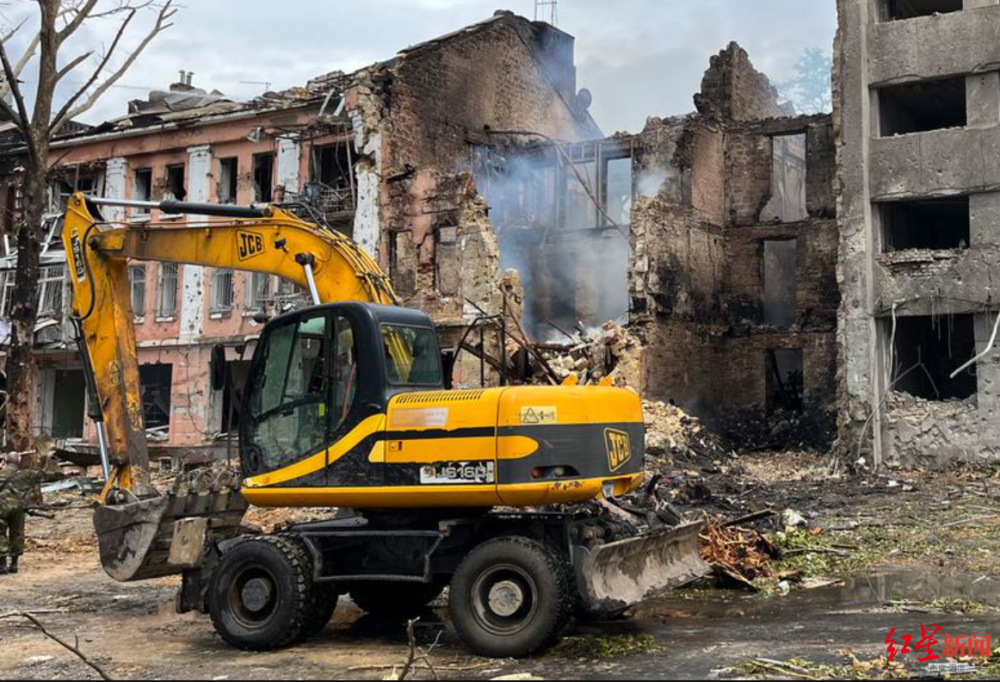

# 全球最大大米出口国发史上最严出口限制令！粮食价格飙涨，联合国秘书长警告

“我们看到全球小麦和玉米价格连续上涨，这对所有人都会造成伤害，尤其是全球第三世界的弱势群体。”

在俄罗斯轰炸乌克兰南部天然良港敖德萨之后，联合国秘书长古特雷斯发出了上述警告。而除了小麦、玉米之外，大米市场的波动更是牵动人心。最大出口国印度发出了史上最严的大米出口限制令，不允许除印度长米外的其他大米品种出口。专家认为，此举或将本来就在十多年来最高点的全球大米价格推上更高的位置。

_▲印度农民在田间劳作_

在黑海运输线上，由于俄乌双方均宣布将驶向对方港口的船只默认为军用舰艇，一时间气氛空前紧张：运送小麦的货船不敢通行，相关海域的船只保险费用飙升，很多保险公司甚至拒绝承保。尽管乌克兰方面也在设法开辟临时通道，但乌方官员承认，目前还没有多少货运方愿意改走偏僻的临时路线。

印度宣布限制大米出口，扰乱全球市场供应

印度20日宣布，立即禁止印度长米（Basmati，一种高级印度香米）以外的其他任何大米的出口，这一消息对全球农业市场产生了冲击。

莫迪政府认为，今年印度地区降雨季节“姗姗来迟”，损害了国内农作物收成，使得印度国内市场开始担心粮食短缺问题。印度大米零售价格去年上涨了11.5%，而在今年6月更是一个月内就上涨了3%。此外印度6月蔬菜价格上涨12%，总体通胀率超4.8%。为了在大选之前平抑国内粮食价格，莫迪政府宣布限制大米出口，优先保障国内市场的供应。

印度目前向140多个国家和地区出口大米。2022年，印度大米出口量达到创纪录的2200万吨，占全球供应量的40%，超过排在其身后的四大谷物出口国泰国、越南、巴基斯坦和美国的总出口量。去年印度政府宣布对大米出口征收20%的税率，但由于印度国内大米价格低廉，出口商仍然愿意冒着重税将大米卖到全球市场赚取差价。

大米出口商协会主席克里希纳·拉奥表示，印度对全球大米市场的扰乱程度，甚至将远远超过俄乌冲突对小麦市场的影响。

 _▲印控克什米尔，农民在稻田里劳作 据ICphoto_

在印度，传统的大米种植区以种植印度长米为主，这种米主要出口中东地区和欧洲，售价较高，在本轮政策中不受影响。印度其他一些地区主要种植短粒白米，出口价格较低，主要出口地区是亚洲的菲律宾、印尼以及东非多国。这类大米正是印度政府严禁出口的品类。以菲律宾为例，该国约20%的大米依赖进口，大米价格在CPI指数占比高达25%。

一些菲律宾贸易商表示，已经开始担心印度出口限制措施带来的影响。一位贸易商表示，“印度大米出口的体量是任何其他国家都难以取代的，对于粮食贸易商来说，这种突如其来的禁令会让我们非常痛苦”。

敖德萨局势影响粮食出口，联合国秘书长发警告

涨价的不只是大米。7月19日，欧洲证券交易所的“制粉小麦”价格相较18日飙升了8.2%，达到每吨253.75欧元，玉米价格也上涨了5.4%。芝加哥期货交易所的美国小麦期货大涨8.5%，创下自2022年2月俄乌冲突爆发以来的单日最高涨幅。7月20日，美国小麦期货价格在三天内已累计上涨超13%。

据统计，俄罗斯小麦出口量占全球小麦出口量的20%以上，乌克兰的小麦出口量也占到全球10%，这两国出口的小麦是一些非洲欠发达地区重要的粮食来源。

俄罗斯当地时间19日通报称，俄军持续打击乌克兰位于黑海西北岸的港口城市敖德萨周边军事设施。据敖德萨当地媒体报道，当地居民已经连续经历了三个晚上的猛烈轰炸。据报道，当地时间20日凌晨2点左右，针对敖德萨的袭击开始爆发，持续了至少90分钟，期间无人机的嗡嗡声回荡在城市上空。

乌克兰媒体称，该国部署在敖德萨的防空系统无法应对俄军使用的导弹类型，防御能力较其他战区有明显的差距。乌克兰空军方面承认，截至20日夜间，俄罗斯方面在敖德萨地区发射了19枚巡航导弹，其中只有5枚被乌军成功拦截。这一成功率和基辅地区相比明显较低，乌克兰官员表示，这是由于乌克兰南部地区缺乏更先进的防御系统。

_▲敖德萨地区建筑被炸毁_

敖德萨作为黑海沿岸地理条件相当优越的天然良港，一直是“欧洲粮仓”乌克兰向国外出口粮食的重要港口基地。乌克兰农业部长索尔斯基称，俄方的空袭摧毁了6万吨粮食库存，还损坏了很多和谷物出口相关的基础设施。乌克兰总统泽连斯基在19日的晚间讲话中证实：“受到袭击的港口储存了大约一百万吨食品，这些食品本来应该交付给非洲和亚洲的一些国家。”

空袭发生后，联合国秘书长古特雷斯提醒道，“破坏民用基础设施的空袭也正在对乌克兰之外的地区产生影响”，他希望俄罗斯遵守承诺，“促进从乌克兰控制的黑海港口畅通无阻地出口粮食、葵花籽油和化肥”。联合国驻地协调员丹尼斯·布朗表示，她对敖德萨遭到空袭后的破败景象感到震惊。她在一份声明中称：“这是这座民用港口连续第二天在大规模袭击中遭到严重破坏，该港口是世界上依赖乌克兰谷物出口的最贫困人口的重要生命线。”

小麦运输船不敢通过黑海，保险费用一路飙升

去年7月，俄罗斯、乌克兰、土耳其和联合国在伊斯坦布尔达成“黑海谷物倡议”，同时联合国还与俄罗斯达成了一项关于其谷物和化肥出口的平行协议。联合国官网资料显示，过去的一年里，“黑海谷物倡议”促成3000多万吨乌克兰粮食经由包括敖德萨在内的三个黑海港口出口到全球市场，成为保障全球粮食安全的重要组成部分。

7月17日，俄罗斯宣布将停止参与“黑海谷物倡议”。俄国防部在19日发表声明称，鉴于黑海港口农产品外运协议已失效，海上人道主义走廊已经关闭，自莫斯科时间20日零时起，俄方将把沿黑海水域前往乌克兰港口的所有船舶视为潜在军用货物承运船只。这些船舶悬挂的旗帜所代表国家将被视为在俄乌冲突中站在乌克兰一边。俄国防部还宣布黑海国际水域西北部和东南部的一些海域为临时航行警戒区。

针对俄方这番表态，乌克兰方面随即也宣布了“报复措施”。乌克兰国防部20日发表声明称，自7月21日起，所有驶往俄罗斯黑海港口的船只都可能被乌方视为军用物资运输船。

_▲敖德萨码头的货运仓库_

此前，俄乌两国曾多次指责对方在黑海粮食海运走廊埋设水雷，企图封锁港口。如今黑海西北部和东南部一些水域已被商船“视为畏途”，货运船只在紧张的地缘政治压力下很难放心地安全通航。在冲突爆发以来，黑海水域的商船保险费用就一路飙升，极大地抬升了该区域运输成本。在俄乌两国相继宣布可能将过路船只视为军用舰艇后，一些保险公司开始考虑撤回对黑海货运的保险报价。

伦敦劳埃德集团一名高级分析师称，目前有一小部分保险公司打算“坐地起价”，趁着局势紧张的时候大幅度提高保险价格，但有很多保险公司不愿意承担如此巨大的风险，拒绝为经过黑海的货运船只提供保险服务。丹麦货运巨头NORDEN方面表示，目前绝大部分船主都拒绝在乌克兰港口接单。

荷兰合作银行农产品市场主管卡洛斯称，乌克兰现在将被迫通过陆路和多瑙河港口出口大部分谷物和油籽，这将显著推高运输成本，并挤压乌克兰农民的利润。“当前局势引发的连锁反应可能会促使乌克兰农民下个季节减少小麦种植，从而给未来的供应能力带来进一步的压力。”

另有报道称，乌克兰正在协调建立一条途经邻国罗马尼亚的临时航线，“其目标是促进黑海西北部国际航运的畅通”。但是乌克兰官员承认，目前还没有多少货运方愿意接受临时航线带来的成本增加问题。

红星新闻记者 郑直

编辑 何先锋 责任编辑 魏孔明

