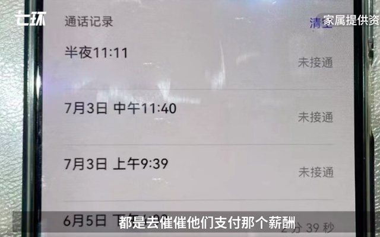
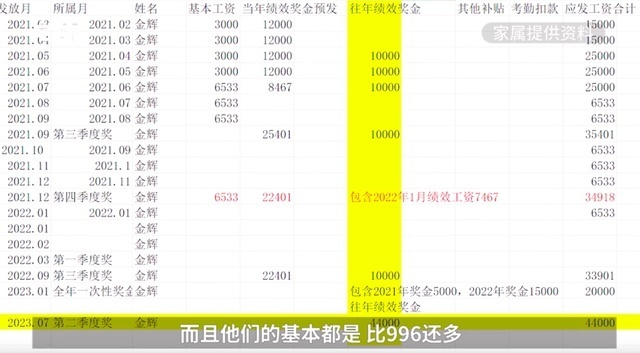

# 工程师离职后在前公司坠亡，生前曾讨薪，亲属：第二天就收到4万薪酬

7月21日，据澎湃新闻客户端，近日，深圳建筑设计研究总院下属单位44岁工程师金辉坠亡。短信显示，其生前曾两次讨薪。

亲属回忆，金辉在其公司任职5年，担任结构工程师，今年3月疑被迫离职。7月6日到公司索要薪酬过程中坠楼身亡。“他是6号一点多坐地铁去公司，三点多他女儿打电话，他没接。后来是一位警察接的，让他妻子早点出派出所。”

亲属称此前家人未见异常，还规划暑假一起旅游。“都办港澳通行证了，照片也拍了，结果那张照片成遗照了。”

金辉的亲属表示，至今不知道金辉3月被迫离职的原因，作为家属不认为他会主动离职，因为他上有老下有小。另外，金辉坠楼的房间没有监控，在他坠楼前到底发生了什么？有什么争执？

亲属提供材料显示， 6月5日和7月3日，金辉曾向单位人士王某梅询问什么时候结算尾数，没有结清的薪酬大概4万多。

不过，就在金辉跳楼的第二天，公司就支付了4万多薪酬。亲属称，其公司“996”加班严重，晚上工作12点，完全没有个人时间，压力很大。

针对上述情况，金辉生前任职单位、上级深圳建筑设计研究总院均拒绝回应。此前，金辉曾向单位人士王某梅询问结算尾数，王某梅表示，她不负责处理金辉事件。

福强社区工作站人员回应，已搭建平台供家属和单位协商，目前涉事机构上级也介入协商。“双方承诺达成了共识点，他们针对某一项细节，他们自己先谈。还有分歧的话，省院就会在第二天上午过来跟他们谈。我们社区的街道和公安是给家属搭一个平台，心平气和地去交谈。”

福田区人力资源局工作人员进一步回应，关于金辉被欠薪的情况，尚无定论。

**【来源：九派新闻综合澎湃新闻】**

