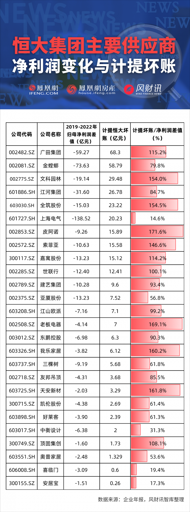

# 消失的恒大供应商：26家企业计提坏账353亿，“老朋友”被逼至破产

来源： 风财讯

在恒大发布“2.5万亿负债”成绩单的12小时后，全国企业破产重整案件信息网悄然上线了一则破产申请公告——

7月18日， **恒大地产集团西安有限公司被西安卫宁商贸有限公司申请破产** ，办理法院为陕西省西安市中级人民法院。

西安卫宁商贸是恒大西安的供应商之一，经营各类批发业务。作为一家注册资本仅101万的小公司，它敢在“恒大披露年报”和“即将召开多个重组沟通会”的敏感点上提起申请，勇气不小。

不过目前该案件“（2023）陕01破申177号”在全国企业破产重整案件信息网上，已经查询不到信息。据报道，西安中院的说法是：并未正式立案，申请人已经撤回申请。

对此，凤凰网风财讯拨打西安卫宁的联系电话，未得接通。但却接触到了另一位和“恒大的小供应商”相关的人张远（化名）。

张远是河南周口人，但却最不喜欢别人称他是“许家印的老乡”，他目前有一个更重要的身份——恒大的债主。

2020年底，张远为一位在郑州干建材的朋友提供了50万元贷款的连带责任担保，并在朋友的推荐下买了约15万的恒大理财产品。这笔担保资金后来被朋友用在了恒大郑州一个项目上，朋友的公司算是这个项目工程链上的小供应商。

但参与工程一年多，已经垫款百万左右，却突遭恒大暴雷。眼看项目一天天停滞下来，不仅目前的工程款收不回来，以前的货款（商票结算）也基本都烂在手里了。

2022年中，张远因朋友未能按期偿还这笔贷款，被小贷公司一起告上了法庭。

“现在不仅一分钱都没要回来，还扯上了官司要再贴进去50万，一切都是恒大的锅！”张远说，自己现在只能求亲戚朋友借钱还债了。

快退休的年纪，张远觉得自己活得太憋屈了，但面对未来，他也只能唉声叹气，“走一步看一步吧。”

“张远的故事”每天都在全国各地上演。主角有小公司或个体户，也有已经上市的大型公司。但无论大小，它们都有同一个身份，即恒大的供应商。

而在恒大暴雷、且迟迟无进展的情况下，它们的境遇，也异常焦灼。

**超20家供应商净亏 恒大拖欠上万亿**

从暴雷到现在，被恒大拖累的供应商，到底有多少家？涉及多少行业？迄今为止，没有任何官方数据。

凤凰网风财讯智库仅能从上市公司的业绩信披中窥得一二。据风财讯智库统计，目前踩雷恒大的上市公司有26家，其中20家业绩亏损，6家大幅下滑。

26家企业公开对恒大计提的坏账已超过了353亿元，这几乎超过了A股4000多家上市公司的市值。

 _（来源|凤凰网风财讯 作者|陈文莉 统计|蔡艳平）_

其中，
**广田集团（002482.SZ）、金螳螂（002081.SZ）、文科园林（002775.SZ）、江河集团（601886.SH）、全筑股份（603030.SH）、上海电气（601727.SH）、索菲亚（002572.SZ）、嘉寓股份（300117.SZ）、皮阿诺（002853.SZ）、世联行（002285.SZ）**
等10家企业对恒大的坏账均超10亿元。

然而，这还只是外界对恒大供应商的“受灾程度”认知的冰山一角——

截至2022年12月31日，中国恒大负债总额为24374亿元。其中，应付贸易账款及其他应付款项10022.6亿元（含应付工程材料款5961.6亿元）。

这意味着，即便减去26家上市公司的坏账，仅恒大对上下游中小供应商的“贸易欠款”少则超五千亿，多则超万亿。

这一年里，头顶万亿坏账的供应商们，又在经历着怎样的生存考验？

**“老朋友”被逼至破产**

在恒大过去十年的发展中，叶远西创立的广田集团既是恒大的主要装饰供应商，亦多次在关键时刻为恒大挺身而出。

2017年，恒大计划借壳深深房回A，叶远西第一时间出资50亿元助力老友；2020年，恒大惨遭股债双杀，叶远西再度援手，同意不要求进行回购并继续持有恒大地产权益。

然而，也正是这样的“情谊”，最终造成了“一荣俱荣，一损广田损”。

随着恒大暴雷，广田集团货款、投资款全面坏账达到了68.3亿元，也是恒大欠款最多的供应商。

2022年5月30日，广田集团被债权人申请破产重整；2023年1月6日，深圳中院决定对广田集团启动预重整程序。

在走破产程序的恒大供应商们，远不止广田集团一家。

4月19日，对恒大累计计提坏账23.22亿元的全筑股份，被债权人 **森西实业** 申请预重整；曾因修建世界第一高楼迪拜哈里法塔蜚声海外的 **南京六建**
，因约360亿元的恒大欠款，正式宣告破产重组……

此外，文科园林、江河集团、索菲亚、嘉寓股份、皮阿诺、世联行、老板电器、苏宁电器等恒大主要供应商，也深陷债务、关店、卖身，乃至退市危机之中。

动辄数亿元的坏账，显然并不是一个容易消化的风险。凤凰网风财讯梳理发现，在恒大暴雷前，26家主要供应商中，净利润不足5亿元的就有17家，而其对应的“恒大损失”最低的1倍，最高的达到了68倍。仅金螳螂、上海电气等极少数背景深厚的业内巨头能够恢复元气。

恒大暴雷的危机仍在资本市场上持续发酵， **洋河股份、合众人寿** 等企业近期均披露了因投资恒大而损失惨重。

**“套子”里的供应商**

通常，中小供应商为恒大供货后得到的是商票而非现金结算。这种看似“主打的就是一个信任”的结款方式，背后却是恒大套路的环环相扣。

据经济观察报，中小供应商兑换商票后需要将大头用来购买恒大理财，以期保证银行渠道的顺畅以及后续工程上合作的可能。

这样几乎“事事以恒大为先”的中小供应商捆绑策略，就像是“击鼓传花”的游戏。甚至当恒大暴雷，大家会发现，“花”可能不止在一个人手上，因为商票的背书转让，更多的人在无知无觉的状态中，登上了恒大这艘危船。

“时代中的一粒灰，落在个人那里，可能就是一座山。”对于此刻艰难喘息的恒大的中小供应商们，这句话显得如此贴切。

如著名大V马光远在7月18日的发文中所说，“对于恒大而言，死是最容易的，也是最解脱的，但对于利益关联方而言，这是最坏的选择。”

