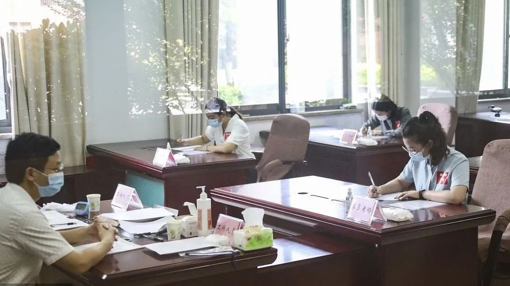

# 烟草局不收直系三代，“子承父业”成历史，肥差变闲职

 _来源：视觉中国_

特约作者 | 王不逊

编辑 | 陈弗也

出品 | 棱镜·腾讯小满工作室

7月15日，一则“烟草局要求直系三代不得应聘”的话题冲上热搜，引起了网友对垄断行业招聘方法的热议。

准确地说，这样的规定不能算新，因为它已经存在了很多年。早在2016年，黑龙江烟草局招聘启事就明确“省公司及所属各级单位所有在职职工的配偶、子女及其配偶，不得应聘同一机关岗位”。

在这个热搜下，一张“汕尾市烟草公司陈文铸家族成员组织结构图”也火了，但是根据广东省官方媒体南方网的辟谣，这是十余年前的旧闻。2011年10月，陈文铸已被行政开除、开除党籍。

这样的旧闻此时成为新闻，或许与今天的就业形势有关。资料显示，今年国考报名人数飙升为250多万，增长了近80%，但招录名额仅为3.7万，相当于70个人竞争1个岗位，几乎是“百里挑一”。

但是烟草、电力、石油等垄断型国企的竞争压力相比，国考还算小的了。公开资料显示，四川烟草商业系统今年春招时共有39970人报考，但仅招聘284人。

不过，时过境迁，在市场经济的冲击下，一些垄断行业中曾经的“肥差”变成了“鸡肋”。与此同时，随着“亲属回避”制度的落实，“子承父业”的现象也正在逐步地从各大垄断企业中消失。

“你听说过‘油三代’、‘烟三代’、‘电三代’，但应该没听过‘油四代’、‘烟四代’、‘电四代’。”一位垄断企业员工向作者感叹，“第三代，可能是最后一代了。”

**过去垫脚石，如今绊脚石**

今年6月，王颖（化名）从一所985大学毕业，并幸运地拿到了一家垄断型央企总部的offer，这家央企的总部今年只招了不到10名应届生。

王颖的父亲在这家央企工作，并在一家地方分公司担任领导职务。巧合的是，就在王颖等待入职的时候，她的父亲也迎来了好消息，要从分公司调到总部担任领导职务。但是，原本该庆祝的两个好消息，碰在一起却成了一个坏消息。

根据公司回避制度的规定，父女两人，只能有一个留在总部。

如今，她的父亲有点后悔让她报考自己单位，原本是想能有些关照，没想到却成为了彼此的绊脚石。

一位央企的相关负责人告诉作者，现在的领导干部们都不愿意让孩子进自己的单位，像王颖这样的情况不再是主流选择，“都愿意把孩子送到同级别的兄弟单位，怕的就是触犯回避制度。”

当下的形势已经和过去不同，十年前，在垄断行业里，“父承子业”是一个水到渠成、非常常见的现象。那个时候，父辈为了让孩子们顺利“接班”，也是煞费苦心。

杨磊（化名）是一个电二代，他的父亲曾经是一家电力公司的处长。十几年前，高考结束时，父亲为了让他能够接班，就给他报了一个与“电”有关的专业。

他是一名理科生，高考成绩并不高，而理想的工科院校正好新开了“广播电视新闻专业”，理科生可以报考，名字里也有个“电”。在当地人印象中，这是所纯工科学校，这让他误以为这个专业研究的“广播电视”，可能类似于电视发射塔的相关技术。

但入学以后才发现，这个专业真正学的是“新闻”，是一个文科专业，与“电”没有半毛钱关系。

为了保证他能接班，经过父亲的运作，杨磊得以在大学里换了专业，最终和父亲成为了同事。

2012年，也就是杨磊大学毕业后的第一年。“逢进必考”成了一些垄断行业的硬门槛，像杨磊这样的普通本科生已经很难进入到电力系统好的部门。

“除非毕业于985、211这样的名牌大学。”杨磊表示，现在央企进人渠道就是招考。

在此之前，“近亲繁殖”在类似电网、石油、烟草这些垄断型央企中较为普遍。

2015年前后，中央巡视组对中石油、中海油、工商银行、农发行、建设银行、中国邮政、中国烟草专卖总局等9家央企开展了巡视，反馈的巡视意见中，都点出了“近亲繁殖”的问题。

比如工商银行，根据当时的巡视意见，总行管理的691名干部中，220名干部的配偶、子女，共有240人在系统内工作。

从此之后，在这些央企中，“近亲繁殖”成为了一条禁忌。这些央企也都出台了相关规定来规避“近亲繁殖”。比如，工商银行就明确了员工子女控制、准入条件设置、亲属回避制度执行等。

在落实回避制度的过程中，建设银行是最为彻底的一家，2020年，他们出台了号称史上最为严格的回避制度。

按照建设银行《员工亲属回避规定》，所有员工三代以内的血亲，都不能报考总部的岗位，也不得招录至员工本人所在的同一内设部门、同一营业网点、同一直属机构、同一境外机构。建设银行从制度上杜绝了“子承父业”。

**国企人事是一门玄学**

去年，江西90后小伙周劼因为在朋友圈炫富炫官，一度引爆了舆论。

周劼供职的单位是江西省国有资本运营控制集团，有着“江西最好国企”的称号，要想进入到这家公司并不容易。比如，公开资料显示，今年该公司录取了8人，其中，5个毕业于国内985，剩下3人分别毕业于伦敦大学国王学院、帝国理工学院，澳洲国立大学。

周劼的学历一直都是个谜，有未经证实的消息显示，他可能毕业于南昌交通学院，这是一所民办本科学院。与上述名校相比，这个学校并不算好。

但是，这并不影响周劼的自信心和自豪感，他曾在朋友圈讽刺学霸同学时说：“我怕你会读书吗？名校研究生都别想那么容易进我单位。这个人当年仗着自己会读书，看不起我们这种靠父母的，社会会教他做人……”

后来，在对“周劼事件”的情况通报中，江西纪委也仅仅介绍了他是在2020年入职，没有认定他入职过程中存在违规。

一位地方纪委官员向作者点破了其中的门道，国企要用什么样的人，专业、年龄、条件，都可以自己决定，不像公务员招考已经成熟，逢进必考，监管比较严，几乎没有任何操作空间。

“它符合程序，但是不代表他就一定公正。为什么组织人事方面的案件很少发案？每个环节都符合程序，但是用谁和不用谁，这个标准很难界定。人事既不是哲学也不是理学，它是一门玄学。”这位官员向作者感叹。

电力、烟草、铁路等行业往往成为“近亲繁殖”的重灾区，一个原因是，这些央企体系庞大，如果一个人是省级公司的领导，那他的子女可选择机会很多，并且，这些公司的用人自主权很大，可以有很多通融的办法。

与国考不同，很多央企的招聘权限依然在地方分公司，作者拿到了多家垄断型央企的内部招聘管理条例，这些企业会自己组织招聘，总部主要对方案进行审核，更多的是起到监督作用。

不过，为了限制“近亲繁殖”，除了对招聘方案进行审核、监督外，很多国企现在还建立了个人情况申报制度。比如，要求副处级以上干部每年进行个人情况申报。

“不仅是父母、兄弟姐妹、子女需要写清楚工作单位，配偶的父母、兄弟姐妹及其子女的工作单位也都属于申报范围。”一位央企人士向作者表示。

一些央企甚至扩大了范围，连普通员工也申报个人情况。“可以这么说，现在领导干部，几乎是没有隐私。”这位央企人士说。

对于央企员工来说，这些个人事项，在民主生活会或者提拔任用时都会成为考察重点，“现在已经没有人还会像过去那样，把自己家的孩子招进自己单位，瓜田李下就说不清楚了。”

**回避，是为了履职公正**

与公务员招聘不同，有关国企的招聘，并没有一个统一的规定，只有一些地方国资委发布过相关条例。

比如，山东省国资委曾经发布《关于进一步规范国有企业招聘行为的意见》，提出要本省国有企业在公开招聘时实行回避制度，这基本上是在参考《公务员法》，不过，该意见的回避范围更小了一些。

山东省国资的意见指出，如果应聘人员与负责人有夫妻关系、直系血亲关系、三代以内旁系血亲或者近姻亲关系，“不得应聘该负责人的秘书或者人事、财务、监督检查等岗位以及有直接上下级关系的岗位”。

公务员法中也有类似规定，但回避范围要大很多，比如，要求亲属不得在其中一方担任领导职务的机关从事组织、人事、纪检、监察、审计和财务工作，不得在同一机关双方直接隶属于同一领导人员的职位，或者有直接上下级关系的职位上工作。

这一轮引发热议的烟草公司，几年前也出台了《烟草总公司关于印发烟草行业招聘工作管理办法的通知》。

不过，对比多地烟草系统的招聘启事后会发现，各地在落实过程中，尺度不尽相同。

比如，四川省、山东省等省份的规定与《公务员法》类似，应聘人员不得报考录用后即构成任职回避情形的岗位，也不得报考与本人有夫妻关系、直系血亲关系、三代以内旁系血亲关系以及近姻亲关系的人员担任领导成员的用人单位的岗位。

最为严苛的是甘肃省烟草专卖局，把回避范围从领导成员扩大为“职工”，要求“职工的配偶、子女及其配偶不得应聘同一机关岗位”。

作者了解到，一家央企的总部最近正在研究出台关于亲属回避的相关规定，一位负责人向作者直言，这个尺度很难把握，央企毕竟是企业，相对于政府仍要保持一定的灵活度，如果对子弟入职限制得太死，“也是另外一种不公平。”

上述纪检官员也向作者介绍说，表面上看，回避原则是为了杜绝“子承父业”，但这并不是设计回避原则的初衷。如果在公开招聘时对职工子弟一视同仁，中间也没有请托打招呼的情形，招聘子弟也是符合当下的规定。

在他看来，回避原则真正目的是保证员工们公正履职，避免在履行自身职责过程中受到家庭关系的影响。

**曾经的“肥差”，今天的闲职**

在之前，优先子弟一直都是垄断型企业一项放在台面上的人事制度。

资料显示，这项制度兴起于1957年，最初是为了鼓励年老职工退休。1979年时，曾被大规模推广，当时是为了解决1500万返城知青的就业问题。到了1986年，国务院明令必须实行劳动合同制，废止了子女顶替的制度。

不过，根据多位垄断型企业在职员工的介绍，直到十八大之前，子弟优先依然是一条潜规则。

张海（化名）就是一家垄断型企业的员工，上高中时，他的学习成绩在班内垫底，但同学们都知道，未来他不缺工作，他的父亲是当地一家国企的负责人。高中毕业后，他并未去读大学，但通过一系列运作，成功逆袭进入到了当地最好的单位——煤炭局。

“财政局、建设局、国土局，随便我选。”回忆起当时安置工作的场景，张海依然感到自豪。

之所以选择煤炭局，是因为当时煤炭还是当地的支柱产业，每年上百亿吨的煤炭，都需要经过煤炭局管理处称重计量税费。尤其是“管秤”这个职务，就是一个令人艳羡的“肥差”。经过几年的奋斗，张海也如愿以偿地成为了那个“管秤”的人。

在那个时候，电力、烟草、油田、铁路都是“铁饭碗”，“子承父业”就是父母能为下一代想到最好的出路，当一些企业推进招聘制度的改革时，也会引起了老职工们的不满。

2014年，大庆油田曾发生过一起备受关注的老职工抗议“接班”制度改革的事件。当时，大庆油田要改变职工大学毕业子女包分配的制度，这遭到了职工们的反对，有职工甚至喊出了“老子打下的江山，为什么不能让小辈来继承”的口号。

最终，那一年，大庆油田顶住了压力，招了千余名应届毕业生，近90%非油田子女。

如今，时过境迁，市场环境早已发生了千变万化，曾经的一些“肥差”，也变成了“闲职”。比如张海那份“管秤”的工作，由于当地的煤炭产量缩减了十倍，这把秤的“重量”已经减轻了很多。“真是人算不如天算。”张海向作者感叹。

掀起这波舆情的烟草行业，在一些地方，也在失去往日的光环。

张海的一些高中同学就有进入到烟草部门的，但是近几年，这些同学发现，自己的收入反而不及十年前了，十年前，还是好几个账户在发工资，现在每个月不到六千块钱，这和当地很多小型民营企业开出的工资一个水平。

但即便如此，张海依然很羡慕他的这些同学，因为他所在的这个曾经炙手可热的岗位，已经拖欠了几个月的工资。

