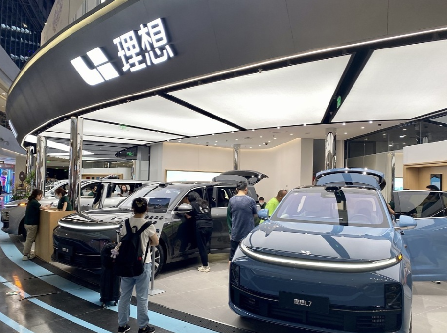
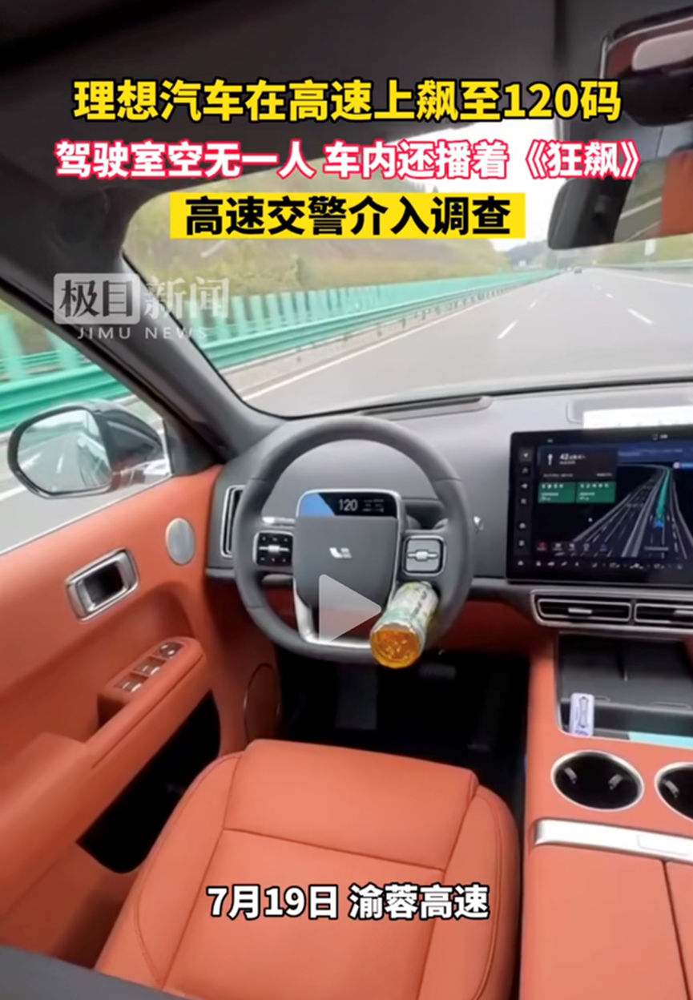
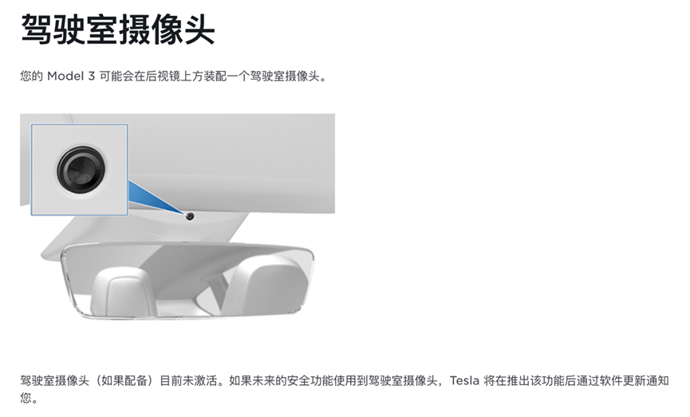

# 理想高速无人狂飙背后：车主可以拒绝开启车内监控摄像头

 _来源：视觉中国_

作者 ｜ 程潇熠

编辑 ｜ 康晓

出品 | 深网·腾讯小满工作室

日前，一段理想汽车在高速上无人高速疾驰的视频再次将辅助驾驶安全问题带到公众面前。

据极目新闻视频报道，一辆驾驶位空无一人的理想汽车在四川省渝蓉高速飙至120码，方向盘上卡着一瓶饮料，副驾驶位坐着一名男子，副驾位前方的屏幕正在播放电视剧《狂飙》。根据画面显示，视频拍摄于理想汽车后座，拍摄者边拍摄边说，“你看理想好牛，我们坐在后排，它自己帮我们开，我们在追剧。”极目新闻记者已向四川高速交警反映此事。

理想汽车就此事回复《深网》：我们注意到，有用户在社交媒体上展示了不文明的驾驶行为，他们绕过系统的监测，或在系统警告至缓退期间进行一系列危险的操作。这是我们坚决杜绝的，现阶段仍然是辅助驾驶，不是自动驾驶。驾驶员是车辆的第一负责人，需要保持手扶方向盘，随时准备接管。

有多位网友对理想汽车辅助驾驶功能提出质疑，“为啥驾驶检测没有启动？”还有人建议理想汽车“赶紧OTA组合一下检测策略，手握方向盘，安全带插口检测，座椅重力检测，行驶过程中座椅靠背角度过大检测，一个条件不满足都不让使用。”

《深网》就上述网友疑惑询问理想汽车，截至发稿暂未回应。

这并非理想汽车第一次出现类似的不文明驾驶现象。2021年8月，就曾有车主在驾驶位上平躺，仅靠辅助驾驶在路上行驶的视频流出。

当时有媒体询问理想汽车销售，得到的答案是车内目前没有DMS （Driver Monitor
System，驾驶员状态监控系统）功能。彼时市面上在售的理想汽车为2021年5月上市的理想ONE（现已停产停售）。

在该款理想ONE发布两个月后，工信部、公安部和交通运输部联合印发的《智能网联汽车道路检测与示范应用管理规范（试行）》（以下简称《规范（试行）》），其中第二条第八款明确规定智能网联汽车要具备在线监控功能，可以反映驾驶人和人机交互状态的车内饰品及语音监控情况。

据贸泽电子介绍，最早的DMS搭载在丰田2006年发布的GS450h车型上，工作原理较为简单，通过一个CCD摄像头对于驾驶员的面部进行红外追踪，从而判断其是否注意力集中。而后随着技术成熟，DMS加入了对于人体特征的生物检测技术，以提高驾驶员信息获取的准确性。

当前DMS的主要功能包括疲劳检测、醉酒检测、分心检测和危险行为检测等，主要通过对于驾驶员的面部五官、人体体征和身体行为三个方面进行检测。面部五官的检测包括眨眼的频率、眼睛的开合度、打呵欠的频率、面部朝向等；体征的检测包括心率、脉搏和体温等；身体行为的检测则包括对于驾驶人的手、胳膊等行为进行判断。

但目前的DMS系统也存在“死角”，会出现误判情况。去年有汽车博主发文称，在试驾多家车企车型的辅助驾驶功能时，常会因眼睛比较小而被系统误判为疲劳驾驶，甚至开车睡觉。

2021年，特斯拉为防止辅助驾驶被“滥用”，上线了给予摄像头的DMS，此前特斯拉驾驶员监控系统只检测方向盘上的压力。这项新功能在当时饱受争议。美国《消费者报告》彼时称，特斯拉利用车内摄像头记录和传输乘客的视频，以开发自动驾驶技术，会引发隐私问题。相比之下，福特和通用等监控系统利用红外技术识别司机的眼球运动或头部位置更为安全。

特斯拉的监测摄像头在国内也引发了争议，而后特斯拉中国声明，特斯拉用户使用的车辆不存在车内摄像头侵犯用户个人隐私的行为，所有中国市场上的特斯拉用户车辆均未开启车内摄像头。

特斯拉中国官网的车主手册中标明了驾驶室摄像头的位置，称驾驶室摄像头（如果配备）目前未激活。

《民法典》规定，“个人信息是以电子或者其他方式记录的能够单独或者与其他信息结合识别特定自然人的各种信息。”“处理个人信息的，应当遵循合法、正当、必要原则，不得过度处理，并符合下列条件：
（一） **征得该自然人或者其监护人同意**
，但是法律、行政法规另有规定的除外；（二）公开处理信息的规则；（三）明示处理信息的目的、方式和范围；（四）不违反法律、行政法规的规定和双方的约定。个人信息的处理包括个人信息的收集、存储、使用、加工、传输、提供、公开等。”

截至目前，理想汽车、蔚来、小鹏汽车三家涉及车内摄像头的驾驶员疲劳监测等均需要车主同意，手动操作开启。

今年蔚小理三家车企都在北京等城区开放了高级别辅助驾驶功能，安全监控与隐私保护间的平衡问题更亟待解决。

6月15日，小鹏汽车高级别辅助驾驶城市NGP在北京开放，主要适用于北京各环线及主要快速路，预计年内开放数十座城市。7月10日，蔚来NOP+增强领航辅助功能在北京五环内的高速公路和城市快速路上线。7月12日，理想汽车在北京（顺义的部分路段和朝阳区望京）和上海开始了城市NOA（Navigate
on Autopilot）的公开测试。今年下半年，理想汽车还计划开放通勤NOA产品，即可以实现城区内点到点高级别辅助驾驶。

据CDC统计，全美每天有9人死于分心驾驶。欧洲已经将驾驶员监测系统（DMS，Driver Monitoring System）列入新车安全评估标准（Euro
NCAP）中，未来几年欧盟将在所有新车型中强制配置DMS。

中国已对“两客一危”等商用车车型安装DMS系统作出强制要求，2023年5月开始已实施《驾驶员注意力监测系统性能要求及试验方法》，将DMS纳入推荐标准，预计强制标准将于2027年起实施。

