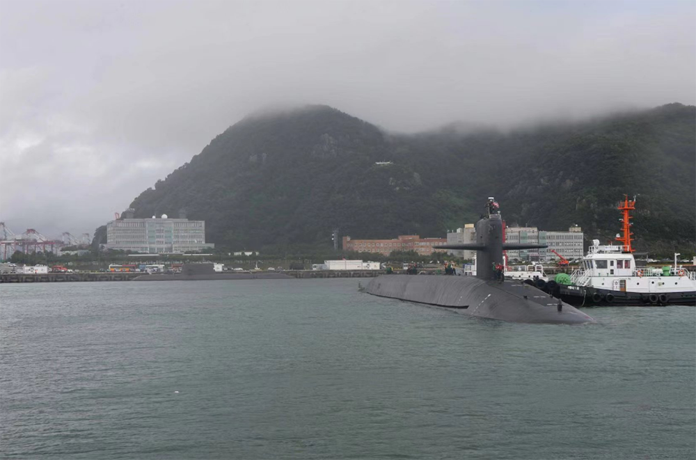
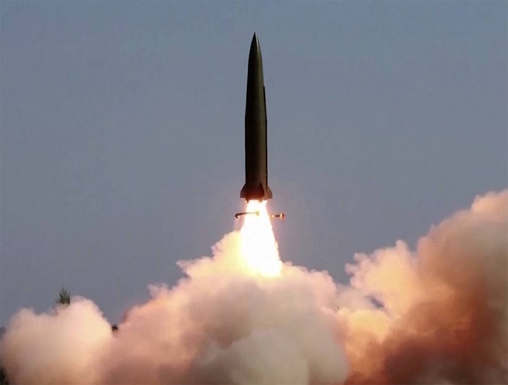

# 美军战略核潜艇停靠韩国，韩媒：除朝鲜外还可能刺激周边大国

朝鲜试射“火星炮-18”固体洲际导弹、美国战略核潜艇停靠韩国……“硬碰硬”对抗不断升级，朝鲜半岛局势动荡进一步加剧。

围绕美国战略核潜艇时隔40年停靠韩国，朝鲜与美韩的对抗仍在继续。
**据朝中社报道，朝鲜国防相强纯男20日发表谈话称，美“俄亥俄”级战略核潜艇停靠韩国对朝鲜是直接的核威胁，此举可能符合朝鲜使用核武器的条件。**

在军事专家看来，美国战略核潜艇停靠以及加强延伸核威慑之举除了刺激朝鲜，这种抵近部署战略核武器还可能刺激周边大国，因为韩国与几个周边大国隔海相望，距离非常近。

美军战略核潜艇“肯塔基”号停靠韩国釜山作战基地。

**朝鲜国防相警告美国**

韩国总统尹锡悦19日下午在釜山海军作战司令部基地登上了停靠该基地的美国战略核潜艇“肯塔基”号，成为第一个登上该类型潜艇的韩国总统。

据韩联社报道，尹锡悦登艇前发表了致辞，尹锡悦称，今访问世界最强的战略资产之一——美军战略核潜艇“肯塔基”号非常有意义，且令人踏实放心。尹锡悦说，这是继自1981年的“罗伯特·李”号潜艇后美国战略核潜艇时隔42年再次停靠韩国，此举充分体现出韩美两国通过定期出动美国战略资产加强延伸威慑执行力的坚定意志。

“肯塔基”号是美国海军“俄亥俄”级战略核潜艇，在韩美核磋商小组（NCG）举行首次会议的18日驶入釜山作战基地。作为美海基核力量的核心，“俄亥俄”级战略核潜艇水下排水量超过1.8万吨，最多装载24枚令人“谈核色变”的“三叉戟”II
D5型潜射弹道导弹，这种导弹最多可携带14个核弹头，一艘核潜艇就可以基本毁灭一个国家。目前，美国海军共装备了14艘“俄亥俄”级核潜艇，其中太平洋舰队拥有8艘。

“‘俄亥俄’级携带的核导弹射程超过1.2万千米，不需要到韩国，甚至在夏威夷就可以完成对核打击任务，”海军专家王云飞接受澎湃新闻（www.thepaper.cn）采访时表示，“美国的这种做法其实就是一种武力炫耀，一方面是向朝鲜展示这种核打击平台，威慑朝鲜；另一方面是向韩国传递信号，美国会履行延伸核威慑的承诺，核保护伞依然有效。”

在18日美韩核磋商小组首次会议结束后，韩美两国评价称，两国表现出落实《华盛顿宣言》的坚定意志。韩国国家安保室第一次长金泰孝在记者会上表示，韩美将构建一体化的延伸威慑体系，即通过核磋商小组共同协商决定延伸威慑事宜并共同采取行动。延伸威慑是指，若美国的同盟国受到核攻击，美国将动用核武器、导弹防御系统以及常规武器等进行打击报复。

朝鲜“火星-11”导弹射程超过500公里，射程覆盖韩国釜山基地。

对于美国战略核潜艇停靠韩国，朝鲜反应强烈，除了进行导弹发射活动外，朝鲜国防相强纯男还发表了措辞强硬的讲话。

据韩联社报道，韩国联合参谋本部19日称，韩军方当天凌晨3时30分许到3时46分许探测到朝鲜在顺安一带向朝鲜半岛东部海域发射2枚短程弹道导弹，导弹分别飞行约550公里后落入日本海。

“朝鲜19日发射的导弹射程设定很有针对性，朝鲜顺安离韩国釜山作战基地距离也在550公里左右，因此这次导弹发射针对性很强，传递的信号就是提醒美韩，该基地在朝鲜导弹的覆盖范围之内。”军事专家韩东分析认为。

强纯男对美战略核潜艇停靠韩国发出警告称，美国派遣“俄亥俄”级战略核潜艇停泊在韩国釜山港作战基地是40多年来第一次在朝鲜半岛地区部署战略核武器，也是对朝鲜最为露骨而直接的核威胁。强纯男表示，要提醒美方，“包括战略核潜艇在内的战略资产部署的可见性增大可能会符合我们国家核武力政策法令所阐明的核武器使用条件”。

强纯男表示，朝鲜核使用规定允许，当国家遭到或者判断为即将遭到核武器攻击时，就可以进行必要的行动程序。

在朝鲜劳动党中央委员会副部长金与正发表多次讲话后，朝鲜国防相发表讲话被认为是为了表明朝鲜军方的态度，军事层面警告的色彩更浓。

**核潜艇停靠韩国为何可能刺激周边大国**

韩国《民族日报》刊文认为，“肯塔基”号停靠釜山港不仅会刺激朝鲜，还会刺激俄罗斯，或将使半岛局势更加动荡。报道称，美国将利用停靠在半岛的战略核潜艇来牵制俄罗斯。报道还提及，18日当天，中国和俄罗斯海军舰艇进入日本海展开联合海上军事演习，演习持续到29日。

近期，多支力量在日本海举行的联合军演引发外界关注。

根据新华社报道，“北部·联合-2023”演习开幕式20日上午8时在日本海某海域举行。中俄双方参演兵力将围绕海空护航、威慑驱离、锚地防御等多个课目展开联合演练。

报道称，中俄两国互为最大邻国和全面战略协作伙伴，中俄两军是促进和维护地区和平稳定的重要力量。演习指挥员邱文生在开幕式致词中表示，此次演习是全面落实两国元首重要共识的实际举措，是两国、两军高度战略互信和牢固传统友谊的再次体现，也是对中俄海空兵力在远海远域一体化联合作战能力的多维度检验。全体参演官兵将全力以赴，以实际行动增强共同维护地区和平稳定、应对各种安全挑战的能力。

在朝鲜发射“火星炮-18”新型固体洲际导弹后，美国、韩国和日本7月16日在朝鲜半岛东部海域进行了三方导弹防御演习。此次演习动用了三艘“宙斯盾”驱逐舰，分别是韩国海军的“栗谷李珥”号、美国海军的“约翰·芬恩”号以及日本海上自卫队的“摩耶”号。韩联社报道称，演习假想朝鲜发射了一枚弹道导弹，三国武装部队着重演练了发现和追踪假想的弹道导弹的流程，并进行了信息共享。

“韩国与周边几个大国隔海相望，最近距离只有几百公里，虽然美国声称战略核潜艇停靠韩国是为了反制朝鲜，但搭载核武器的平台在如此近的距离‘秀肌肉’如果引发周边大国关注也是正常的，”韩东指出，“战略核潜艇的导弹虽然不用靠近对手就可以发动核打击，但抵近部署采用超低弹道发射将大幅缩短飞行时间，反导系统也更难应对，更具威胁。”

“与战略核潜艇停靠韩国相比，美国这个举动是否意味着美国未来会更多向常态化韩国部署战略武器更值得关注，比如美国是否会在韩国部署中程导弹。”韩东告诉澎湃新闻。

《韩国日报》7月11日刊文称“堤丰”系统实际上是将美国海军的导弹垂发系统转移到陆地上使用。6月27日，美国陆军成功使用“堤丰”陆基中程导弹系统发射了一枚“战斧”导弹。报道称，美国可能将于明年提出在韩国部署“堤丰”系统的建议，“韩国方面可以借机实现韩国国际地位的大飞跃”。

“堤丰”陆基中程导弹系统目前配备的武器主要有射程1700公里的新型“战斧”导弹和射程370公里的“标准-6”导弹。韩媒报道称，通过对软件进行升级及简单的设备改造后，“堤丰”系统可以发射更多类型的导弹，包括最大射程900公里的LRASM隐形反舰导弹、能拦截高超声速导弹的改进型“标准-6”导弹、能拦截洲际导弹的“标准-3Block2A”导弹等。

值得一提的是，今年6月美国会调查局的报告表示，“考虑到射程等限制因素，如果不将‘堤丰’系统部署到海外美军基地，它的作战效能将大打折扣，甚至本身的存在也会失去意义”。

“‘堤丰’系统配备的巡航导弹不仅覆盖朝鲜全境，甚至周边大国的部分领土也在该导弹的射程范围之内，如果美国真的在韩国部署中程导弹，将是‘萨德’入韩之后又一重要举动，值得高度警惕。”韩东指出。

