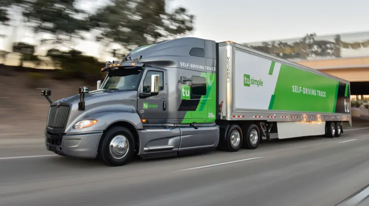

# 美国交通部长又挑事：中国自动驾驶汽车技术引发“担忧”

（观察者网讯）美国再度以所谓“存在国家安全担忧”为由，向中国发难。据路透社21日报道，当地时间周四，美国交通部长皮特·布蒂吉格声称，美国市场上的中国自动驾驶汽车供应商“存在国家安全担忧”。

他在接受采访时说：“无论我们谈论的是硬件还是软件，就像对电信或Tik Tok的担忧一样，人们对（中国的）交通技术也有担忧。”

布蒂吉格还称，美国需要更好地了解为该国交通系统提供不同要素的不同企业，其背后的“真正所有权”。

 _截图自自路透社_

报道提到，17日一封写给布蒂吉格和美国商务部长雷蒙多的信中，一个由四名议员组成的两党团体要求调查中国自动驾驶汽车技术在美国的流行情况，以及如何对其加以限制。

据称，该团体在信中引用加州监管机构数据，称去年有7家中国公司在美国人口最多的州进行自动驾驶汽车测试，声称此举可能存在所谓“数据安全隐患”。

“自动驾驶中使用的技术、激光雷达、摄像头、人工智能和其他先进的传感器和半导体，都可以用来收集有关美国人民和基础设施的数据，这些数据可能会被传送回中国。”信中写道。

 _美国交通部长皮特·布蒂吉格
图自路透社_

前一天（20日），路透社的另一篇报道还提到，在即将于7月26日举行的国会听证会上，美国众议员专家小组将寻求重启已经停滞了5年，与自动驾驶汽车安全和监管相关的立法工作。

据报道，听证会将由美国众议院能源和商务委员会下属的创新、数据和商务小组委员会召开，题为“自动驾驶汽车立法框架：加强安全、改善生活和流动性，以及击败中国”。（“Self-
Driving Vehicle Legislative Framework: Enhancing Safety, Improving Lives and
Mobility, and Beating China.”）

而这场听证会的意图，在一份来自能源和商务委员会主席凯茜·麦克莫里斯·罗杰斯（Cathy McMorris
Rodgers）和小组委员会主席古斯·比莱拉基斯（Gus Bilirakis）的联合声明中直言不讳。

其宣称，“过去两届国会的不作为，使美国面临将该行业领导地位拱手让给中国的风险。为了确保美国人能够从自动驾驶汽车中获益，我们必须制定一项全面的国家法律，为安全部署自动驾驶汽车铺平道路。”

这不是美方第一次在自动驾驶汽车领域，将矛头对准中国。比如说，刚刚经历了一年“动荡”的全球“自动驾驶第一股”图森未来（TuSimple）。

据《福布斯》报道，这家公司总部位于美国加利福尼亚，同时在中美两地开展业务，2021年在纳斯达克上市，由中国投资者提供的早期资金导致该公司遭到美国外国投资委员会（CFIUS）发起多轮审查。

 _图森未来的自动驾驶卡车 资料图_

去年3月，路透社曾援引知情人士消息称，图森未来或以10亿美元（时值约合人民币63亿元）的价格出售其在中国的业务。这一决定是“严格监管”的结果，由于美国政府对数据安全的考虑，将限制其中国分部对数据的访问。

据报道，图森未来与美国政府达成一项协议，同意“限制对某些数据的访问并采取技术控制计划”。图森未来首席行政和法律官吉姆·马伦（Jim
Mullen）称，这些措施涉及限制公司中国分部的一些信息，包括自动驾驶卡车业务的源代码和算法。

此外，图森未来还需任命一名安全官和一名安全总监，并建立一个董事会级政府安全委员会，后者被要求定期开会并向CFIUS报告。

这份协议被图森未来的CEO吕程称为是“美国政府开出的一份健康证明”。然而2022年年中，美国有关部门再次以“中美团队技术共享”为由对该公司发起调查。

另据《华尔街日报》报道，今年2月，CFIUS还对吕程和两名联合创始人提出“经济间谍”指控，称该公司“与中国有联系”。

据界面新闻报道，5月18日，图森未来宣布了一项美国业务重组计划，包括将全球员工数量减少约30%。该公司公告称，裁员只会影响其在美国的业务，中国业务不受影响，并且还会进一步扩招。

就在前不久（6月28日），图森未来再发公告，称正在探索美国业务的战略替代方案，包括可能出售美国业务，并更加重视亚太地区和全球其他主要市场。

CEO吕程在接受《福布斯》采访时表示，拆分美国业务的计划并非源于CFIUS审查的压力。但他也特别提到，“如果美国业务出售成功，将是缓解CFIUS未来可能产生的任何国家安全问题担忧的最有意义的一步。因为如果一家公司都没有在美国设立研发部门，那么就不存在国家安全问题。”

对于美方频频以所谓“国家安全”为由挑事，我外交部发言人曾多次表达立场，中方坚决反对美国一再泛化国家安全概念，滥用国家力量，打压别国企业。美方应当切实尊重市场经济和公平竞争原则，停止打压有关企业，为各国企业在美国的投资经营提供开放公平和非歧视的环境。

**本文系观察者网独家稿件，未经授权，不得转载。**

