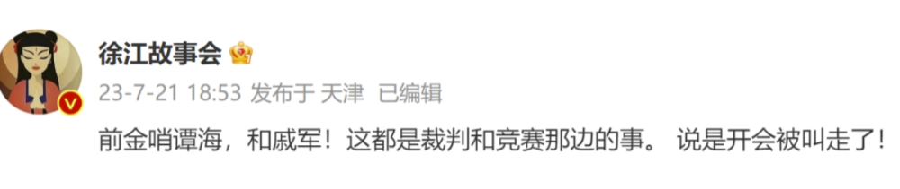
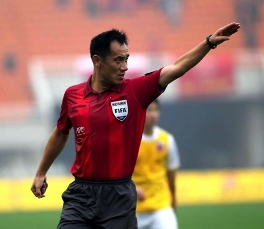
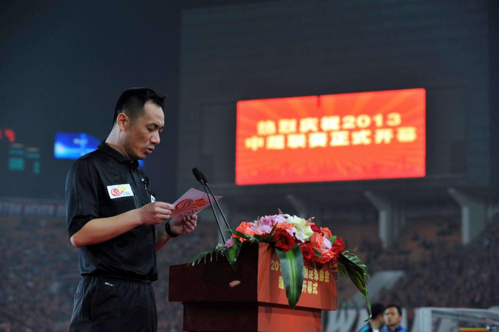
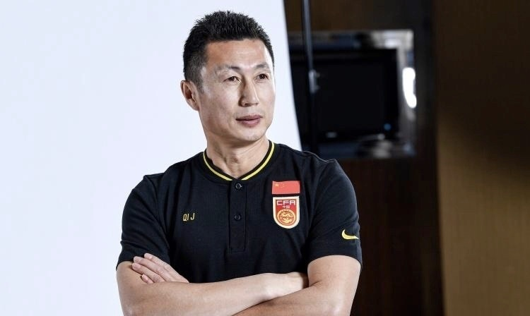

# 轮到裁判了！前中超金哨谭海、足协竞赛部部长戚军被带走调查

中国足坛的“反赌扫黑”风暴在沉寂一段时间后，再起波澜。北京时间7月21日晚，来自国内知名媒体人徐江的透露，前金哨谭海和足协竞赛部部长戚军开会时被叫走。

在本日早些时候，记者赵宇和裴力就在社交媒体上暗示，中国足球又有人今日被抓，但两人都没有透露究竟谁被带走。而徐江则直接点出了名字，分别是前金哨谭海和足协竞赛部部长戚军，两人是在开会被带走的。

谭海生于1970年，2004年成为国际级裁判，他从2005年起开始执法中超联赛，2011年、2012年、2014年和2015年，他四度被主办单位评为“金哨”（年度最佳裁判）。

2016年谭海退休。2018年1月12日，谭海担任中国足协裁判管理部部长。此前，本次风暴落网的人当中并没有来自裁判界。而如果徐江爆料属实，谭海则是第一人。

戚军曾长期担任足协竞赛部部长，他还担任过足协副秘书长，去年8月出任足协战略规划部部长。去年世预赛期间，戚军是国足代表团的领队。

