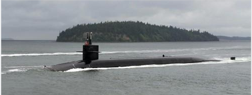

# 韩媒：访韩美战略核潜艇“肯塔基”号驶离韩国，下一站不得而知

【环球网报道 实习记者
詹慧娟】据韩联社首尔7月21日报道，日前访韩的美国海军“俄亥俄”级战略核潜艇（SSBN）“肯塔基”号21日上午驶离釜山作战基地，下一站将前往何处不得而知。

_（美国海军“俄亥俄”级战略核潜艇“肯塔基”号 资料图 图源：韩联社报道配图）_

报道称，“肯塔基”号于18日韩美核咨商小组（NCG）首次会议举行当天驶入釜山作战基地。这是美军战略核潜艇近42年来首次访韩。韩国总统尹锡悦19日登上该潜艇，成为第一位登艇的外国领导人。“肯塔基”号在韩国停靠了4天，其间未同韩军举行联合军演。韩国国防部人士当天向记者表示，战略核潜艇通常不参加联演。

报道还称，驶离韩国的“肯塔基”号下一站将前往何处不得而知。驻韩美军方面表示，战略核潜艇是战略资产，故无法提供有关其位置和目的地的信息。

据韩联社此前报道，在美国核潜艇18日抵达韩国数小时后，朝鲜于19日凌晨向朝鲜半岛东部海域发射2枚短程弹道导弹。报道认为，这是朝方对美军战略核潜艇前一天停靠韩国釜山港实施的“针对性”示威。

对于美国战略核潜艇停靠韩国一事，朝鲜20日作出回应。据朝中社报道，朝鲜国防相强纯男20日发表谈话，他警告美方称，美国派遣"俄亥俄"级战略核潜艇停泊在韩国釜山港作战基地，是40多年来第一次在朝鲜半岛地区部署战略核武器，也是对朝鲜最为露骨而直接的核威胁。强纯男表示，要提醒美方，“包括战略核潜艇在内的战略资产部署的可见性增大可能会符合我们国家核武力政策法令所阐明的核武器使用条件”。

