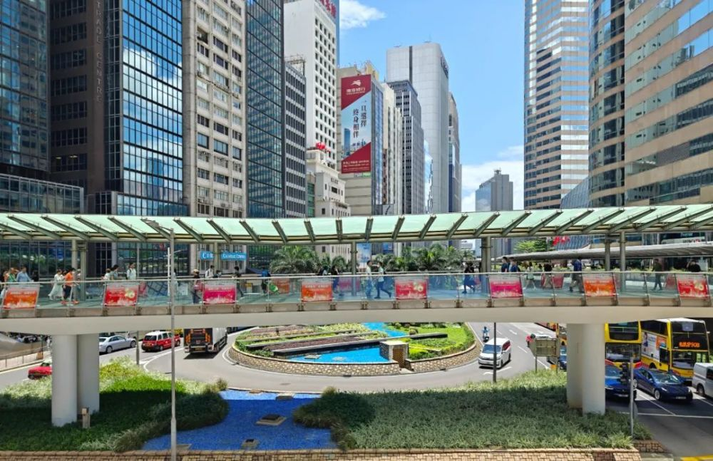

# 3年少了21万人，香港疯狂“抢人”

_作为国际性金融中心，亦保持了其独特地缘优势的中国香港特区，正成为各类人才汇聚的桥梁和枢纽。如何让外来人才真正发挥其作用，香港相关各界近日亦在进行探讨。《财经》记者
焦建/摄_

**文｜《财经》特派香港记者 焦建**

**编辑｜苏琦**

以2022年底起正式推出的“高端人才通行证计划”（下称“高才通”）为核心标志的一系列新型“抢人才”行动，已在中国香港特区实施超过半年。一系列与其成效相关的数字逐渐公布，其经验与短板亦开始浮现。

作为小型城市经济体，中国香港特区和与之情况类似、亦在积极引人的新加坡类似：
**因难以在短期内通过培育本地人才满足发展需求，“抢人才”的效果最为“立竿见影”。**

整体而言，按照特区政府公布的相关数字：今年各项输入人才计划，目前已有超过6万宗申请获批，“成效较想像中好”。其中，备受瞩目的“高才通”政策的外界反应尤其踊跃，接获逾3.6万宗申请，批出约2.6万宗。

“截至6月底的这半年来，（各项输入人才计划）共收到逾10万宗申请，几近是每年输入3.5万名人才目标的3倍，充分证明中国香港对世界人才的吸引力。”中国香港特区政府行政长官李家超近日在出席公开活动时透露称。

**“香港推出高才通等措施，既有内部需求，也有国际环境背景。前者一方面是过去几年香港遭遇比较严重人才流失，另一方面则是香港产业结构希望进行调整，对新型人才需求不断增加；后者则是在大国博弈下，很多美国或欧洲科学家有兴趣回归。”**
中国香港立法会议员洪雯对《财经》记者解析称，“香港迅速调整政策、放宽条件，很快就吸引了很多人，这是策略成功的一面。这其中未必每个人都会最终留在香港，但总体上是值得肯定的。”

哪些人愿意赴港？

**受移民潮、生育率下降及与之相关的老龄化加速等一系列不利因素影响，中国香港特区正面对劳动人口的结构性缩减：其2018年劳动人口有368万人，至2022年只有346万人。**

在全球经济衰退风险大增、多个经济体均借机吸引新产业及中高端人才之时，高度依赖外来人才维持经济活力的中国香港特区亦需正视竞争。

“香港一定会抢人才”，2022年夏，新就任不久的李家超在《施政报告》咨询会上曾有此表示，其范畴则包括创新、医疗及高端科技等领域的优质人才。时至当年10月，在其正式公布的首份《施政报告》中，则正式推出了一系列面向全球初级、中高级人才的政策。

为巩固国际金融中心、全球最大离岸人民币业务中心、全球领先的生物科技融资中心等一系列优势，中国香港将“更积极和进取地‘抢企业’‘抢人才’”。除积极培养和挽留本地人才，特区政府也会以更进取的态度吸纳外来人才，其目标是每年吸纳至少3.5万名人才。

为实现上述目标，中国香港的具体抓手包括在各驻内地办事处和海外经济贸易办事处（经贸办）设立“招商引才专组”，主动接触目标企业和人才，积极游说他们来港发展。

为提升对于人才的吸引力，“高才通”是罗致这些人才来港发展的有力手段之一：符合资格的外来人才在成为香港永久性居民后，可按相关要求在满足条件后申请退还在港置业已缴付额外的印花税。

“高端人才”指毕业于全球百强大学，并在过去五年内累积了三年以上工作经验，相关人士即可获发为期两年的签证来港寻找工作机会。过去一年在其他地区年薪达250万港元（下同）或以上的人士，亦可通过直接获发两年签证来港求职，名额不设上限。

**移民香港的大多是内地富裕阶层，以企业家居多，相比之下，“高才通”的目标群体则以年轻人和中产家庭为主。**

此外，针对初级人才，香港也推出了更有弹性、受众更广的政策。例如，针对在港攻读全日制大学的非本地学生，或毕业于香港高校在大湾区合办高校的学生，均给予相关签证，把毕业后在港逗留时间从一年延长至两年，以便学生有充足的时间寻找工作机会。

“香港有接近5万人的境外学生在各类高校读书。这批人其实也是很值得政府去采取措施留下的，他们在香港生活过因此适应香港、了解香港，比较容易扎根。”洪雯认为，“怎么样留住这批人，是香港值得好好思考的。”

拥有大学学历、具备负担自己食宿的财力、拥有中英文书写及口语能力人士，则可申请“优秀人才入境计划”，获得来港逗留的签证。这一计划最初的年度配额为2000人，2021年相关政策提升至4000人，2022年《施政报告》则进一步取消配额，优化审批程序。

自从2006年港府推出该计划以来，截至2021年底共有3.7万人申请，9131人获批，当中88%的优才来自中国内地。

**整体而言，除高端人才通行证计划、优秀人才入境计划，中国香港吸引外来人才的其他措施还包括一般就业政策、输入内地人才计划、非本地毕业生留港/回港就业安排，以及2015年推出的“输入中国籍香港永久性居民第二代计划”、2018年推出的“科技人才入境计划”。**

在一系列引才输才计划中，最新推出的“高才通”可谓最受欢迎。6月下旬，香港特区政府政务司司长陈国基公开的相关数据显示：截至5月底，各项人才入境计划已共收到约8.3万份申请，超过一半，即约4.9万份已获批。其中，“高才通计划”尤其受欢迎，共收到超过3.2万份申请，当中超过2.1万份已获批。

因时间尚未满一年，具体的获批情况仍未有官方统计数据。但香港特区政府劳工及福利局局长孙玉菡近日亦透露了一些初步的情况：

截至3月28日，特区政府已收到超过2万宗申请，获批的接近1.2万宗。申请数字一直以平均每天200宗平稳上升。在2万宗申请中，超五成为拥有至少三年以上工作经验的全球百强大学毕业生，具备三年以内工作经验的全球百强大学毕业生占27%，年薪高于250万港元的申请人约占22%。

在获批的1万多名申请人中，30岁以下的约占一半，40岁以下的接近八成。因高才通申请人可带配偶及18岁以下的子女一同来港，目前批出的受养人签证约有8300名，其中高薪类别申请人连同受养人一并申请的比率较高，每位获批的申请人平均会带同1.46名受养人。

全国政协港澳台侨委员会副主任、香港新时代发展智库主席屠海鸣近日则在香港当地报刊撰文中提供了一些新的数字：截至今年5月底，高才通有超过3.2万人申请，其中2.1万多人获批，且超过7000人已经到港。从来源地看，来自内地的人才最多；从年龄结构看，18岁至30岁人群最多。

_中国香港特区名额总计2万人的输入计划预计最快从7月起接受申请，其中运输业占8000个。因人手严重不足的情况已持续了一段时间，输入计划引发的讨论比补充计划要小一些。图为天星小轮码头正在监看游客下船的码头工人。《财经》记者
焦建/摄_

获批只是开始

对于高才通等一系列引进人才计划的申请者们来说，拥有香港永久居民身份具备一系列“身份红利”，例如在全球170个左右的国家和地区免签、子女可降分入读高校等。如果是独生子女，或兄弟姐妹均在海外，父母60岁以后亦可以投靠子女的理由，换取香港身份，享受当地的公立医疗等诸多福利。

在此基础上，作为中国的国际性金融中心，香港亦因金融、服务等行业的独特优势，可为内地的申请人提供接触海外工作机会的窗口，使其视野较为开阔，薪资水平亦有一定吸引力。此外，中国香港的税负偏低，其个税累计的税率最高为17%，低于美国税改后的37%，亦远低于英国、德国等的最高档45%。

中国香港还保持了其独特的地缘优势。如前所述，中美角力正使得越来越多的华裔学者和科学家回流中国。中国香港也受惠于这股回流潮，单是香港大学和中文大学，近期就有不少知名学者落户。

例如就任港大教职的两位学者中，其一是马毅，他是人工智能（AI）机器视觉的知名学者，本是加州大学伯克利分校（UCB）电子工程与计算机系教授，他从该停薪留职后，今年加入香港大学，出任数据科学研究院院长。另一位则是美国布鲁金斯学会约翰桑顿中国中心主任李成，他是美国知名中国问题学者，今年在港大创建“中国与世界治理中心”。

借助这些优势，中国香港希望真正罗致人才为其所用。这至少亦有两重考虑，即一方面为填补其金融、法律等传统优势行业的人手缺口；另一方面亦为其实现“再工业化”进行准备、壮大人才库。例如，人工智能大数据、生命健康、医疗健康、金融科技、新工业、新材料等领域的人才便广受欢迎。

在前一方面，除中小学生数量连年降低，香港的大学毕业生人数亦呈下滑趋势，由2018年的1.7万人跌至1.5万人左右。
**疫情期间，由于大量劳动人口流出，新投入职场的毕业生却未能填补市场上的空缺，许多企业陷入窘况。**

“香港中级及初级人才的市场供应近年来大多处于不饱和状态，本地毕业的大学生数量难以满足市场需要；另一方面，由于近两年中高层人才流失，企业招聘需要更长时间，不少金融行业的大公司更加重视培养初级人才的同时，亦希望吸引外来人才。”在港从事人力资源管理行业多年的周鑫女士对《财经》记者解析称。

因为香港不少相关行业已经出现了较为严重的人手缺口，李家超近日亦透露称：特区政府准备进一步放宽人才申请条件，“高才通”的门槛将降低至不限于世界百强大学毕业生。

例如，在医学等一系列特殊行业的专业人才短缺情况较为明显。根据相关数据显示：过去1年当地医生流失率约为8%，护士的流失率则超过10%。为解决医护人不足的难题，当地近日就撤除了认可医学资格的壁垒，向内地的顶尖医学院学生发出工作邀请。

在后一方面，实际上与香港正在实施一系列新产业政策密切相关。按照前述《施政报告》提出的设立100亿港元的“产学研1+计划”，2023年起将以配对形式资助最少100支有潜质成为初创企业的大学研发团队，激励产学研协作，加快科研成果的转化和产业发展。同时，特区政府会连同由财政司司长陈茂波带队的“引进重点企业办公室”，配合50亿港元的“策略性创科基金”，以及港深创新及科技园提供的土地，吸引优秀企业和人才落户香港。

“过去几年，我们花了大概2000亿左右，营造了一个比较好的创科生态，但是还没有大的科创企业在香港，没有大的科创企业，就很难汇聚人才，也很难再进一步有科研突破，所以特区政府就提出我们要‘抢企业’‘抢人才’。”陈茂波近日表示，“我们希望你们过来投资。在香港有业务，可以设双总部，一个国际总部，一个内地的总部、全球的总部。你需要的话也可以把你的部分人才调过来，我们也非常欢迎。”

“人才的流动优先考虑的是工作机会以及相关产业的发展前景，当前香港产业结构并不合理，金融产业一枝独秀，而其他传统支柱产业对GDP的贡献明显萎缩，人力资源存在明显的错配。而人才是跟着机遇发展走的，这其实就是“一体两面”的问题：如果没有形成产业生态，人才要么不会来，要么来了挣扎一段时间找不到合适的机遇就走了，新业态也就很难形成。”洪雯指出，“所以我一直倡议：人才跟产业生态的发展要齐头并进。香港要尽快把一系列的产业推进计划落实起来，这样人才就容易融入到生态当中去，能够实现扎根与发芽。”

按照相关规划：2023年至2025年间，香港希望吸引至少1130家企业在港开设或扩展业务。在吸引人才规模方面，香港则期望同期通过一系列新措施，每年最少可以输入3.5万名预计逗留超过12个月、打算在香港长远发展的人才，较2021年输入人才的水平增加约40%。

这其实并非一个较高的标准。但“高才通”如何真正发挥其作用，香港相关各界近日亦在开始进行探讨。

其中的一个担心是人才“来而不居，居而不留”，因此对本地经济发展的贡献甚微。实际上，亦有一些相关讨论称“高才通”只是当作赴港的旅游及商务签证，甚至可以借机赴港生育。

这一方面与政策的执行较为宽松有关。以高才通为例，此计划毋须工作证明，只需来自指定百强大学毕业即可申请，而且程序简易，期间不论已获聘或转工，都不一定要向政府告知。

有商界人士对此直言：该计划的最大问题，就是这些人才是否真的有心留下来工作。因此，特区政府应当为那些真正有意在港工作的人才提供“售后服务”，认真了解他们的需求，并切实提供资源，从而绑定他们跟香港的联系。

在此方面，外来人才真正融入香港并不容易。按照香港立法会2020年发表的“全球争夺人才”《研究简报》显示：
**在2010年至2019年期间，引进外籍人士来港工作的“一般就业政策”签证同比增加近五成，但是同期居港的外籍人士不升反跌，减少近三成。“输入内地人才计划”批准了5.7万宗申请，但是根据该计划来港并成为香港永居的仅有7033人——换言之，只有12%的内地人才在香港工作、居住满七年，最后成为香港永久居民。**

此项研究指出：香港难以留住人才的主要原因在于生活成本高昂，削弱了香港优厚薪酬的吸引力，在计算生活成本等因素后，香港本地职位的薪酬不如内地及新加坡的相似职位。

“为帮助人才在香港扎根。应该与申请人有更多沟通，让他们了解香港的机遇，吸引他们真正来港定居。比如，一些来自内地的人才，他们希望到香港寻找新机遇，但已过了看报纸广告找工作的阶段。特区政府除了给一个签证，并没有帮助他们跟产业、社会需求匹配起来。”洪雯建议称，“在一些细微的环节，特区政府应该形成一定的机制，去追踪这些个案并提供一定的协助。如果政府不方便出面，可以委托一定的社会机构去建立网络，帮助他们在香港settle
down（安定下来）。香港企业也可发挥作用，整体从民间、社会层面为香港留人。”

为解决相关问题，中国香港已于2018年成立人力资源规划委员会，致力整合政府和各界的资源与力量，检视、检讨及统筹宏观人力资源政策和措施。

孙玉菡则于7月上旬时亦透露称：特区政府正筹备成立实体的“香港人才服务窗口”，其工作除专责对外推广招揽人才及从生活各方面协助来港人才落户外，亦会与来港人才保持联系，留意他们在港的发展，构建人才群组，为香港进一步发展作出贡献。

