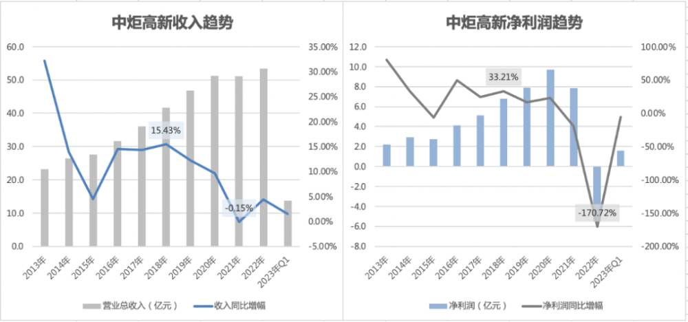

# “野蛮人”姚振华吃了闭门羹

作为酱油界的“老二”，上市公司中炬高新曾是广州中山市第一家上市公司，坐拥知名酱油品牌厨邦、美味鲜，但最近因为前两大股东宝能系和国资股东中山火炬集团有限公司（以下简称“火炬集团”）的斗争升级，再次陷入了麻烦。

戏剧性的一幕发生在7月19日下午，宝能集团董事长、曾被王石称作“野蛮人”的姚振华到中炬高新总部调研，却被保安拦在了门外。

在一段宝能集团官网公布的视频中，姚振华愤愤不平地怒斥道，“是谁让你们这样做？你们两个实话实说就行……我从来没见过能够乱到这种程度，这是在大湾区，营商环境最好的地方！”

 _▲图源：宝能集团官网视频截图_

中炬高新更多闹剧还在陆续上演，股东大会前夕宝能系董事、高管大“换血”，新董事受阻无法办理入职手续，国资股东以多年前土地纠纷起诉上市公司，导致中炬高新因巨额赔款陷入上市首亏……

在这背后，曾经“野蛮入主”多家上市公司的宝能系日渐式微，曾被其收入囊中的公司逐渐失控，陆续脱离宝能系的掌控。

脱离宝能系，中炬高新等不及了

中炬高新的内斗剧情又更新了，而最近几集还要从二股东火炬集团的“反水”说起。

2015年开始，宝能系以前海人寿之名进入中炬高新股东之列，2018年宝能系将所持中炬高新股份统一划归中山润田，后者就此取代火炬集团此前延续多年的第一大股东之位，姚振华也从2019年开始成为中炬高新实际控制人。

失去控制权后，火炬集团似乎一直在等待翻身的机会。

2022年一季度开始，宝能系由于债务问题根基松动，中山润田持有的中炬高新股份被陆续拍卖、划转，中山润田对中炬高新的持股比例也从高峰时期的25%一路降至2023年5月26日的9.58%。

过程中，火炬集团与一致行动人鼎晖隽禺、鼎晖桉邺、Cypress
Cambo等陆续增持中炬高新股份，并于2023年1月正式超过宝能系的持股，回到第一大股东之位，但当时双方持股比例差距较小，战况依然焦灼。

 _▲数据来源：Wind_

不过，截至2023年7月20日，宝能系中山润田对中炬高新的持股比例只剩下9.58%，远低于火炬集团及其一致行动人19.65%的持股比例。但公司实际控制人仍为宝能系姚振华。

急于改变现状的火炬集团，终于在7月7日通过监事会发起召开股东大会的提案，计划于7月24日召开股东大会，议案内容包括罢免何华、黄炜、曹建军、周艳梅四位宝能系背景的董事，同时选举四位新董事。

但宝能系也没有坐以待毙，在股东大会召开前夕，做了两件让许多人出乎意料的事。

首先是从7月18日开始到7月21日，即原定股东大会前夕，有宝能系背景的副总经理张弼弘、董秘邹卫东、总经理李翠旭和副总经理李健，先后辞去职务或被董事会免职，与此同时，董事会将同样有宝能系背景的邓祖明、孔令云、秦君雪和田秋提名为新任总经理、副总经理和董秘，总体来说相当于宝能系换掉了四个“自己人”。

上述人员变动虽然理论上获得董事会6票通过（3票反对）后生效，但相关人员受各种阻挠，并未能顺利办理入职。有观点认为，此举或是宝能系试图在中炬高新董事会改组前夕以相关动作干扰改组。

其次是从7月12日开始，宝能集团官网连发三份严厉声明，谴责火炬集团及其关联方的一系列不当行为，包括7月12日、14日举报其涉嫌虚假诉讼、操纵证券；7月20日谴责相关人员阻拦姚振华进入公司调研。

 _▲注：来自宝能集团官网截图_

无奈的宝能系，相当于将股权斗争完全搬到了台面上。

结合董监高履历背景，当前局势已经逐渐明朗——现有董事会13名成员中有8名关联火炬集团，虽占据多数，但其中或有人改变站队，导致宝能系暂时控制了董事会，得以通过近两次临时更换董事的决议。

四名监事会成员中有2名关联火炬集团，1名为公司老员工（职工代表），还有1名关联宝能系，火炬集团占优势，这也是为什么火炬集团无法按照正常流程通过董事会召集股东大会，而要通过监事会发起罢免宝能系人员的股东大会。

除此之外，目前7名公司高管中，尚有6名关联宝能系，1名关联火炬集团，但这种局面很可能会在24日召开股东大会更换董事后被扭转。

事实上这也早已不是火炬集团第一次和宝能系“唱反调”了。

早在2019年姚振华首次成为中炬高新实际控制人后，多年来许多次董事会决议中，都有火炬集团背景的余健华董事投出反对票。

除此之外，2021年中炬高新曾在债务压力下，抛出出售房地产子公司中汇合创、向大股东中山润田增发股份的计划，但都被火炬集团以投票反对和土地协议纠纷诉讼等方式横加阻挠。

只是相比以往的明争暗斗，近期中炬高新保安直接将公司实控人姚振华拦在门外，显得尤其“戏剧化”，或暗示着双方矛盾的进一步升级，以及宝能系危机的加剧。

股权斗争下的巨亏

不断升级的股权之争，已然让上市公司中炬高新成为最大受害者。

成立于1993年、上市于1995年的中炬高新，早期以国家级中山火炬高技术产业开发区为依托，投资了食品、汽配等领域。宝能系进入之前，其实控人是中山火炬高技术产业开发区管理委员会。

经过多年发展，中炬高新形成以调味食品为主、房地产等其他业务为辅的业务模式，收入规模一路从数亿元增至2015年的近30亿元，净利润也从数千万元增至近3亿元，没有大风大浪，但一直以来都还算平稳。

直到2015年“野蛮人”宝能系的出现。

当年的“宝万之争”最终以宝能系失败落下帷幕，但几乎同一时间，从万科退败的资金中有一部分来到了中炬高新，后者的命运也开始发生变化。

数据显示，自2019年姚振华成为中炬高新实际控制人以来，其收入和净利润的增长幅度就开始显著放缓，其中2021年和2022年，中炬高新的收入同比增幅分别只有-0.15%和4.41%，均为近十年来最低，2022年更是出现5.55亿元的上市以来首亏，最新业绩预告显示，2023年上半年还将有14亿元左右的巨额亏损。

_▲数据来源：Wind_

而2022年和2023年上半年的巨亏，与两位股东的明争暗斗有直接关系。

2021年8月，为了“狙击”宝能系出售中炬高新地产子公司的计划，以及向大股东中山润田定向增发股票的预案，与二股东火炬集团有相同实控人的中山火炬工业联合会，以20年前的土地协议纠纷为由，将中炬高新告上了法庭。

具体来说，20多年前中炬高新还由火炬集团实际控制时，曾与中山火炬工业联合会签订协议，向后者出售一块地，但在收款后始终未进行交付。不知出于何种缘由，多年来中山火炬工业联合会都没有向中炬高新讨要过这块土地，但恰巧在宝能系即将有大动作时，以此为由将中炬高新告上法庭，打乱了宝能系的计划，个中曲折确实耐人寻味。

但火炬集团还是达成了目的，2022年法院查封了中炬高新持有的房地产子公司中汇合创的股权，中炬高新因此无法推进出售中汇合创的计划，向中山润田定增的美好愿望也就此破灭。

还是因为这一起离奇的诉讼，2022年中炬高新计提了11.78亿元预计负债，导致当年净利润由盈转亏。2023年6月法院判决中炬高新败诉，需要向工业联合会返还土地转让款995.96万元并支付19.19亿元土地增值溢价，导致上半年业绩再度亏损，出现约14亿元的巨额亏损。

业绩重创下，中炬高新股价大跌——市值从2020年9月最高点508亿元跌至2022年5月的最低点188亿元，缩水63%，目前已陆续回升至273亿元。

与此同时，因为宝能系债务问题，中山润田质押的中炬高新的股份陆续被动减持时，火炬集团就地反击，趁着中炬高新因巨额亏损股价大幅下跌，拉拢多位一致行动人在股价低位增持上市公司股票。2022年8月到2023年5月，火炬集团及四位一致行动人共斥资约16.7亿元，增持中炬高新4858万股，重新回到了第一大股东之位。

这也是宝能系控诉火炬集团等“涉嫌虚假诉讼”“操纵证券”的原因。

除了诉讼导致的大幅亏损，中炬高新的财务基本面也在姚振华成为实际控制人后开始一路走低。其收入从2018年到2022年只增长了30%不到，毛利率从39.12%跌至31.7%，负债率也有所提升。

作为对比，同期酱油界“大哥”海天味业的营业收入，在2018年170亿元大基数背景下还增长了50%。一个重要原因是，海天味业用这5年时间把产量提高了84.4万吨，而忙着争夺控股权的中炬高新，产量只提高了15万吨。

兜兜转转，火炬集团在当前股价较低点拿回了大股东之位，中炬高新的股价虽较最高点有大幅缩水，但较2015年宝能系举牌进入时14元/股至22元/股的成本价，还有54%至143%的溢价，宝能系也并不算亏。

相比之下，巨亏的中炬高新，以及在股价高点买入中炬高新的无辜散户们，或是这场风波中受伤最深的。

风险蔓延

出生于1970年的姚振华，1992年毕业后先是在国企工作过几年，借着南巡讲话的时代机遇，以“潮汕帮”为支撑，在深圳借着“菜篮子”工程的契机，成立了新保康蔬菜实业有限公司，以建设净菜超级市场的缘由，拿下了深圳宝安区14万平方米的土地，就此进军房地产市场，扎下了根基。

2006年，宝能集团又拿下深圳国有企业深业物流集团的控制权，并在深业物流上市失败后，分走了公司名字的使用权和深业物流的许多土地，尝到了“入股”“分地”这种商业模式的甜头。

2012年姚振华更是大手笔组建前海人寿保险，吸纳大量社会资金，并且在当时对保险资金监管有限的背景下，以险资撬动金融机构资金，四处“狙击”上市公司，先后与万科、格力交手，被王石痛批“不配成为万科大股东”，被董明珠怒斥为“破坏实业的罪人”，引发监管关注。

 _▲图源:视觉中国_

虽然没能拿下万科和格力，但前海人寿资金还是在2015年进入了多家上市公司，包括南玻A、韶能股份和中炬高新，2015年末宝能系前海人寿分别持有这三家公司11.08%、15%和18.5%的股份，之后还有所增持。

在宝能集团官网介绍中，这三家公司和宝能旗下的汽车业务，共同构筑起集团相当重要的高端制造业务板块。

潮涨潮退，早些年崛起的多个资本派系，都在近几年遇到了不同的困境——中植系债务逾期，创始人解直锟因病逝世；海航系分崩离析，两位创始人一个意外身亡一个锒铛入狱，造就国内迄今为止最大破产案；恒大则顶着2.4万亿负债成为近期热搜。

相比之下，2021年开始显露资金问题的宝能系，已经属于生命力相对“持久”的存在。

2021年初，早年一起创业的姚振华及其兄弟姚建辉，传出要“分家”的消息。据财新报道，“姚建辉在2021年初的公司内部会议上公开宣称，将彻底退出宝能，原因是与姚振华“经营理念不合”。有观点认为，“二姚分家”或是一种分割风险的方式，为两兄弟留一条后路。

2021年6月开始，宝能系多家子公司爆出裁员、拖欠薪酬社保等问题，流动性危机显露，缺口不断放大。

在这之后，就是宝能系旗下上市公司或发债主体越来越频繁的公告，关键词大多涵盖债务逾期、民事裁定、股份冻结等等，宝能系的“遮羞布”被一点点扯下。

2022年年报显示，姚振华个人涉及高达25笔执行案件，「市界」统计，其负有连带担保责任的债务金额合计高达350.84亿元，中山润田三笔数额较大且到期未清偿的债务合计达21.5亿元。

整个宝能集团截至2021年9月底的合并报表总资产为8300亿元，剔除并表金融资产及负债后总资产4300亿元，有息负债合计1927亿元，对外担保余额308亿元。

其中宝能系旗下重要的融资主体钜盛华，2021年末共有349.21亿元逾期借款，融资及对外担保等诉讼事项涉及本金及利息金额550.02亿元，且截至当前共有14支存续债券，合计118.28亿元，其中7支处于“展期”状态。

债务黑洞下，宝能系相关人员屡次传出各种消息，集团资产也开始被大量拍卖。

2022年3月广东省广州市中级人民法院传出“姚振华下落不明”的消息，后经证实姚振华仍在公司上班，大概率是未能及时回应法院通告所致。2022年8月，又传出宝能集团高级副总裁、前海财险董事长黄炜曾被深圳有关方面带走调查的消息，市场再次哗然。

公开资料显示，2022年以来，宝能系旗下深圳宝能城花园已成功拍卖219套住宅，成交总价35.62亿元，其持有的中炬高新和韶能股份股票也被大量拍卖，对价约17亿元。

资本版图破裂之际，包括中炬高新在内，宝能系曾经“野蛮入主”的上市公司，正在陆续失去控制。

主营玻璃业务的上市公司南玻A，目前第一大股东仍为前海人寿，但前海人寿与宝能系早已在内讧中分道扬镳，而目前南玻A的董事会席位中，前海人寿席位占多数，意味着宝能系已对其失去控制。

与入主中炬高新相似，宝能系也曾通过华利通持有上市公司韶能股份近20%的股份，但因为债务问题从2022年开始陆续被动减持，最新持股比例已降至6.84%，早已让出前三大股东的位置。

如此看来，宝能系对中炬高新仍然咬紧不放，正是这个曾经庞大的资本系的奋力挣扎。

**作者 |** 林夏淅

**编辑 |** 刘肖迎

**运营 |** 贾天宇

