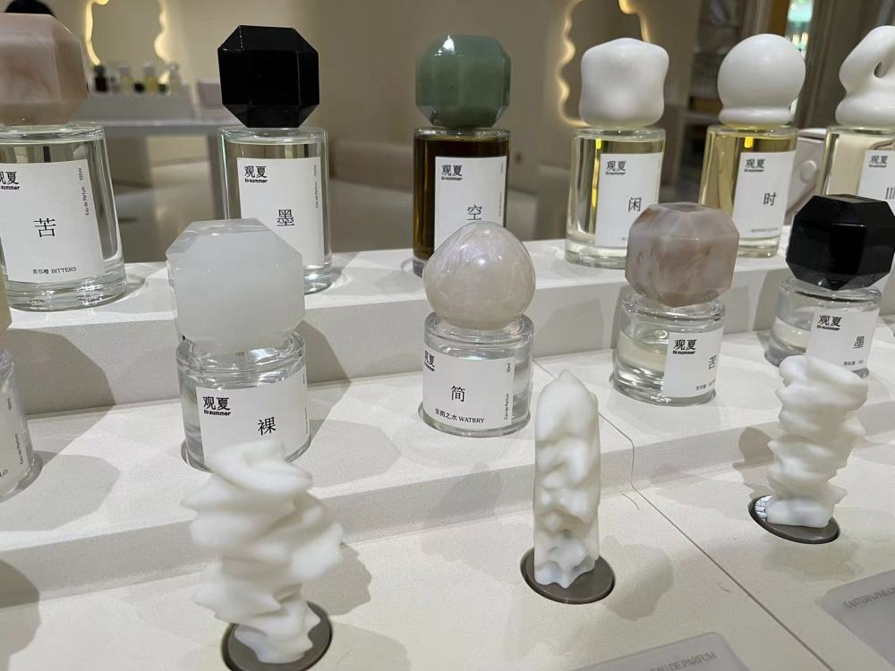
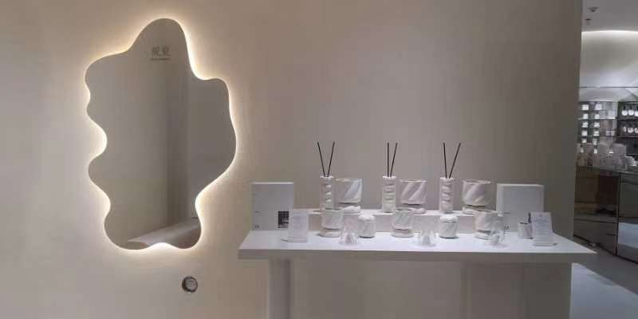
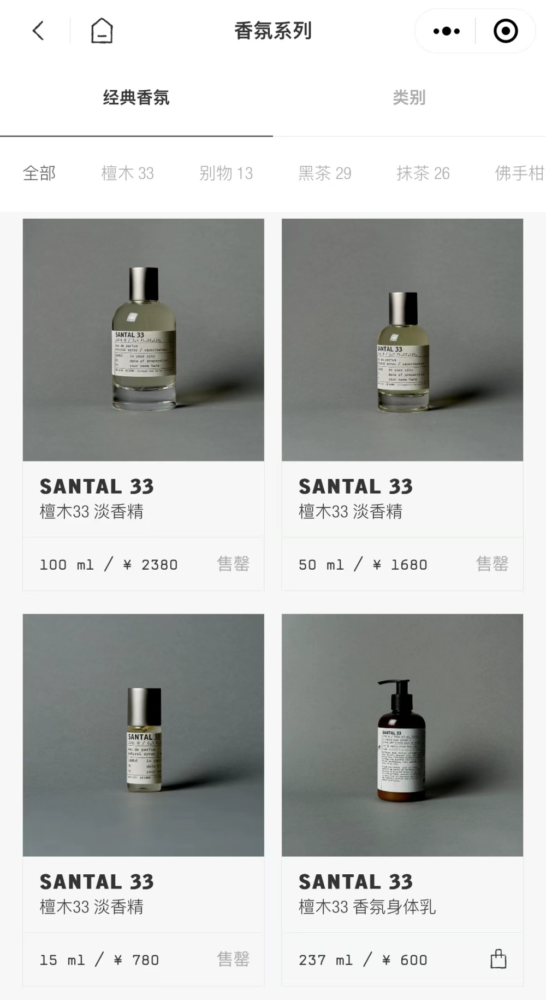
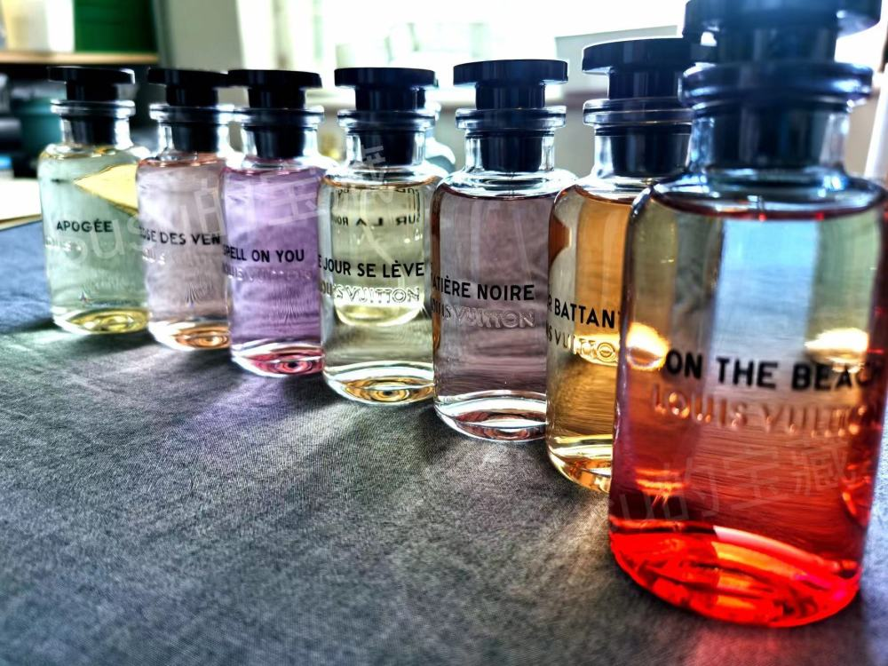

# 千元国产香水也卖断货，有人买香水花掉上百万，有人靠二手倒卖大赚

本文来源：时代财经 作者：周嘉宝

在香氛这一细分领域，国产品牌逐渐占据一席之地。

7月，国产香氛品牌观夏西南首店在成都正式营业。成立于2019年的观夏正加速线下布局，三个月前，该品牌刚刚落子江苏首店，目前拥有9家独立店铺。其品牌联合创始人曾透露，理想中的观夏总门店数量在13家至15家。

 _观夏北京三里屯门店。时代财经/摄_

香氛爱好者茂茂有些兴奋，“现在逛街看到的香氛门店越来越多了，尤其是国产品牌。”观夏在北京三里屯门店的销售人员亦透露，消费者在周末时常需要排队才能进店，部分热卖产品也会出现断货现象。

不只是观夏，更多本土香氛品牌傍身于SKP、IFS、太古里、万象城等高端商场，加速涌入一、二线城市中心消费圈。今年5月，Melt
Season北京首店在三里屯太古里北区开业；6月，高端本土香水闻献的新店落户杭州万象城，该品牌两年内已陆续开出8家试香空间和2家书屋。

国产香氛品牌攻城略池背后，是中国消费者对香氛认知的觉醒，香氛消费热情空前高涨。在时代财经的采访中，有受访者两年购入1000瓶香水；有人每月将1/3的工资用于香水消费；还有人靠“玩香”理财，7年赚了30万元。

据凯度数据，2021年中国香水市场整体零售额仅占世界香水市场的4.1%，但2016年至2021年的复合年均增长率却高达21.4%；预计到2026年，中国香水市场的整体销售额将达到371.3亿元，未来五年市场的年复合增长率维持在22.3%左右，为世界香水市场整体增长率的3倍。

随着消费者、品牌、资本的持续涌入，撕掉平价标签的国产香氛，试图闯入众多国际品牌主导的中高端市场搅弄风云，一场嗅觉消费革命在东方之境酝酿。

**撕下平价标签，神秘东方香卖到2000元**

从事IT工作的李玩玩是一名重度香氛爱好者。十余年来，她保持着每周都购买香水的习惯，每年的消费额超过10万元。

近两年，李玩玩也明显感受到这股本土香氛风潮，“会感受到公共场合中有喷香水习惯的人多了，周围的人也会讨论相关话题，而在以前能一起交流的人都很少。”许多中国本土产品也逐渐进入了她的收藏列表，例如闻献、观夏、乂㸚制香和浮香堂。

时代财经发现，这与国产香氛品牌数量的增长不无关系。据不完全统计，在2016年以前，国货香氛品牌以每年约3-5家左右的速度增长，但除了气味图书馆、冰希黎、RE调香室、野兽派等品牌，市面上真正知名的品牌寥寥无几。

2017年-2019年，这一赛道开始涌现出大批主打东方文化的新品牌，每年约9-10家新品牌面世。疫情之后，国产香氛品牌迎来大爆发，在2020年-2022年成立的国货品牌超过50家。

桂花、茶、雪松、梅子这些贴近中国人生活的味道时常出现在本土品牌的主推产品中，“昆仑煮雪”“颐和金桂”“空无一木”“夜漠回声”，这些腔调十足的香水名字将神秘的东方氛围拉满。

_观夏在北京三里屯门店。时代财经/摄_

中国消费者对这套玩法的买单意愿超乎想象。

据媒体引用增长黑盒的数据，观夏2021年全年的销售额约为1.43亿元。此前该品牌曾透露，观夏微信订阅数已达到百万级，复购率达60%。

“整个行业从无到有，再到繁盛，发展得非常快。”连界启辰资本投资总监、“兔子看消费”主理人兔子对时代财经表示。成立仅2-3年，年销售就过亿元的国产香氛品牌已经有好几家。“这在当下其他的消费赛道并不常见。”

她认为，这受到多方面因素推动，“首先，疫情居家让大家关注到了情绪价值与悦己需求；其次，年轻消费人群的眼界和精力，让他们对香氛产品不再陌生。这几年国潮消费也助推了本土香氛品牌的成长。”

本土新品牌开始向更高的价格带试探。以2021年成立的闻献为例，其明星产品的售价约为980元/30ml，均价在32.6元/ml；一款以四季为主题的浓香产品则定价1900元/30ml，另一款精油家居香氛则定价2650元。

可以对比的是，经典的“香奈儿五号”在中国市场售价为890元/35ml，约合25元/ml。祖马龙明星产品“英国梨与小苍兰”售价在660元/30ml，约合22元/ml；雅诗兰黛集团旗下的馥马尔香水出版社“浓缩苦橙”的价格在1620元/50ml，约合32.4元/ml。

**低成本、高毛利，资本盯上中国香水**

快速崛起的东方香氛新秀引起了资本和美妆巨头的关注。

2019年，真格基金、IDG资本等完成对观夏的天使轮融资，2020年底，红杉中国参与了观夏A轮融资；闻献在2021年6月和12月先后完成种子轮和天使轮融资，次年9月，该品牌收到了来自欧莱雅中国、凯辉基金数千万元的A轮融资。另一家成立时间更早的香氛品牌气味图书馆的背后，则是来自西班牙香水巨头Puig。

兔子直言，“近几年，投资人会有意识地去培养各个赛道的国产品牌、新国潮品牌。而国产香氛赛道也要培养消费者的认知、消费者的使用习惯、消费的场景，这些都是需要大量成本，资本入局是必然结果。”

除了投资机构，国产香氛背后还有国内外美妆巨头的身影。“和护肤、彩妆类似，香氛品类最大的成本就是对品牌的营销包装。整个消费环境疲软的背景下，可以讲的故事无非是国人的情绪，精神上的愉悦，功能和功效。”

当然，资本看中的不只是故事，更是实际的回报。兔子直言，“一个行业要起来，前提是要让参与这个行业的人都能赚到钱，大家才愿意入局。香氛产品成本低，毛利率高，这意味着当中的渠道、参与者都有了很大的利润空间。”

兔子认为，过去几年爆发式增长的品牌，归根结底还是切中时代和消费者的情绪。情绪到位，价格都不是问题。“加上包装等，香氛产品的成本可能只是售价的20-30%。”

早在2019年，有法国媒体披露，法国香水的出厂成本仅占售价约15%。消费者为香水支付的费用中，品牌商利润和广告营销费用占据了绝大部分。另有业内人士透露，市面上许多定位不一的国产品牌实则共用一个代工厂，虽然产品配方差异会影响成本高低，但也无法完全解释终端销售的巨大价差。

高额利润诱惑和消费热潮下，更多本土品牌跑步入场。节气盒子CEO孙雪婷对时代财经透露，公司预计下半年推出新的高端香水品牌，定价在799元-1299元之间。

值得一提的是，目前国内中高端香氛市场竞争格外激烈。2020年以来，梅森·马吉拉、阿蒂仙、潘海利根、馥马尔香水出版社等国际品牌陆续进场。今年6月，雅诗兰黛旗下高端香氛品牌Le
Labo在上海开出中国首店，官方小程序上，许多售价超过2000元的香水显示已售罄，一瓶难求。

 _图片来源：Le Labo官方小程序截图_

不过，在孙雪婷看来，中国本土的高端香氛市场仍大有可为。根据《2023香水香氛消费者洞察白皮书》，美国、欧洲等国际市场香水渗透率分别达到50%、42%，高速增长的中国香水市场渗透率则在5%左右。

她认为，对于消费者而言，香水消费的品牌排他性并不强。“香水是一个具有人格标签和文化标签的产品，我可以拥有国内的品牌，也可以拥有国际的品牌，只要找准赛道和位置，沉淀下来。一旦做了高端，就意味着你要的并不是大众市场。”

兔子也进一步指出，“过去国内香氛消费市场的规模可以忽略不计。而一旦市场的基数几乎为零时，增速就会十分可观，在一个新兴市场找20%的增量和在一个存量市场找增长的难易程度完全不同。”

**越高端越抢手，有人花200万元买香水**

中国香水爱好者在香水消费上也展现出惊人的购买力。

在上海工作的林玲月入过万，每月刨除数千元房租和日用已所剩不多，但仍保持着月入一瓶香水的消费节奏，“有些香水很贵，特别心动的，攒钱也要买。”

香水老玩家李玩玩则将自己1/3的工资都用在香水上。据其介绍，很多时候，为了体验一款香水，自己会沐浴更衣，完整地与它待上几个小时，甚至一天。一张购物截图也显示，仅在今年6月26日，李玩玩就购入7瓶不同味道100ml的Lubin品牌香水和14支Creed品牌香水分装小样，共花费8305元。

另一位香水老玩家菁菁已经为买香投入了超200万元，“从2006年到2020年只买了几瓶香水。但这两年，买了非常多。”

_图片来源：小红书用户@跳蚤儿_

越高端，越抢手，没有香氛爱好者能逃过“天香”的魔力。李玩玩和菁菁就分别拥有一瓶Jacques Fath L'Iris de
Fath香水，花费约1.3万元。该产品也被网友称为“天价鸢尾”，主要卖点在于其追溯至上世纪的调香配方，昂贵的鸢尾根原料及每年150瓶的产量。

菁菁透露，除了天价鸢尾，近万元的高端香水在她的收藏中并不少见，比如Henry Jacques“Down To
Heart”，售价约1.3万元/15ml。此外，她还有9瓶同品牌的香水精油。而目前，菁菁的购买力仍在进阶。

_图片来源：小红书用户@跳蚤儿_

时代财经发现，许多香水爱好者的消费态度和菁菁类似，对产品溢价具有很高的宽容度。消费者一旦认可产品和它背后的故事，都愿意在能力范围内为产品买单。

Vogue
Business发布的报告显示，高端香水对拉动国内香氛市场增长起到关键作用。2015年-2020年，中国高端香水市场的销售额占比从70%提升至91%。Euromonitor预测，未来几年，大众香水市场将逐步收缩，预计到2026年高级香水销售额将实现146%的复合增长率。

随着中国消费者对高端香水消费需求高涨，香水品类在二手交易市场也开始活跃。绝版香水、限量香水、和购买渠道的差别都会带来溢利空间。在闲鱼，一瓶“天价鸢尾”正以分装的形式对外销售，卖家给出的价格是350元/0.5ml，若整瓶都以分装形式售出，则可获利约8000元。

拥有6年香水消费经验的林子乔，2022年开始在社交平台分享他的“香水理财”经验。林子乔对时代财经表示，品牌自身的涨价行为、渠道管控、出货量调整、C端热度升高、产品改版和停产都会导致香水在二手市场价格上涨。

依靠这套逻辑，林子乔在手里有闲钱的时候，通过海淘囤积一些限量款、改版、或热度较高的香水，让他在7年时间内赚了近30万元，“我知道哪些产品差价大，哪些有市场，可以先买好东西回来再出售。”

值得一提的是，许多国际品牌香水正以奢侈品姿态活跃在市场。2019年问世的The Spirit of Dubai
Shumukh售价130万美元，L'Abeille Noire Édition
Prestige娇兰的黑蜂尊享版售价25.2万元。今年5月，娇兰限量发布了由雕塑和玻璃艺术家Aristide Najean设计的香水“Bouquet de
la Mariée Murano Edition”，售价约合人民币19.6万元。

国产品牌方面，近一年有不少消费者对闻献等国产香水的定价表示不满，国产香“割韭菜”的话题也一度发酵。但有入局者认为，“在当下的年轻人心里，中国文化是有溢价的，中国的高端香水也一定能够走出来。”

（文中受访者李玩玩、菁菁、林子乔、林玲为化名。）

