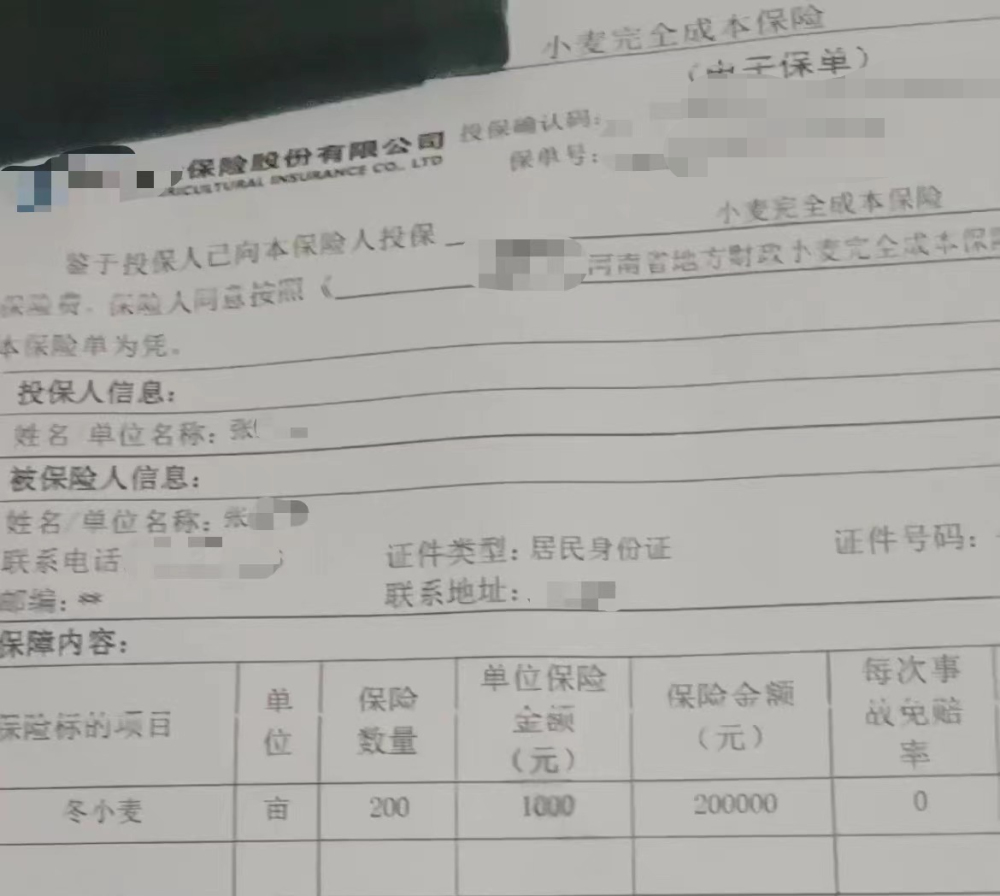

# 小麦遭“烂场雨”减产被曝每亩赔20元，农户：没有给庄稼买保险的习惯

7月20日，遂平县的乡村公路上，凉风习习。午休过后，村民们三三两两，或坐在公路边乘凉，或聚在村头闲谈。只有收粮站里，红蓝条纹塑料棚布下来不及运走的小麦堆，和田间地头半人高的玉米，印证着6月的繁忙。

这座位于河南省驻马店市的小县城有103万亩土地。在这个季节，车子驶离县城后，就能看到连片的、绿油油的玉米地。而就在两个月前，土地里还是金黄色的麦穗。

今年麦收，河南遭遇10年来最严重的“烂场雨”（指麦收期间的连阴雨），麦子发芽、品质下降，从而导致小麦收购价的降低。豫南的驻马店市、南阳市等地尤其受损严重。

近期，“小麦遭‘烂场雨’减产（保险）每亩赔20元”的话题引发关注。遂平县的农户们对此并不感兴趣，如今，地里的玉米正是生长期，他们更期盼一场大雨的降临。

多数农户告诉九派新闻，他们没有为庄稼购买保险的习惯。比起没有确定性的保险赔付，“俺们种庄稼的人，都是靠天吃饭”，一位农户说。

_遂平县农户6月种下的玉米，已经长至半人高。图/九派新闻陈冬艳_

**【1】给庄稼买保险**

20日下午，艳阳高照，遂平县石寨铺镇一村庄的街道旁，农户聚在树荫下打牌。一扇红墙上，牌匾上写着“xxx险遂平县石寨铺镇农业保险xx村服务点”，红墙两侧商铺的大门紧闭。

有农户介绍，这是某保险公司在村里的代办点，但大多数时候，这里并没有人。“没有业务，人在这干啥。”一位姓刘的农户说。在石寨铺，被询问是否给庄稼买了保险时，大部分农户的答案是否定的。

而偶有一两位买了农业保险的农户，被问及今年小麦的损失是否获得赔付时，农户李先生说，“应该赔了吧。”他只是看到有人在短视频平台讨论农业保险赔付的问题，并没有去查银行账户，“没有所谓，反正也赔不了多少钱。”

李先生家种了30多亩小麦。往年，每亩地能收获约1200斤小麦，今年减产至每亩1000斤。同时，今年的麦种、化肥，以及收割机租赁费，都有不同程度的上涨，据李先生推算，“每亩地得损失200到300块钱。”

遂平县多位农户也向九派新闻证实，受阴雨天气的影响，小麦发芽后导致品质下降，往年每斤约1.2元的收购价也跌至了0.7元上下，部分农户只能卖到每斤0.5元的价格。直到近期，小麦的价格才回升至1.2元左右，但大部分农户的小麦已经出售完毕。

李先生的小麦保险是在业务员挨家挨户上门推销时买的。前些年在郑州打工时，他的工友受伤后获得了保险的赔付，这给李先生留下了对保险理赔的良好印象。所以去年听到业务员介绍时，他很快以7元每亩的价格为自己的小麦购买了保险。

6月初，意识到小麦的收成受损，即将种下玉米的李先生又主动联系保险公司的业务员，以每亩11元的价格购买了玉米的保险。但直到6月中旬，李先生都没有等到上门为小麦做核实理赔的业务员。看到驻马店市西平县有人每亩小麦只获赔20元的新闻后，李先生表示，“以后不会给庄稼买保险了”。

针对小麦的保险理赔问题，中华联合财险工作人员曾对海报新闻回应称，赔偿标准是300元/亩，根据当地农业部门测产数据，减产达20%的符合起赔标准。

但有农户告诉九派新闻，即使获得了赔付，衡量和理赔的程序也并不透明。去年，河南信阳的张先生以每亩7.5元的价格，为自己200亩的小麦购买了小麦完全成本保险。今年，受灾的小麦每亩获得12元的赔付。钱是直接达打到账户里的，张先生表示，自己没有签过字，他并不清楚保险公司是如何衡量和理赔的。

_张先生的小麦完全成本保险保单。受访者供图_

**【2】“农民只能靠天吃饭”**

九派新闻实地走访发现，无论是散户还是种粮大户，遂平县多数农户对于农业保险的理赔效果并不看好。相比之下，他们更期待这一年风调雨顺。

和兴镇50岁的胡先生是庄上的种粮大户。2022年夏季开始，他承包了200亩地，种玉米和冬小麦。今年6月，是他承包土地后收的第一茬小麦。

即使管理着数量庞大的土地，胡先生也没有给自己的小麦买农业保险，因为“我们这小麦很少有收成不好的时候”。66岁的于女士和丈夫一起耕种了20亩小麦，她记得，上次收麦期遇上连绵的阴雨天，已经是1996年的事了。

“农民只能靠天吃饭”，胡先生和于女士都这么说。20日，遂平县气温在33℃，阳光刺眼。气象局发布的预警信息显示，河南将迎来强对流天气，驻马店部分县市有中雨，局部大雨并伴有短时强降水。

胡先生和于女士都期待着这场大雨的来临。说话间，他多次打开手机天气预报，上下滑动、刷新。当天天气预报显示：遂平县，中雨。胡显示抬头往屋外看去，一片晴空。除了中午飘下的几滴雨，村子已经近半个月没有见过雨了。

遂平县每年种两茬庄稼，每年6月至10月，地里长的是挺拔的玉米杆杆。10月到次年6月，小麦是主要农作物。

今年4月至5月，遂平县雨水充沛，小麦长势喜人。“今年的庄稼肯定好”，大部分农户都是这么想的。但是，到了5月底，本该放晴的天空却还是被阴雨笼罩着。“下了整整一周的雨”，胡国军说，5月底和6月初是遂平县收麦的时期。

阴雨还没停下，地头的小麦开始冒出新芽，“到地里一看，一片麦都冒着青色的嫩芽。”胡国军坐不住了，6月2日，他通过朋友租来了镇子附近唯一的大型收割机。地里积着淤泥，害怕机器陷入其中，5米宽的收割机小心翼翼前行，在田间轰轰作响了一整天。

6月初，收了小麦后，农户们马不停蹄地翻地，趁着雨水播下了玉米种子。一个半月过去，乡村公路两边随处可见半人高的玉米。

7月，雨水减少得明显。玉米正是抽条的时候，需要充足的水源。走在田间会发现，有些种得晚些的玉米，没有赶上丰沛的雨水，长得矮小稀疏。庄上屋旁的玉米地已经开裂，有些玉米叶子耷拉着，打着卷。

于秀琴站在家门前的树荫下，指了指天空，“这天啊，就是不该下雨的时候下了，该下雨的时候不下。”但她还是祈祷，“下半年能风调雨顺”。

**九派新闻记者 陈冬艳河南驻马店报道**

【来源：九派新闻】

