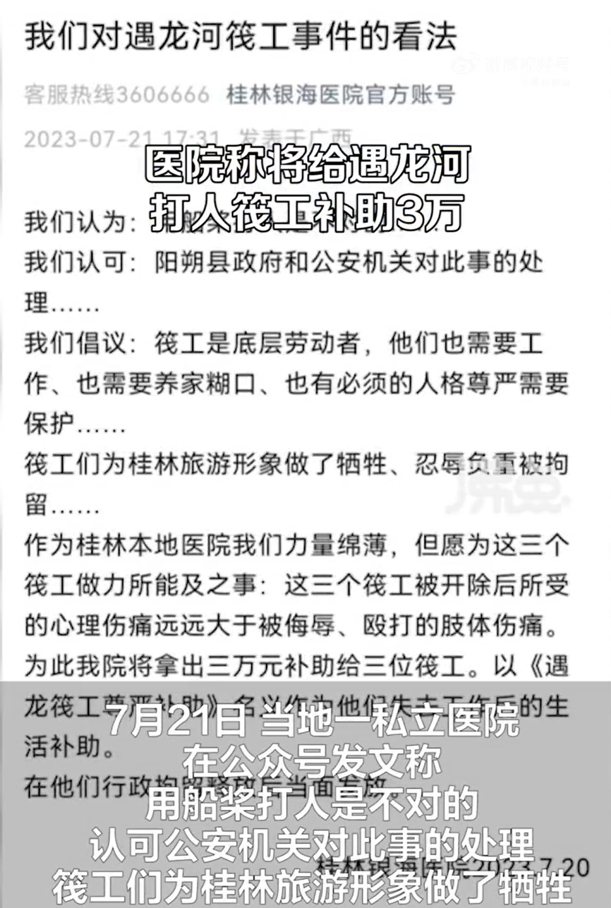
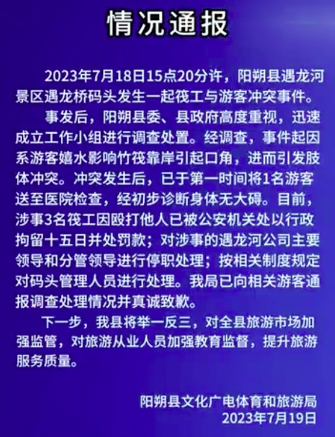

# 广西当地医院称将给打人筏工补助3万元：他们为桂林旅游形象忍辱负重

据新黄河援引沸点视频报道，近日，在广西桂林阳朔遇龙河景区内，三名筏工与游客发生口角，用船桨殴打游客，引起广泛关注。

7月19日，阳朔县文体局发布通报称，经调查，事件起因系游客嬉水影响竹筏靠岸引起口角，进而引发肢体冲突。涉事3名筏工因殴打他人已被公安机关行拘15日并处罚款。

7月21日，当地一私立医院在公众号上发文称，“我们认为用船桨打人是不对的，认可公安机关对此事的处理。”“筏工们为桂林旅游形象做了牺牲、忍辱负重被拘留。”

“这三个筏工被开除后所受的心理伤痛远远大于被侮辱、殴打的肢体伤痛。为此我院将拿出三万元补助给三位筏工，在他们行政拘留释放后当面发放。”

目前，该文章已删除。

对此，涉事医院工作人员回应称，文章是医院发的，是领导确定的，不了解为什么删除，但后续肯定会按照上面写的做。

**此前报道：**

7月18日，网曝广西桂林阳朔遇龙河景区筏工拿船桨殴打男游客，还将女游客推下河。19日，阳朔县文化广电体育和旅游局对此通报，称目前涉事3名筏工因殴打他人已被公安机关处以行政拘留十五日并处罚款；对涉事的遇龙河公司主要领导和分管领导进行停职处理；按相关制度规定对码头管理人员进行处理。

通报全文：

2023年7月18日15点20分许，阳朔县遇龙河景区遇龙桥码头发生一起筏工与游客冲突事件。

事发后，阳朔县委、县政府高度重视，迅速成立工作小组进行调查处置。经调查，事件起因系游客嬉水影响竹筏靠岸引起口角，进而引发肢体冲突。冲突发生后，已于第一时间将1名游客送至医院检查，经初步诊断身体无大碍。目前，涉事3名筏工因殴打他人已被公安机关处以行政拘留十五日并处罚款；对涉事的遇龙河公司主要领导和分管领导进行停职处理；按相关制度规定对码头管理人员进行处理。我局已向相关游客通报调查处理情况并真诚致款。

下一步，我县将举一反三，对全县旅游市场加强监管，对旅游从业人员加强教育监督，提升旅游服务质量。

据时间视频报道，7月18日，网曝广西桂林阳朔遇龙河景区筏工拿船桨殴打男游客，还将女游客推下河。

视频显示，几名筏工拿船桨殴打岸上的游客，一名筏工甚至拿着船桨疑似打了男游客的头部，随后男游客被其他筏工压在身下。

紧接着，筏工拿起船桨作势要打一名女游客，被他人拦下。被压在身下的男游客还在被另一筏工打，于是女游客上前劝阻，被筏工推下河。

19日，阳朔县委宣传部工作人员回应称，被打游客已送医，警方已介入调查，具体情况要等公安局反馈。

另据九派新闻报道，阳朔县文广体旅局的负责人回应称，“县里正在处理此事，有关部门调查清楚后，会向公众发布通报。具体情况需从县委宣传部了解。”

遇龙河景区的工作人员表示，不太清楚三名打人者是导游，还是景区的竹筏工。针对网友称加50元就能玩水的情况，该工作人员回应，“没有这种事情。”其称，目前，遇龙河的漂流项目未受影响，处于正常开放状态。

**【来源：综合新黄河、沸点视频、阳朔微旅游、时间视频、九派新闻】**

**此前报道：**

阳朔筏工打人事件疑似反转，旁观者：游客先挑起事端，为何没受处罚？

