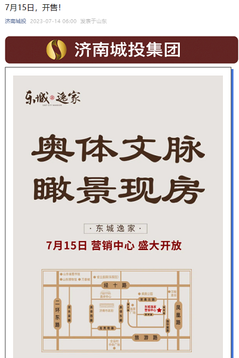
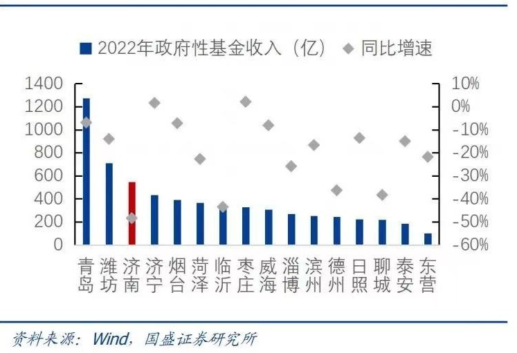

# 济南城投出售“公务员小区房源”背后：当地国企利润上缴比例升至20%

房企销售房源原本是正常的市场行为，但济南城投近期首次对外出售东城逸家、西江华府两个公务员集中居住小区部分房源，还是引起外界很多关注。7月20日，东城逸家首批368套房源公开认筹，7月22日认筹已满。

济南城投的全称为济南城市投资集团有限公司，是市属一级国有企业，由当地国资委和财政厅控股。济南城投主要承担政府性重点项目建设，负责城市片区、产业园区、水资源开发投资建设及运营，集团总资产超2000亿元。

上海证券交易所网站今年6月份公开的一份联合资信评估股份有限公司对济南城投2023年跟踪评级报告显示，济南城投作为济南市重要的基础设施建设及国有资产运营主体，跟踪期内，外部发展环境良好，并持续获得有力的外部支持。同时，联合资信也关注到公司资金支出压力大、资产变现周期较长、整体债务负担较重、短期偿付压力大等因素可能对公司信用水平带来的不利影响。

根据上述评级报告数据，截至2023年3月底，济南城投全部债务和全部债务资本化比率分别为1047.53 亿元和
65.12%，公司债务负担较重；考虑其他权益工具后，公司债务负担高于上述指标表现。公司现金短期债务比为0.23倍，短期偿付压力大。

上述评级报告数据显示，2023年1至3月，济南城投实现营业总收入19.76亿元，利润总额0.42亿元。2022济南城投营业总收入112.07亿元，利润总额12.15亿元。

济南城投此次出售部分房源，在外界看来，显然可以缓解当前偿债压力。而济南城投作为当地重要政府投融资平台，与地方财政有着千丝万缕联系，此次济南城投出售“公务员小区”也引起外界对当地财政债务形势的关注。今年济南财政收支紧平衡下，为了收支矛盾，当地将包括济南城投在内的市属国有企业利润上缴比例提高到20%。

济南作为山东省会城市，是山东省政治、经济、文化、科技、教育和金融的中心，去年生产总值约1.2万亿元。在山东省16个地市中，济南财政收入规模低于青岛，位列全省第二，且对土地财政依赖度较高。

与不少地方相似，疫情冲击下，当地经济增速放缓，叠加实施大规模税费支持政策，地方财政收入受到一定冲击。

根据济南市财政局数据，2020年受疫情冲击，为弥补税收减收，当地非税收入保持较快增长，全年一般公共预算收入小幅增长站上900亿元（906.1亿元）台阶。2021年经济恢复性增长，税收保持较快增长，当年一般公共预算收入快速增长，首次突破1000亿元，达到1007.6亿元。2022年受疫情冲击叠加大规模退减缓税费政策实施，尽管非税收入快速增长弥补减收，但全年一般公共预算收入略有下滑，约为1001亿元。

随着今年经济恢复性增长，济南市财政局数据显示，今年上半年全市一般公共预算收入573.7亿元，同比增长6.1%，符合当地年初预期。不过这一增速略低于山东省平均水平（7.8%），也明显低于全国地方这一收入增速（13.1%）。这主要跟济南上半年非税收入大幅下滑（-19.5%）有关。

除了一般公共预算收入外，以卖地收入为主的地方政府性基金收入也是济南财政收入重要来源。

根据济南财政局数据，2019年济南市政府性基金收入已达1019亿元，2020年降至820亿元，2021年这一收入回升至1016亿元，但2022年受房地产市场深度调整影响，土地市场低迷，2022年当地政府性基金收入几近腰斩，跌至约547亿元。

济南市去年预算执行情况和今年预算草案报告中，谈到当地财政改革发展存在问题和不足时，首要问题就是各级财政收支矛盾突出，基层财政平稳运行压力大。在对今年财政收支形势预判上，该报告认为今年当地财政收支矛盾仍然异常突出，财政运行紧平衡状态没有发生变化。今年财政增收节支防风险的压力非常大。

国盛证券固收首席分析师杨业伟最近撰文认为，今年初济南放开限购政策，上半年新房销售面积和金额明显回升，有望对土地出让收入形成一定支撑。

根据济南上述预算报告，预计今年政府性基金收入达到651亿元，同比增长约19%。当然这只是一个预期性数据，最终执行数存在不确定性。

近些年为了支持经济增长，济南加大举债力度，近年政府债务规模逐年攀升，不过位于债务限额内，整体风险安全可控。

根据济南市财政局数据，济南市2019年底地方政府债务余额约1289亿元，经过疫情三年，2022年底这一数字增至约2660亿元，不过位于当年债务限额（约2835亿元）之内。

粤开证券首席经济学家罗志恒认为，考虑到经济发展水平，济南虽然债务规模大，但负债率反而较低，在20%以下。

杨业伟测算，2022年，济南市狭义债务率为633%，低于青岛和威海，广义债务率为581
%，在省内排名第二，低于青岛。相比于其他省会城市，济南的债务率处于中等水平。济南的产业和金融资源较为丰富，资金安全垫较为充足。

济南市上述预算报告在谈及今年财政工作重点时称，今年将政府债务还本付息全面纳入预算管理，制定偿债计划，落实资金来源，确保及时足额偿还。加快推进平台公司市场化转型，规范融资行为，杜绝违规举债和新增政府隐性债务，坚决守住不发生系统性风险的底线。

为了缓解当前财政收支矛盾，济南在今年上述预算报告也采取了一些新举措。这包括科学调度组织收入，对税收应收尽收。继续过紧日子，如市本级日常公用经费定额标准压减20%，编外人员经费只减不增。

另一项关键举措是，济南加强财政资源统筹，将市属国有企业利润上缴比例提高到20%，市本级国有资本经营预算调入一般公共预算的比例提高至35%。

另外，针对当前行政事业单位部分资产统筹不够、使用效益不高等现象，去年10月财政部发布了《关于盘活行政事业单位国有资产的指导意见》，要求加快对房屋、土地、车辆等各类国有资产盘活利用，提升资产盘活利用效率，真正落实紧日子要求。

根据财政部数据，2021年末全国行政事业性国有资产总额54.4万亿元，全国国有企业资产（不含金融企业）总额308.3万亿元。专家认为，未来进一步盘活这类资产，也可以在一定程度上缓解地方财政收支矛盾。

此前报道：

济南城投出售“公务员小区”：值得财政紧张的地方政府学习

