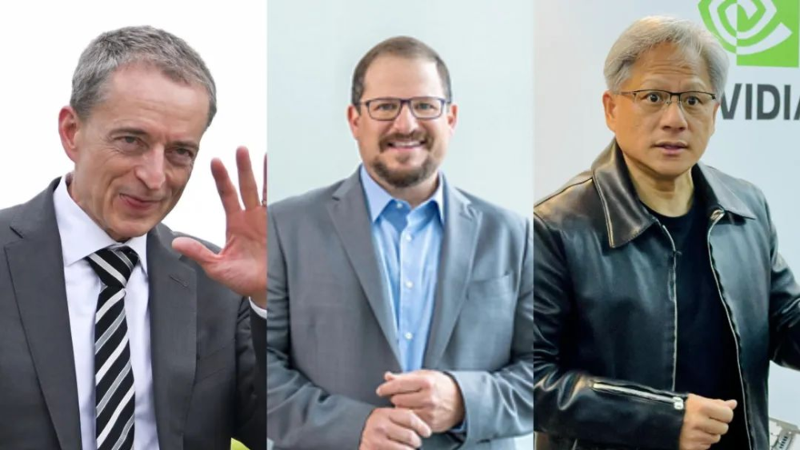
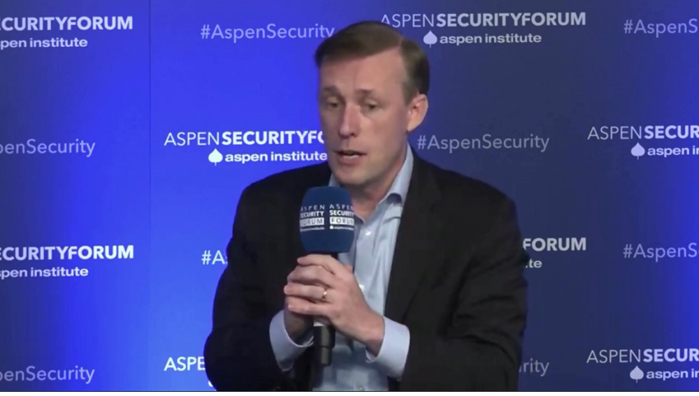

# 芯片三巨头CEO促美政府研究对华出口限制影响并暂停行动，白宫给说法

【环球网报道记者
张晓雅】彭博社当地时间21日援引知情人士消息披露，美三大芯片巨头首席执行官（CEO）本周一（17日）在华盛顿举行会谈时向拜登政府官员表示，美国政府应当研究收紧对华出口限制的影响，并在实施新限制之前暂停实施有关举措。

彭博社进一步披露，本周一在华盛顿举行的会议上，英特尔公司CEO帕特·基辛格、英伟达公司CEO黄仁勋和高通公司CEO克里斯蒂亚诺·安蒙警告说，采取相关出口管制措施可能会损害美国在该行业的领导地位。知情人士还透露，拜登政府官员听取了简报，但没有做出任何承诺。由于此次会议是非公开的，这些知情人士要求匿名。

 _英特尔CEO帕特·基辛格（左），高通CEO克里斯蒂亚诺·阿蒙（中），以及英伟达CEO黄仁勋（右） 资料图_

报道继续称，据知情人士透露，在当日会谈中，英特尔公司CEO帕特·基辛格告诉美国总统国家安全事务助理沙利文、国务卿布林肯和其他官员，进一步限制英特尔在中国的业务，将危及拜登“将芯片生产带回美国”的一项关键政策。

报道说，知情人士还透露，帕特·基辛格表示，如果没有中国客户的订单，英特尔计划在俄亥俄州建设工厂等项目的必要性就会大大降低。英伟达CEO黄仁勋则表示，限制该公司芯片在华销售，只会让替代产品更受欢迎。

芯片行业是中美之间日益紧张关系的焦点之一，报道提到，美国政府正迫使企业收紧对华出口限制，理由是老调重弹的“国家安全”一说，“其中一位高管反对目前限制对华出口人工智能硬件的规定，指认该政策并没有达到减缓中国人工智能发展的预期效果”。

报道说，上述三家公司代表和白宫国家安全委员会发言人均拒绝置评。不过报道提到，沙利文20日在阿斯彭安全论坛上声称，他同意高管们的观点，即需要实行“小院子，高栅栏”的做法，呈现出有限但有效的特点。他还为美国政府的限制措施进行辩护，声称这些措施是有针对性的，对大多数事关芯片行业的美中贸易几乎没有影响。沙利文还暗示，美方可能会出台更多限制措施，但只有在与受影响的公司进行讨论后再做抉择。

_沙利文20日参加阿斯彭安全论坛并讲话 图自外媒_

彭博社本月15日就曾援引知情人士消息预告，美国上述三大芯片巨头CEO将前往华盛顿与美政府官员和议员举行会谈，游说拜登放弃出台新的对华芯片出口限制。去年10月，美国政府颁布全面限制措施，旨在遏制中国芯片行业发展。据报道，这一措施预计会在今年7月底前进一步扩大。美国芯片企业英伟达首席财务官科莱特·克雷斯6月底出席一场投资会议时表示，美国限制人工智能芯片对华出口“将令美国这一行业永久丧失机会”。黄仁勋日前接受采访时也表示，中国市场不可代替，退出中国市场不是一种可行选项。

针对美国对华芯片等产品的出口管制措施，中国已于去年12月在世贸组织提起诉讼。中国商务部表示，美方近年来不断泛化国家安全概念，滥用出口管制措施，阻碍芯片等产品的正常国际贸易，威胁全球产业链供应链稳定，破坏国际经贸秩序，违反国际经贸规则，违背基本经济规律，损害全球和平发展利益，是典型的贸易保护主义做法。

