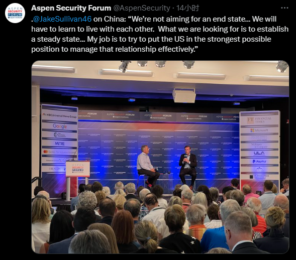

# 英特尔CEO：若没有中国订单，全球最大芯片制造基地也没必要建了

（观察者网讯）多家外媒援引消息称，7月17日，美国三大芯片巨头英特尔、高通和英伟达的首席执行官（CEO）与国务卿布林肯等美高官会面，游说拜登政府放弃对华半导体新限制政策。

据彭博社21日报道，有知情人士透露，英特尔CEO帕特·基辛格（Pat
Gelsinger）在17日的会上告诉美官员，针对中国的限制政策没有达到预期效果，反而会限制美企在华业务。他警告说，如果没有来自中国的订单，英特尔在俄亥俄州建设“全球最大芯片制造基地”的计划就没啥必要了。

 _彭博社报道截图_

6月底，多家外媒放出“拜登政府将扩大对华芯片出口限制”的消息，称继去年10月对出口中国的人工智能（AI）芯片施加限制后，美商务部或最快在今年7月底前采取行动，进一步扩大相关出口管制，禁止英伟达等芯片制造商在事先未获得许可证的情况下，向中国和其他相关国家的客户出口芯片。

彭博社称，这一举动发生在中美关系紧张之际，美国政府以国家安全为由，迫使企业限制对其最大市场的芯片出口。不过，在17日的会议上，美国三大芯片巨头英特尔、高通和英伟达CEO告诉布林肯、沙利文等美国高官，此举损害了它们在中国开展业务的能力。

知情人士称，其中，英特尔CEO帕特·基辛格直言不讳，称若进一步限制英特尔在华业务，将危及拜登政府“将芯片生产带回美国”的一项关键政策。他警告说，如果没有中国客户的订单，英特尔计划在俄亥俄州建设工厂等项目的必要性就会大大降低。

去年1月，英特尔宣布将在美国俄亥俄州哥伦布市外新建两家芯片工厂，计划投资至少2000亿美元，以扩大英特尔的芯片制造业务。路透社称，建成后，这将成为“全球最大芯片制造基地”。

 _英特尔CEO基辛格，图自外媒_

在场的英伟达创始人兼CEO黄仁勋也说，限制英伟达在华芯片销售，只会给其他品牌提供机会。

黄仁勋曾指出，中国占据了美国科技产业约三分之一的市场，其作为半导体零部件来源地和产品终端市场的地位让其无法取代，美官员在对华实施进一步限制时须“深思熟虑”，退出中国市场不是一种可行选项。

彭博社总结道，在17日的讨论会上， **三大芯片巨头高管们都认为，拜登对华半导体的限制政策没有达到预期，并没有显著减缓中国发展人工智能的速度。**
他们认为，中企使用软件的可用性和质量足以弥补任何硬件限制。有知情人士称，拜登政府官员听取了简报，但没有做出任何承诺。

关于此次会谈，彭博社日前报道称，英特尔等公司牵头此次会谈，目的是确保政府官员了解到，若进一步收紧对华销售芯片的规定可能带来的负面影响。三家芯片巨头并不指望此举能起到阻止美政府所有行动的作用，但他们感受到了一个“机会窗口”，希望通过游说的方式让拜登政府相信，如果事态进一步升级，将伤害白宫在对华接触政策上所做的一切外交努力。

当地时间21日，白宫国家安全顾问沙利文和英特尔CEO基辛格共同出席美国智库阿斯彭安全论坛会议。

谈到美国三大芯片巨头的游说时，沙利文回应称，他同意高管们的观点，即对华芯片限制措施的做法需做到“在小院修建高墙”（small yard, high
fence），即在有限的领域施加有效的做法。

沙利文同时为拜登政府至今的行动做辩护，声称这些对华限制措施对大多数中美芯片贸易几乎没有影响，“美国设计的芯片绝大部分销往中国的势头有增无减”。他还暗示将继续出台更多限制措施，但在与相关美企讨论后，这些措施才会实施。

对于沙利文的辩解，英特尔CEO基辛格并不买账。他直白地表示：“目前，中国占半导体出口的25%至30%。如果我们公司的市场减少了20%或30%，我就需要减少工厂的建设。”

基辛格强调，总的来说，允许美国芯片公司进入中国市场符合美国的利益，因为来自中国的收入有助于推动研发，而这对于保持美国在量子计算等新技术方面的领先地位是必要的。

_沙利文参加阿斯彭安全论坛，谈及中美关系。推文截图_

彭博社指出，拜登政府对华芯片出口限制，令美国应用材料公司等芯片设备制造商的营收受到巨大冲击，被迫将营收预期下调了数十亿美元。

7月17日，美国半导体行业协会发表声明，呼吁拜登政府“不要进一步限制”对华芯片销售，允许该行业继续进入中国市场，因为中国是“世界上最大的半导体商业市场”。根据该协会数据，去年在中国半导体采购额为1800亿美元，超过全球总额5559亿美元的三分之一，是最大单一市场。

针对美国对华芯片等产品的出口管制措施，中国已于去年12月在世贸组织提起诉讼。

我外交部此前表示，美方出于维护科技霸权需要，滥用出口管制措施，对中国企业进行恶意封锁和打压，这种做法背离公平竞争原则，违反国际经贸规则，不仅损害中国企业的正当权益，也将影响美国企业的利益。这种做法阻碍国际科技交流和经贸合作，对全球产业链供应链稳定和世界经济恢复都将造成冲击。美方将科技和经贸问题政治化、工具化、武器化，阻挡不了中国发展，只会封锁自己、反噬自身。

**本文系观察者网独家稿件，未经授权，不得转载。**

