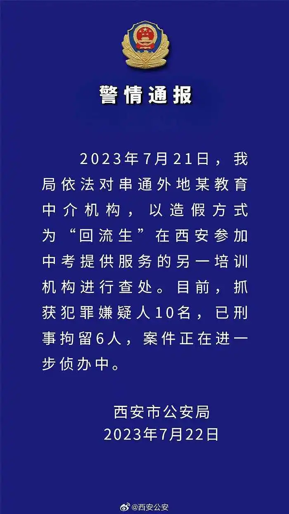

# 西安查处另一造假为回流生提供服务的机构：抓获嫌犯10名，已刑拘6人

7月22日，西安市公安局发布警情通报，2023年7月21日，我局依法对串通外地某教育中介机构，以造假方式为“回流生”在西安参加中考提供服务的另一培训机构进行查处。

目前，抓获犯罪嫌疑人10名，已刑事拘留6人，案件正在进一步侦办中。

**此前报道：**

西安深夜通报“回流生”事件，控制涉案人员13名，将严肃中考政策环境

西安市教育局：对部分家长反映的“回流生”资格造假等问题，已成立联合调查组

三千多“回流生”回西安中考引众怒？家长质疑“钻空子”挤占升学资源

西安市教育局回应今年中考情况：网传“回流生4万人”信息严重不实

西安中考“回流生”事件背后

